体系结构描述文档—— 灯具进销存管理系统  软工二小组
=========================

 
 
 

# 更新历史
| **修改人员**           | **日期**     | **变更原因** | **版本** |
| ------------------ | ---------- | -------- | ------ |
| 陈骁、陈思彤、 王宁、王颀涵 | 2017-10-10 | 最初版本     | V1.0   |

 
 
***********************************************
 
 

# 变更记录
| **修改人员**           | **日期**     | **变更原因** | **版本** | **变更内容** |
| ------------------ | ---------- | -------- | ------ | -------- |
| 陈骁、陈思彤、 王宁、王颀涵 | 2017-10-10 | 初始版本     | V1.0   | 无        |

 
 
***********************************************
 
 

# 目录
	1.引言
		1.1 编制目的
		1.2 参考资料
	2.产品概述
	3.逻辑视角
	4.组合视角
		4.1 开发包图
		4.2 运行时进程
		4.3 物理部署
	5.接口视角
		5.1 模块的职责
		5.2 用户界面层的分解
		5.3 业务逻辑层的分解
		5.4 数据层的分解
	6.信息视角
		6.1 数据持久化对象
		6.2 Txt持久化格式
		6.3 数据库表

 
 
***********************************************
 
 

# 1.引言

## 1.1 编制目的
本报告详细完成对灯具照明行业进销存系统的概要设计，达到指导详细设计和开发的目
的，同时实现测试人员及用户的沟通。 
本报告面向开发人员、测试人员及最终用户编写，是了解系统的导航。

 
 
***********************************************
 
 

## 1.2 参考资料
附录D.3 连锁商店（MSCS）软件体系描述结构文档

 
 
***********************************************
 
 

# 2.产品概述
参考灯具照明行业进销存系统用例文档和灯具照明行业进销存系统软件规格说明中对产
品的概括描述。

 
 
***********************************************
 
 

# 3.逻辑视角
灯具进销存管理系统中，选择了分层体系结构的风格，将系统分为3层（展示层、业务逻辑层、数据层）能够很好的示意整个高层抽象。展示层包括GUI页面的实现，业务逻辑层包含业务逻辑处理的实现，数据层负责数据的持久化和访问。分层体系结构的逻辑视角和逻辑设计方案如图1和图2所示。

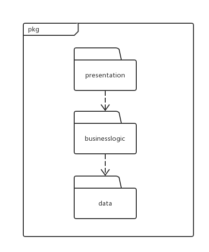
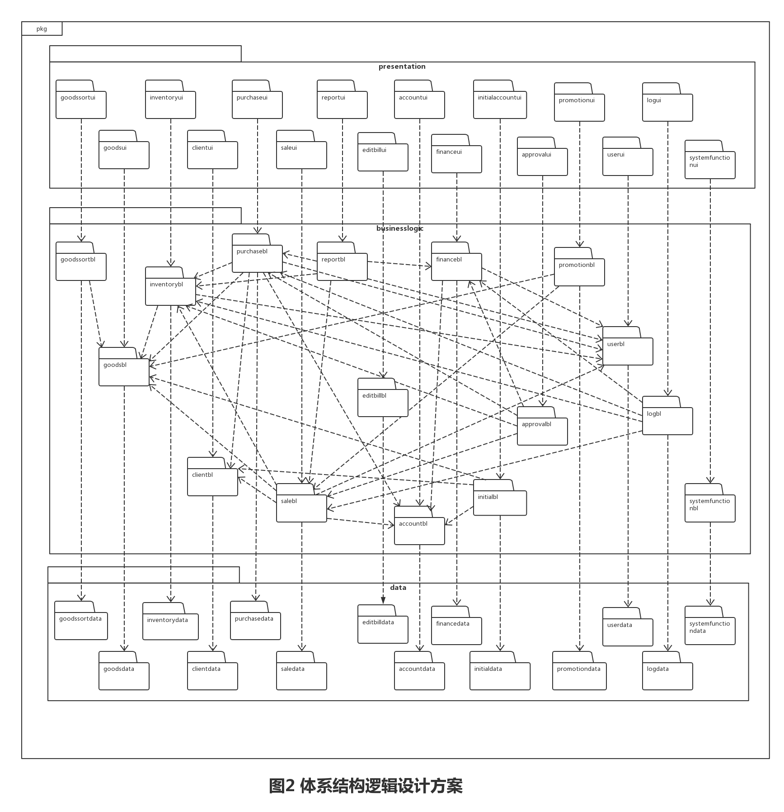

 
 
***********************************************
 
 

# 4.组合视角
## 4.1 开发包图
灯具进销存管理系统的最终开发包设计如表1所示

| 表1                        | 连锁商店管理系统的最终开发包设计                         |
| ------------------------- | ---------------------------------------- |
| 开发（物理）包                   | 依赖的其他开发包                                 |
| mainui                    | goodssortui, goodsui, inventoryui, clientui, purchaseui, saleui, reportui, accountui, billui, initialui, approvalui, promotionui, userui, logui,systemfunctionui,editbillui, vo |
|                           |                                          |
| goodssortui               | goodssortblservice, 界面类库包, vo            |
| goodssortblservice        |                                          |
| goodssortbl               | goodssortblservice, goodssortdataservice, po, goodsbl |
| goodssortdataservice      | Java RMI, po                             |
| goodssortdata             | databaseutility, po, goodssortdataservice |
|                           |                                          |
| goodsui                   | goodsblservice, 界面类库包, vo                |
| goodsblservice            |                                          |
| goodsbl                   | goodsblservice, goodsdataservice, po     |
| goodsdataservice          | Java RMI, po                             |
| goodsdata                 | databaseutility, po, goodsdataservice    |
|                           |                                          |
| inventoryui               | inventoryblservice, 界面类库包, vo            |
| inventoryblservice        |                                          |
| inventorybl               | inventoryblservice, inventorydataservice, po, goodsbl,userbl |
| inventorydataservice      | Java RMI, po                             |
| inventorydata             | databaseutility, po, inventorydataservice |
|                           |                                          |
| clientui                  | clientblservice, 界面类库包, vo               |
| clientblservice           |                                          |
| clientbl                  | clientblservice, clientdataservice, po   |
| clientdataservice         | Java RMI, po                             |
| clientdata                | databaseutility, po, clientdataservice   |
|                           |                                          |
| purchaseui                | purchaseblservice, 界面类库包, vo             |
| purchaseblservice         |                                          |
| purchasebl                | purchaseblservice, purchasedataservice, po, goodsbl, clientbl, accountbl, inventorybl, userbl |
| purchasedataservice       | Java RMI, po                             |
| purchasedata              | databaseutility, po, purchasedataservice |
|                           |                                          |
| saleui                    | saleblservice, 界面类库包, vo                 |
| saleblservice             |                                          |
| salebl                    | saleblservice, saledataservice, po, goodsbl, clientbl, accountbl, inventorybl, userbl |
| saledataservice           | Java RMI, po                             |
| saledata                  | databaseutility, po, saledataservice     |
|                           |                                          |
| reportui                  | reportblservice, 界面类库包, vo               |
| reportblservice           |                                          |
| reportbl                  | reportblservice, reportdataservice, po, inventorybl, purchasebl, saleui, billbl |
|                           |                                          |
| accountui                 | accountblservice, 界面类库包, vo              |
| accountblservice          |                                          |
| accountbl                 | accountblservice, accountdataservice, po |
| accountdataservice        | Java RMI, po                             |
| accountdata               | databaseutility, po, accountdataservice  |
|                           |                                          |
| financeui                 | billblservice, 界面类库包, vo                 |
| financeblservice          |                                          |
| financebl                 | financeblservice, financedataservice, po, accountbl, userbl |
| financedataservice        | Java RMI, po                             |
| financedata               | databaseutility, po, financedataservice  |
|                           |                                          |
| initialui                 | initialblservice, 界面类库包, vo              |
| initialblservice          |                                          |
| initialbl                 | initialblservice, initialdataservice, po, goodsbl, client, accountbl |
| initialdataservice        | Java RMI, po                             |
| initialdata               | databaseutility, po, initialdataservice  |
|                           |                                          |
| approvalui                | approvalblservice, 界面类库包, vo             |
| approvalblservice         |                                          |
| approvalbl                | approvalblservice, approvaldataservice, po, inventorybl, purchasebl, saleui, billbl |
|                           |                                          |
| promotionui               | promotionblservice, 界面类库包, vo            |
| promotionblservice        |                                          |
| promotionbl               | promotionblservice, promotiondataservice, po, goodsbl, salebl, clientbl, accountbl |
| promotiondataservice      | Java RMI, po                             |
| promotiondata             | databaseutility, po, promotiondataservice |
|                           |                                          |
| userui                    | userblservice, 界面类库包, vo                 |
| userblservice             |                                          |
| userbl                    | userblservice, userdataservice, po       |
| userdataservice           | Java RMI, po                             |
| userdata                  | databaseutility, po, userdataservice     |
|                           |                                          |
| logui                     | logblservice, 界面类库包, vo                  |
| logblservice              |                                          |
| logbl                     | logblservice, logdataservice, po, inventorybl, purchasebl, saleui, billbl, userbl |
| logdataservice            | Java RMI, po                             |
| logdata                   | databaseutility, po, logdataservice      |
|                           |                                          |
| editBillui                | editBillblservice, 界面类库包, vo             |
| editBillblservice         |                                          |
| editBillbl                | editBillblservice, inventorybl, purchasebl, saleui, financebl, userbl |
|                           |                                          |
| systemfunctionui          | systemfunctionblservice, 界面类库包, vo       |
| systemfunctionblservice   |                                          |
| systemfunctionbl          | systemfunctionblservice, systenfunctiondataservice, po, userbl |
| systemfunctiondataservice | Java RMI, po                             |
| systemfunctiondata        | databaseutility, po, logdataservice      |
|                           |                                          |
| vo                        |                                          |
| po                        |                                          |
| blutility                 |                                          |
| datautility               | JDBC                                     |
| 界面类库包                     |                                          |
| Java RMI                  |                                          |

 

灯具进销存管理系统客户端开发包图和服务器端开发包图如图3和图4所示。

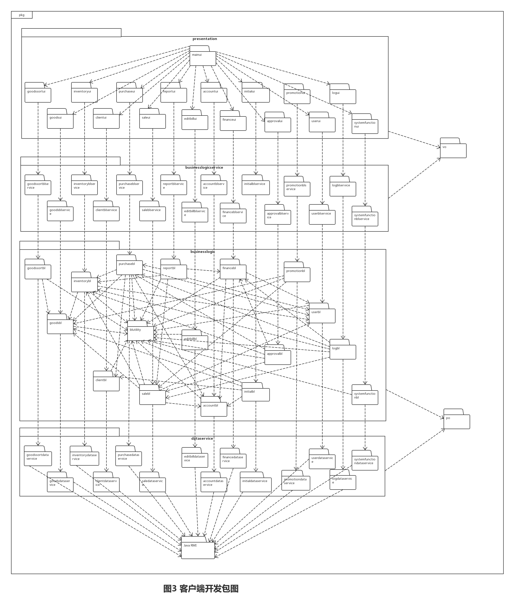
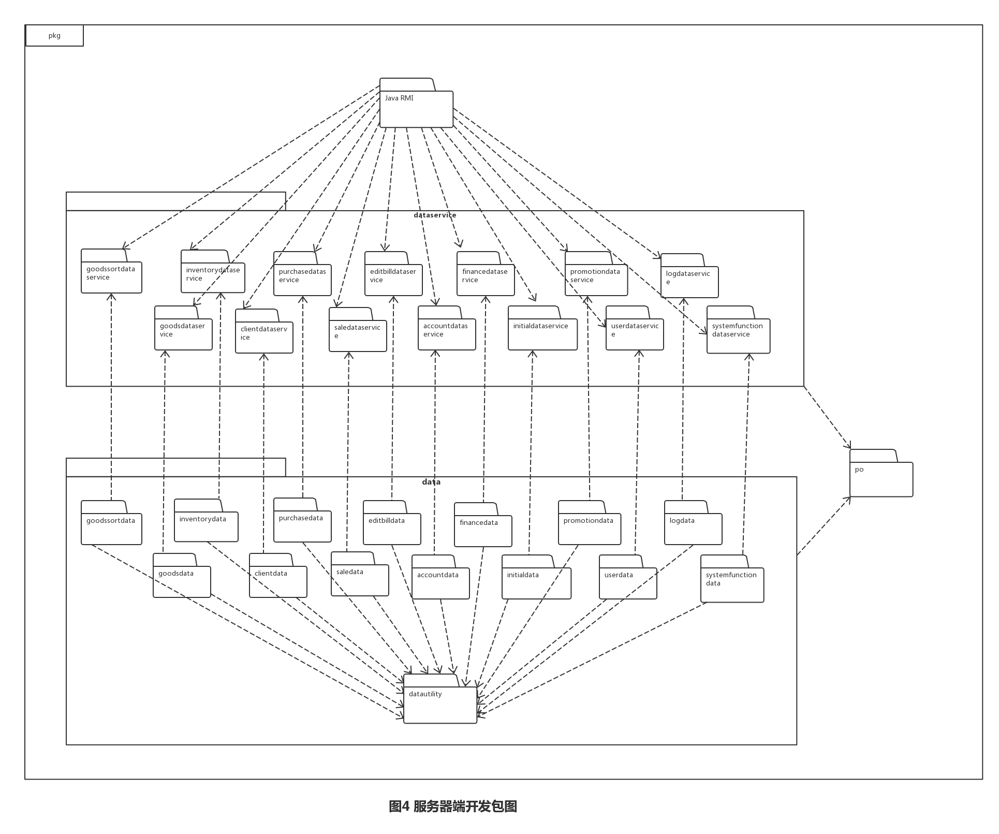

 
 
***********************************************
 
 

## 4.2 运行时进程
在灯具进销存管理系统中，会有多个客户端进程和一个服务器端进程，其进程如图5所示。结合部署图，客户端进程是在客户端机器上运行，服务器端进程是在服务器端机器上运行。

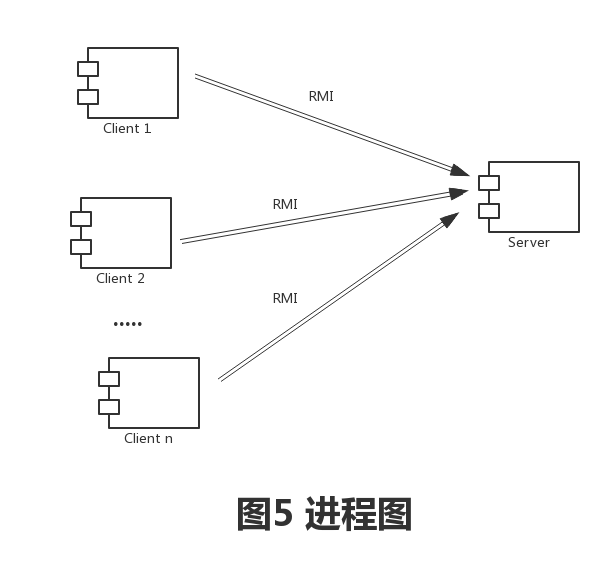

 
 
***********************************************
 
 

## 4.3 物理部署
灯具进销存管理系统中客户端构件是放在客户端机上，服务器端构件是放在服务器端机器上。在客户端节点上，还要部署RMIStub构件。由于Java RMI 构件属于JDK 1.8的一部分。所以，在系统JDK环境已经设置好的情况下，不需要独立部署。部署图如图6所示。

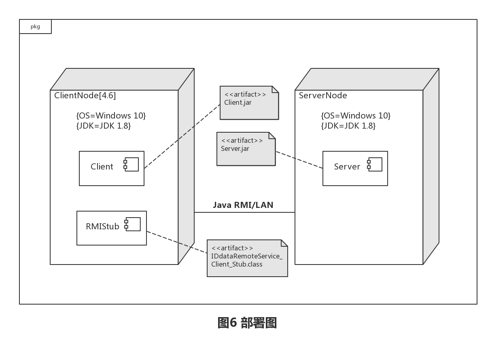

 
 
***********************************************
 
 

# 5.接口视角
## 5.1 模块的职责
客户端模块和服务器模块视图分别如图7和图8所示。客户端各层和服务器端各层的职责分别如表2和3所示。

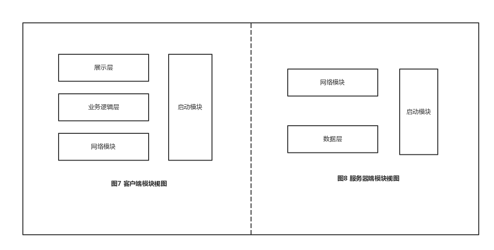

| 表2      | 客户端各层的职责               |
| ------- | ---------------------- |
| 客户端各层   | 客户端各层的职责               |
| 启动模块    | 负责初始化网络通信机制，启动用户界面     |
| 用户界面层   | 基于窗口的进销存管理系统客户端用户界面    |
| 业务逻辑层   | 对于用户界面的输入进行响应并进行业务处理逻辑 |
| 客户端网络模块 | 利用java RMI机制查找RMI服务    |
 

| 表3       | 服务器端各层的职责                   |
| -------- | --------------------------- |
| 服务器端各层   | 服务器端各层的职责                   |
| 启动模块     | 负责初始化网络通信机制，启动用户界面          |
| 数据层      | 负责数据的持久化及数据访问接口             |
| 服务器端网络模块 | 利用Java RMI机制开启RMI服务，注册RMI服务 |
 

每一层只是使用下方直接接触的层。层与层之间仅仅是通过接口的调用来完成的。层与层之间调用的接口下表4所示。

| 表4                                       | 层之间调用的接口 |          |
| ---------------------------------------- | -------- | -------- |
| 接口                                       | 服务调用方    | 服务提供方    |
| goodssortblservice goodsblservice inventoryblservice clientblservice purchaseblservice saleblservice reportblservice accountblservice billblservice initialblservice approvalblservice promotionblservice userblservice logblservice editbillblservice systemfunctionblservice | 客户端展示层   | 客户端业务逻辑层 |
| goodssortdataservice goodsdataservice inventorydataservice clientdataservice purchasedataservice saledataservice reportdataservice accountdataservice billdataservice initialdataservice approvaldataservice promotiondataservice userdataservice logdataservice editbilldataservice systemfunctiondataservice | 客户端业务逻辑层 | 服务器端数据层  |
 

借用登陆操作来说明层之间的调用，如图9所示。每一层之间都是由上一层依赖了一个接口(需接口)，而下层实现这个接口(供接口)。LoginBlService提供了LoginUI界面所需要的所有业务逻辑功能。LoginDataService提供了对数据库的增、删、改、查等操作。这样的实现就大大降低了层与层之间的耦合。

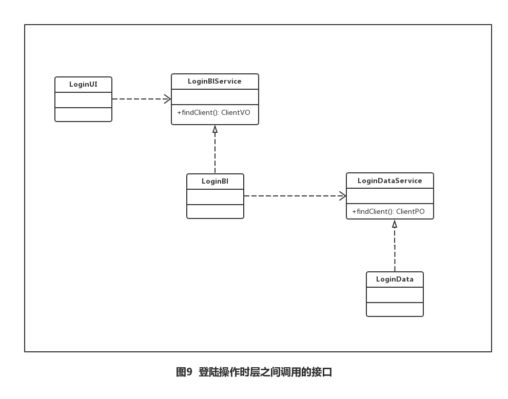

 
 
***********************************************
 
 

## 5.2 用户界面层的分解
根据需求，系统存在38个用户界面：登录界面，库存管理主界面，进货销售主界面，财务管理主界面，总经理主界面，管理员主界面，商品分类管理界面，商品分类信息界面，商品管理界面，商品信息界面，库存查看界面，库存盘点界面，库存溢损单界面，修改库存类单据界面，客户管理界面，客户信息界面，制定进货单界面，制定进货退货单界面，制定销售单界面，制定销售退货单界面，修改进销类单据界面，账户管理界面，账户信息界面，制定收款单界面，制定付款单界面，制定现金费用单界面，查看经营历程表界面，查看经营情况表界面，查看销售明细表界面，期初建账界面，修改财务单据界面，查看日志界面，审批单据界面，促销策略管理界面，促销策略信息界面，库存赠送单界面，账号管理界面，账号信息界面。界面跳转如图10所示。

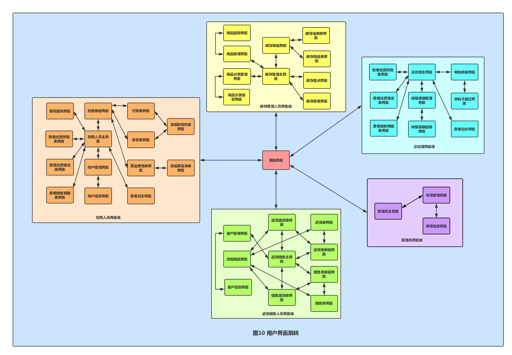

服务器端和客户端的用户界面设计接口是一致的，只是具体的界面不一样。用户界面类如图11所示。

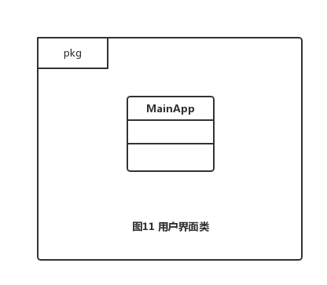

### 5.2.1 用户界面层模块的职责
如下表5所示为用户界面层模块的职责

| 表5        | 用户界面层模块的职责            |
| --------- | --------------------- |
| 模块        | 职责                    |
| MainFrame | 界面Frame，负责界面的显示和界面的跳转 |
 

### 5.2.2 用户界面层模块的接口规范
用户界面层模块的接口规范如表6所示

| 表6        | 用户界面层模块的接口规范 |                     |
| --------- | ------------ | ------------------- |
| MainFrame | 语法           | init(args:String[]) |
|           | 前置条件         | 无                   |
|           | 后置条件         | 显示Frame以及LoginPanel |
 

用户界面层需要的服务接口如表7所示

| 表7                                    | 用户界面层需要的服务接口      |
| ------------------------------------- | ----------------- |
| 服务名                                   | 服务                |
| `businesslogicservice.LoginBLService` | 登录界面的逻辑接口         |
| `businesslogicservice.*BLService`     | 每个界面都有一个相应的业务逻辑接口 |

 
 
***********************************************
 
 

## 5.3 业务逻辑层的分解
业务逻辑层包括多个针对界面的业务逻辑处理对象。其设计图如图12所示。

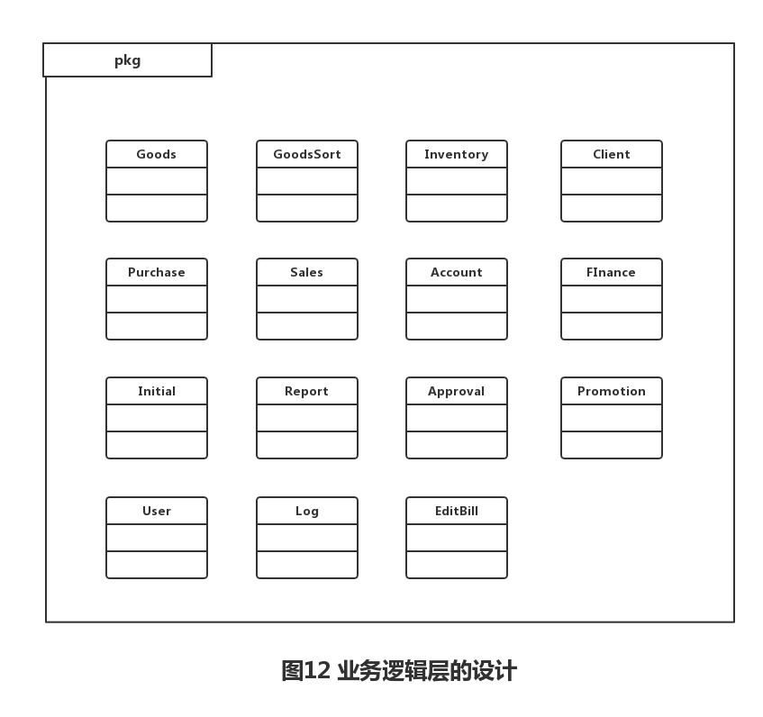

### 5.3.1 业务逻辑层模块的职责
业务逻辑层模块的职责如下表所示

| 业务逻辑层模块          | 职责                      |
| ---------------- | ----------------------- |
| goodssortbl      | 负责实现商品分类与商品分类管理界面所需要的服务 |
| goodsbl          | 负责实现商品与商品管理界面所需要的服务     |
| inventorybl      | 负责实现仓库管理界面所需要的服务        |
| clientbl         | 负责实现客户管理界面所需要的服务        |
| purchasebl       | 负责实现进货界面所需要的服务          |
| salebl           | 负责实现销售界面所需要的服务          |
| reportbl         | 负责实现查看报表界面所需要的服务        |
| accountbl        | 负责实现账户管理界面所需要的服务        |
| financebl        | 负责实现财务单据界面所需要的服务        |
| initialbl        | 负责实现期初建账界面所需要的服务        |
| approvalbl       | 负责实现审批界面所需要的服务          |
| promotionbl      | 负责实现销售策略界面所需要的服务        |
| userbl           | 负责实现登陆及用户管理界面所需要的服务     |
| logbl            | 负责实现查看日志界面所需要的服务        |
| editbillbl       | 负责实现修改单据界面所需要的服务        |
| systemfunctionbl | 负责登陆以及各个主要界面界面所需要的服务    |
 

### 5.3.2 业务逻辑层模块的接口规范

| goodssortbl模块提供的服务（供接口）              |      |                                          |
| ------------------------------------ | ---- | ---------------------------------------- |
| `GoodsSortBlService.insertGoodsSort` | 语法   | `public ResultMessage insertGoodsSort(String sortName,String fatherSort,String note)` |
|                                      | 前置条件 | 分类名称正确，父类中没有商品                           |
|                                      | 后置条件 | 添加商品分类，持久化更新对象的数据                        |
| `GoodsSortBlService.deleteGoodsSort` | 语法   | `public ResultMessage deleteGoodsSort(String ID)` |
|                                      | 前置条件 | 商品分类已经选择                                 |
|                                      | 后置条件 | 删除商品分类，持久化更新对象的数据                        |
| `GoodsSortBlService.updateGoodsSort` | 语法   | `public ResultMessage updateGoodsSort(String sortName,String fatherSort,String note)` |
|                                      | 前置条件 | 商品分类已选择，分类名称正确，父类中没有商品                   |
|                                      | 后置条件 | 修改商品分类，持久化更新对象的数据                        |
| `GoodsSortBlService.detailGoodsSort` | 语法   | `public ResultMessage detailGoodsSort(String ID)` |
|                                      | 前置条件 | 商品分类已选择                                  |
|                                      | 后置条件 | 显示商品分类信息                                 |
| `GoodsSortBlService.getID`           | 语法   | `public ArrayList<GoodsSortVO> getID(String fatherSort)` |
|                                      | 前置条件 | 商品分类已添加或删除                               |
|                                      | 后置条件 | 返回商品分类ID                                 |
| `GoodsSortInfoBlService.show`        | 语法   | `public ResultMessage show()`            |
|                                      | 前置条件 | 商品分类已选择                                  |
|                                      | 后置条件 | 显示商品分类信息                                 |
 

| gooossortbl模块需要的服务（需接口）                  |                 |
| ---------------------------------------- | --------------- |
| 服务名                                      | 服务              |
| `GoodsSortDataService.findGoodsSort(String ID)` | 根据ID进行查找单一持久化对象 |
| `GoodsSortDataService.insert(GoodsSortPO po)` | 添加单一持久化对象       |
| `GoodsSortDataService.detele(GoodsSortPO po)` | 删除单一持久化对象       |
| `GoodsSortDataService.update(GoodsSortPO po)` | 修改单一持久化对象       |
| `GoodsSortDataService.detail(GoodsSortPO po)` | 查找单一持久化对象       |
 
 
 

| goodsbl模块提供的服务（供接口）          |      |                                          |
| ---------------------------- | ---- | ---------------------------------------- |
| `GoodsBlService.insertGoods` | 语法   | `public ResultMessage insertGoods( String name, String model, int number,double cost, double retail, double latestCost,double latestRetail, String comment)` |
|                              | 前置条件 | 商品分类已选择，商品编号，名称，型号，数量，进价，零售价，最近进价，最近零售价，备注输入正确 |
|                              | 后置条件 | 添加商品，持久化更新对象的数据                          |
| `GoodsBlService.deleteGoods` | 语法   | `public ResultMessage deleteGoods(String ID)` |
|                              | 前置条件 | 商品已选择                                    |
|                              | 后置条件 | 删除商品，持久化更新对象的数据                          |
| `GoodsBlService.getID`       | 语法   | `public ArrayList<GoodsVO> getID()`      |
|                              | 前置条件 | 商品已添加或修改                                 |
|                              | 后置条件 | 返回商品的ID                                  |
| `GoodsBlService.updateGoods` | 语法   | `public ResultMessage updateGoods(String ID, String name, String model, int number,double cost, double retail, double latestCost,double latestRetail, String comment)` |
|                              | 前置条件 | 商品已选择，商品编号，名称，型号，数量，进价，零售价，最近进价，最近零售价，备注输入正确 |
|                              | 后置条件 | 修改商品持久化更新对象数据                            |
| `GoodsBlService.detailGoods` | 语法   | `public ResultMessage detailGoods(String ID)` |
|                              | 前置条件 | 商品已选择                                    |
|                              | 后置条件 | 显示商品信息                                   |
| `GoodsBlService.setAlarmNum` | 语法   | `public ResultMessage setAlarmNum(String ID)` |
|                              | 前置条件 | 商品已选择                                    |
|                              | 后置条件 | 添加商品报警数量，持久化更新对象数据                       |
| `GoodsInfoBlService.show`    | 语法   | `public ResultMessage show()`            |
|                              | 前置条件 | 已创建一个Goods领域的对象                          |
|                              | 后置条件 | 显示所有商品                                   |
 

| gooosbl模块需要的服务（需接口）                      |                    |
| ---------------------------------------- | ------------------ |
| 服务名                                      | 服务                 |
| `GoodsDataService.findGoods(String ID, String name)` | 根据ID，名称进行查找单一持久化对象 |
| `GoodsDataService.insert(GoodsPO po)`    | 添加单一持久化对象          |
| `GoodsDataService.delete(GoodsPO po)`    | 删除单一持久化对象          |
| `GoodsDataService.update(GoodsPO po)`    | 修改单一持久化对象          |
| `GoodsDataService.detail(GoodsPO po)`    | 查看单一持久化对象          |
 
 
 

| inventorybl模块提供的服务（供接口）                  |      |                                          |
| ---------------------------------------- | ---- | ---------------------------------------- |
| `InventoryCheckBlService.view`           | 语法   | `public ResultMessage view(String beginDate,String endDate)` |
|                                          | 前置条件 | 日期输入正确                                   |
|                                          | 后置条件 | 显示在此时间段内的出/入库数量/金额，销售/进货数量/金额，以及库存合计     |
| `InventoryVerificationBlService.record`  | 语法   | `public ResultMessage record(String date)` |
|                                          | 前置条件 | 得到库存单据数据                                 |
|                                          | 后置条件 | 显示库存快照                                   |
| `InventoryLossOverBillBlService.getLossOverID` | 语法   | `public ArrayList<InventoryLossOverBillVO> getLossOverID()` |
|                                          | 前置条件 | 得到库存单据数据                                 |
|                                          | 后置条件 | 返回对应单据的ID                                |
| `InventoryLossOverBillBlService.getOperator` | 语法   | `public ArrayList<InventoryLossOverBillVO> getOperator()` |
|                                          | 前置条件 | 得到库存单据数据                                 |
|                                          | 后置条件 | 返回对应单据的操作员                               |
| `InventoryLossOverBillBlService.insertGoods` | 语法   | `public ResultMessage insertGoods(GoodsVO ID,int actualnum)` |
|                                          | 前置条件 | 商品数量正确，                                  |
|                                          | 后置条件 | 填入信息，生成库存溢损单                             |
 

| inventorybl模块需要的服务（需接口）                  |                     |
| ---------------------------------------- | ------------------- |
| 服务名                                      | 服务                  |
| `InventoryLossOverBillBlService.findGoods(String ID，String name)` | 根据ID与名称查找匹配的单一持久化对象 |
| `InventoryLossOverBillBlService.insert(RepositoryPO po)` | 添加单据                |
| `InventoryLossOverBillBlService.getState(String ID)` | 返回单据的状态             |
| `InventoryLossOverBillBlService.update(RepositoryPO po)` | 修改单据                |
| `InventoryCheckBlService.findView(String beginDate,String endDate)` | 根据时间区间查找匹配的单一持久化对象  |
| `InventoryVerificationBlService.findView(String date)` | 根据时间查找匹配的单一持久化对象    |
 
 
 

| clietbl模块提供的服务（供接口）             |      |                                          |
| ------------------------------- | ---- | ---------------------------------------- |
| `ClientBlService.searchClient`  | 语法   | `public ArraytList<ClientVO> searchClient(String clientInfo)` |
|                                 | 前置条件 | 输入的信息符合输入条件                              |
|                                 | 后置条件 | 查找到目标客户                                  |
| `ClientBlService.addClient`     | 语法   | `public ResultMessage addClient(String ID, String category, int level, String name, String phone, String address, String post, String email, UserVO salesman)` |
|                                 | 前置条件 | 客户信息输入正确且不和其他客户重复                        |
|                                 | 后置条件 | 添加客户，更新持久化对象                             |
| `ClientBlService.editClient`    | 语法   | `public ResultMessage editClient(String ID, String category, int level, String name, String phone, String address, String post, String email, UserVO salesman)` |
|                                 | 前置条件 | 修改的客户信息符合输入条件                            |
|                                 | 后置条件 | 修改客户信息，更新持久化对象                           |
| `ClientBlService.deleteClient`  | 语法   | `public ResultMessage deleteClient(String ID, String name)` |
|                                 | 前置条件 | 修改的客户信息符合输入条件                            |
|                                 | 后置条件 | 删除客户，更新持久化对象                             |
| `ClientInfoBlService.getClient` | 语法   | `public ClientVO getClient(String ID)`   |
|                                 | 前置条件 | 客户ID符合输入条件                               |
|                                 | 后置条件 | 查找到目标客户                                  |
 

| clinetbl模块需要的服务（需接口）                     |                    |
| ---------------------------------------- | ------------------ |
| 服务名                                      | 服务                 |
| `ClientDataService.find(String clientInfo)` | 根据姓名和id进行查找多个持久化对象 |
| `ClientDataService.insert(ClientPO po)`  | 添加单一化持久对象          |
| `ClientDataService.delete(ClientPO po)`  | 删除单一化持久对象          |
| `ClientDataService.update(ClientPO po)`  | 更改单一化持久对象          |
| `ClientInfoDataService.getClient(String ID)` | 得到单一持久化对象          |
 
 
 

| purchasebl模块提供的服务（供接口）                   |      |                                          |
| ---------------------------------------- | ---- | ---------------------------------------- |
| `PurchaseTradeBillBLService.getID`       | 语法   | `public String getID ()`                 |
|                                          | 前置条件 | 开始创建一个进货单                                |
|                                          | 后置条件 | 得到该进货单的编号                                |
| `PurchaseTradeBillBLService.calculateTotal` | 语法   | `public double calculateTotal(ArrayList<GoodsVO> goodsList)` |
|                                          | 前置条件 | 输入商品                                     |
|                                          | 后置条件 | 计算商品的总价                                  |
| `PurchaseTradeBillBLService.submit`      | 语法   | `public ResultMessage submit(PurchaseTradeBillVO bill)` |
|                                          | 前置条件 | 单据已经被制定出                                 |
|                                          | 后置条件 | 单据被提交发送给经理进行审批                           |
| `PurchaseTradeBillBLService.saveDraft`   | 语法   | `public ResultMessage saveDraft(PurchaseTradeBillVO bill)` |
|                                          | 前置条件 | 单据已经被制定出                                 |
|                                          | 后置条件 | 单据被保存为草稿                                 |
| `PurchaseRefundBillBLService.getID`      | 语法   | `public String getID ()`                 |
|                                          | 前置条件 | 开始创建一个进货退货单                              |
|                                          | 后置条件 | 得到该进货退货单的编号                              |
| `PurchaseRefundBillBLService.calculateTotal` | 语法   | `public double calculateTotal(ArrayList<Goods> goosList)` |
|                                          | 前置条件 | 输入商品                                     |
|                                          | 后置条件 | 计算商品的总价                                  |
| `PurchaseRefundBillBLService.submit`     | 语法   | `public ResultMessage submit(PurchaseRefundBillVO bill)` |
|                                          | 前置条件 | 单据已经被制定出                                 |
|                                          | 后置条件 | 单据被提交发送给经理进行审批                           |
| `PurchaseRefundBillBLService.saveDraft`  | 语法   | `public ResultMessage saveDraft(PurchaseRefundBillVO bill)` |
|                                          | 前置条件 | 单据已经被制定出                                 |
|                                          | 后置条件 | 单据被保存为草稿                                 |
 

| purchasebl模块需要的服务（需接口）                   |                 |
| ---------------------------------------- | --------------- |
| 服务名                                      | 服务              |
| `PurchaseTradeBillDataService.find(String id)` | 根据ID进行查找单一持久化对象 |
| `PurchaseTradeBillDataService.insert(PurchasePO po)` | 插入单一持久化对象       |
| `PurchaseTradeBillDataService.delete(PurchasePO po)` | 删除单一持久化对象       |
| `PurchaseTradeBillDataService.update(PurchasePO po)` | 更新单一持久化对象       |
| `PurchaseRefundBillDataService.find(String id)` | 根据ID进行查找单一持久化对象 |
| `PurchaseRefundBillDataService.insert(PurchasePO po)` | 插入单一持久化对象       |
| `PurchaseRefundBillDataService.delete(PurchasePO po)` | 删除单一持久化对象       |
| `PurchaseRefundBillDataService.update(PurchasePO po)` | 更新单一持久化对象       |
 
 
 

| salebl模块提供的服务（供接口）                       |      |                                          |
| ---------------------------------------- | ---- | ---------------------------------------- |
| `SaleTradeBillBLService.getID`           | 语法   | `public String getID ()`                 |
|                                          | 前置条件 | 开始创建一个销售单                                |
|                                          | 后置条件 | 得到该销售单的编号                                |
| `SaleTradeBillBLService.calculateTotal`  | 语法   | `public double calculateTotal(ArrayList<GoodsVO> goodsList)` |
|                                          | 前置条件 | 输入商品                                     |
|                                          | 后置条件 | 计算商品的总价                                  |
| `SaleTradeBillBLService.getVoucher`      | 语法   | `public double setVoucher(PromotionVO promotion)  ` |
|                                          | 前置条件 | 已知商品信息                                   |
|                                          | 后置条件 | 取得相应的特价包促销策略信息                           |
| `SaleTradeBillBLService.submit`          | 语法   | `public ResultMessage submit(SaleTradeBillVO bill)` |
|                                          | 前置条件 | 单据已经被制定出                                 |
|                                          | 后置条件 | 单据被提交发送给经理进行审批                           |
| `SaleTradeBillBLService.saveDraft`       | 语法   | `public ResultMessage saveDraft(SaleTradeBillVO bill)` |
|                                          | 前置条件 | 单据已经被制定出                                 |
|                                          | 后置条件 | 单据被保存为草稿                                 |
| `SaleRefundBillBLService.getID`          | 语法   | `public String getID ()`                 |
|                                          | 前置条件 | 开始创建一个销售单                                |
|                                          | 后置条件 | 得到该销售单的编号                                |
| `SaleRefundBillBLService.calculateTotal` | 语法   | `public double calculateTotal(ArrayList<GoodsVO> goosList)` |
|                                          | 前置条件 | 输入商品                                     |
|                                          | 后置条件 | 计算商品的总价                                  |
| `SaleRefundBillBLService.submit`         | 语法   | `public ResultMessage submit(SaleTradeBillVO bill)` |
|                                          | 前置条件 | 单据已经被制定出                                 |
|                                          | 后置条件 | 单据被提交发送给经理进行审批                           |
| `SaleRefundBillBLService.saveDraft`      | 语法   | `public ResultMessage saveDraft(SaleTradeBillVO bill)` |
|                                          | 前置条件 | 单据已经被制定出                                 |
|                                          | 后置条件 | 单据被保存为草稿                                 |
 

| salebl模块需要的服务（需接口）                       |                 |
| ---------------------------------------- | --------------- |
| 服务名                                      | 服务              |
| `SaleRefundBillDataService.findPromotionClient(ClientPO client,GoodsPO goods)` | 查找相应的客户等级促销策略信息 |
| `SaleRefundBillDataService.findPromotionTotal(ClientPO client,GoodsPO goods)` | 查找相应的商品总价促销策略信息 |
| `SaleRefundBillDataService.findPromotionGoods(ClientPO client,GoodsPO goods)` | 查找相应的特价包促销策略信息  |
| `SaleTradeBillDataService.find(String id)` | 根据ID进行查找单一持久化对象 |
| `SaleTradeBillDataService.insert(PurchasePO po)` | 插入单一持久化对象       |
| `SaleTradeBillDataService.delete(PurchasePO po)` | 删除单一持久化对象       |
| `SaleTradeBillDataService.update(PurchasePO po)` | 更新单一持久化对象       |
| `SaleRefundBillDataService.find(String id)` | 根据ID进行查找单一持久化对象 |
| `SaleRefundBillDataService.insert(PurchasePO po)` | 插入单一持久化对象       |
| `SaleRefundBillDataService.delete(PurchasePO po)` | 删除单一持久化对象       |
| `SaleRefundBillDataService.update(PurchasePO po)` | 更新单一持久化对象       |
 
 
 

| accountbl模块提供的服务（供接口）                  |      |                                          |
| -------------------------------------- | ---- | ---------------------------------------- |
| `AccountBlService.isPrimeRight`        | 语法   | `    public ResultMessage isPrimeRight(UserPO po)` |
|                                        | 前置条件 | user已经登入系统                               |
|                                        | 后置条件 | 返回用户是否有最高权限                              |
| `AccountBlService.addAccount`          | 语法   | `public ResultMessage addAccount(String accountID, String name)` |
|                                        | 前置条件 | 已取得最高权限，输入账户和名称合法，accountID不存在           |
|                                        | 后置条件 | 新建账户，持久化更新涉及的对象的数据                       |
| `AccountBlService.showAccount`         | 语法   | `public AccountVO showAccount(String accountID)` |
|                                        | 前置条件 | 已取得最高权限，accountID存在                      |
|                                        | 后置条件 | 显示账户的信息                                  |
| `AccountBlService.getAccountID`        | 语法   | `public String getAccountID(AccountVO vo)` |
|                                        | 前置条件 | 已取得最高权限，账户存在                             |
|                                        | 后置条件 | 返回账户的ID                                  |
| `AccountBlService.getAccountName`      | 语法   | `public String getAccountName(String accountID)` |
|                                        | 前置条件 | 已取得最高权限，账户存在                             |
|                                        | 后置条件 | 返回账户的名称                                  |
| `AccountBlService.getAccountRem`       | 语法   | `public double getAccountRem(String accountID)` |
|                                        | 前置条件 | 已取得最高权限，账户存在                             |
|                                        | 后置条件 | 返回账户的余额                                  |
| `AccountBlService.searchAccount`       | 语法   | `public ArrayList<AccountVO> searchAccount(String keyWords)` |
|                                        | 前置条件 | 已取得最高权限，输入关键词合法                          |
|                                        | 后置条件 | 查找到匹配的账户                                 |
| `AccountInfoBlService.mockAccountName` | 语法   | `public ResultMessage mockAccountName(String accountID, String newName)` |
|                                        | 前置条件 | 已取得最高权限，输入账户和新名称合法，accountID存在           |
|                                        | 后置条件 | 更改账户名称，持久化更新涉及的对象的数据                     |
| `AccountInfoBlService.delAccount`      | 语法   | `public ResultMessage delAccount(String accountID)` |
|                                        | 前置条件 | 已取得最高权限，账户存在                             |
|                                        | 后置条件 | 删除账户，持久化更新涉及的对象的数据                       |
| `AccountInfoBlService.updateAccount`   | 语法   | `public ResultMessage updateAccount()`   |
|                                        | 前置条件 | 已取得最高权限                                  |
|                                        | 后置条件 | 更新账户，持久化更新涉及的对象的数据                       |
 

| accountbl模块需要的服务（需接口）                    |                      |
| ---------------------------------------- | -------------------- |
| 服务名                                      | 服务                   |
| `AccountDataService.rightControl(UserPO po)` | 根据user返回用户最高权限情况     |
| `AccountDataService.find(String accountID)` | 根据accountID查找单一持久化对象 |
| `AccountDataService.finds(ArrayList<String> accountID)` | 根据accountID查找多个持久化对象 |
| `AccountDataService.insert(AccountPO po)` | 插入单一持久化对象            |
| `AccountDataService.add(AccountPO po)`   | 新增单一持久化对象            |
| `AccountDataService.delete(AccountPO po)` | 删除单一持久化对象            |
| `AccountDataService.update(AccountPO po)` | 更新单一持久化对象            |
 
 
 

| financebl模块提供的服务（供接口）                    |      |                                          |
| ---------------------------------------- | ---- | ---------------------------------------- |
| `PaymentBillBlService.getPaymentBillID`  | 语法   | `   public String getPaymentBillID(PaymentBillVO vo)` |
|                                          | 前置条件 | 上一年单据编号后五位id小于99999                      |
|                                          | 后置条件 | 返回新的付款单单据编号                              |
| `PaymentBillBlService.addPaymentBill`    | 语法   | `   public ResultMessage newPaymentBill(String DocID, ArrayList<String> client,ArrayList<String> transList, String total, String operator)` |
|                                          | 前置条件 | 输入的单据编号、客户、转账列表合法，单据编号不存在                |
|                                          | 后置条件 | 新建付款单，持久化更新涉及的对象的数据                      |
| `PaymentBillBlService.showPaymentBill`   | 语法   | `   public PaymentBillVO showPaymentBill(String DocID)` |
|                                          | 前置条件 | 输入的单据编号合法且存在                             |
|                                          | 后置条件 | 返回付款单的所有数据                               |
| `PaymentBillBlService.mockPaymentBill`   | 语法   | `   public ResultMessage mockPaymentBill(String DocID, ArrayList<String> client,ArrayList<String> transList, String total, String operator)` |
|                                          | 前置条件 | 输入的单据编号、客户、转账列表合法，单据编号存在                 |
|                                          | 后置条件 | 修改付款单，持久化更新涉及的对象的数据                      |
| `PaymentBillBlService.mockPaymentBillStatus` | 语法   | `   public ResultMessage mockPaymentBillStatus(String DocID)` |
|                                          | 前置条件 | 输入的单据编号合法且存在，单据内容发生改变                    |
|                                          | 后置条件 | 修改付款单状态，持久化更新涉及的对象的数据                    |
| `PaymentBillBlService.getPaymentBillTotal` | 语法   | `   public double getPaymentBillTotal(ArrayList<Double> list)` |
|                                          | 前置条件 | 输入的金额合法                                  |
|                                          | 后置条件 | 返回金额总额                                   |
| `PaymentBillBlService.getOperator`       | 语法   | `  public UserPO getOperator()`          |
|                                          | 前置条件 | 单据内容为草稿状态                                |
|                                          | 后置条件 | 返回操作员                                    |
| `PaymentBillBlService.reversePaymentBill` | 语法   | `  public ResultMessage reversePaymentBill(PaymentBillVO vo)` |
|                                          | 前置条件 | 单据编号已经存在                                 |
|                                          | 后置条件 | 生成然后入账一份数据取负的单子，持久化更新涉及的对象的数据            |
| `PaymentBillBlService.showButton`        | 语法   | `  public ResultMessage showButton(String DocID)` |
|                                          | 前置条件 | 单据编号已经存在                                 |
|                                          | 后置条件 | 控制按钮的显示                                  |
| `PaymentBillBlService.submitDoc`         | 语法   | `  public ResultMessage submitDoc(PaymentBillVO vo)` |
|                                          | 前置条件 | 单据编号已经存在                                 |
|                                          | 后置条件 | 更新并提交付款单，持久化更新涉及的对象的数据                   |
| `PaymentBillBlService.saveDoc`           | 语法   | `  public ResultMessage saveDoc(PaymentBillVO vo)` |
|                                          | 前置条件 | 单据编号已经存在                                 |
|                                          | 后置条件 | 保存付款单，持久化更新涉及的对象的数据                      |
| `ReceiptBillBlService.getReceiptBillID`  | 语法   | `   public String getReceiptBillID(ReceiptBillVO vo)` |
|                                          | 前置条件 | 上一年单据编号后五位id小于99999                      |
|                                          | 后置条件 | 返回新的收款单单据编号                              |
| `ReceiptBillBlService.addReceiptBill`    | 语法   | `   public ResultMessage newReceiptBill(String DocID, ArrayList<String> client,ArrayList<String> transList, String total, String operator)` |
|                                          | 前置条件 | 输入的单据编号、客户、转账列表合法，单据编号不存在                |
|                                          | 后置条件 | 新建收款单，持久化更新涉及的对象的数据                      |
| `ReceiptBillBlService.showReceiptBill`   | 语法   | `   public ReceiptBillVO showReceiptBill(String DocID)` |
|                                          | 前置条件 | 输入的单据编号合法且存在                             |
|                                          | 后置条件 | 返回收款单的所有数据                               |
| `ReceiptBillBlService.mockReceiptBill`   | 语法   | `   public ResultMessage mockReceiptBill(String DocID, ArrayList<String> client,ArrayList<String> transList, String total, String operator)` |
|                                          | 前置条件 | 输入的单据编号、客户、转账列表合法，单据编号存在                 |
|                                          | 后置条件 | 修改收款单，持久化更新涉及的对象的数据                      |
| `ReceiptBillBlService.mockReceiptBillStatus` | 语法   | `   public ResultMessage mockReceiptBillStatus(String DocID)` |
|                                          | 前置条件 | 输入的单据编号合法且存在，单据内容发生改变                    |
|                                          | 后置条件 | 修改收款单状态，持久化更新涉及的对象的数据                    |
| `ReceiptBillBlService.getReceiptBillTotal` | 语法   | `   public double getReceiptBillTotal(ArrayList<Double> list)` |
|                                          | 前置条件 | 输入的金额合法                                  |
|                                          | 后置条件 | 返回金额总额                                   |
| `ReceiptBillBlService.getOperator`       | 语法   | `  public UserPO getOperator()`          |
|                                          | 前置条件 | 单据内容为草稿状态                                |
|                                          | 后置条件 | 返回操作员                                    |
| `ReceiptBillBlService.reverseReceiptBill` | 语法   | `  public ResultMessage reverseReceiptBill(ReceiptBillVO vo)` |
|                                          | 前置条件 | 单据编号已经存在                                 |
|                                          | 后置条件 | 生成然后入账一份数据取负的单子，持久化更新涉及的对象的数据            |
| `ReceiptBillBlService.showButton`        | 语法   | `  public ResultMessage showButton(String DocID)` |
|                                          | 前置条件 | 单据编号已经存在                                 |
|                                          | 后置条件 | 控制按钮的显示                                  |
| `ReceiptBillBlService.submitDoc`         | 语法   | `  public ResultMessage submitDoc(ReceiptBillVO vo)` |
|                                          | 前置条件 | 单据编号已经存在                                 |
|                                          | 后置条件 | 更新并提交收款单，持久化更新涉及的对象的数据                   |
| `ReceiptBillBlService.saveDoc`           | 语法   | `  public ResultMessage saveDoc(ReceiptBillVO vo)` |
|                                          | 前置条件 | 单据编号已经存在                                 |
|                                          | 后置条件 | 保存收款单，持久化更新涉及的对象的数据                      |
| `CashBillBlService.getCashBillID`        | 语法   | `   public String getCashBillID(CashBillVO vo)` |
|                                          | 前置条件 | 上一年单据编号后五位id小于99999                      |
|                                          | 后置条件 | 返回新的现金费用单单据编号                            |
| `CashBillBlService.addCashBill`          | 语法   | `   public ResultMessage newCashBill(String DocID, ArrayList<String> bankAccount,ArrayList<String> itemList, String total, String operator)` |
|                                          | 前置条件 | 输入的单据编号、银行账户、条目清单合法，单据编号不存在              |
|                                          | 后置条件 | 新建现金费用单，持久化更新涉及的对象的数据                    |
| `CashBillBlService.showCashBill`         | 语法   | `   public CashBillVO showCashBill(String DocID)` |
|                                          | 前置条件 | 输入的单据编号合法且存在                             |
|                                          | 后置条件 | 返回现金费用单的所有数据                             |
| `CashBillBlService.mockCashBill`         | 语法   | `   public ResultMessage mockCashBill(String DocID, ArrayList<String> bankAccount,ArrayList<String> itemList, String total, String operator)` |
|                                          | 前置条件 | 输入的单据编号、银行账户、条目清单合法，单据编号存在               |
|                                          | 后置条件 | 修改现金费用单，持久化更新涉及的对象的数据                    |
| `CashBillBlService.mockCashBillStatus`   | 语法   | `   public ResultMessage mockCashBillStatus(String DocID)` |
|                                          | 前置条件 | 输入的单据编号合法且存在，单据内容发生改变                    |
|                                          | 后置条件 | 修改现金费用单状态，持久化更新涉及的对象的数据                  |
| `CashBillBlService.getCashBillTotal`     | 语法   | `   public double getCashBillTotal(ArrayList<Double> list)` |
|                                          | 前置条件 | 输入的金额合法                                  |
|                                          | 后置条件 | 返回金额总额                                   |
| `CashBillBlService.getOperator`          | 语法   | `  public UserPO getOperator()`          |
|                                          | 前置条件 | 单据内容为草稿状态                                |
|                                          | 后置条件 | 返回操作员                                    |
| `CashBillBlService.reverseCashBill`      | 语法   | `  public ResultMessage reverseCashBill(CashBillVO vo)` |
|                                          | 前置条件 | 单据编号已经存在                                 |
|                                          | 后置条件 | 生成然后入账一份数据取负的单子，持久化更新涉及的对象的数据            |
| `CashBillBlService.showButton`           | 语法   | `  public ResultMessage showButton(String DocID)` |
|                                          | 前置条件 | 单据编号已经存在                                 |
|                                          | 后置条件 | 控制按钮的显示                                  |
| `CashBillBlService.submitDoc`            | 语法   | `  public ResultMessage submitDoc(CashBillVO vo)` |
|                                          | 前置条件 | 单据编号已经存在                                 |
|                                          | 后置条件 | 更新并提交现金费用单，持久化更新涉及的对象的数据                 |
| `CashBillBlService.saveDoc`              | 语法   | `  public ResultMessage saveDoc(CashBillVO vo)` |
|                                          | 前置条件 | 单据编号已经存在                                 |
|                                          | 后置条件 | 保存现金费用款单，持久化更新涉及的对象的数据                   |
 

| financebl模块需要的服务（需接口）                    |                  |
| ---------------------------------------- | ---------------- |
| 服务名                                      | 服务               |
| `PaymentBillDataService.submitDoc(PaymentPO po)` | 上传单据             |
| `PaymentBillDataService.saveDoc(PaymentPO po)` | 保存单据             |
| `PaymentBillDataService.find(String docID)` | 根据docID查找单一持久化对象 |
| `PaymentBillDataService.finds(ArrayList<String> docID)` | 根据docID查找多个持久化对象 |
| `PaymentBillDataService.insert(PaymentBillPO po)` | 插入单一持久化对象        |
| `PaymentBillDataService.add(PaymentBillPO po)` | 新增单一持久化对象        |
| `PaymentBillDataService.update(PaymentBillPO po)` | 更新单一持久化对象        |
| `ReceiptBillDataService.submitDoc(ReceiptPO po)` | 上传单据             |
| `ReceiptBillDataService.saveDoc(ReceiptPO po)` | 保存单据             |
| `ReceiptBillDataService.find(String docID)` | 根据docID查找单一持久化对象 |
| `ReceiptBillDataService.finds(ArrayList<String> docID)` | 根据docID查找多个持久化对象 |
| `ReceiptBillDataService.insert(ReceiptBillPO po)` | 插入单一持久化对象        |
| `ReceiptBillDataService.add(ReceiptBillPO po)` | 新增单一持久化对象        |
| `ReceiptBillDataService.update(ReceiptBillPO po)` | 更新单一持久化对象        |
| `CashBillDataService.submitDoc(CashPO po)` | 上传单据             |
| `CashBillDataService.saveDoc(CashPO po)` | 保存单据             |
| `CashBillDataService.find(String docID)` | 根据docID查找单一持久化对象 |
| `CashBillDataService.finds(ArrayList<String> docID)` | 根据docID查找多个持久化对象 |
| `CashBillDataService.insert(CashBillPO po)` | 插入单一持久化对象        |
| `CashBillDataService.add(CashBillPO po)` | 新增单一持久化对象        |
| `CashBillDataService.update(CashBillPO po)` | 更新单一持久化对象        |
 
 
 

| initialbl模块提供的服务（供接口）                 |      |                                          |
| ------------------------------------- | ---- | ---------------------------------------- |
| `InitialBlService.getLastYearGoods`   | 语法   | `    public ArrayList<GoodsPO> getLastYearGoods(Date current)` |
|                                       | 前置条件 | 输入的时间合法                                  |
|                                       | 后置条件 | 返回上一年的持久化商品对象                            |
| `InitialBlService.getLastYearClient`  | 语法   | `    public ArrayList<ClientPO> getLastYearClient(Date current)` |
|                                       | 前置条件 | 输入的时间合法                                  |
|                                       | 后置条件 | 返回上一年的持久化客户对象                            |
| `InitialBlService.getLastYearAccount` | 语法   | `    public ArrayList<AccountPO> getLastYearAccount(Date current)` |
|                                       | 前置条件 | 输入的时间合法                                  |
|                                       | 后置条件 | 返回上一年的持久化账户对象                            |
| `InitialBlService.establishInitial`   | 语法   | `    public ResultMessage establishInitial(ArrayList<GoodsVO> goods, ArrayList<GoodsVO> client,ArrayList<GoodsVO> account)` |
|                                       | 前置条件 | 输入的商品、客户、账户对象合法                          |
|                                       | 后置条件 | 保存期初信息，持久化更新涉及的对象的数据                     |
| `InitialBlService.getInitial`         | 语法   | `    public ArrayList<InitialVO> getInitial(int year)` |
|                                       | 前置条件 | 输入的年份合法且存在                               |
|                                       | 后置条件 | 返回对应的期初信息                                |
| `InitialBlService.showButton`         | 语法   | `    public ResultMessage showButton(int year)` |
|                                       | 前置条件 | 输入的年份合法且存在                               |
|                                       | 后置条件 | 根据年份决定是否显示按钮                             |
 

| initialbl模块需要的服务（需接口）                    |                      |
| ---------------------------------------- | -------------------- |
| 服务名                                      | 服务                   |
| `InitialDataService.find(int year)`      | 根据initialID查找单一持久化对象 |
| `InitialDataService.finds(ArrayList<Integer> year)` | 根据initialID查找多个持久化对象 |
| `InitialDataService.insert(InitialPO po)` | 插入单一持久化对象            |
| `InitialDataService.add(InitialPO po)`   | 新增单一持久化对象            |
| `InitialDataService.update(InitialPO po)` | 更新单一持久化对象            |
 
 
 

| logbl模块提供的服务（供接口）       |      |                                          |
| ----------------------- | ---- | ---------------------------------------- |
| `LogBlService.getLog`   | 语法   | `    public ArrayList<LogVO> getLog(Date from, Date to)` |
|                         | 前置条件 | 输入的时间合法而且from与to有重叠                      |
|                         | 后置条件 | 返回时间区间内的操作日志                             |
| `LogBlService.writeLog` | 语法   | `    public ResultMessage writeLog(String operator, String action, Date date)` |
|                         | 前置条件 | 输入的操作者、行为、时间点合法                          |
|                         | 后置条件 | 添加操作日志，持久化更新涉及的对象的数据                     |
 

| logbl模块需要的服务（需接口）                        |                    |
| ---------------------------------------- | ------------------ |
| 服务名                                      | 服务                 |
| `LogDataService.returnLog(Date from, Date to)` | 根据时间区间查找匹配的单一持久化对象 |
| `LogDataService.find(String logID)`      | 根据logID查找单一持久化对象   |
| `LogDataService.finds(ArrayList<String> logID)` | 根据logID查找多个持久化对象   |
| `LogDataService.insert(LogID po)`        | 插入单一持久化对象          |
| `LogDataService.add(LogID po)`           | 新增单一持久化对象          |
| `LogDataService.update(LogID po)`        | 更新单一持久化对象          |
 
 
 

| reportbl模块提供的服务（供接口）                |      |                                          |
| ----------------------------------- | ---- | ---------------------------------------- |
| `SaLeDetailBlService.filter`        | 语法   | `public ArrayList<SaleTradeBillVO> filter(Date start, Date end, String goods, String client, String salesman, String repository);` |
|                                     | 前置条件 | end在start之后                              |
|                                     | 后置条件 | 系统显示符合筛选条件的销售出货单据列表                      |
| `BusinessHistoryBlService.filter`   | 语法   | `public ArrayList<BillVO> filter(Date start, Date end, String type, String client, String operator, String repository);` |
|                                     | 前置条件 | end在start之后                              |
|                                     | 后置条件 | 系统显示符合筛选条件的所有单据列表                        |
| `BusinessConditionBlService.filter` | 语法   | `public int[] filter(Date start, Date end);` |
|                                     | 前置条件 | end在start之后                              |
|                                     | 后置条件 | 系统统计该时间区间内所有单据并计算，返回计算结果                 |
 

| reportbl模块需要的服务（需接口）                     |                 |
| ---------------------------------------- | --------------- |
| 服务名                                      | 服务              |
| `saledataservice.SaleTradeBill.finds(Date start, Date end, String goods, String client, String salesman, String repository)` | 根据筛选条件查找多个持久化对象 |
| `inventoryblservice.finds(Date start, Date end, int type, String client, String salesman, String repository)` | 根据筛选条件查找多个持久化对象 |
| `saleblservice.finds(Date start, Date end, int type, String client, String salesman, String repository)` | 根据筛选条件查找多个持久化对象 |
| `purchaseblservice.finds(Date start, Date end, int type, String client, String salesman, String repository)` | 根据筛选条件查找多个持久化对象 |
| `financeblservice.finds(Date start, Date end, int type, String client, String salesman, String repository)` | 根据筛选条件查找多个持久化对象 |
 
 
 

| ApprovalBlServicebl模块提供的服务（供接口） |      |                                          |
| ------------------------------- | ---- | ---------------------------------------- |
| `ApprovalBlService.show`        | 语法   | `public ArrayList<BillVO> show()`        |
|                                 | 前置条件 | 无                                        |
|                                 | 后置条件 | 系统返回所有提交单据                               |
| `ApprovalBlService.filter`      | 语法   | `public ArrayList<BillVO> filter(int type)` |
|                                 | 前置条件 | 无                                        |
|                                 | 后置条件 | 系统显示该类型的提交单据                             |
| `ApprovalBlService.pass`        | 语法   | `public boolean pass(BillVO vo)`         |
|                                 | 前置条件 | vo属性正确                                   |
|                                 | 后置条件 | 系统修改单据的数据及状态                             |
| `ApprovalBlService.fail`        | 语法   | `public boolean fail(BillVO vo)`         |
|                                 | 前置条件 | 无                                        |
|                                 | 后置条件 | 系统修改单据的状态                                |
| `ApprovalBlService.quantities`  | 语法   | `public boolean quantities(ArrayList<BillVO> vos)` |
|                                 | 前置条件 | 已勾选单据                                    |
|                                 | 后置条件 | 系统批量修改单据状态                               |
 

| ApprovalBlServicebl模块需要的服务（需接口）          |               |
| ---------------------------------------- | ------------- |
| 服务名                                      | 服务            |
| `inventoryblservice.finds(int state)`    | 根据状态查找多个持久化对象 |
| `saleblservice.finds(int state)`         | 根据状态查找多个持久化对象 |
| `purchaseblservice.finds(int state)`     | 根据状态查找多个持久化对象 |
| `financeblservice.finds(int state)`      | 根据状态查找多个持久化对象 |
| `inventoryblservice.update(InventoryBillVO vo)` | 更新持久化对象       |
| `saleblservice.update(SaleBillVO vo)`    | 更新持久化对象       |
| `purchaseblservice.update(PurchaseBillVO vo)` | 更新持久化对象       |
| `financeblservice.update(FinanceBillVO vo)` | 更新持久化对象       |
 
 
 

| promotionbl模块提供的服务（供接口）     |      |                                          |
| --------------------------- | ---- | ---------------------------------------- |
| `PromotionBlService.show`   | 语法   | `public ArrayList<PromotionVO> show()`   |
|                             | 前置条件 | 无                                        |
|                             | 后置条件 | 系统显示所有促销策略                               |
| `PromotionBlService.add`    | 语法   | `public boolean add(PromotionVO vo)`     |
|                             | 前置条件 | vo属性正确                                   |
|                             | 后置条件 | 系统新增促销策略                                 |
| `PromotionBlService.modify` | 语法   | `public boolean modify(PromotionVO vo)`  |
|                             | 前置条件 | vo属性正确                                   |
|                             | 后置条件 | 系统修改促销策略                                 |
| `PromotionBlService.delete` | 语法   | `public ResultMessage fail(PromotionVO vo)` |
|                             | 前置条件 | 无                                        |
|                             | 后置条件 | 系统删除促销策略                                 |
 

| promotionbl模块需要的服务（需接口）                  |               |
| ---------------------------------------- | ------------- |
| 服务名                                      | 服务            |
| `promotiondataservice.PromotionDataService.find(String id)` | 根据ID查找单一持久化对象 |
| `promotiondataservice.PromotionDataService.finds()` | 查找多个持久化对象     |
| `promotiondataservice.PromotionDataService.insert(PromotionPO po)` | 插入单一持久化对象     |
| `promotiondataservice.PromotionDataService.delete(PromotionPO po)` | 删除单一持久化对象     |
| `promotiondataservice.PromotionDataService.update(PromotionPO po)` | 更新单一持久化对象     |
 
 
 

| userbl模块提供的服务（供接口）     |      |                                    |
| ---------------------- | ---- | ---------------------------------- |
| `UserBlService.show`   | 语法   | `public ArrayList<UserVo> show()`  |
|                        | 前置条件 | 无                                  |
|                        | 后置条件 | 系统显示所有帐号                           |
| `UserBlService.add`    | 语法   | `public boolean add(UserVO vo)`    |
|                        | 前置条件 | vo属性正确                             |
|                        | 后置条件 | 系统新增帐号                             |
| `UserBlService.modify` | 语法   | `public boolean modify(UserVO vo)` |
|                        | 前置条件 | vo属性正确                             |
|                        | 后置条件 | 系统修改帐号                             |
| `UserBlService.delete` | 语法   | `public boolean delete(UserVO vo)` |
|                        | 前置条件 | 无                                  |
|                        | 后置条件 | 系统删除帐号                             |
 

| userbl模块需要的服务（需接口）                       |               |
| ---------------------------------------- | ------------- |
| 服务名                                      | 服务            |
| `userdataservice.UserDataService.find(String id)` | 根据ID查找单一持久化对象 |
| `userdataservice.UserDataService.finds()` | 查找多个持久化对象     |
| `userdataservice.UserDataService.insert(UserPO po)` | 插入单一持久化对象     |
| `userdataservice.UserDataService.delete(UserPO po)` | 删除单一持久化对象     |
| `userdataservice.UserDataService.update(UserPO po)` | 更新单一持久化对象     |
 
 
 

| editbillbl模块提供的服务（供接口）                   |      |                                          |
| ---------------------------------------- | ---- | ---------------------------------------- |
| `EditInventoryBillBlService.getInventoryBill` | 语法   | `public ArrayList<InventoryBillVO> getInventoryBill(int state)` |
|                                          | 前置条件 | 无                                        |
|                                          | 后置条件 | 系统显示符合条件的库存单据                            |
| `EditFinanceBillBlService.getInventoryBill` | 语法   | `public ArrayList<FinanceBillVO> getFinanceBill(int state)` |
|                                          | 前置条件 | 无                                        |
|                                          | 后置条件 | 系统显示符合条件的库存单据                            |
| `EditPurchaseSaleBillBlService.getPurchaseBill` | 语法   | `public ArrayList<PurchaseBillVO> getPurchaseBill(int state)` |
|                                          | 前置条件 | 无                                        |
|                                          | 后置条件 | 系统显示符合条件的进货类单据                           |
| `EditPurchaseSaleBillBlService.getSaleBill` | 语法   | `public ArrayList<SaleBillVO> getSaleBill(int state)` |
|                                          | 前置条件 | 无                                        |
|                                          | 后置条件 | 系统显示符合条件的进货类单据                           |
 

| editbillbl模块需要的服务（需接口）                   |           |
| ---------------------------------------- | --------- |
| 服务名                                      | 服务        |
| `EditInventoryBillDataService.getInventoryBill` | 查找多个持久化对象 |
| `EditFinanceBillDataService.getFinanceBill` | 查找多个持久化对象 |
| `EditPurchaseSaleBillDataService.getPurchaseBill` | 查找多个持久化对象 |
| `EditPurchaseSaleBillDataService.getSaleBill` | 查找多个持久化对象 |
 
 
 

| systemfunctionbl模块提供的服务（供接口）             |      |                                          |
| ---------------------------------------- | ---- | ---------------------------------------- |
| `LoginBlService.findCLient`              | 语法   | `public CLientVO findClient(String ID, String password)` |
|                                          | 前置条件 | 无                                        |
|                                          | 后置条件 | 系统返回符合条件的客户                              |
| `InventoryPanelBlService.getMessage`     | 语法   | `public MessageVO getMessage(UserVO receiver);` |
|                                          | 前置条件 | 无                                        |
|                                          | 后置条件 | 系统显示系统信息                                 |
| `PurchaseSalePanelBlService.getMessage`  | 语法   | `public MessageVO getMessage(UserVO receiver);` |
|                                          | 前置条件 | 无                                        |
|                                          | 后置条件 | 系统显示系统信息                                 |
| `FinancePanelBlService.getMessage`       | 语法   | `public MessageVO getMessage(UserVO receiver);` |
|                                          | 前置条件 | 无                                        |
|                                          | 后置条件 | 系统显示系统信息                                 |
| `ManagerPanelBlService.getMessage`       | 语法   | `public MessageVO getMessage(UserVO receiver);` |
|                                          | 前置条件 | 无                                        |
|                                          | 后置条件 | 系统显示系统信息                                 |
| `AdministratorPanelBlService.getMessage` | 语法   | `public MessageVO getMessage(UserVO receiver);` |
|                                          | 前置条件 | 无                                        |
|                                          | 后置条件 | 系统显示系统信息                                 |
 

| systemfunctionbl模块需要的服务（需接口）    |           |
| ------------------------------- | --------- |
| 服务名                             | 服务        |
| `LoginDataService.findClient`   | 查找单个持久化对象 |
| `MessageDataService.getMessage` | 查找多个持久化对象 |
 
 
 

 
 
***********************************************
 
 

## 5.4 数据层的分解
数据层主要给业务逻辑层提供数据访问服务，包括对于持久化数据的增、删、改、查。持久化数据保存采用序列化文件

### 5.4.1 数据层模块的职责
数据层模块职责如下表所示

| 数据层模块                     | 职责                             |
| ------------------------- | ------------------------------ |
| goodssortdataserver       | 提供商品分类数据集体载入、保存、增删改查服务         |
| goodsdataserver           | 提供商品集体载入、保存、增删改查服务             |
| inventorydataservice      | 提供库存单据的提交服务（赠送单、报溢单、报损单、报警单）   |
| clientdataservice         | 提供客户数据集体载入、保存、增删改查服务           |
| purchasedataservice       | 提供进货(退货)单数据集体载入、保存、增加、删除、查找、修改 |
| saledataservice           | 提供销售（退货）单数据集体载入、保存、增加、删除、查找    |
| accountdataservice        | 提供账户数据集体载入、保存、增删改查服务           |
| financedataservice        | 收款单、付款单、现金单的集体载入、保存、查看修改操作     |
| approvaldataservice       | 提供单据的审批操作                      |
| initialdataservice        | 提供期初建账数据集体载入、保存、增加、查看服务        |
| promotiondataservice      | 提供促销策略的制定和管理                   |
| userdataservice           | 提供用户集体载入、保存、增删改查服务             |
| logdataservice            | 提供日志集体载入、保存、添加、查看服务            |
| editbillsataservice       | 提供查找相应状态的单据的服务                 |
| systemfunctionsataservice | 提供登陆及系统信息服务                    |
 

### 5.4.2 数据层模块的接口规范
数据层模块的接口规范如下表所示
| goodssortdataservice模块提供的服务（供接口）     |      |                                          |
| ------------------------------------ | ---- | ---------------------------------------- |
| `GoodsSortDataService.findGoodsSort` | 语法   | `public GoodsSortPO findGoodsSort(String ID) throws RemoteException` |
|                                      | 前置条件 | 无                                        |
|                                      | 后置条件 | 按ID进行查找返回相应的GoodsSortPO结果                |
| `GoodsSortDataService.insert`        | 语法   | `public void insert(GoodsSortPO po) throws RemoteException` |
|                                      | 前置条件 | 同样ID的po不存在                               |
|                                      | 后置条件 | 增加一个po                                   |
| `GoodsSortDataService.delete`        | 语法   | `public void delete(GoodsSortPO po) throws RemoteException` |
|                                      | 前置条件 | 存在同样ID的po                                |
|                                      | 后置条件 | 删除一个po                                   |
| `GoodsSortDataService.update`        | 语法   | `public void update(GoodsSortPO po) throws RemoteException` |
|                                      | 前置条件 | 存在同样ID的po                                |
|                                      | 后置条件 | 更新一个po                                   |
| `GoodsSortDataService.detail`        | 语法   | `public GoodsSortPO detail(GoodsSortPO po) throws RemoteException` |
|                                      | 前置条件 | 无                                        |
|                                      | 后置条件 | 返回相应的GoodsSortPO结果                       |
 
 
 

| goodsdataservice模块提供的服务（供接口） |      |                                          |
| ---------------------------- | ---- | ---------------------------------------- |
| `GoodsDataService.findGoods` | 语法   | `public GoodsPO findGoods(String ID, String name) throws RemoteException` |
|                              | 前置条件 | 无                                        |
|                              | 后置条件 | 按ID或名称进行查找返回相应的GoodsPO结果                 |
| `GoodsDataService.insert`    | 语法   | `public void insert(GoodsPO po) throws RemoteException` |
|                              | 前置条件 | 同样ID的po不存在                               |
|                              | 后置条件 | 增加一个po                                   |
| `GoodsDataService.delete`    | 语法   | `public void delete(GoodsPO po) throws RemoteException` |
|                              | 前置条件 | 存在同样ID的po                                |
|                              | 后置条件 | 删除一个po                                   |
| `GoodsDataService.update`    | 语法   | `public void update(GoodsPO po) throws RemoteException` |
|                              | 前置条件 | 存在同样ID的po                                |
|                              | 后置条件 | 更新一个po                                   |
| `GoodsDataService.detail`    | 语法   | `public GoodsPO detail(GoodsPO po) throws RemoteException` |
|                              | 前置条件 | 无                                        |
|                              | 后置条件 | 返回相应的GoodsPO结果                           |
 
 
 

| inventorydataservice模块提供的服务（供接口）         |      |                                          |
| ---------------------------------------- | ---- | ---------------------------------------- |
| `InventoryLossOverBillDataService.findGoods` | 语法   | `public RepositoryPO findGoods(String ID, String name) throws RemoteException` |
|                                          | 前置条件 | 无                                        |
|                                          | 后置条件 | 按ID或名称进行查找返回相应的InventoryPO结果             |
| `InventoryLossOverBillDataService.insert` | 语法   | `public void insert(RepositoryPO po) throws RemoteException` |
|                                          | 前置条件 | 同样的ID的po不存在                              |
|                                          | 后置条件 | 增加一个po                                   |
| `InventoryLossOverBillDataService.getState` | 语法   | `public int getState(String ID) throws RemoteException` |
|                                          | 前置条件 | 存在同样ID的po                                |
|                                          | 后置条件 | 返回相应的int结果                               |
| `InventoryLossOverBillDataService.update` | 语法   | `public void update(RepositoryPO po) throws RemoteException` |
|                                          | 前置条件 | 存在同样ID的po                                |
|                                          | 后置条件 | 更新一个po                                   |
| `InventoryCheckBlService.findView`       | 语法   | `public RepositoryPO findView(String beginDate,String endDate) throws RemoteException` |
|                                          | 前置条件 | 无                                        |
|                                          | 后置条件 | 按时间段进行查找返回相应的InventoryPO结果               |
| `InventoryVerificationBlService.findView` | 语法   | `public RepositoryPO findView(String date) throws RemoteException` |
|                                          | 前置条件 | 无                                        |
|                                          | 后置条件 | 按时间进行查找返回相应的InventoryPO结果                |
| `InventoryGiftBillDataService.finds`     | 语法   | `public ArrayList<InventoryGiftBillPO> finds() throws RemoteException` |
|                                          | 前置条件 | 无                                        |
|                                          | 后置条件 | 查找返回相应的 `ArrayList<InventoryGiftBillPO>`结果 |
| `InventoryGiftBillDataService.find`      | 语法   | `public InventoryGiftBillPO find(String id) throws RemoteException` |
|                                          | 前置条件 | 无                                        |
|                                          | 后置条件 | 按ID进行查找返回相应的`InventoryGiftBillPO`结果      |
| `InventoryGiftBillDataService.insert`    | 语法   | `public void insert(InventoryGiftBillPO po) throws RemoteException` |
|                                          | 前置条件 | 同样ID的po在Mapper中不存在                       |
|                                          | 后置条件 | 在数据库中增加一个po                              |
| `InventoryGiftDataService.update`        | 语法   | `public void update(InventoryGiftBillPO po) throws RemoteException` |
|                                          | 前置条件 | 在数据库中存在同样ID的po                           |
|                                          | 后置条件 | 更新一个po                                   |
 
 
 

| cLientdataservice提供的服务（供接口）       |      |                                          |
| --------------------------------- | ---- | ---------------------------------------- |
| `ClientDataService.insert`        | 语法   | `public ResultMessage insert(ClientPO clientpo) throws RemoteException` |
|                                   | 前置条件 | 同样的po在数据中不存在                             |
|                                   | 后置条件 | 增加一条po数据                                 |
| `ClientDataService.find`          | 语法   | `public ArrayList<ClientPO> find(String clientInfo) throws RemoteException` |
|                                   | 前置条件 | 无                                        |
|                                   | 后置条件 | 查找返回相应的结果                                |
| `ClientDataService.delete`        | 语法   | `public ResultMessage  delete (ClientPO clientpo) throws RemoteException` |
|                                   | 前置条件 | 同样的po在数据中存在                              |
|                                   | 后置条件 | 删除一个po                                   |
| `ClientDataService.update`        | 语法   | `public ResultMessage update (ClientPO clientpo) throws RemoteException` |
|                                   | 前置条件 | 同样的po在数据中存在                              |
|                                   | 后置条件 | 更新一个po                                   |
| `ClientInfoDataService.getClient` | 语法   | `public ClientPO getClient(String ID) throws RemoteException` |
|                                   | 前置条件 | 无                                        |
|                                   | 后置条件 | 查找返回相应的结果                                |
 
 
 

| purchasedataservice模块提供的服务（供接口）         |      |                                          |
| --------------------------------------- | ---- | ---------------------------------------- |
| `PurchaseTradeBilldataService.insert`   | 语法   | `public  ResultMessage insert(PurchaseTradeBillPO po)throws RemoteException` |
|                                         | 前置条件 | 同样的po在数据中不存在                             |
|                                         | 后置条件 | 增加一条po数据                                 |
| `PurchaseTradeBilldataService.find`     | 语法   | `public PurchasePO find(String ID) throws RemoteException` |
|                                         | 前置条件 | 无                                        |
|                                         | 后置条件 | 查找返回相应的结果                                |
| `PurchaseTradeBilldataService.delete`   | 语法   | `public  ResultMessage delete (PurchaseTradeBillPO po) throws RemoteException` |
|                                         | 前置条件 | 同样的po在数据中存在                              |
|                                         | 后置条件 | 删除po                                     |
| `PurchaseTradeBilldataService.update`   | 语法   | `public ResultMessage update  (PurchaseTradeBillPO po) throws RemoteException` |
|                                         | 前置条件 | 同样的po在数据中存在                              |
|                                         | 后置条件 | 更新po                                     |
| `PurchaseTradeBilldataService.getID`    | 语法   | `public String getID  () throws RemoteException` |
|                                         | 前置条件 | 无                                        |
|                                         | 后置条件 | 得到进货单ID                                  |
| `PurchaseTradeBilldataService.getList`  | 语法   | `public  ArrayList<PurchaseTradeBillPO> getList() throws RemoteException` |
|                                         | 前置条件 | 无                                        |
|                                         | 后置条件 | 得到所有进货单po数据                              |
| `PurchaseRefundBilldataService.insert`  | 语法   | `public  ResultMessage insert(PurchaseRefundBillPO po)throws RemoteException` |
|                                         | 前置条件 | 同样的po在数据中不存在                             |
|                                         | 后置条件 | 增加一条po数据                                 |
| `PurchaseRefundBilldataService.find`    | 语法   | `public PurchasePO find(PurchaseRefundBillPO po) throws RemoteException` |
|                                         | 前置条件 | 无                                        |
|                                         | 后置条件 | 查找返回相应的结果                                |
| `PurchaseRefundBilldataService.delete`  | 语法   | `public  ResultMessage delete (PurchaseRefundBillPO po) throws RemoteException` |
|                                         | 前置条件 | 同样的po在数据中存在                              |
|                                         | 后置条件 | 删除po                                     |
| `PurchaseRefundBilldataService.update`  | 语法   | `public ResultMessage update  (PurchaseRefundBillPO po) throws RemoteException` |
|                                         | 前置条件 | 同样的po在数据中存在                              |
|                                         | 后置条件 | 更新po                                     |
| `PurchaseRefundBilldataService.getID`   | 语法   | `public String getID  () throws RemoteException` |
|                                         | 前置条件 | 无                                        |
|                                         | 后置条件 | 得到进货单ID                                  |
| `PurchaseRefundBilldataService.getList` | 语法   | `public  ArrayList<PurchaseRefundBillPO> getList() throws RemoteException` |
|                                         | 前置条件 | 无                                        |
|                                         | 后置条件 | 得到所有进货单po数据                              |
 
 
 

| saledataservice模块提供的服务（供接口）         |      |                                          |
| ----------------------------------- | ---- | ---------------------------------------- |
| `SaleTradeBilldataService.insert`   | 语法   | `public  ResultMessage insert(SaleTradeBillPO po)throws RemoteException` |
|                                     | 前置条件 | 同样的po在数据中不存在                             |
|                                     | 后置条件 | 增加一条po数据                                 |
| `SaleTradeBilldataService.find`     | 语法   | `public SaleTradeBillPO find(String ID) throws RemoteException` |
|                                     | 前置条件 | 无                                        |
|                                     | 后置条件 | 查找返回相应的结果                                |
| `SaleTradeBilldataService.delete`   | 语法   | `public  ResultMessage delete (SaleTradeBillPO po) throws RemoteException` |
|                                     | 前置条件 | 同样的po在数据中存在                              |
|                                     | 后置条件 | 删除po                                     |
| `SaleTradeBilldataService.update`   | 语法   | `public ResultMessage update  (SaleTradeBillPO po) throws RemoteException` |
|                                     | 前置条件 | 同样的po在数据中存在                              |
|                                     | 后置条件 | 更新po                                     |
| `SaleTradeBilldataService.getID`    | 语法   | `public String getID  () throws RemoteException` |
|                                     | 前置条件 | 无                                        |
|                                     | 后置条件 | 得到销售单ID                                  |
| `SaleTradeBilldataService.getList`  | 语法   | `public  ArrayList<SaleTradeBillPO> getList() throws RemoteException` |
|                                     | 前置条件 | 无                                        |
|                                     | 后置条件 | 得到所有销售单po数据                              |
| `SaleRefundBilldataService.insert`  | 语法   | `public  ResultMessage insert(SaleRefundBillPO po)throws RemoteException` |
|                                     | 前置条件 | 同样的po在数据中不存在                             |
|                                     | 后置条件 | 增加一条po数据                                 |
| `SaleRefundBilldataService.find`    | 语法   | `public SalePO find(SaleRefundBillPO po) throws RemoteException` |
|                                     | 前置条件 | 无                                        |
|                                     | 后置条件 | 查找返回相应的结果                                |
| `SaleRefundBilldataService.delete`  | 语法   | `public  ResultMessage delete (SaleRefundBillPO po) throws RemoteException` |
|                                     | 前置条件 | 同样的po在数据中存在                              |
|                                     | 后置条件 | 删除po                                     |
| `SaleRefundBilldataService.update`  | 语法   | `public ResultMessage update  (SaleRefundBillPO po) throws RemoteException` |
|                                     | 前置条件 | 同样的po在数据中存在                              |
|                                     | 后置条件 | 更新po                                     |
| `SaleRefundBilldataService.getID`   | 语法   | `public String getID  () throws RemoteException` |
|                                     | 前置条件 | 无                                        |
|                                     | 后置条件 | 得到销售单ID                                  |
| `SaleRefundBilldataService.getList` | 语法   | `public  ArrayList<SaleRefundBillPO> getList() throws RemoteException` |
|                                     | 前置条件 | 无                                        |
|                                     | 后置条件 | 得到所有销售单po数据                              |
 
 
 

| accountdataservice模块提供的服务（供接口）    |      |                                          |
| --------------------------------- | ---- | ---------------------------------------- |
| `AccountDataService.rightControl` | 语法   | `public String rightControl(UserPO po) throws RemoteException` |
|                                   | 前置条件 | 无                                        |
|                                   | 后置条件 | 查找返回用户是否最高权限                             |
| `AccountDataService.find`         | 语法   | `public AccountPO find(String accountID) throws RemoteException` |
|                                   | 前置条件 | 持久化数据中存在账户id                             |
|                                   | 后置条件 | 根据账户ID查找并返回相应的AccountPO                  |
| `AccountDataService.insert`       | 语法   | `public void insert(AccountPO po) throws RemoteException` |
|                                   | 前置条件 | 同样ID的po在Mapper中不存在                       |
|                                   | 后置条件 | 在持久化数据中插入一个po记录                          |
| `AccountDataService.delete`       | 语法   | `public void delete(AccountPO po) throws RemoteException` |
|                                   | 前置条件 | 持久化数据中存在同样ID的po                          |
|                                   | 后置条件 | 删除一个po                                   |
| `AccountDataService.update`       | 语法   | `public void update(AccountPO po) throws RemoteException` |
|                                   | 前置条件 | 持久化数据中存在同样ID的po                          |
|                                   | 后置条件 | 更新一个po                                   |
| `AccountDataService.init`         | 语法   | `public void init() throws RemoteException` |
|                                   | 前置条件 | 无                                        |
|                                   | 后置条件 | 初始化持久化数据库                                |
| `AccountDataService.finish`       | 语法   | `public void finish() throws RemoteException` |
|                                   | 前置条件 | 无                                        |
|                                   | 后置条件 | 结束持久化数据库                                 |
 
 
 

| financedataservice模块提供的服务（供接口）     |      |                                          |
| ---------------------------------- | ---- | ---------------------------------------- |
| `PaymentBillDataService.submitDoc` | 语法   | `public void submitDoc(PaymentBillPO po) throws RemoteException` |
|                                    | 前置条件 | 提交的单据有效                                  |
|                                    | 后置条件 | 上传一个po                                   |
| `PaymentBillDataService.saveDoc`   | 语法   | `public void saveDoc(PaymentBillPO po) throws RemoteException` |
|                                    | 前置条件 | 保存的单据有效                                  |
|                                    | 后置条件 | 保存一个po                                   |
| `PaymentBillDataService.find`      | 语法   | `public PaymentBillPO find(String docID) throws RemoteException` |
|                                    | 前置条件 | 持久化数据中存在付款单id                            |
|                                    | 后置条件 | 根据付款单ID查找并返回相应的PaymentBillPO结果           |
| `PaymentBillDataService.insert`    | 语法   | `public void insert(PaymentBillPO po) throws RemoteException` |
|                                    | 前置条件 | 同样ID的po在Mapper中不存在                       |
|                                    | 后置条件 | 在持久化数据中插入一个po记录                          |
| `PaymentBillDataService.update`    | 语法   | `public void update(PaymentBillPO po) throws RemoteException` |
|                                    | 前置条件 | 持久化数据中存在同样ID的po                          |
|                                    | 后置条件 | 更新一个po                                   |
| `PaymentBillDataService.init`      | 语法   | `public void init() throws RemoteException` |
|                                    | 前置条件 | 无                                        |
|                                    | 后置条件 | 初始化持久化数据库                                |
| `PaymentBillDataService.finish`    | 语法   | `public void finish() throws RemoteException` |
|                                    | 前置条件 | 无                                        |
|                                    | 后置条件 | 结束持久化数据库                                 |
| `ReceiptBillDataService.submitDoc` | 语法   | `public void submitDoc(ReceiptBillPO po) throws RemoteException` |
|                                    | 前置条件 | 提交的单据有效                                  |
|                                    | 后置条件 | 上传一个po                                   |
| `ReceiptBillDataService.saveDoc`   | 语法   | `public void saveDoc(ReceiptBillPO po) throws RemoteException` |
|                                    | 前置条件 | 保存的单据有效                                  |
|                                    | 后置条件 | 保存一个po                                   |
| `ReceiptBillDataService.find`      | 语法   | `public ReceiptBillPO find(String docID) throws RemoteException` |
|                                    | 前置条件 | 持久化数据中存在收款单id                            |
|                                    | 后置条件 | 根据收款单ID查找并返回相应的ReceiptBillPO结果           |
| `ReceiptBillDataService.insert`    | 语法   | `public void insert(ReceiptBillPO po) throws RemoteException` |
|                                    | 前置条件 | 同样ID的po在Mapper中不存在                       |
|                                    | 后置条件 | 在持久化数据中插入一个po记录                          |
| `ReceiptBillDataService.update`    | 语法   | `public void update(ReceiptBillPO po) throws RemoteException` |
|                                    | 前置条件 | 持久化数据中存在同样ID的po                          |
|                                    | 后置条件 | 更新一个po                                   |
| `ReceiptBillDataService.init`      | 语法   | `public void init() throws RemoteException` |
|                                    | 前置条件 | 无                                        |
|                                    | 后置条件 | 初始化持久化数据库                                |
| `ReceiptBillDataService.finish`    | 语法   | `public void finish() throws RemoteException` |
|                                    | 前置条件 | 无                                        |
|                                    | 后置条件 | 结束持久化数据库                                 |
| `CashBillDataService.submitDoc`    | 语法   | `public void submitDoc(CashBillPO po) throws RemoteException` |
|                                    | 前置条件 | 提交的单据有效                                  |
|                                    | 后置条件 | 上传一个po                                   |
| `CashBillDataService.saveDoc`      | 语法   | `public void saveDoc(CashBillPO po) throws RemoteException` |
|                                    | 前置条件 | 保存的单据有效                                  |
|                                    | 后置条件 | 保存一个po                                   |
| `CashBillDataService.find`         | 语法   | `public CashBillPO find(String docID) throws RemoteException` |
|                                    | 前置条件 | 持久化数据中存在现金费用款单id                         |
|                                    | 后置条件 | 根据现金费用单ID查找并返回相应的CashBillPO结果            |
| `CashBillDataService.insert`       | 语法   | `public void insert(CashBillPO po) throws RemoteException` |
|                                    | 前置条件 | 同样ID的po在Mapper中不存在                       |
|                                    | 后置条件 | 在持久化数据中插入一个po记录                          |
| `CashBillDataService.update`       | 语法   | `public void update(CashBillPO po) throws RemoteException` |
|                                    | 前置条件 | 持久化数据中存在同样ID的po                          |
|                                    | 后置条件 | 更新一个po                                   |
| `CashBillDataService.init`         | 语法   | `public void init() throws RemoteException` |
|                                    | 前置条件 | 无                                        |
|                                    | 后置条件 | 初始化持久化数据库                                |
| `CashBillDataService.finish`       | 语法   | `public void finish() throws RemoteException` |
|                                    | 前置条件 | 无                                        |
|                                    | 后置条件 | 结束持久化数据库                                 |
 
 
 

| initialdataservice模块提供的服务（供接口） |      |                                          |
| ------------------------------ | ---- | ---------------------------------------- |
| `InitialDataService.find`      | 语法   | `public InitialPO find(int year) throws RemoteException` |
|                                | 前置条件 | 持久化数据中存在期初建账年份year                       |
|                                | 后置条件 | 根据年份year查找并返回相应的InitialPO结果              |
| `InitialDataService.insert`    | 语法   | `public void insert(InitialPO po) throws RemoteException` |
|                                | 前置条件 | 同样年份的po在Mapper中不存在                       |
|                                | 后置条件 | 在持久化数据中插入一个po记录                          |
| `InitialDataService.delete`    | 语法   | `public void delete(InitialPO po) throws RemoteException` |
|                                | 前置条件 | 持久化数据中存在同样年份的po                          |
|                                | 后置条件 | 删除一个po                                   |
| `InitialDataService.update`    | 语法   | `public void update(InitialPO po) throws RemoteException` |
|                                | 前置条件 | 持久化数据中存在同样ID的po                          |
|                                | 后置条件 | 更新一个po                                   |
| `InitialDataService.init`      | 语法   | `public void init() throws RemoteException` |
|                                | 前置条件 | 无                                        |
|                                | 后置条件 | 初始化持久化数据库                                |
| `InitialDataService.finish`    | 语法   | `public void finish() throws RemoteException` |
|                                | 前置条件 | 无                                        |
|                                | 后置条件 | 结束持久化数据库                                 |
 
 
 

| logdataservice模块提供的服务（供接口） |      |                                          |
| -------------------------- | ---- | ---------------------------------------- |
| `LogDataService.find`      | 语法   | `public LogPO find(int year) throws RemoteException` |
|                            | 前置条件 | 持久化数据中存在期初建账年份year                       |
|                            | 后置条件 | 根据年份year查找并返回相应的LogPO结果                  |
| `LogDataService.insert`    | 语法   | `public void insert(LogPO po) throws RemoteException` |
|                            | 前置条件 | 同样年份的po在Mapper中不存在                       |
|                            | 后置条件 | 在持久化数据中插入一个po记录                          |
| `LogDataService.delete`    | 语法   | `public void delete(LogPO po) throws RemoteException` |
|                            | 前置条件 | 持久化数据中存在同样年份的po                          |
|                            | 后置条件 | 删除一个po                                   |
| `LogDataService.update`    | 语法   | `public void update(LogPO po) throws RemoteException` |
|                            | 前置条件 | 持久化数据中存在同样ID的po                          |
|                            | 后置条件 | 更新一个po                                   |
| `LogDataService.init`      | 语法   | `public void init() throws RemoteException` |
|                            | 前置条件 | 无                                        |
|                            | 后置条件 | 初始化持久化数据库                                |
| `LogDataService.finish`    | 语法   | `public void finish() throws RemoteException` |
|                            | 前置条件 | 无                                        |
|                            | 后置条件 | 结束持久化数据库                                 |
 
 
 

| promotiondataservice模块提供的服务（供接口） |      |                                          |
| -------------------------------- | ---- | ---------------------------------------- |
| `PromotionDataService.finds`     | 语法   | `public ArrayList<PromotionPO> finds() throws RemoteException` |
|                                  | 前置条件 | 无                                        |
|                                  | 后置条件 | 查找返回相应的 `ArrayList<PromotionPO>`结果       |
| `PromotionDataService.find`      | 语法   | `public Promotion find(String id) throws RemoteException` |
|                                  | 前置条件 | 无                                        |
|                                  | 后置条件 | 按ID进行查找返回相应的PromotionPO结果                |
| `PromotionDataService.insert`    | 语法   | `public void insert(PromotionPO po) throws RemoteException` |
|                                  | 前置条件 | 同样ID的po在Mapper中不存在                       |
|                                  | 后置条件 | 在数据库中增加一个po                              |
| `PromotionDataService.update`    | 语法   | `public void update(PromotionPO po) throws RemoteException` |
|                                  | 前置条件 | 在数据库中存在同样ID的po                           |
|                                  | 后置条件 | 更新一个po                                   |
| `PromotionDataService.delete`    | 语法   | `public void delete(PromotionPO po) throws RemoteException` |
|                                  | 前置条件 | 在数据库中存在同样ID的po                           |
|                                  | 后置条件 | 删除一个po                                   |
 
 
 

| userdataservice模块提供的服务（供接口） |      |                                          |
| --------------------------- | ---- | ---------------------------------------- |
| `UserDataService.finds`     | 语法   | `public ArrayList<UserPO> finds() throws RemoteException` |
|                             | 前置条件 | 无                                        |
|                             | 后置条件 | 查找返回相应的 `ArrayList<UserPO>`结果            |
| `UserDataService.find`      | 语法   | `public User find(String id) throws RemoteException` |
|                             | 前置条件 | 无                                        |
|                             | 后置条件 | 按ID进行查找返回相应的UserPO结果                     |
| `UserDataService.insert`    | 语法   | `public void insert(UserPO po) throws RemoteException` |
|                             | 前置条件 | 同样ID的po在Mapper中不存在                       |
|                             | 后置条件 | 在数据库中增加一个po                              |
| `UserDataService.update`    | 语法   | `public void update(UserPO po) throws RemoteException` |
|                             | 前置条件 | 在数据库中存在同样ID的po                           |
|                             | 后置条件 | 更新一个po                                   |
| `UserDataService.delete`    | 语法   | `public void delete(UserPO po) throws RemoteException` |
|                             | 前置条件 | 在数据库中存在同样ID的po                           |
|                             | 后置条件 | 删除一个po                                   |
 
 
 

| editbilldata模块提供的服务（供接口）                 |      |                                          |
| ---------------------------------------- | ---- | ---------------------------------------- |
| `EditInventoryBillDataService.getInventoryBill` | 语法   | `public ArrayList<InventoryBillPO> getInventoryBill(int state)` |
|                                          | 前置条件 | 无                                        |
|                                          | 后置条件 | 系统返回符合条件的库存单据                            |
| `EditFinanceBillDataService.getInventoryBill` | 语法   | `public ArrayList<FinanceBillPO> getFinanceBill(int state)` |
|                                          | 前置条件 | 无                                        |
|                                          | 后置条件 | 系统返回符合条件的库存单据                            |
| `EditPurchaseSaleBillDataService.getPurchaseBill` | 语法   | `public ArrayList<PurchaseBillPO> getPurchaseBill(int state)` |
|                                          | 前置条件 | 无                                        |
|                                          | 后置条件 | 系统返回符合条件的进货类单据                           |
| `EditPurchaseSaleBillDataService.getSaleBill` | 语法   | `public ArrayList<SaleBillPO> getSaleBill(int state)` |
|                                          | 前置条件 | 无                                        |
|                                          | 后置条件 | 系统返回符合条件的进货类单据                           |
 
 
 

| systemfunctiondata模块提供的服务（供接口）  |      |                                          |
| ------------------------------- | ---- | ---------------------------------------- |
| `LoginDataService.findClient`   | 语法   | `public ClientPO findClient(String ID，String password)` |
|                                 | 前置条件 | 无                                        |
|                                 | 后置条件 | 系统返回符合条件的客户信息                            |
| `MessageDataService.getMessage` | 语法   | `public MessagePO getMessage(UserVO receiver)` |
|                                 | 前置条件 | 无                                        |
|                                 | 后置条件 | 系统返回符合条件的系统信息                            |
 
 
 

 
 
***********************************************
 
 

# 6.信息视角
## 6.1 数据持久化对象
系统的PO类就是对应的相关的实体类，如下所示:  
·GoodsSortPO商品分类类：编号、名称、父分类、子分类、商品列表。
·GoodsPO商品类：包括编号、名称、型号、数量、进价、零售价、最近进价、最近零售价、报警数量、备注。 
·InventoryAlarmBillPO库存报警单类：包括时间、单据ID、状态、仓库、客户、报警商品列表（包括商品编号、数量）。 
·InventoryOverLossBillPO库存溢损单类：包括时间、单据ID、状态、仓库、操作员、溢损商品列表（包括商品编号、实际数量）。 
·InventoryGiftBillPO库存报警单类：包括时间、单据ID、状态、仓库、客户、赠品列表（包括商品编号、数量）。 
·ClientPO客户类：包括编号、类别（进货商、销售商）、等级（五级，一级普通用户，五级VIP客户）、姓名、电话、地址、邮编、电子邮箱、应收额度、应收、应付、默认业务员。 
·PurchaseTradeBillPO进货单类：包括时间、状态、单据编号（JHD-yyyyMMdd-xxxxx），客户，仓库，操作员，商品列表，备注，总额。 
·PurchaseRefundBillPO进货退货单类：包括时间、状态、单据编号（JHD-yyyyMMdd-xxxxx），客户，仓库，操作员，商品列表，备注，总额。 
·SaleTradeBillPO销售单类：包括时间、状态、单据编号（XSD-yyyyMMdd-xxxxx），客户，业务员，操作员（当前登录系统的用户），仓库，商品列表，折让前总额，折让，使用代金卷金额，折让后总额，备注。 
·SaleRefundBillPO销售单类：包括时间、状态、单据编号（XSTHD-yyyyMMdd-xxxxx），客户，业务员，操作员（当前登录系统的用户），仓库，商品列表，总额，备注。 
·AccountPO账户类：包括银行账户、账户名称、金额、可见性。 
·ReceiptBillPO收款单类：包括时间、状态，单据编号（SKD-yyyyMMdd-xxxxx），客户（同时包含供应商和销售商），操作员（当前登录用户），转账列表，总额，备注。 
·PaymentBillPO收款单类：包括时间、状态，单据编号（SKD-yyyyMMdd-xxxxx），客户（同时包含供应商和销售商），操作员（当前登录用户），转账列表，总额，备注。 
·CashBillPO现金费用单类：包括时间、状态、单据编号、操作员、备注、条目清单（包括条目名和金额）、总额。 
·InitialPO期初建账类：包括年份、商品信息（商品分类，某一商品的名称，类别，型号，进价/售价(默认为上年平均)，最近进价和最近售价留空），客户信息（客户分类，某一个客户的名称，联系方式等，应收应付(之前遗留)），银行账户信息（名称，余额）。 
·PromotionCLientPO客户促销策略类：包括编号、类型、起始时间、结束时间、客户等级、代金卷、折让金额、赠品列表（编号、数量）。 
·PromotionCLientPO客户促销策略类：包括编号、类型、起始时间、结束时间、客户等级、代金卷、折让金额、赠品列表（编号、数量）。 
·PromotionGoodsPO组合包促销策略类：包括编号、类型、起始时间、结束时间、组合商品列表（编号、数量）、总价。 
·PromotionTotalPO总价促销策略类：包括编号、类型、起始时间、结束时间、总价、代金卷、赠品列表（编号、数量）。 
·UserPO用户类：包括用户名、密码、身份属性。 
·LogPO日志类：包括执行者列表，行为列表，时间列表 
·MessagePO系统信息类：包括发送者、接收者、信息列表 

 
 
***********************************************
 
 

### 6.2 文件格式
统一用*.ser格式，比如client.ser

