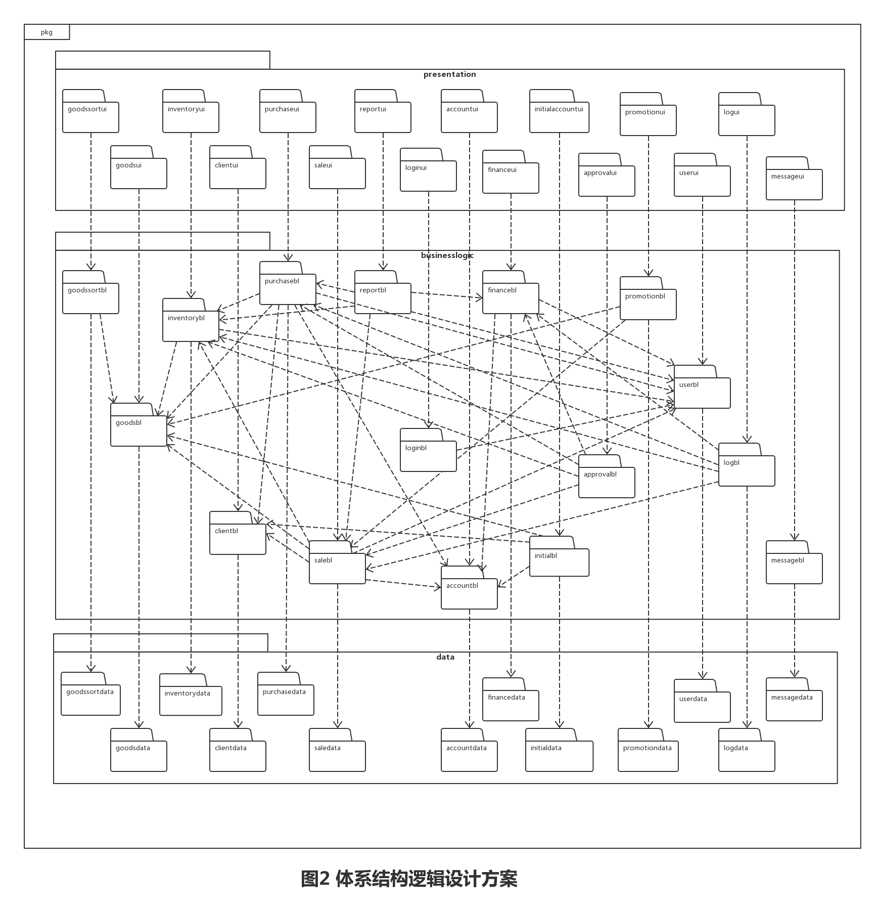
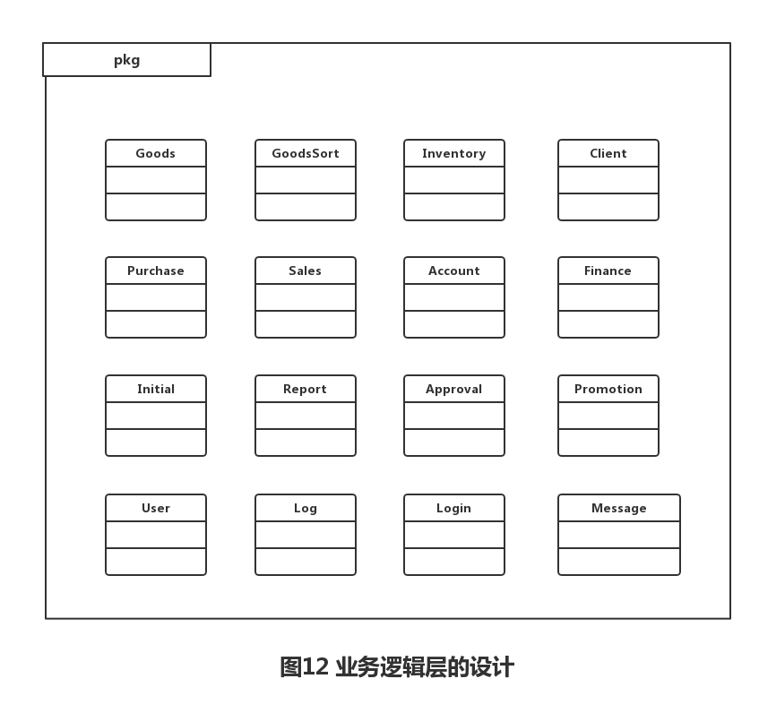

体系结构描述文档—— 灯具进销存管理系统  软工二小组

 
 
 

# 更新历史
| **修改人员**           | **日期**     | **变更原因** | **版本** |
| ------------------ | ---------- | -------- | ------ |
| 陈骁、陈思彤、 王宁、王颀涵 | 2017-10-10 | 最初版本     | V1.0   |
| 陈骁、陈思彤、 王宁、王颀涵 | 2017-11-11 | 修改接口方法   | V1.1   |

 
 
***********************************************
 
 

# 变更记录
| **修改人员**           | **日期**     | **变更原因** | **版本** | **变更内容** |
| ------------------ | ---------- | -------- | ------ | -------- |
| 陈骁、陈思彤、 王宁、王颀涵 | 2017-10-10 | 初始版本     | V1.0   | 无        |
| 陈骁、陈思彤、 王宁、王颀涵 | 2017-11-11 | 修改接口方法   | V1.1   | 接口方法     |

 
 
***********************************************
 
 

# 目录
<!-- TOC -->

- [更新历史](#更新历史)
- [变更记录](#变更记录)
- [目录](#目录)
- [1.引言](#1引言)
    - [1.1 编制目的](#11-编制目的)
    - [1.2 参考资料](#12-参考资料)
- [2.产品概述](#2产品概述)
- [3.逻辑视角](#3逻辑视角)
- [4.组合视角](#4组合视角)
    - [4.1 开发包图](#41-开发包图)
    - [4.2 运行时进程](#42-运行时进程)
    - [4.3 物理部署](#43-物理部署)
- [5.接口视角](#5接口视角)
    - [5.1 模块的职责](#51-模块的职责)
    - [5.2 用户界面层的分解](#52-用户界面层的分解)
        - [5.2.1 用户界面层模块的职责](#521-用户界面层模块的职责)
        - [5.2.2 用户界面层模块的接口规范](#522-用户界面层模块的接口规范)
    - [5.3 业务逻辑层的分解](#53-业务逻辑层的分解)
        - [5.3.1 业务逻辑层模块的职责](#531-业务逻辑层模块的职责)
        - [5.3.2 业务逻辑层模块的接口规范](#532-业务逻辑层模块的接口规范)
    - [5.4 数据层的分解](#54-数据层的分解)
        - [5.4.1 数据层模块的职责](#541-数据层模块的职责)
        - [5.4.2 数据层模块的接口规范](#542-数据层模块的接口规范)
- [6.信息视角](#6信息视角)
    - [6.1 数据持久化对象](#61-数据持久化对象)
        - [6.2 文件格式](#62-文件格式)

<!-- /TOC -->

 
 
***********************************************
 
 

# 1.引言

## 1.1 编制目的
本报告详细完成对灯具照明行业进销存系统的概要设计，达到指导详细设计和开发的目
的，同时实现测试人员及用户的沟通。 
本报告面向开发人员、测试人员及最终用户编写，是了解系统的导航。

 
 
***********************************************
 
 

## 1.2 参考资料
附录D.3 连锁商店（MSCS）软件体系描述结构文档

 
 
***********************************************
 
 

# 2.产品概述
参考灯具照明行业进销存系统用例文档和灯具照明行业进销存系统软件规格说明中对产
品的概括描述。

 
 
***********************************************
 
 

# 3.逻辑视角
灯具进销存管理系统中，选择了分层体系结构的风格，将系统分为3层（展示层、业务逻辑层、数据层）能够很好的示意整个高层抽象。展示层包括GUI页面的实现，业务逻辑层包含业务逻辑处理的实现，数据层负责数据的持久化和访问。分层体系结构的逻辑视角和逻辑设计方案如图1和图2所示。

 
 
***********************************************
 
 

# 4.组合视角
## 4.1 开发包图
灯具进销存管理系统的最终开发包设计如表1所示

| 表1                   | 连锁商店管理系统的最终开发包设计                         |
| -------------------- | ---------------------------------------- |
| 开发（物理）包              | 依赖的其他开发包                                 |
|                      |                                          |
| goodssortui          | goodssortblservice, 界面类库包, vo, exception, uiutility |
| goodssortblservice   | exception                                |
| goodssortbl          | goodssortblservice, goodssortdataservice, po, goodsbl, exception |
| goodssortdataservice | Java RMI, po, exception                  |
| goodssortdata        | po, goodssortdataservice, exception      |
|                      |                                          |
| goodsui              | goodsblservice, 界面类库包, vo, exception, uiutility |
| goodsblservice       | exception                                |
| goodsbl              | goodsblservice, goodsdataservice, po, exception |
| goodsdataservice     | Java RMI, po, exception                  |
| goodsdata            | po, goodsdataservice, exception          |
|                      |                                          |
| inventoryui          | inventoryblservice, 界面类库包, vo, exception, uiutility |
| inventoryblservice   | exception                                |
| inventorybl          | inventoryblservice, inventorydataservice, po, goodsbl,userbl, exception |
| inventorydataservice | Java RMI, po, exception                  |
| inventorydata        | po, inventorydataservice, exception      |
|                      |                                          |
| clientui             | clientblservice, 界面类库包, vo, exception, uiutility |
| clientblservice      | exception                                |
| clientbl             | clientblservice, clientdataservice, po, exception |
| clientdataservice    | Java RMI, po, exception                  |
| clientdata           | po, clientdataservice, exception         |
|                      |                                          |
| purchaseui           | purchaseblservice, 界面类库包, vo, exception, uiutility |
| purchaseblservice    | exception                                |
| purchasebl           | purchaseblservice, purchasedataservice, po, goodsbl, clientbl, accountbl, inventorybl, userbl, exception |
| purchasedataservice  | Java RMI, po, exception                  |
| purchasedata         | po, purchasedataservice, exception       |
|                      |                                          |
| saleui               | saleblservice, 界面类库包, vo, exception, uiutility |
| saleblservice        | exception                                |
| salebl               | saleblservice, saledataservice, po, goodsbl, clientbl, accountbl, inventorybl, userbl, exception |
| saledataservice      | Java RMI, po, exception                  |
| saledata             | po, saledataservice, exception           |
|                      |                                          |
| reportui             | reportblservice, 界面类库包, vo, exception, uiutility |
| reportblservice      | exception                                |
| reportbl             | reportblservice, reportdataservice, po, inventorybl, purchasebl, saleui,exception |
|                      |                                          |
| accountui            | accountblservice, 界面类库包, vo, exception, uiutility |
| accountblservice     | exception                                |
| accountbl            | accountblservice, accountdataservice, po, exception |
| accountdataservice   | Java RMI, po, exception                  |
| accountdata          | po, accountdataservice, exception        |
|                      |                                          |
| financeui            | billblservice, 界面类库包, vo, exception, uiutility |
| financeblservice     | exception                                |
| financebl            | financeblservice, financedataservice, po, accountbl, userbl, exception |
| financedataservice   | Java RMI, po, exception                  |
| financedata          | po, financedataservice, exception        |
|                      |                                          |
| initialui            | initialblservice, 界面类库包, vo, exception, uiutility |
| initialblservice     | exception                                |
| initialbl            | initialblservice, initialdataservice, po, goodsbl, client, accountbl, exception |
| initialdataservice   | Java RMI, po, exception                  |
| initialdata          | po, initialdataservice, exception        |
|                      |                                          |
| approvalui           | approvalblservice, 界面类库包, vo, exception, uiutility |
| approvalblservice    | exception                                |
| approvalbl           | approvalblservice, approvaldataservice, po, inventorybl, purchasebl, saleui, exception |
|                      |                                          |
| promotionui          | promotionblservice, 界面类库包, vo, exception, uiutility |
| promotionblservice   | , exception                              |
| promotionbl          | promotionblservice, promotiondataservice, po, goodsbl, salebl, clientbl, accountbl, exception |
| promotiondataservice | Java RMI, po, exception                  |
| promotiondata        | po, promotiondataservice, exception      |
|                      |                                          |
| userui               | userblservice, 界面类库包, vo, exception, uiutility |
| userblservice        | exception                                |
| userbl               | userblservice, userdataservice, po, exception |
| userdataservice      | Java RMI, po, exception                  |
| userdata             | po, userdataservice, exception           |
|                      |                                          |
| logui                | logblservice, 界面类库包, vo, exception, uiutility |
| logblservice         | exception                                |
| logbl                | logblservice, logdataservice, po, inventorybl, purchasebl, saleui, userbl, exception |
| logdataservice       | Java RMI, po, exception                  |
| logdata              | po, logdataservice, exception            |
|                      |                                          |
| loginui              | loginblservice, 界面类库包, vo, exception, uiutility |
| loginblservice       | exception                                |
| loginbl              | userbl, po, exception                    |
|                      |                                          |
| messageui            | messageblservice, 界面类库包, vo, exception, uiutility |
| messageblservice     | exception                                |
| messagebl            | messageblservice po, userbl              |
| messagedataservice   | Java RMI, po                             |
| messagedata          | po, logdataservice                       |
|                      |                                          |
| vo                   |                                          |
| po                   |                                          |
| uiutility            |                                          |
| exception            |                                          |
| 界面类库包                |                                          |
| Java RMI             |                                          |

灯具进销存管理系统客户端开发包图和服务器端开发包图如图3和图4所示。

 
 
***********************************************
 
 

## 4.2 运行时进程
在灯具进销存管理系统中，会有多个客户端进程和一个服务器端进程，其进程如图5所示。结合部署图，客户端进程是在客户端机器上运行，服务器端进程是在服务器端机器上运行。

 
 
***********************************************
 
 

## 4.3 物理部署
灯具进销存管理系统中客户端构件是放在客户端机上，服务器端构件是放在服务器端机器上。在客户端节点上，还要部署RMIStub构件。由于Java RMI 构件属于JDK 1.8的一部分。所以，在系统JDK环境已经设置好的情况下，不需要独立部署。部署图如图6所示。

 
 
***********************************************
 
 

# 5.接口视角
## 5.1 模块的职责
客户端模块和服务器模块视图分别如图7和图8所示。客户端各层和服务器端各层的职责分别如表2和3所示。

| 表2      | 客户端各层的职责               |
| ------- | ---------------------- |
| 客户端各层   | 客户端各层的职责               |
| 启动模块    | 负责初始化网络通信机制，启动用户界面     |
| 用户界面层   | 基于窗口的进销存管理系统客户端用户界面    |
| 业务逻辑层   | 对于用户界面的输入进行响应并进行业务处理逻辑 |
| 客户端网络模块 | 利用java RMI机制查找RMI服务    |
 

| 表3       | 服务器端各层的职责                   |
| -------- | --------------------------- |
| 服务器端各层   | 服务器端各层的职责                   |
| 启动模块     | 负责初始化网络通信机制，启动用户界面          |
| 数据层      | 负责数据的持久化及数据访问接口             |
| 服务器端网络模块 | 利用Java RMI机制开启RMI服务，注册RMI服务 |
 

每一层只是使用下方直接接触的层。层与层之间仅仅是通过接口的调用来完成的。层与层之间调用的接口下表4所示。

| 表4                                       | 层之间调用的接口 |          |
| ---------------------------------------- | -------- | -------- |
| 接口                                       | 服务调用方    | 服务提供方    |
| goodssortblservice goodsblservice inventoryblservice clientblservice purchaseblservice saleblservice accountblservice financeblservice reportblservice initialblservice approvalblservice promotionblservice userblservice logblservice messageblservice loginblservice | 客户端展示层   | 客户端业务逻辑层 |
| goodssortdataservice goodsdataservice inventorydataservice clientdataservice purchasedataservice saledataservice accountdataservice financedataservice initialdataservice promotiondataservice userdataservice logdataservice messagedataservice | 客户端业务逻辑层 | 服务器端数据层  |
 

借用登陆操作来说明层之间的调用，如图9所示。每一层之间都是由上一层依赖了一个接口(需接口)，而下层实现这个接口(供接口)。LoginBlService提供了LoginUI界面所需要的所有业务逻辑功能。LoginDataService提供了对数据库的增、删、改、查等操作。这样的实现就大大降低了层与层之间的耦合。

 
 
***********************************************
 
 

## 5.2 用户界面层的分解
根据需求，系统存在47个用户界面。具体内容和界面跳转如图10所示。

服务器端和客户端的用户界面设计接口是一致的，只是具体的界面不一样。用户界面类如图11所示。

### 5.2.1 用户界面层模块的职责
如下表5所示为用户界面层模块的职责

| 表5      | 用户界面层模块的职责    |
| ------- | ------------- |
| 模块      | 职责            |
| MainApp | 负责界面的显示和界面的跳转 |
 

### 5.2.2 用户界面层模块的接口规范
用户界面层模块的接口规范如表6所示

| 表6      | 用户界面层模块的接口规范 |            |
| ------- | ------------ | ---------- |
| MainApp | 语法           |            |
|         | 前置条件         | 无          |
|         | 后置条件         | 显示界面以及登陆窗口 |
 

用户界面层需要的服务接口如表7所示

| 表7                                    | 用户界面层需要的服务接口      |
| ------------------------------------- | ----------------- |
| 服务名                                   | 服务                |
| `businesslogicservice.LoginBLService` | 登录界面的逻辑接口         |
| `businesslogicservice.*BLService`     | 每个界面都有一个相应的业务逻辑接口 |

 
 
***********************************************
 
 

## 5.3 业务逻辑层的分解
业务逻辑层包括多个针对界面的业务逻辑处理对象。其设计图如图12所示。

### 5.3.1 业务逻辑层模块的职责
业务逻辑层模块的职责如下表所示

| 业务逻辑层模块     | 职责                      |
| ----------- | ----------------------- |
| goodssortbl | 负责实现商品分类与商品分类管理界面所需要的服务 |
| goodsbl     | 负责实现商品与商品管理界面所需要的服务     |
| inventorybl | 负责实现仓库管理界面所需要的服务        |
| clientbl    | 负责实现客户管理界面所需要的服务        |
| purchasebl  | 负责实现进货界面所需要的服务          |
| salebl      | 负责实现销售界面所需要的服务          |
| reportbl    | 负责实现查看报表界面所需要的服务        |
| accountbl   | 负责实现账户管理界面所需要的服务        |
| financebl   | 负责实现财务单据界面所需要的服务        |
| initialbl   | 负责实现期初建账界面所需要的服务        |
| approvalbl  | 负责实现审批界面所需要的服务          |
| promotionbl | 负责实现销售策略界面所需要的服务        |
| userbl      | 负责实现登陆及用户管理界面所需要的服务     |
| logbl       | 负责实现查看日志界面所需要的服务        |
| loginbl     | 负责实现登陆界面所需要的服务          |
| messagebl   | 负责查看系统信息界面所需要的服务        |
 

### 5.3.2 业务逻辑层模块的接口规范
业务逻辑层模块的接口规范如下所示

| goodssortbl模块提供的服务（供接口）              |      |                                          |
| ------------------------------------ | ---- | ---------------------------------------- |
| `GoodsSortBlService.getRoot`         | 语法   | `public GoodsSortVO getRoot()` |
|                                      | 前置条件 | 正在进行商品分类管理                               |
|                                      | 后置条件 | 输出商品分类的根节点                               |
| `GoodsSortBlService.addGoodsSort`    | 语法   | `public String addGoodsSort(GoodsSortVO goodsSort)` |
|                                      | 前置条件 | 正在进行商品分类管理                               |
|                                      | 后置条件 | 添加一个商品分类，更新商品分类列表                        |
| `GoodsSortBlService.deleteGoodsSort` | 语法   | `public void deleteGoodsSort(String goodsSortID)` |
|                                      | 前置条件 | 正在进行商品分类管理                               |
|                                      | 后置条件 | 删除一个商品分类，更新商品分类列表                        |
| `GoodsSortBlService.editGoodsSort`   | 语法   | `public void editGoodsSort(GoodsSortVO goodsSort)` |
|                                      | 前置条件 | 正在进行商品分类管理                               |
|                                      | 后置条件 | 编辑一个商品分类，更新商品分类列表                        |
| `GoodsSortBlService.find`            | 语法   | `public GoodsSortVO find(String goodsSortID)` |
|                                      | 前置条件 | 无                                        |
|                                      | 后置条件 | 返回相关的商品分类                                |

 

| gooossortbl模块需要的服务（需接口）                  |           |
| ---------------------------------------- | --------- |
| 服务名                                      | 服务        |
| `GoodsSortDataService.find(String goodsSortID)` | 取得持久化对象   |
| `GoodsSortDataService.insert(GoodsSortPO po)` | 添加商品分类    |
| `GoodsSortDataService.delete(GoodsSortPO po)` | 删除商品分类    |
| `GoodsSortDataService.update(GoodsSortPO po)` | 修改单一持久化对象 |
| `GoodsSortDataService.getRoot()`         | 得到商品分类根节点 |

 
 
***********************************************
 
 

| goodsbl模块提供的服务（供接口）           |      |                                          |
| ----------------------------- | ---- | ---------------------------------------- |
| `GoodsBlService.getGoodsList` | 语法   | `public ArrayList<GoodsVO> getGoodsList(GoodsQueryVO query)` |
|                               | 前置条件 | 正在进行商品管理                                 |
|                               | 后置条件 | 返回商品列表                                   |
| `GoodsBlService.addGoods`     | 语法   | `public String addGoods(GoodsVO goods)` |
|                               | 前置条件 | 正在进行商品管理                                 |
|                               | 后置条件 | 添加一个商品，更新商品列表                            |
| `GoodsBlService.editGoods`    | 语法   | `public void editGoods(GoodsVO goods)` |
|                               | 前置条件 | 正在进行商品管理                                 |
|                               | 后置条件 | 编辑一个商品，更新商品列表                            |
| `GoodsBlService.deleteGoods`  | 语法   | `public void deleteGoods(String goodsID)` |
|                               | 前置条件 | 正在进行商品管理                                 |
|                               | 后置条件 | 删除一个商品，更新商品列表                            |

 

| gooosbl模块需要的服务（需接口）                      |               |
| ---------------------------------------- | ------------- |
| 服务名                                      | 服务            |
| `GoodsDataService.find(String goodsID)`  | 根据筛选条件d进行查找商品 |
| `GoodsDataService.insert(GoodsPO po)`    | 添加商品          |
| `GoodsDataService.delete(String goodsID)` | 删除商品          |
| `GoodsDataService.update(GoodsPO po)`    | 更改商品信息        |
| `GoodsDataService.finds(GoodsQueryPO query)` | 查找香相关的商品列表    |

 
 
***********************************************
 
 

| inventorybl模块提供的服务（供接口）                  |      |                                          |
| ---------------------------------------- | ---- | ---------------------------------------- |
| `InventoryCheckBlService.getInventoryCheck` | 语法   | `public ArrayList<InventoryCheckItemVO> getInventoryCheck(Date start,Date end)` |
|                                          | 前置条件 | 正在进行库存查看                                 |
|                                          | 后置条件 | 返回对应的库存查看数据                              |
| `InventoryVerificationBlService.getGoodsList` | 语法   | `public ArrayList<GoodsVO> getGoodsList(GoodsQueryVO query)` |
|                                          | 前置条件 | 无                                        |
|                                          | 后置条件 | 得到库存数据                                   |
| `InventoryLossOverBillBlService.getGoodList` | 语法   | `public ArrayList<GoodsVO> getGoodsList(GoodsQueryVO query)` |
|                                          | 前置条件 | 无                                        |
|                                          | 后置条件 | 返回对应商品列表                                 |
| `InventoryLossOverBillBlService.submit`  | 语法   | `public String submit(InventoryLossOverBillVO bill)` |
|                                          | 前置条件 | 无                                        |
|                                          | 后置条件 | 更新并提交库存溢损单，持久化更新涉及的对象的数据                 |
| `InventoryLossOverBillBlService.editInventoryLossOverBill` | 语法   | `    public void editInventoryLossOverBill(InventoryLossOverBillVO inventoryLossOverBillVO)` |
|                                          | 前置条件 | 无                                        |
|                                          | 后置条件 | 更新库存溢损单，持久化更新涉及的对象的数据                    |
| `InventoryLossOverBillBlService.getInventoryLossOverBillList` | 语法   | `public ArrayList<InventoryLossOverBillVO> getInventoryLossOverBillList(BillQueryVO query)` |
|                                          | 前置条件 | 无                                        |
|                                          | 后置条件 | 取得库存溢损单列表                                |
| `InventoryGiftBillBlService.getGoodList` | 语法   | `public ArrayList<GoodsVO> getGoodsList(GoodsQueryVO query)` |
|                                          | 前置条件 | 无                                        |
|                                          | 后置条件 | 返回对应商品列表                                 |
| `InventoryGiftBillBlService.getClientList` | 语法   | `public ArrayList<ClientVO> getClientList(ClientQueryVO query)` |
|                                          | 前置条件 | 无                                        |
|                                          | 后置条件 | 返回对应客户列表                                 |
| `InventoryGiftBillBlService.submit`      | 语法   | `public String submit(InventoryGiftBillVO bill)` |
|                                          | 前置条件 | 无                                        |
|                                          | 后置条件 | 更新并提交库存赠送单，持久化更新涉及的对象的数据                 |
| `InventoryGiftBillBlService.editInventoryGiftBill` | 语法   | `public void editInventoryGiftBill(InventoryGiftBillVO inventoryGiftBillVO)` |
|                                          | 前置条件 | 无                                        |
|                                          | 后置条件 | 更新库存溢损单，持久化更新涉及的对象的数据                    |
| `InventoryGiftBillBlService.getInventoryGiftBillList` | 语法   | `public ArrayList<InventoryGiftBillVO> getInventoryGiftBillList(BillQueryVO query)` |
|                                          | 前置条件 | 无                                        |
|                                          | 后置条件 | 取得库存赠送单列表                                |

 

| inventorybl模块需要的服务（需接口）                  |            |
| ---------------------------------------- | ---------- |
| 服务名                                      | 服务         |
| `InventoryLossOverBillDataService.find(BillQueryPO query)` | 查找匹配的持久化对象 |
| `InventoryLossOverBillDataService.insert(InventoryLossOverBillPO po)` | 添加单据       |
| `InventoryLossOverBillDataService.update(InventoryLossOverBillPO po)` | 修改单据       |
| `InventoryGiftBillDataService.find(BillQueryVO query)` | 查找匹配的持久化对象 |
| `InventoryGiftBillDataService.insert(InventoryGiftBillPO po)` | 添加单据       |
| `InventoryGiftBillDataService.update(InventoryGiftBillPO po)` | 修改单据       |

 
 
***********************************************
 
 

| clientbl模块提供的服务（供接口）            |      |                                          |
| ------------------------------- | ---- | ---------------------------------------- |
| `ClientBlService.getClientList` | 语法   | `public ArrayList<ClientVo> getClientList(ClientQueryVO query)` |
|                                 | 前置条件 | 正在进行客户管理                                 |
|                                 | 后置条件 | 返回客户列表                                   |
| `ClientBlService.addClient`     | 语法   | `public String addClient(ClientVO client)` |
|                                 | 前置条件 | 正在进行客户管理                                 |
|                                 | 后置条件 | 添加一个客户，返回客户ID                            |
| `ClientBlService.editClient`    | 语法   | `public void editClient(ClientVO client)` |
|                                 | 前置条件 | 正在进行客户管理                                 |
|                                 | 后置条件 | 编辑一个客户，更新客户列表                            |
| `ClientBlService.deleteClient`  | 语法   | `public void deleteClient(String clientID)` |
|                                 | 前置条件 | 正在进行客户管理                                 |
|                                 | 后置条件 | 删除一个客户，更新客户列表                            |
| `ClientBlService.getUserList`   | 语法   | `public ArrayList<UserVO> getUserList(UserQueryVO query)` |
|                                 | 前置条件 | 正在进行客户管理                                 |
|                                 | 后置条件 | 取得符合条件的用户列表，作为业务员的备选                     |

 

| clientbl模块需要的服务（需接口）                     |              |
| ---------------------------------------- | ------------ |
| 服务名                                      | 服务           |
| `ClientDataService.find(ClientQueryPO query)` | 根据筛选条件进行查找客户 |
| `ClientDataService.insert(ClientPO po)`  | 添加客户         |
| `ClientDataService.delete(String clientID)`  | 删除客户         |
| `ClientDataService.update(ClientPO po)`  | 更改客户信息       |
| `ClientDataService.getID()`              | 得到新的客户ID     |

 
 
***********************************************
 
 

| purchasebl提供的服务（供接口）                     |      |                                          |
| ---------------------------------------- | ---- | ---------------------------------------- |
| `PurchaseTradeBillBlService.getSupplierList` | 语法   | `public ArrayList<ClientVO> getSupplierList(ClientQueryVO query)` |
|                                          | 前置条件 | 开始制定进货单                                  |
|                                          | 后置条件 | 返回客户列表                                   |
| `PurchaseTradeBillService.getGoodsList`  | 语法   | `public ArrayList<GoodsVO> getGoodsList(GoodsQueryVO query)` |
|                                          | 前置条件 | 开始制定进货单                                  |
|                                          | 后置条件 | 返回商品列表                                   |
| `PurchaseTradeBillBlService.submit`      | 语法   | `public String submit(PurchaseTradeBillVO purchaseTradeBillVO)` |
|                                          | 前置条件 | 无                                        |
|                                          | 后置条件 | 提交单据，返回单据ID                              |
| `PurchaseTradeBillBlService.editPurchaseTradeBill` | 语法   | `public void editPurchaseTradeBill(PurchaseTradeBillVO purchaseTradeBillVO)` |
|                                          | 前置条件 | 制定单据完成                                   |
|                                          | 后置条件 | 更新单据信息                                   |
| `PurchaseTradeBillBlService.getPurchaseTradeBillList` | 语法   | `public ArrayList<PurchaseTradeBillVO> getPurchaseTradeBillList(BillQueryVO query)` |
|                                          | 前置条件 | 无                                        |
|                                          | 后置条件 | 取得进货单列表                                  |
| `PurchaseRefundBillBlService.getSupplierList` | 语法   | `public ArrayList<ClientVO> getSupplierList(ClientQueryVO query)` |
|                                          | 前置条件 | 开始制定进货退货单                                |
|                                          | 后置条件 | 返回客户列表                                   |
| `PurchaseRefundBillService.getGoodsList` | 语法   | `public ArrayList<GoodsVO> getGoodsList(GoodsQueryVO query)` |
|                                          | 前置条件 | 开始制定进货退货单                                |
|                                          | 后置条件 | 返回商品列表                                   |
| `PurchaseRefundBillBlService.submit`     | 语法   | `public String submit(PurchaseRefundBillVO purchaseRefundBillVO)` |
|                                          | 前置条件 | 制定单据完成                                   |
|                                          | 后置条件 | 提交单据，返回单据ID                           |
| `PurchaseRefundBillBlService.editPurchaseRefundBill` | 语法   | `public void editPurchaseRefundBill(PurchaseRefundBillVO purchaseRefundBillVO)` |
|                                          | 前置条件 | 制定单据完成                                   |
|                                          | 后置条件 | 更新单据信息                                   |
| `PurchaseRefundBilllService.getPurchaseRefudnBillList` | 语法   | `public ArrayList<PurchaseRefundBillVO> getPurchaseRefundBillList(BillQueryVO query)` |
|                                          | 前置条件 | 无                                        |
|                                          | 后置条件 | 取得进货退货单列表                                |

 

| purchasebl模块需要的服务（需接口）                   |         |
| ---------------------------------------- | ------- |
| 服务名                                      | 服务      |
| `PurchaseTradeBillDataService.finds(BillQueryPO query)` | 取得进货单列表 |
| `PurchaseTradeBillDataService.insert(PurchaseTradeBillPO po)` | 添加进货单   |
| `PurchaseTradeBillDataService.update(PurchaseTradeBillPO po)` | 修改进货单   |
| `PurchaseRefundBillDataService.finds(BillQueryPO query)` | 取得进货单退货列表 |
| `PurchaseRefundBillDataService.insert(PurchaseRefundBillPO po)` | 添加进货退货单   |
| `PurchaseRefundBillDataService.update(PurchaseRefundBillPO po)` | 修改进货退货单   |

 
 
***********************************************
 
 

| salebl模块提供的服务（供接口）                       |      |                                          |
| ---------------------------------------- | ---- | ---------------------------------------- |
| `SaleTradeBillBlService.getSellerList`   | 语法   | `public ArrayList<ClientVO> getSellerList(ClientQueryVO query)` |
|                                          | 前置条件 | 开始制定销售单                                  |
|                                          | 后置条件 | 返回客户列表                                   |
| `SaleTradeBillService.getGoodsList`      | 语法   | `public ArrayList<goodsVO> getGoodsList(GoodsQueryVO query)` |
|                                          | 前置条件 | 开始制定销售单                                  |
|                                          | 后置条件 | 返回商品列表                                   |
| `SaleTradeBillService.getPromotitonList` | 语法   | `public ArrayList<PromotionVO> getPromotionList(PromotionQueryVO query)` |
|                                          | 前置条件 | 开始制定销售单                                  |
|                                          | 后置条件 | 返回符合的促销策略列表                              |
| `SaleTradeBillBlService.submit`          | 语法   | `public String submit(SaleTradeBillVO saleTradeBillVO)` |
|                                          | 前置条件 | 制定单据完成                                   |
|                                          | 后置条件 | 保存单据，返回单据ID                              |
| `SaleTradeBillBlService.editSaleTradeBill` | 语法   | `public void editSaleTradeBill(SaleTradeBillVO saleTradeBillVO)` |
|                                          | 前置条件 | 无                                        |
|                                          | 后置条件 | 更新单据信息                                   |
| `SaleTradeBillBlService.getSaleTradeBillList` | 语法   | `public ArrayList<SaleTradeBillVO> getSaleTradeBillList(BillQueryVO query)` |
|                                          | 前置条件 | 无                                        |
|                                          | 后置条件 | 取得销售单列表                                  |
| `SaleRefundBillBlService.getSellerList`  | 语法   | `public ArrayList<ClientVO> getSellerList(ClientQueryVO query)` |
|                                          | 前置条件 | 开始制定销售退货单                                |
|                                          | 后置条件 | 返回客户列表                                   |
| `SaleRefundBillService.getGoodsList`     | 语法   | `public ArrayList<GoodsVO> getGoodsList(GoodsQueryVO query)` |
|                                          | 前置条件 | 开始制定销售退货单                                |
|                                          | 后置条件 | 返回商品列表                                   |
| `SaleRefundBillBlService.submit`         | 语法   | `public String submit(SaleRefundBillVO saleRefundBillVO)` |
|                                          | 前置条件 | 制定单据完成                                   |
|                                          | 后置条件 | 保存单据，返回单据ID                          |
| `SaleRefundBillBlService.editSaleRefundBill` | 语法   | `public void editSaleRefundBill(SaleRefundBillVO saleRefundBillVO)` |
|                                          | 前置条件 | 无                                        |
|                                          | 后置条件 | 更新单据信息                                   |
| `SaleRefundBilllService.getSaleRefudnBillList` | 语法   | `public ArrayList<SaleRefundBillVO> getSaleRefundBillList(BillQueryVO query)` |
|                                          | 前置条件 | 无                                        |
|                                          | 后置条件 | 取得销售退货单列表                                |

 

| 需要的服务（需接口）                               |         |
| ---------------------------------------- | ------- |
| 服务名                                      | 服务      |
| `SaleTradeBillDataService.findsByReport(SaleTradeBillQueryPO query)` | 取得销售单列表 |
| `SaleTradeBillDataService.findsByBill(BillQueryPO query)` | 取得销售单列表 |
| `SaleTradeBillDataService.insert(SaleTradeBillPO po)` | 添加销售单   |
| `SaleTradeBillDataService.update(SaleTradeBillPO po)` | 添加销售单   |
| `SaleRefundBillDataService.finds(BillQueryPO query)` | 取得销售单列表 |
| `SaleRefundBillDataService.insert(SaleRefundBillPO po)` | 添加销售单   |
| `SaleRefundBillDataService.update(SaleRefundBillPO po)` | 更新销售单   |

 
 
***********************************************
 
 

| loginbl模块提供的服务（供接口）     |      |                                          |
| ----------------------- | ---- | ---------------------------------------- |
| `LoginBlService.login`  | 语法   | `public UserVO login(String jobName, String password)` |
|                         | 前置条件 | 在登陆界面                                    |
|                         | 后置条件 | 根据用户名和密码返回客户信息                           |
| `LoginBlService.logout` | 语法   | `public void logout(String ID)`          |
|                         | 前置条件 | 在登陆界面                                    |
|                         | 后置条件 | 根据用户名和密码返回客户信息                           |

 

| loginbl模块需要的服务（需接口）                      |              |
| ---------------------------------------- | ------------ |
| 服务名                                      | 服务           |
| 无 |  |

 
 
***********************************************
 
 

| messagebl模块提供的服务（供接口）             |      |                                          |
| --------------------------------- | ---- | ---------------------------------------- |
| `MessageBlService.getMessageList` | 语法   | `public Arraylist<MessageVO> getMessageList(UserVO receiver)` |
|                                   | 前置条件 | 在各个用户的主界面                                |
|                                   | 后置条件 | 根据接收者，返回系统信息                             |
| `MessageBlService.deleteMessage`       | 语法   | `public void deleteMessage(String receiverID, int number))` |
|                                   | 前置条件 | 删除给某一用户的信息                               |
|                                   | 后置条件 | 更新持久化数据                                  |
 

| messagebl模块需要的服务（需接口）                    |            |
| ---------------------------------------- | ---------- |
| 服务名                                      | 服务         |
| `MessageDataService.finds(String receiverID)` | 取得该用户的系统信息 |
| `MessageDataService.insert(MessagePO message)` | 新增系统消息     |
| `MessageDataService.delete(String receiverID, int number)` | 删除系统消息     |

 
 
***********************************************
 
 

| accountbl模块提供的服务（供接口）             |      |                                          |
| --------------------------------- | ---- | ---------------------------------------- |
| `AccountBlService.getAccountList` | 语法   | `public ArrayList<AccountVO> getAccountList(AccountQueryVO query)` |
|                                   | 前置条件 | 无                                        |
|                                   | 后置条件 | 返回符合查询条件的账户                              |
| `AccountBlService.editAccount`    | 语法   | `public void editAccount(AccountVO account)` |
|                                   | 前置条件 | 最高权限                                     |
|                                   | 后置条件 | 修改账户属性并更新账户信息                            |
| `AccountBlService.find`           | 语法   | `public AccountVO find(String accountID)` |
|                                   | 前置条件 | 无                                        |
|                                   | 后置条件 | 返回符合ID的账户                                |
| `AccountBlService.addAccount`     | 语法   | `public String addAccount(AccountVO account)` |
|                                   | 前置条件 | 最高权限                                     |
|                                   | 后置条件 | 添加账户，并更新账户列表                             |
| `AccountBlService.deleteAccount`  | 语法   | `public void deleteAccount(String accountID)` |
|                                   | 前置条件 | 最高权限                                     |
|                                   | 后置条件 | 删除账户，更新账户列表                              |

 

| accountbl模块需要的服务（需接口）                    |            |
| ---------------------------------------- | ---------- |
| 服务名                                      | 服务         |
| `AccountDataService.find(String accountID);` | 根据ID精确查找账户 |
| `AccountDataService.finds(AccountQueryPO query)` | 返回账户列表     |
| `AccountDataService.insert(AccountPO po)` | 添加账户       |
| `AccountDataService.delete(String accountID)` | 删除账户       |
| `AccountDataService.update(AccountPO po)` | 更改账户信息     |

 
 
***********************************************
 
 

| financebl模块提供的服务（供接口）                    |      |                                          |
| ---------------------------------------- | ---- | ---------------------------------------- |
| `PaymentBillBlService.getPaymentBillList` | 语法   | `public ArrayList<PaymentBillVO> getPaymentBillList(BillQueryVO query)` |
|                                          | 前置条件 | 无                                        |
|                                          | 后置条件 | 返回付款单列表                                  |
| `PaymentBillBlService.getClientList`     | 语法   | `public ArrayList<ClientVO> getClientList(ClientQueryVO query)` |
|                                          | 前置条件 | 无                                        |
|                                          | 后置条件 | 返回客户列表                                   |
| `PaymentBillBlService.getAccountList`    | 语法   | `public ArrayList<AccountVO> getAccountList(AccountQueryVO query)` |
|                                          | 前置条件 | 无                                        |
|                                          | 后置条件 | 返回账户列表                                   |
| `PaymentBillBlService.submit`            | 语法   | `public String submit(PaymentBillVO vo)` |
|                                          | 前置条件 | 提交付款单                                    |
|                                          | 后置条件 | 更新并提交付款单，持久化更新涉及的对象的数据                   |
| `PaymentBillBlService.editPaymentBill`   | 语法   | `public void editPaymentBill(PaymentBillVO vo)` |
|                                          | 前置条件 | 修改草稿或审批不通过单据                             |
|                                          | 后置条件 | 更新付款单，持久化更新涉及的对象的数据                      |
| `ReceiptBillBlService.getReceiptBillList` | 语法   | `public ArrayList<ReceiptBillVO> getReceiptBillList(BillQueryVO query)` |
|                                          | 前置条件 | 无                                        |
|                                          | 后置条件 | 返回收款单列表                                  |
| `ReceiptBillBlService.getClientList`     | 语法   | `public ArrayList<ClientVO> getClientList(ClientQueryVO query)` |
|                                          | 前置条件 | 无                                        |
|                                          | 后置条件 | 返回客户列表                                   |
| `ReceiptBillBlService.getAccountList`    | 语法   | `public ArrayList<AccountVO> getAccountList(AccountQueryVO query)` |
|                                          | 前置条件 | 无                                        |
|                                          | 后置条件 | 返回账户列表                                   |
| `ReceiptBillBlService.submit`            | 语法   | `public String submit(ReceiptBillVO vo)` |
|                                          | 前置条件 | 提交收款单                                    |
|                                          | 后置条件 | 更新并提交收款单，持久化更新涉及的对象的数据                   |
| `ReceiptBillBlService.editReceiptBill`   | 语法   | `public void editReceiptBill(ReceiptBillVO vo)` |
|                                          | 前置条件 | 修改草稿或审批不通过单据                             |
|                                          | 后置条件 | 更新收款单，持久化更新涉及的对象的数据                      |
| `CashBillBlService.getCashBillList`      | 语法   | `public ArrayList<CashBillVO> getCashBillList(BillQueryVO query)` |
|                                          | 前置条件 | 无                                        |
|                                          | 后置条件 | 返回现金费用单列表                                |
| `CashBillBlService.getGoodsList`         | 语法   | `public ArrayList<GoodsVO> getGoodsList(GoodsQueryVO query)` |
|                                          | 前置条件 | 无                                        |
|                                          | 后置条件 | 返回商品列表                                   |
| `CashBillBlService.getAccountList`       | 语法   | `public ArrayList<AccountVO> getAccountList(AccountQueryVO query)` |
|                                          | 前置条件 | 无                                        |
|                                          | 后置条件 | 返回账户列表                                   |
| `CashBillBlService.submit`               | 语法   | `public String submit(CashBillVO vo)` |
|                                          | 前置条件 | 提交现金费用单                                  |
|                                          | 后置条件 | 更新并提交现金费用单，持久化更新涉及的对象的数据                 |
| `CashBillBlService.editCashBill`         | 语法   | `public void editCashBill(CashBillVO vo)` |
|                                          | 前置条件 | 修改草稿或审批不通过单据                             |
|                                          | 后置条件 | 更新现金费用单，持久化更新涉及的对象的数据                    |

 

| financebl模块需要的服务（需接口）                    |                 |
| ---------------------------------------- | --------------- |
| 服务名                                      | 服务              |
| `PaymentBillDataService.finds(BillQueryPO query)` | 根据筛选条件获取付款单列表   |
| `PaymentBillDataService.insert(PaymentBillPO po)` | 添加付款单           |
| `PaymentBillDataService.update(PaymentBillPO po)` | 更新付款单信息         |
| `ReceiptBillDataService.finds(BillQueryPO query)` | 根据筛选条件获取收款单列表   |
| `ReceiptBillDataService.insert(ReceiptBillPO po)` | 添加收款单           |
| `ReceiptBillDataService.update(ReceiptBillPO po)` | 更新收款单信息         |
| `CashBillDataService.finds(BillQueryPO query)` | 根据筛选条件获取现金费用单列表 |
| `CashBillDataService.insert(CashBillPO po)` | 添加现金费用单         |
| `CashBillDataService.update(CashBillPO po)` | 更新现金费用单信息       |

 
 
***********************************************
 
 

| initialbl模块提供的服务（供接口）               |      |                                          |
| ----------------------------------- | ---- | ---------------------------------------- |
| `InitialBlService.getGoodsList`     | 语法   | `public ArrayList<GoodsVO> getGoodsList(GoodsQueryVO query)` |
|                                     | 前置条件 | 无                                        |
|                                     | 后置条件 | 返回上一年的持久化商品对象                            |
| `InitialBlService.getClientList`    | 语法   | `public ArrayList<ClientVO> getClientList(ClientQueryVO query)` |
|                                     | 前置条件 | 无                                        |
|                                     | 后置条件 | 返回上一年的持久化客户对象                            |
| `InitialBlService.getAccountList`   | 语法   | `public ArrayList<AccountVO> getAccountList(AccountQueryVO query)` |
|                                     | 前置条件 | 无                                        |
|                                     | 后置条件 | 返回上一年的持久化账户对象                            |
| `InitialBlService.establishInitial` | 语法   | `public String establishInitial(InitialVO initial)` |
|                                     | 前置条件 | 无                                        |
|                                     | 后置条件 | 保存期初信息，持久化更新涉及的对象的数据                     |
| `InitialBlService.getInitial`       | 语法   | `public ArrayList<InitialVO> getInitial(InitialQueryVO query)` |
|                                     | 前置条件 | 无                                        |
|                                     | 后置条件 | 返回期初信息列表                                 |

 

| initialbl模块需要的服务（需接口）                    |           |
| ---------------------------------------- | --------- |
| 服务名                                      | 服务        |
| `InitialDataService.insert(InitialPO po)` | 添加期初信息    |
| `InitialDataService.finds(InitialQueryPO query)` | 获取持久化对象列表 |

 
 
***********************************************
 
 

| logbl模块提供的服务（供接口）         |      |                                          |
| ------------------------- | ---- | ---------------------------------------- |
| `LogBlService.getLogList` | 语法   | `public ArrayList<LogVO> getLogList(LogQueryVO query)` |
|                           | 前置条件 | 无                                        |
|                           | 后置条件 | 返回日志列表                                   |

 

| logbl模块需要的服务（需接口）                        |               |
| ---------------------------------------- | ------------- |
| 服务名                                      | 服务            |
| `LogDataService.finds(LogQueryPO query)` | 根据筛选条件查找符合的日志 |
| `LogDataService.insert(LogPO po)`        | 插入日志          |

 
 
***********************************************
 
 

| reportbl提供的服务（供接口）                       |      |                                          |
| ---------------------------------------- | ---- | ---------------------------------------- |
| `SaLeDetailBlService.getSaleRecordList`  | 语法   | `public ArrayList<SaleRecordVO> getSaleRecordList(SaleDetailQueryVO query)` |
|                                          | 前置条件 | 无                                        |
|                                          | 后置条件 | 系统返回符合筛选条件的所有商品销售记录                      |
| `BusinessHistoryBlService.getBillList`   | 语法   | `public ArrayList<BillVO> getBillList(BusinessHistoryQueryVO query)` |
|                                          | 前置条件 | 无                                        |
|                                          | 后置条件 | 系统返回符合筛选条件的所有单据                          |
| `BusinessHistoryBlService.reversePaymentBill` | 语法   | `public String reversePaymentBill(PaymentBillVO paymentBillVO, UserVO operator)` |
|                                          | 前置条件 | 无                                        |
|                                          | 后置条件 | 红冲付款单                                    |
| `BusinessHistoryBlService.reverseReceiptBill` | 语法   | `public String reverseReceiptBill(ReceiptBillVO receiptBillVO, UserVO operator)` |
|                                          | 前置条件 | 无                                        |
|                                          | 后置条件 | 红冲收款单                                    |
| `BusinessHistoryBlService.reverseCashBill` | 语法   | `public String reverseCashBill (CashBillVO cashBillVO, UserVO operator)` |
|                                          | 前置条件 | 无                                        |
|                                          | 后置条件 | 红冲现金费用单                                  |
| `BusinessConditionBlService.getCondition` | 语法   | `public ArrayList<Double> getCondition(BusinessConditionQueryVO query)` |
|                                          | 前置条件 | 无                                        |
|                                          | 后置条件 | 系统返回符合筛选条件的经营情况                          |

 

| reportbl需要的服务（需接口）                       |           |
| ---------------------------------------- | --------- |
| 服务名                                      | 服务        |
| 无 |    |

 
 
***********************************************
 
 

| approvalbl提供的服务（供接口）            |      |                                          |
| ------------------------------- | ---- | ---------------------------------------- |
| `ApprovalBlService.getBillList` | 语法   | `public ArrayList<BillVO> getBillList(BillQueryVO query)` |
|                                 | 前置条件 | 无                                        |
|                                 | 后置条件 | 系统显示该类型的提交单据                             |
| `ApprovalBlService.pass`        | 语法   | `public void pass(BillVO vo, UserVO senderVO)` |
|                                 | 前置条件 | 无                                        |
|                                 | 后置条件 | 系统修改单据的数据，状态以及单据涉及的数据                    |
| `ApprovalBlService.reject`      | 语法   | `public void reject(BillVO vo, String reason, UserVO senderVO)` |
|                                 | 前置条件 | 无                                        |
|                                 | 后置条件 | 系统修改单据的状态                                |

 

| approvalbl需要的服务（需接口）                     |            |
| ---------------------------------------- | ---------- |
| 服务名                                      | 服务         |
| 无 |     |

 
 
***********************************************
 
 

| promotionbl提供的服务（供接口）                 |      |                                          |
| ------------------------------------- | ---- | ---------------------------------------- |
| `PromotionBlService.getPromotionList` | 语法   | `public ArrayList<PromotionVO> getPromotionList(PromotionQueryVO query)` |
|                                       | 前置条件 | 无                                        |
|                                       | 后置条件 | 系统显示符合条件的促销策略                            |
| `PromotionBlService.addPromotion`     | 语法   | `public String addPromotion(PromotionVO vo);` |
|                                       | 前置条件 | vo属性正确                                   |
|                                       | 后置条件 | 系统新增促销策略                                 |
| `PromotionBlService.editPromotion`    | 语法   | `public void editPromotion(PromotionVO vo)` |
|                                       | 前置条件 | vo属性正确                                   |
|                                       | 后置条件 | 系统修改促销策略                                 |
| `PromotionBlService.deletePromotion`  | 语法   | `public void deletePromotion(String promotionID)` |
|                                       | 前置条件 | 无                                        |
|                                       | 后置条件 | 系统删除促销策略                                 |
| `PromotionBlService.getGoodsList　`    | 语法   | `public ArrayList<GoodsVO> getGoodsList(GoodsQueryVO query)` |
|                                       | 前置条件 | 无                                        |
|                                       | 后置条件 | 无                                        |

 

| promotionbl需要的服务（需接口）                    |              |
| ---------------------------------------- | ------------ |
| 服务名                                      | 服务           |
| `PromotionDataService.finds(PromotionQueryPO query)` | 根据筛选条件查找促销策略 |
| 服务名                                      | 服务           |
| `PromotionDataService.find(String promotionID)` | 根据ID查找唯一促销策略 |
| `PromotionDataService.insert(PromotionPO po)` | 插入单一持久化对象    |
| `PromotionDataService.delete(String promotionID)` | 删除单一持久化对象    |
| `PromotionDataService.update(PromotionPO po)` | 更新单一持久化对象    |

 
 
***********************************************
 
 

| userbl提供的服务（供接口）            |      |                                          |
| --------------------------- | ---- | ---------------------------------------- |
| `UserBlService.getUserList` | 语法   | `public ArrayList<UserVO> getUserList(UserQueryVO query)` |
|                             | 前置条件 | 无                                        |
|                             | 后置条件 | 返回用户列表                                   |
| `UserBlService.addUser`     | 语法   | `public String addUser(UserVO vo)` |
|                             | 前置条件 | 无                                        |
|                             | 后置条件 | 插入单一持久化对象                                |
| `UserBlService.editUser`    | 语法   | `public void editUser(UserVO vo)` |
|                             | 前置条件 | 无                                        |
|                             | 后置条件 | 更新单一持久化对象                                |
| `UserBlService.deleteUser`  | 语法   | `public void deleteUser(String UserID)` |
|                             | 前置条件 | 无                                        |
|                             | 后置条件 | 删除单一持久化对象                                |
| `UserTool.getUserList`      | 语法   | `public ArrayList<UserVO> getUserList(UserQueryVO query)` |
|                             | 前置条件 | 无                                        |
|                             | 后置条件 | 返回用户列表                                   |

 

| 需要的服务（需接口）                               |              |
| ---------------------------------------- | ------------ |
| 服务名                                      | 服务           |
| `UserDataService.finds(UserQueryPO query)` | 根据筛选条件进行查找用户 |
| `UserDataService.find(String userID)`    | 根据ID查找唯一用户   |
| `UserDataService.insert(UserPO po)`      | 添加用户         |
| `UserDataService.delete(String userID)`  | 删除用户         |
| `UserDataService.update(UserPO po)`      | 更改用户         |
| `UserDataService.login(String jobName, String password)` | 用户登录         |
| `UserDataService.logout(String userID)`  | 用户登出         |

 
 
***********************************************
 
 

## 5.4 数据层的分解
数据层主要给业务逻辑层提供数据访问服务，包括对于持久化数据的增、删、改、查。持久化数据保存采用序列化文件

### 5.4.1 数据层模块的职责
数据层模块职责如下表所示

| 数据层模块                | 职责                             |
| -------------------- | ------------------------------ |
| goodssortdataserver  | 提供商品分类数据集体载入、保存、增删改查服务         |
| goodsdataserver      | 提供商品集体载入、保存、增删改查服务             |
| inventorydataservice | 提供库存单据的提交服务（赠送单、报溢单、报损单、报警单）   |
| clientdataservice    | 提供客户数据集体载入、保存、增删改查服务           |
| purchasedataservice  | 提供进货(退货)单数据集体载入、保存、增加、删除、查找、修改 |
| saledataservice      | 提供销售（退货）单数据集体载入、保存、增加、删除、查找    |
| accountdataservice   | 提供账户数据集体载入、保存、增删改查服务           |
| financedataservice   | 收款单、付款单、现金单的集体载入、保存、查看修改操作     |
| initialdataservice   | 提供期初建账数据集体载入、保存、增加、查看服务        |
| promotiondataservice | 提供促销策略的制定和管理                   |
| userdataservice      | 提供用户集体载入、保存、增删改查服务             |
| logdataservice       | 提供日志集体载入、保存、添加、查看服务            |
| logindataservice     | 提供登陆服务                         |
| messagedataservice   | 提供系统信息服务                       |

 

### 5.4.2 数据层模块的接口规范
数据层模块的接口规范如下所示

| goodssortdata模块提供的服务（供接口）      |      |                                          |
| ------------------------------ | ---- | ---------------------------------------- |
| `GoodsSortDataService.find`    | 语法   | `public GoodsSortPO find(String goodsSortID)` |
|                                | 前置条件 | 无                                        |
|                                | 后置条件 | 根据筛选条件进行查找商品分类                           |
| `GoodsSortDataService.insert`  | 语法   | `public String insert(GoodsSortPO po)` |
|                                | 前置条件 | 无                                        |
|                                | 后置条件 | 添加新商品分类，返回商品分类ID                         |
| `GoodsSortDataService.delete`  | 语法   | `public void delete(String GoodsSortID)` |
|                                | 前置条件 | 无                                        |
|                                | 后置条件 | 删除商品分类                                   |
| `GoodsSortDataService.update`  | 语法   | `public void update(GoodsSortPO po)` |
|                                | 前置条件 | 无                                        |
|                                | 后置条件 | 更新商品分类信息                                 |
| `GoodsSortDataService.getRoot` | 语法   | `public GoodsSortPO getRoot()` |
|                                | 前置条件 | 无                                        |
|                                | 后置条件 | 返回商品分类根节点                                |

 
 
 

| goodsdata模块提供的服务（供接口）     |      |                                          |
| ------------------------- | ---- | ---------------------------------------- |
| `GoodsDataService.find`   | 语法   | `public GoodsPO find(String goodsID)` |
|                           | 前置条件 | 无                                        |
|                           | 后置条件 | 根据ID进行查找单一商品                             |
| `GoodsDataService.insert` | 语法   | `public String insert(GoodsPO po)` |
|                           | 前置条件 | 无                                        |
|                           | 后置条件 | 添加新商品，返回商品ID                             |
| `GoodsDataService.delete` | 语法   | `public void delete(String goodsID)` |
|                           | 前置条件 | 无                                        |
|                           | 后置条件 | 删除商品                                     |
| `GoodsDataService.update` | 语法   | `public void update(GoodsPO po)` |
|                           | 前置条件 | 无                                        |
|                           | 后置条件 | 更新商品信息                                   |
| `GoodsDataService.finds`  | 语法   | `public ArrayList<GoodsPO> finds(GoodsQueryPO query)` |
|                           | 前置条件 | 无                                        |
|                           | 后置条件 | 根据筛选返回商品列表                               |

 
 
 

| inventorydata模块提供的服务（供接口）                |      |                                          |
| ---------------------------------------- | ---- | ---------------------------------------- |
| 服务名                                      | 服务   |                                          |
| `InventoryLossOverBillDataService.finds` | 语法   | `public ArrayList<InventoryLossOverBillPO> finds(BillQueryPO query)` |
|                                          | 前置条件 | 无                                        |
|                                          | 后置条件 | 取得溢损单列表                                  |
| `InventoryLossOverBillDataService.insert` | 语法   | `public String insert(InventoryLossOverBillPO po)` |
|                                          | 前置条件 | 无                                        |
|                                          | 后置条件 | 添加持久化溢损单数据，返回单据ID                        |
| `InventoryLossOverBillDataService.update` | 语法   | `public void update(InventoryLossOverBillPO po)` |
|                                          | 前置条件 | 无                                        |
|                                          | 后置条件 | 更新持久化溢损单数据                               |
| `InventoryGiftBillDataService.finds`     | 语法   | `ArrayList<InventoryGiftBillPO> finds(BillQueryPO query)` |
|                                          | 前置条件 | 无                                        |
|                                          | 后置条件 | 取得赠送单列表                                  |
| `InventoryGiftBillDataService.insert`    | 语法   | `public String insert(InventoryGiftBillPO po)` |
|                                          | 前置条件 | 无                                        |
|                                          | 后置条件 | 添加持久化赠送单数据，返回单据ID                        |
| `InventoryGiftBillDataService.update`    | 语法   | `public void update(InventoryGiftBillPO po)` |
|                                          | 前置条件 | 无                                        |
|                                          | 后置条件 | 更新持久化赠送单数据                               |

 
 
 

| clientdata模块提供的服务（供接口）                   |      |                                          |
| ---------------------------------------- | ---- | ---------------------------------------- |
| `ClientDataService.find` | 语法   | `public ClientPO find(String clientID)`  |
|                                          | 前置条件 | 无                                        |
|                                          | 后置条件 | 根据ID进行查找客户                               |
| `ClientDataService.finds` | 语法   | `public ClientPO find(ClientQueryPO query)` |
|                                          | 前置条件 | 无                                        |
|                                          | 后置条件 | 根据筛选条件进行查找客户                             |
| `ClientDataService.insert`  | 语法   | `public void insert(ClientPO po)`        |
|                                          | 前置条件 | 无                                        |
|                                          | 后置条件 | 添加新客户，返回提示信息                             |
| `ClientDataService.delete`  | 语法   | `public void delete(String clientID)`        |
|                                          | 前置条件 | 无                                        |
|                                          | 后置条件 | 删除客户，返回提示信息                              |
| `ClientDataService.update`  | 语法   | `public void update(ClientPO po)`        |
|                                          | 前置条件 | 无                                        |
|                                          | 后置条件 | 更新客户信息，返回提示信息                            |

 
 
 

| purchasedata模块提供的服务（供接口）                 |      |                                          |
| ---------------------------------------- | ---- | ---------------------------------------- |
| 服务名                                      | 服务   |                                          |
| `PurchaseTradeBillDataService.finds` | 语法   | `public ArrayList<PurchaseTradeBillPO> find(BillQueryPO query)` |
|                                          | 前置条件 | 无                                        |
|                                          | 后置条件 | 取得进货单列表                                  |
| `PurchaseTradeBillDataService.insert` | 语法   | `public void insert(PurchaseTradeBillPO po)` |
|                                          | 前置条件 | 制定单据完成                                   |
|                                          | 后置条件 | 添加持久化进货单数据                               |
| `PurchaseTradeBillDataService.update` | 语法   | `public void update(PurchaseTradeBillPO po)` |
|                                          | 前置条件 | 修改单据完成                                   |
|                                          | 后置条件 | 更新持久化进货单数据                               |
| `PurchaseRefundBillDataService.finds` | 语法   | `public ArrayList<PurchaseRefundBillPO> find(BillQueryPO query)` |
|                                          | 前置条件 | 无                                        |
|                                          | 后置条件 | 取得进货退货单列表                                |
| `PurchaseRefundBillDataService.insert` | 语法   | `public void insert(PurchaseRefundBillPO po)` |
|                                          | 前置条件 | 制定单据完成                                   |
|                                          | 后置条件 | 添加持久化进货退货单数据                             |
| `PurchaseRefundBillDataService.update` | 语法   | `public void update(PurchaseRefundBillPO po)` |
|                                          | 前置条件 | 修改单据完成                                   |
|                                          | 后置条件 | 更新持久化进货退货单数据                             |

 
 
 

| saledata模块提供的服务（供接口）                     |      |                                          |
| ---------------------------------------- | ---- | ---------------------------------------- |
| 服务名                                      | 服务   |                                          |
| `SaleTradeBillDataService.findsByReport` | 语法   | `public ArrayList<SaleTradeBillPO> findsByReport(BillQueryPO query)` |
|                                          | 前置条件 | 无                                        |
|                                          | 后置条件 | 取得销售单列表                                  |
| `SaleTradeBillDataService.findsByBill` | 语法   | `public ArrayList<SaleTradeBillPO> find(BillQueryPO query)` |
|                                          | 前置条件 | 无                                        |
|                                          | 后置条件 | 取得销售单列表                                  |
| `SaleTradeBillDataService.insert` | 语法   | `public void insert(SaleTradeBillPO po)` |
|                                          | 前置条件 | 制定单据完成                                   |
|                                          | 后置条件 | 添加持久化销售单数据                               |
| `SaleTradeBillDataService.update` | 语法   | `public void update(SaleTradeBillPO po)` |
|                                          | 前置条件 | 修改单据完成                                   |
|                                          | 后置条件 | 更新持久化销售单数据                               |
| `SaleRefundBillDataService.finds` | 语法   | `public ArrayList<SaleRefundBillPO> find(BillQueryPO query)` |
|                                          | 前置条件 | 无                                        |
|                                          | 后置条件 | 取得销售退货单列表                                |
| `SaleRefundBillDataService.insert` | 语法   | `public void insert(SaleRefundBillPO po)` |
|                                          | 前置条件 | 制定单据完成                                   |
|                                          | 后置条件 | 添加持久化销售退货单数据                             |
| `SaleRefundBillDataService.update` | 语法   | `public void update(SaleRefundBillPO po)` |
|                                          | 前置条件 | 修改单据完成                                   |
|                                          | 后置条件 | 更新持久化销售退货单数据                             |

 
 
 

| messagedata模块提供的服务（供接口）     |      |                                          |
| --------------------------- | ---- | ---------------------------------------- |
| `MessageDataService.finds`   | 语法   | `public Arraylist<MessagePO> finds(String receiverID)` |
|                             | 前置条件 | 无                                        |
|                             | 后置条件 | 根据接收者，返回系统信息                             |
| `MessageDataService.insert` | 语法   | `public void insert(MessagePO message)`  |
|                             | 前置条件 | 增加给某一用户的信息                               |
|                             | 后置条件 | 更新持久化数据                                  |
| `MessageDataService.delete` | 语法   | `public void delete(String ID, int number)` |
|                             | 前置条件 | 删除给某一用户的信息                               |
|                             | 后置条件 | 更新持久化数据                                  |

 
 
 

| accountdata模块提供的服务（供接口）     |      |                                          |
| --------------------------- | ---- | ---------------------------------------- |
| `AccountDataService.find`   | 语法   | `public AccountPO find(String accountID)` |
|                             | 前置条件 | 持久化数据中存在账户                               |
|                             | 后置条件 | 根据账户关键字查找并返回相应的账户                        |
| `AccountDataService.finds`  | 语法   | `public ArrayList<AccountPO> finds(AccountQueryPO query)` |
|                             | 前置条件 | 持久化数据中存在账户                               |
|                             | 后置条件 | 根据账户关键字查找并返回相应的账户列表                      |
| `AccountDataService.insert` | 语法   | `public String insert(AccountPO po)` |
|                             | 前置条件 | 同样ID的po在数据库中不存在                          |
|                             | 后置条件 | 在持久化数据中插入一个po记录                          |
| `AccountDataService.delete` | 语法   | `public void delete(String accountID)` |
|                             | 前置条件 | 持久化数据中存在同样ID的po                          |
|                             | 后置条件 | 删除一个po                                   |
| `AccountDataService.update` | 语法   | `public void update(AccountPO po)` |
|                             | 前置条件 | 持久化数据中存在同样ID的po                          |
|                             | 后置条件 | 更新一个po                                   |

 
 
 

| financedata模块提供的服务（供接口）         |      |                                          |
| ------------------------------- | ---- | ---------------------------------------- |
| `PaymentBillDataService.finds`  | 语法   | `public ArrayList<PaymentBillPO> finds(BillQueryPO query)` |
|                                 | 前置条件 | 持久化数据中存在查询的付款单                           |
|                                 | 后置条件 | 根据付款单查询条件查找并返回相应的付款单列表                   |
| `PaymentBillDataService.insert` | 语法   | `public String insert(PaymentBillPO po)` |
|                                 | 前置条件 | 同样ID的po在数据库中不存在                          |
|                                 | 后置条件 | 在持久化数据中插入一个po记录                          |
| `PaymentBillDataService.update` | 语法   | `public void update(PaymentBillPO po)` |
|                                 | 前置条件 | 持久化数据中存在同样ID的po                          |
|                                 | 后置条件 | 更新一个po                                   |
| `ReceiptBillDataService.finds`  | 语法   | `public ArrayList<ReceiptBillPO> finds(BillQueryPO query)` |
|                                 | 前置条件 | 持久化数据中存在查询的收款单                           |
|                                 | 后置条件 | 根据收款单查询条件查找并返回相应的收款单列表                   |
| `ReceiptBillDataService.insert` | 语法   | `public String insert(ReceiptBillPO po)` |
|                                 | 前置条件 | 同样ID的po在数据库中不存在                          |
|                                 | 后置条件 | 在持久化数据中插入一个po记录                          |
| `ReceiptBillDataService.update` | 语法   | `public void update(ReceiptBillPO po)` |
|                                 | 前置条件 | 持久化数据中存在同样ID的po                          |
|                                 | 后置条件 | 更新一个po                                   |
| `CashBillDataService.finds`     | 语法   | `public ArrayList<CashBillPO> finds(BillQueryPO query)` |
|                                 | 前置条件 | 持久化数据中存在查询的现金费用单                         |
|                                 | 后置条件 | 根据现金费用单查询条件查找并返回相应的现金费用单列表               |
| `CashBillDataService.insert`    | 语法   | `public String insert(CashBillPO po)` |
|                                 | 前置条件 | 同样ID的po在数据库中不存在                          |
|                                 | 后置条件 | 在持久化数据中插入一个po记录                          |
| `CashBillDataService.update`    | 语法   | `public void update(CashBillPO po)` |
|                                 | 前置条件 | 持久化数据中存在同样ID的po                          |
|                                 | 后置条件 | 更新一个po                                   |

 
 
 

| initialdata模块提供的服务（供接口）     |      |                                          |
| --------------------------- | ---- | ---------------------------------------- |
| `InitialDataService.finds`  | 语法   | `public ArrayList<InitialPO> finds(InitialQueryPO query)` |
|                             | 前置条件 | 持久化数据中存在期初建账年份year                       |
|                             | 后置条件 | 根据查询信息查找并返回相应的期初信息列表结果                   |
| `InitialDataService.insert` | 语法   | `public String insert(InitialPO po)` |
|                             | 前置条件 | 同样年份的po在数据库中不存在                          |
|                             | 后置条件 | 在持久化数据中插入一个po记录                          |

 
 
 

| logdata模块提供的服务（供接口）     |      |                                          |
| ----------------------- | ---- | ---------------------------------------- |
| `LogDataService.finds`  | 语法   | `public ArrayList<LogPO> finds(LogQueryPO query)` |
|                         | 前置条件 | 持久化数据中存在查询的操作日志                          |
|                         | 后置条件 | 根据查询信息查找并返回相应的操作日志列表                     |
| `LogDataService.insert` | 语法   | `public void insert(LogPO po)` |
|                         | 前置条件 | 同样年份的po在数据库中不存在                          |
|                         | 后置条件 | 在持久化数据中插入一个po记录                          |

 
 
 

| promotiondata提供的服务（供接口）       |      |                                          |
| ----------------------------- | ---- | ---------------------------------------- |
| `PromotionDataService.finds`  | 语法   | `public ArrayList<PromotionPO> finds(PromotionQueryPO query)` |
|                               | 前置条件 | 无                                        |
|                               | 后置条件 | 返回符合筛选条件的促销策略                            |
| `PromotionDataService.find`   | 语法   | `public PromotionPO find(String promotionID)` |
|                               | 前置条件 | 无                                        |
|                               | 后置条件 | 返回根据ID查找到的唯一促销策略                         |
| `PromotionDataService.insert` | 语法   | `public String insert(PromotionPO po)` |
|                               | 前置条件 | 同样ID的po不存在                               |
|                               | 后置条件 | 在数据库中增加一个po                              |
| `PromotionDataService.update` | 语法   | `public void update(PromotionPO po)` |
|                               | 前置条件 | 在数据库中存在同样ID的po                           |
|                               | 后置条件 | 更新一个po                                   |
| `PromotionDataService.delete` | 语法   | `public void delete(String promotionID)` |
|                               | 前置条件 | 在数据库中存在同样ID的po                           |
|                               | 后置条件 | 删除一个po                                   |

 
 
 

| userdata提供的服务（供接口）       |      |                                          |
| ------------------------ | ---- | ---------------------------------------- |
| `UserDataService.find`   | 语法   | `public UserPO find(String userID)` |
|                          | 前置条件 | 无                                        |
|                          | 后置条件 | 返回根据ID查找到的唯一帐号                           |
| `UserDataService.finds`  | 语法   | `public public ArrayList<UserPO> find(UserQueryVO query)` |
|                          | 前置条件 | 无                                        |
|                          | 后置条件 | 返回符合筛选条件的帐号                              |
| `UserDataService.insert` | 语法   | `public String insert(UserPO po)` |
|                          | 前置条件 | 同样ID的po不存在                               |
|                          | 后置条件 | 在数据库中增加一个po                              |
| `UserDataService.update` | 语法   | `public void update(UserPO po)` |
|                          | 前置条件 | 在数据库中存在同样ID的po                           |
|                          | 后置条件 | 更新一个po                                   |
| `UserDataService.delete` | 语法   | `public void delete(String userID)` |
|                          | 前置条件 | 在数据库中存在同样ID的po                           |
|                          | 后置条件 | 删除一个po                                   |
| `UserDataService.login`  | 语法   | `public UserPO login(String jobName, String password)` |
|                          | 前置条件 | 无                                        |
|                          | 后置条件 | 返回匹配的帐号，修改帐号为已登录                         |
| `UserDataService.logout` | 语法   | `public void logout(String userID)` |
|                          | 前置条件 | 无                                        |
|                          | 后置条件 | 修改帐号为登出                                  |

 
 
***********************************************
 
 

# 6.信息视角
## 6.1 数据持久化对象
系统的PO类就是对应的相关的实体类，如下所示:  
·GoodsSortPO商品分类类：编号、名称、父分类、子分类、商品列表。 
·GoodsPO商品类：包括编号、名称、型号、数量、进价、零售价、最近进价、最近零售价、报警数量、备注。 
·InventoryAlarmBillPO库存报警单类：包括时间、单据ID、状态、仓库、客户、报警商品列表（包括商品编号、数量）。 
·InventoryOverLossBillPO库存溢损单类：包括时间、单据ID、状态、仓库、操作员、溢损商品列表（包括商品编号、实际数量）。 
·InventoryGiftBillPO库存报警单类：包括时间、单据ID、状态、仓库、客户、赠品列表（包括商品编号、数量）。 
·ClientPO客户类：包括编号、类别（进货商、销售商）、等级（五级，一级普通用户，五级VIP客户）、姓名、电话、地址、邮编、电子邮箱、应收额度、应收、应付、默认业务员。 
·PurchaseTradeBillPO进货单类：包括时间、状态、单据编号（JHD-yyyyMMdd-xxxxx），客户，仓库，操作员，商品列表，备注，总额。 
·PurchaseRefundBillPO进货退货单类：包括时间、状态、单据编号（JHD-yyyyMMdd-xxxxx），客户，仓库，操作员，商品列表，备注，总额。 
·SaleTradeBillPO销售单类：包括时间、状态、单据编号（XSD-yyyyMMdd-xxxxx），客户，业务员，操作员（当前登录系统的用户），仓库，商品列表，折让前总额，折让，使用代金卷金额，折让后总额，备注。 
·SaleRefundBillPO销售单类：包括时间、状态、单据编号（XSTHD-yyyyMMdd-xxxxx），客户，业务员，操作员（当前登录系统的用户），仓库，商品列表，总额，备注。 
·AccountPO账户类：包括银行账户、账户名称、金额、可见性。 
·ReceiptBillPO收款单类：包括时间、状态，单据编号（SKD-yyyyMMdd-xxxxx），客户（同时包含供应商和销售商），操作员（当前登录用户），转账列表，总额，备注。 
·PaymentBillPO收款单类：包括时间、状态，单据编号（SKD-yyyyMMdd-xxxxx），客户（同时包含供应商和销售商），操作员（当前登录用户），转账列表，总额，备注。 
·CashBillPO现金费用单类：包括时间、状态、单据编号、操作员、备注、条目清单（包括条目名和金额）、总额。 
·InitialPO期初建账类：包括年份、商品信息（商品分类，某一商品的名称，类别，型号，进价/售价(默认为上年平均)，最近进价和最近售价留空），客户信息（客户分类，某一个客户的名称，联系方式等，应收应付(之前遗留)），银行账户信息（名称，余额）。 
·PromotionCLientPO客户促销策略类：包括编号、类型、起始时间、结束时间、客户等级、代金卷、折让金额、赠品列表（编号、数量）。 
·PromotionCLientPO客户促销策略类：包括编号、类型、起始时间、结束时间、客户等级、代金卷、折让金额、赠品列表（编号、数量）。 
·PromotionGoodsPO组合包促销策略类：包括编号、类型、起始时间、结束时间、组合商品列表（编号、数量）、总价。 
·PromotionTotalPO总价促销策略类：包括编号、类型、起始时间、结束时间、总价、代金卷、赠品列表（编号、数量）。 
·UserPO用户类：包括用户名、密码、身份属性。 
·LogPO日志类：包括执行者列表，行为列表，时间列表 
·MessagePO系统信息类：包括发送者、接收者、信息列表 

 
 
***********************************************
 
 

### 6.2 文件格式
用MySQL数据库保存，导出文件格式为*.sql。
