库存管理人员手册—— 灯具进销存管理系统  软工二小组
=========================

 
 
 

# 更新历史
| **修改人员**           | **日期**     | **变更原因** | **版本** |
| ------------------ | ---------- | -------- | ------ |
| 陈骁、陈思彤、 王宁、王颀涵 | 2018-01-06 | 最初版本     | V1.0   |

 
 
***********************************************
 
 

# 变更记录
| **修改人员**           | **日期**     | **变更原因** | **版本** | **变更内容** |
| ------------------ | ---------- | -------- | ------ | -------- |
| 陈骁、陈思彤、 王宁、王颀涵 | 2018-01-06 | 初始版本     | V1.0   | 无        |

 
 
***********************************************
 
 

# 目录
<!-- TOC -->

- [更新历史](#更新历史)
- [变更记录](#变更记录)
- [目录](#目录)
- [1.登录界面](#1登录界面)
    - [1.1 初始界面](#11-初始界面)
    - [1.2 操作员界面](#12-操作员界面)
- [2.库存管理人员界面](#2库存管理人员界面)
    - [2.1 库存管理人员主界面](#21-库存管理人员主界面)
    - [2.2 商品分类管理界面](#22-商品分类管理界面)
        - [2.2.1 商品分类信息界面](#221-商品分类信息界面)
        - [2.2.2 商品信息界面](#222-商品信息界面)
    - [2.3 商品管理界面](#23-商品管理界面)
        - [2.3.1 商品信息界面](#231-商品信息界面)
    - [2.4 库存类单据界面](#24-库存类单据界面)
        - [2.4.1 库存溢损单界面](#241-库存溢损单界面)
        - [2.4.2 库存赠送单界面](#242-库存赠送单界面)
    - [2.5 库存查看界面](#25-库存查看界面)
    - [2.6 库存盘点界面](#26-库存盘点界面)
        - [2.6.1 导出Excel界面](#261-导出excel界面)

<!-- /TOC -->

 
 
***********************************************
 
 

# 1.登录界面
## 1.1 初始界面
初始界面为用户提供登陆服务，可以输入账号和密码进行登陆。初始界面如下图所示：

 
 
 

## 1.2 操作员界面
操作员界面位于各个主要界面的最上方，显示了操作员的基本信息。如果当前处于某个用户的主界面，则右侧显示登出按钮；进入了某个功能模块之后，这个按钮变成返回主界面的按钮。操作员界面的样式如下图所示：

 
 
***********************************************
 
 

# 2.库存管理人员界面
## 2.1 库存管理人员主界面
库存管理人员的主界面包含功能模块区域和系统信息区域。点击某个功能模块可以跳转到相应的界面，系统消息区域显示收到的系统消息，点击红色的“清除”按钮可以清空目前收到的系统消息。库存管理人员主界面的样式如图所示：

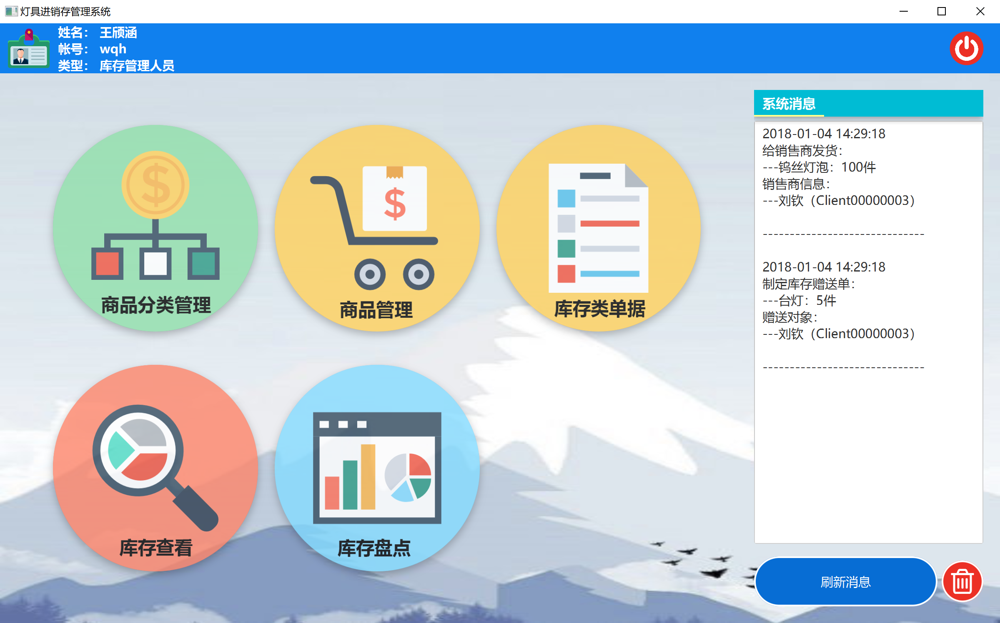

 
 
 

## 2.2 商品分类管理界面
商品分类管理界面会按照树状图显示商品分类以及分类下的商品。点击下方的按钮可以添加、删除、修改商品分类，也可以选中某一个商品分类后添加商品。但是不是叶节点的分类无法删除；包含子分类的分类无法添加商品，反之亦然。商品分类管理界面的样式和一部分提示信息的样式如下图所示。

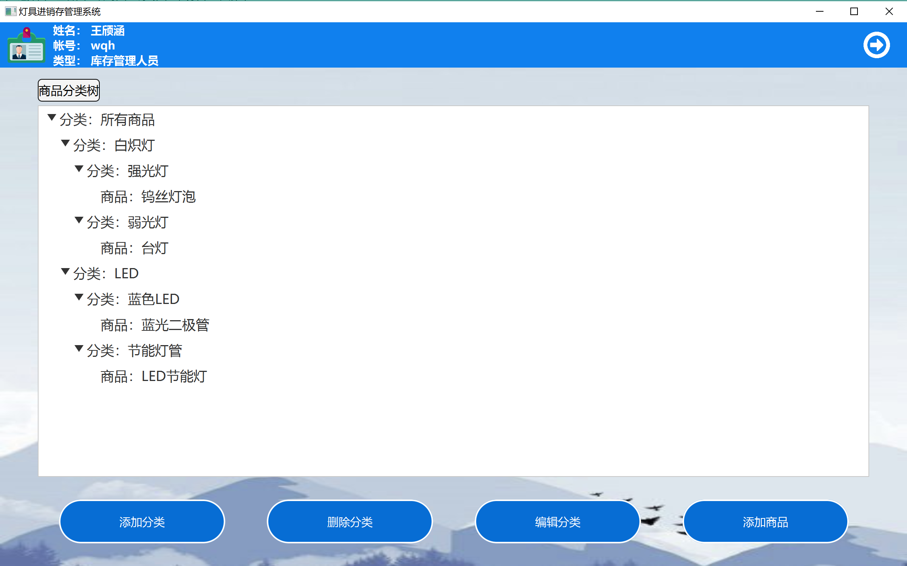

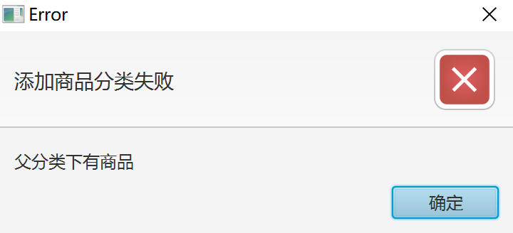

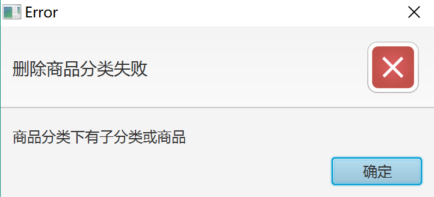

### 2.2.1 商品分类信息界面
在商品分类管理界面内，对商品分类的增删改查会显示商品分类信息界面。对于不同的需求，商品分类信息界面可以用来添加、查看、编辑商品分类。商品分类信息界面的样式如下图所示。

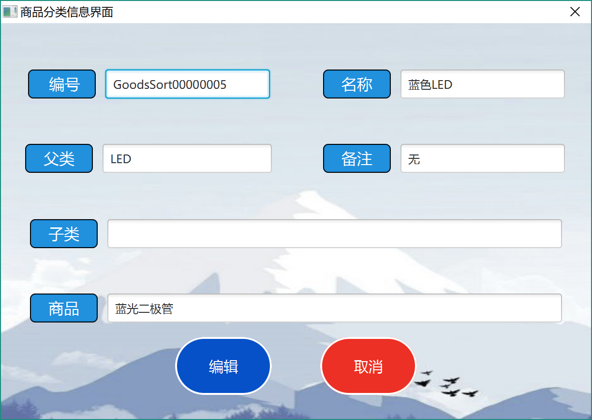

### 2.2.2 商品信息界面
在商品分类管理界面内，点击添加商品会显示商品信息界面。详见2.3.1商品信息界面。

 
 
 

## 2.3 商品管理界面
商品管理界面会显示所有用户的列表，也可以输入商品名或者ID来查找商品。可以选中用户，进行修改、删除、查看的操作。商品管理界面的样式如下图所示。

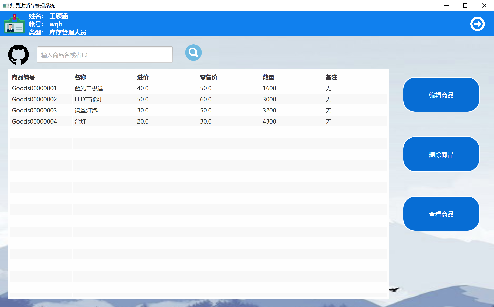

### 2.3.1 商品信息界面
在商品管理界面内，对商品的增删改查会显示商品信息界面。对于不同的需求，商品信息界面可以用来添加、查看、编辑商品。商品信息界面的样式如下图所示。

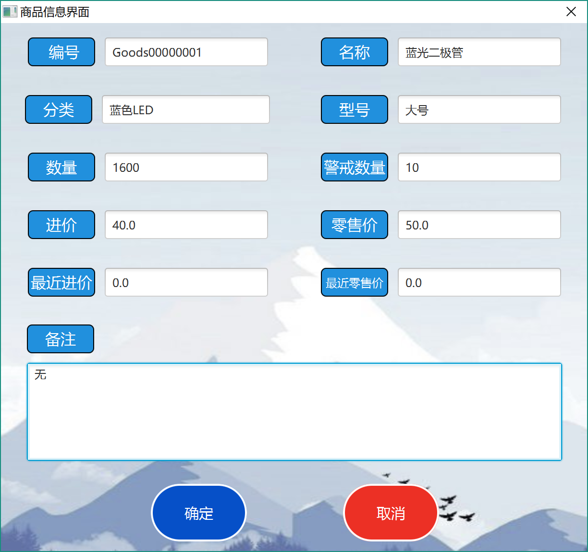

 
 
 

## 2.4 库存类单据界面
库存类单据界面会显示所有待修改的库存类单据（草稿状态和审批不通过状态）。可以制定新的库存溢损单、库存赠送单；也可以选中单据并编辑。库存类单据界面的样式如图所示：

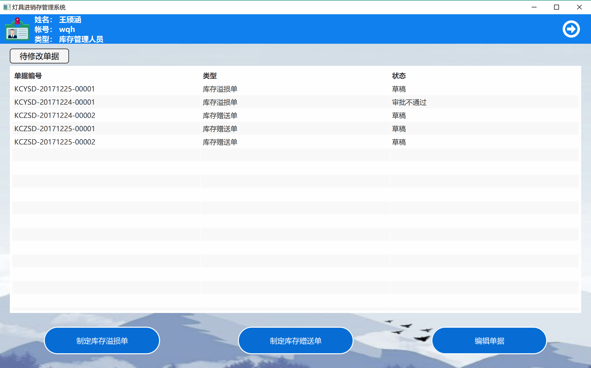

### 2.4.1 库存溢损单界面
在库存类单据界面内，添加库存溢损单或者编辑库存溢损单会显示库存溢损单界面。对于不同的需求，该界面可以用来添加、查看、编辑单据。库存溢损单界面的样式如下图所示。

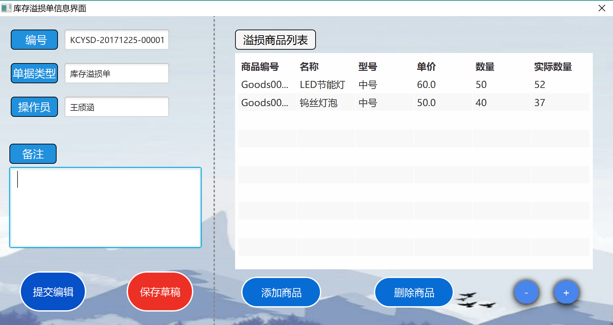

### 2.4.2 库存赠送单界面
在库存类单据界面内，添加库存赠送单或者编辑库存赠送单会显示库存赠送单界面。对于不同的需求，该界面可以用来添加、查看、编辑单据。库存赠送单界面的样式如下图所示。

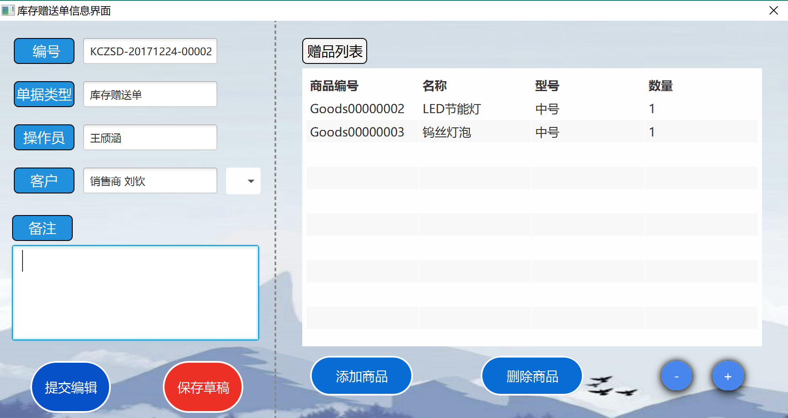

 
 
 

## 2.5 库存查看界面
库存查看界面会根据设定的起始和结束时间搜索数据库，并显示这段时间内的各个商品进货、销售的金额、数量，以及商品的库存数。默认的起始结束时间段是当天，操作员可以自行设定起始结束时间，并进行搜索。库存查看界面的样式如图所示：

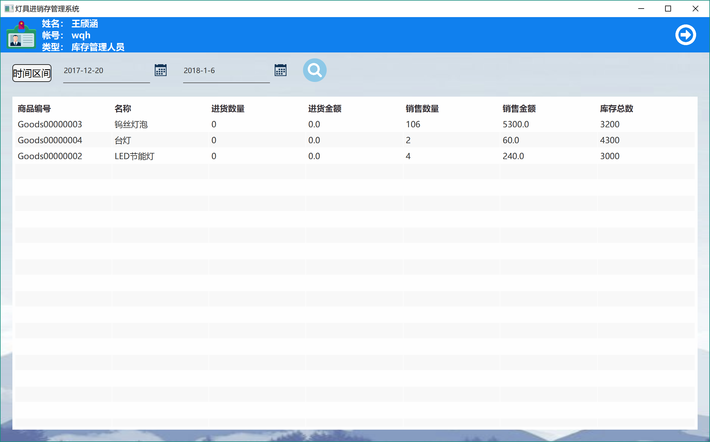

 
 
 

## 2.6 库存盘点界面
库存盘点界面会显示当前各个商品的数量、型号等信息，提供一个库存快照。右上角的绿色按钮是导出Excel的按钮。库存盘点界面的样式如图所示：

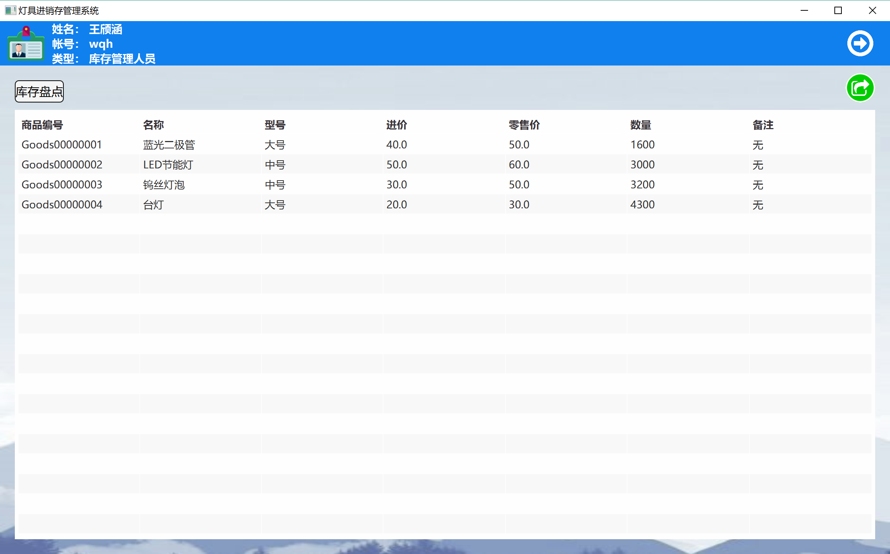

### 2.6.1 导出Excel界面
导出库存快照的Excel时，调用系统提供的文件选择器。其样式如下图所示：

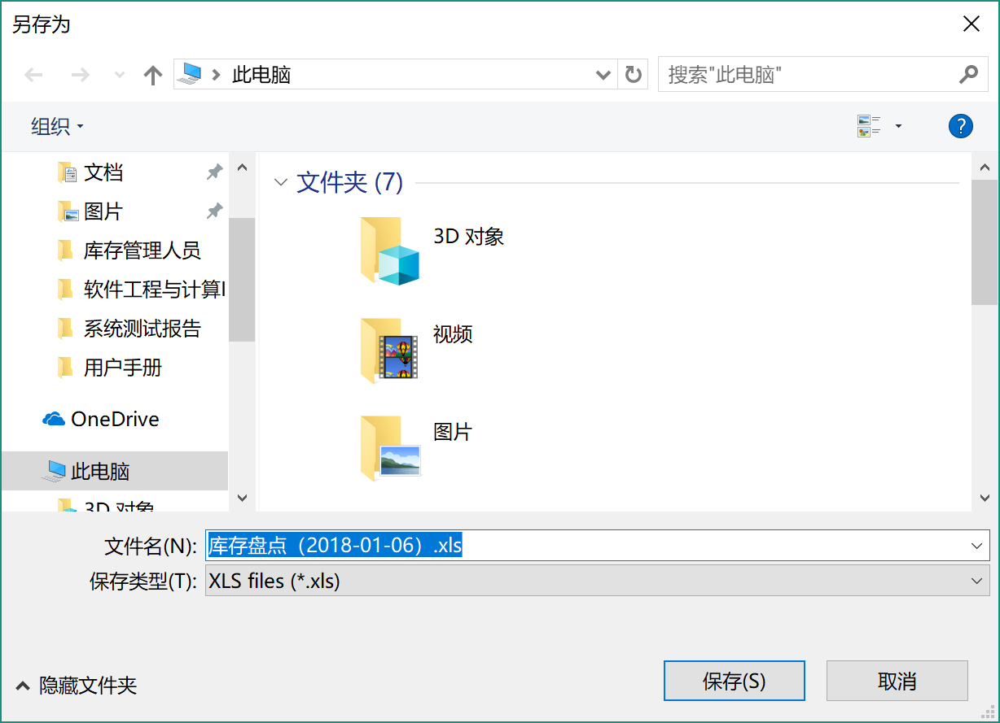

