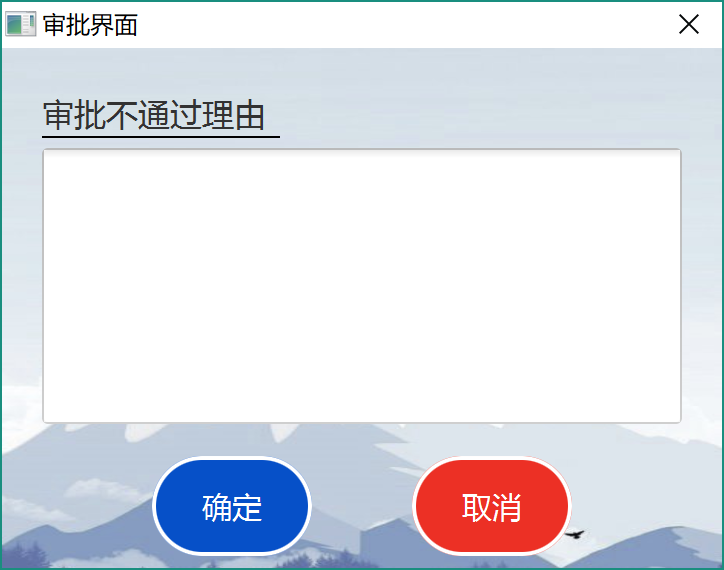

总经理手册—— 灯具进销存管理系统  软工二小组
=========================

 
 
 

# 更新历史
| **修改人员**           | **日期**     | **变更原因** | **版本** |
| ------------------ | ---------- | -------- | ------ |
| 陈骁、陈思彤、 王宁、王颀涵 | 2018-01-06 | 最初版本     | V1.0   |

 
 
***********************************************
 
 

# 变更记录
| **修改人员**           | **日期**     | **变更原因**  | **版本** | **变更内容** |
| ------------------ | ---------- | --------- | ------ | -------- |
| 陈骁、陈思彤、 王宁、王颀涵 | 2018-01-06 | 初始版本      | V1.0   | 无        |

 
 
***********************************************
 
 

# 目录
<!-- TOC -->

- [更新历史](#更新历史)
- [变更记录](#变更记录)
- [目录](#目录)
- [1.登录界面](#1登录界面)
    - [1.1 初始界面](#11-初始界面)
    - [1.2 操作员界面](#12-操作员界面)
- [2.总经理界面](#2总经理界面)
    - [2.1 总经理主界面](#21-总经理主界面)
    - [2.2 审批单据界面](#22-审批单据界面)
        - [2.2.1 审批不通过界面](#221-审批不通过界面)
    - [2.3 促销策略管理界面](#23-促销策略管理界面)
        - [2.3.1 客户促销界面](#231-客户促销界面)
        - [2.3.2 商品促销界面](#232-商品促销界面)
        - [2.3.3 总价促销界面](#233-总价促销界面)
    - [2.4 查看操作日志界面](#24-查看操作日志界面)
    - [2.5 销售明细表界面](#25-销售明细表界面)
    - [2.6 经营历程表界面](#26-经营历程表界面)
    - [2.7 经营情况表界面](#27-经营情况表界面)

<!-- /TOC -->

 
 
***********************************************
 
 

# 1.登录界面
## 1.1 初始界面
初始界面为用户提供登陆服务，可以输入账号和密码进行登陆。初始界面如下图所示：

 
 
 

## 1.2 操作员界面
操作员界面位于各个主要界面的最上方，显示了操作员的基本信息。如果当前处于某个用户的主界面，则右侧显示登出按钮；进入了某个功能模块之后，这个按钮变成返回主界面的按钮。操作员界面的样式如下图所示：

 
 
***********************************************
 
 

# 2.总经理界面
## 2.1 总经理主界面
总经理的主界面包含功能模块区域和系统信息区域。点击某个功能模块可以跳转到相应的界面，系统消息区域显示收到的系统消息，点击红色的“清除”按钮可以清空目前收到的系统消息。总经理主界面的样式如图所示：

 
 
 

## 2.2 审批单据界面
审批单据界面会显示所有待审批的单据，也可以通过单据类型来筛选。可以选中某张单据查看信息。可以选择一张或者多张单据批量审批通过，也可以选中某一张单据，审批不通过并填写理由。审批单据通过或不通过，单据的制定者都会收到系统消息。审批单据界面的样式如下图所示。

### 2.2.1 审批不通过界面
对于某张审批不通过的单据，可以在此界面输入理由，之后单据的制定者会通过系统消息收到理由。审批不通过界面的样式如下图所示。

 
 
 

## 2.3 促销策略管理界面
促销策略管理界面会显示所有促销策略。可以制定新的客户促销、商品促销、总价促销；也可以选中促销策略并编辑或删除，已经开始的促销策略无法编辑或删除。财务类单据界面的样式如图所示：

### 2.3.1 客户促销界面
在客户促销界面内，可以填写促销策略具体的信息。根据不同的需求，此界面可以用于添加、编辑、查看等不同的功能。客户促销界面的样式如下图所示。

### 2.3.2 商品促销界面
在商品促销界面内，可以填写促销策略具体的信息。根据不同的需求，此界面可以用于添加、编辑、查看等不同的功能。商品促销界面的样式如下图所示。

### 2.3.3 总价促销界面
在总价促销界面内，可以填写促销策略具体的信息。根据不同的需求，此界面可以用于添加、编辑、查看等不同的功能。总价促销界面的样式如下图所示。

 
 
 

## 2.4 查看操作日志界面
查看操作日志界面会显示操作日志的列表，也可以输入起始时间和结束时间来查找操作日志。查看操作日志界面的样式如下图所示。

 
 
 

## 2.5 销售明细表界面
销售明细表界面会显示商品的销售情况，默认为所有的销售情况。可以选择时间区间、商品名、客户、业务员来筛选。右上角的绿色按钮是导出按钮。销售明细表界面的样式如下图所示。

 
 
 

## 2.6 经营历程表界面
经营历程表界面会显示所有审批通过的单据情况，默认为所有的单据。可以选择时间区间、单据类型、客户、操作员来筛选。右上角的绿色按钮是导出按钮。总经理可以选中某张财务类单据，进行红冲操作，生成一张数值相反的单据。经营历程表界面的样式如下图所示。

 
 
 

## 2.7 经营情况表界面
经营情况表界面会显示一段时间内的收入和支出明细，默认为当天。可以选择起始和结束时间来筛选。右上角的绿色按钮是导出按钮。经营情况表界面的样式如下图所示。

