财务人员手册—— 灯具进销存管理系统  软工二小组
=========================

 
 
 

# 更新历史
| **修改人员**           | **日期**     | **变更原因** | **版本** |
| ------------------ | ---------- | -------- | ------ |
| 陈骁、陈思彤、 王宁、王颀涵 | 2018-01-06 | 最初版本     | V1.0   |

 
 
***********************************************
 
 

# 变更记录
| **修改人员**           | **日期**     | **变更原因**  | **版本** | **变更内容** |
| ------------------ | ---------- | --------- | ------ | -------- |
| 陈骁、陈思彤、 王宁、王颀涵 | 2018-01-06 | 初始版本      | V1.0   | 无        |

 
 
***********************************************
 
 

# 目录
<!-- TOC -->

- [更新历史](#更新历史)
- [变更记录](#变更记录)
- [目录](#目录)
- [1.登录界面](#1登录界面)
    - [1.1 初始界面](#11-初始界面)
    - [1.2 操作员界面](#12-操作员界面)
- [2.财务人员界面](#2财务人员界面)
    - [2.1 财务人员主界面](#21-财务人员主界面)
    - [2.2 账户管理界面](#22-账户管理界面)
        - [2.2.1 账户信息界面](#221-账户信息界面)
    - [2.3 财务类单据界面](#23-财务类单据界面)
        - [2.3.1 收款单界面](#231-收款单界面)
        - [2.3.2 付款单界面](#232-付款单界面)
        - [2.3.3 现金费用单界面](#233-现金费用单界面)
    - [2.4 查看操作日志界面](#24-查看操作日志界面)
    - [2.5 销售明细表界面](#25-销售明细表界面)
    - [2.6 经营历程表界面](#26-经营历程表界面)
    - [2.7 经营情况表界面](#27-经营情况表界面)
    - [2.8 期初建账界面](#28-期初建账界面)
        - [2.8.1 期初信息界面](#281-期初信息界面)
        - [2.8.2 期初建账失败提示](#282-期初建账失败提示)

<!-- /TOC -->

 
 
***********************************************
 
 

# 1.登录界面
## 1.1 初始界面
初始界面为用户提供登陆服务，可以输入账号和密码进行登陆。初始界面如下图所示：

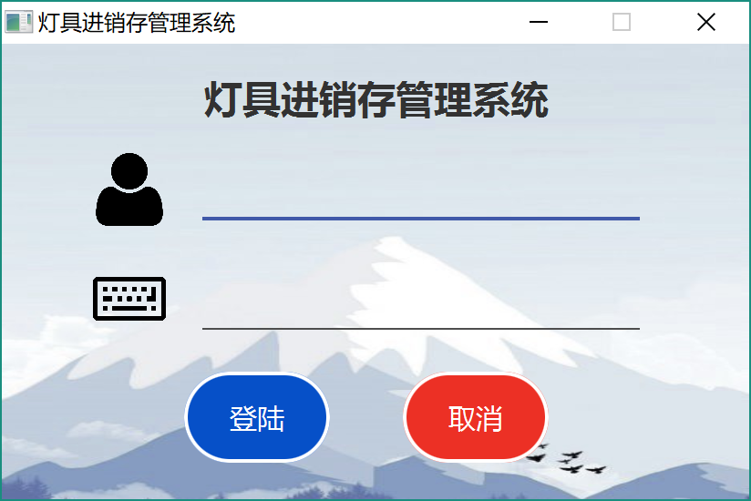

 
 
 

## 1.2 操作员界面
操作员界面位于各个主要界面的最上方，显示了操作员的基本信息。如果当前处于某个用户的主界面，则右侧显示登出按钮；进入了某个功能模块之后，这个按钮变成返回主界面的按钮。操作员界面的样式如下图所示：

 
 
***********************************************
 
 

# 2.财务人员界面
## 2.1 财务人员主界面
财务人员的主界面包含功能模块区域和系统信息区域。点击某个功能模块可以跳转到相应的界面，系统消息区域显示收到的系统消息，点击红色的“清除”按钮可以清空目前收到的系统消息。财务人员主界面的样式如图所示：

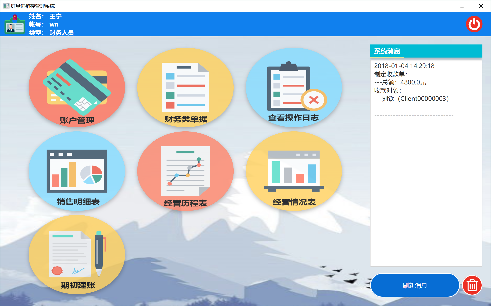

 
 
 

## 2.2 账户管理界面
账户管理界面会显示所有账户的列表，也可以输入账户名或银行卡号来查找账户。可以添加账户，或者可以选中账户，进行修改、删除、查看的操作。账户管理界面的样式如下图所示。

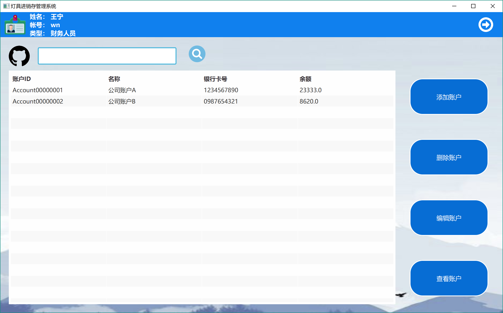

### 2.2.1 账户信息界面
在账户管理界面内，对账户的增删改查会显示账户信息界面。对于不同的需求，账户信息界面可以用来添加、查看、编辑账户。账户信息界面的样式如下图所示。

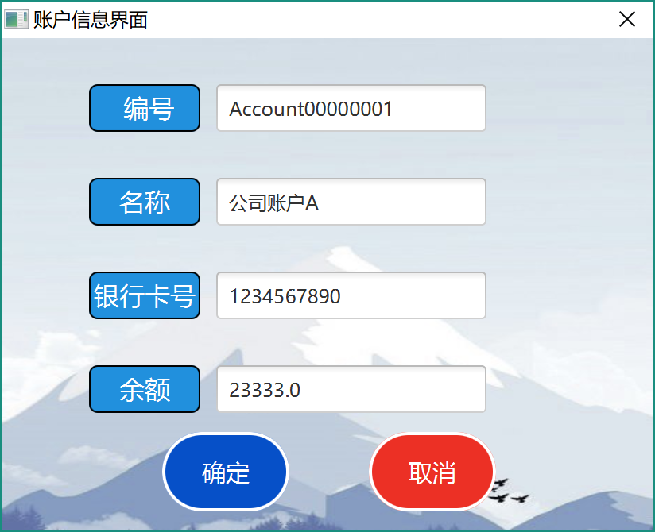

 
 
 

## 2.3 财务类单据界面
财务类单据界面会显示所有待修改的财务类单据（草稿状态和审批不通过状态）。可以制定新的付款单、收款单、现金费用单；也可以选中单据并编辑。财务类单据界面的样式如图所示：

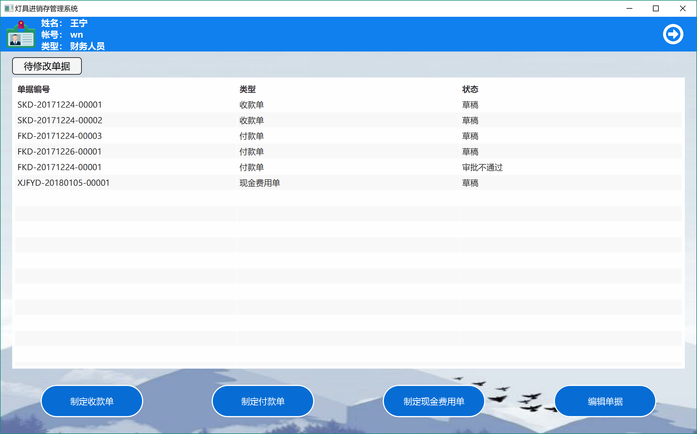

### 2.3.1 收款单界面
在财务类类单据界面内，添加收款单或者编辑收款单会显示收款单界面。对于不同的需求，该界面可以用来添加、查看、编辑单据。收款单界面的样式如下图所示。

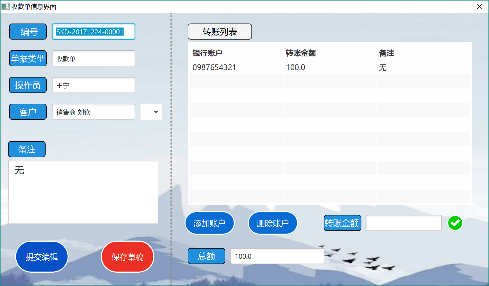

### 2.3.2 付款单界面
在财务类单据界面内，添加付款单或者编辑付款单会显示付款单界面。对于不同的需求，该界面可以用来添加、查看、编辑单据。付款单界面的样式如下图所示。

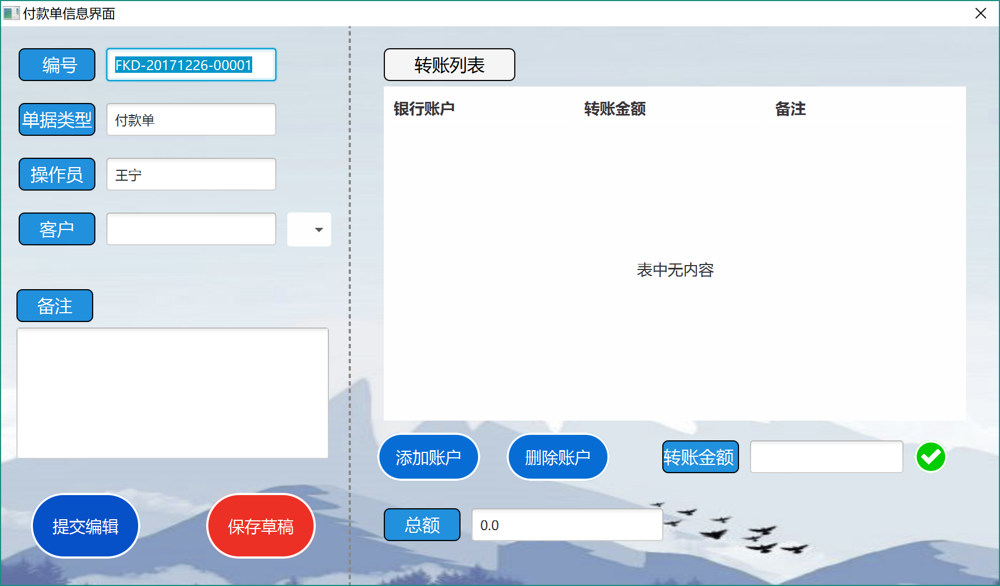

### 2.3.3 现金费用单界面
在财务类单据界面内，添加现金费用单或者编辑现金费用单会显示现金费用单界面。对于不同的需求，该界面可以用来添加、查看、编辑单据。现金费用单界面的样式如下图所示。

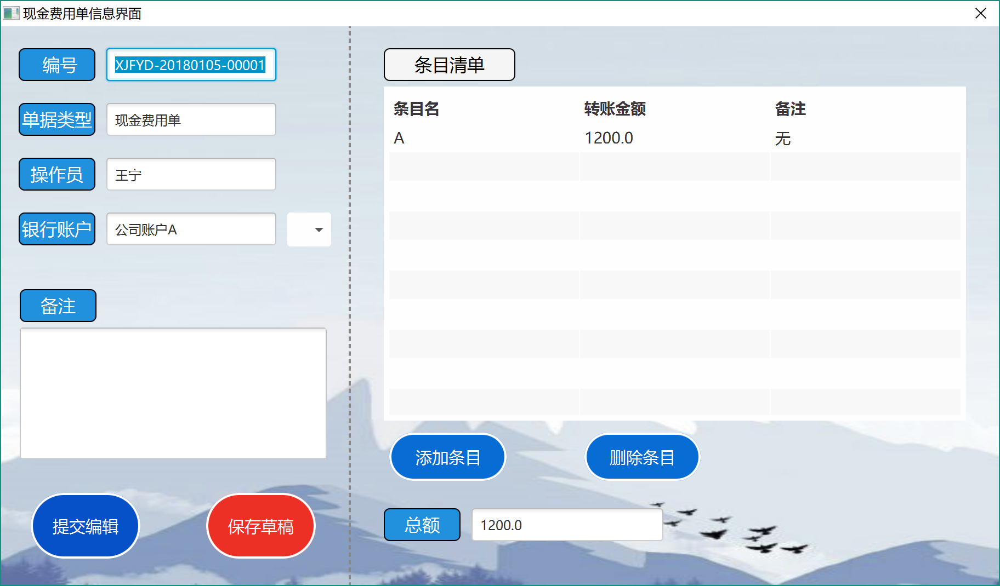

 
 
 

## 2.4 查看操作日志界面
查看操作日志界面会显示操作日志的列表，也可以输入起始时间和结束时间来查找操作日志。查看操作日志界面的样式如下图所示。

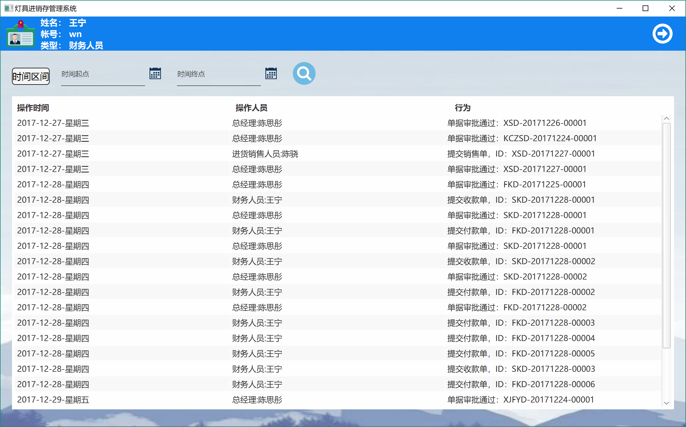

 
 
 

## 2.5 销售明细表界面
销售明细表界面会显示商品的销售情况，默认为所有的销售情况。可以选择时间区间、商品名、客户、业务员来筛选。右上角的绿色按钮是导出按钮。销售明细表界面的样式如下图所示。

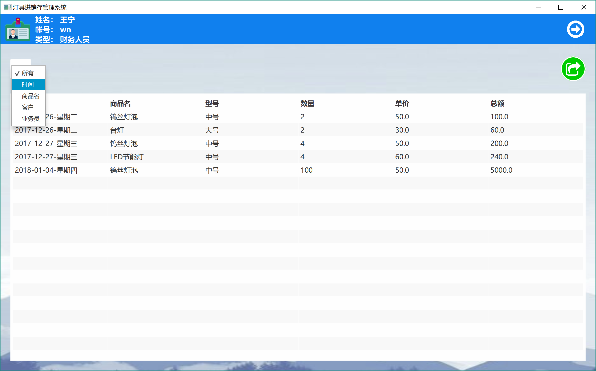

 
 
 

## 2.6 经营历程表界面
经营历程表界面会显示所有审批通过的单据情况，默认为所有的单据。可以选择时间区间、单据类型、客户、操作员来筛选。右上角的绿色按钮是导出按钮。财务人员可以选中某张财务类单据，进行红冲操作，生成一张数值相反的单据。经营历程表界面的样式如下图所示。

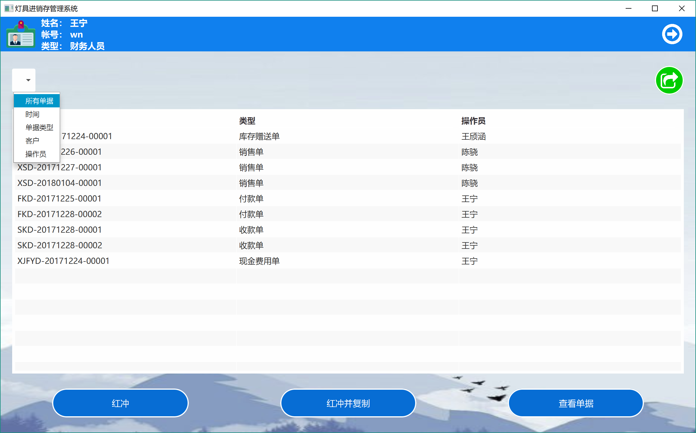

 
 
 

## 2.7 经营情况表界面
经营情况表界面会显示一段时间内的收入和支出明细，默认为当天。可以选择起始和结束时间来筛选。右上角的绿色按钮是导出按钮。经营情况表界面的样式如下图所示。

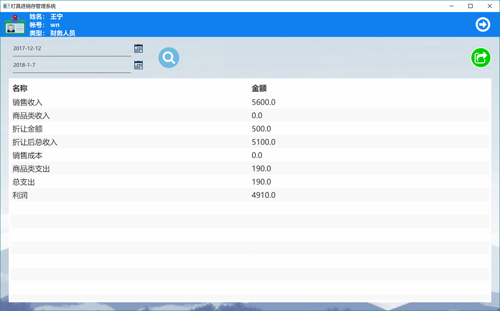

 
 
 

## 2.8 期初建账界面
期初建账界面会显示各个年份的期初信息。可以选择年份来筛选。可以选中某个期初账目，点击查看；也可以进行期初建账操作，但是一年只能进行一次期初建账，之后会提示错误。期初建账界面的样式如下图所示。

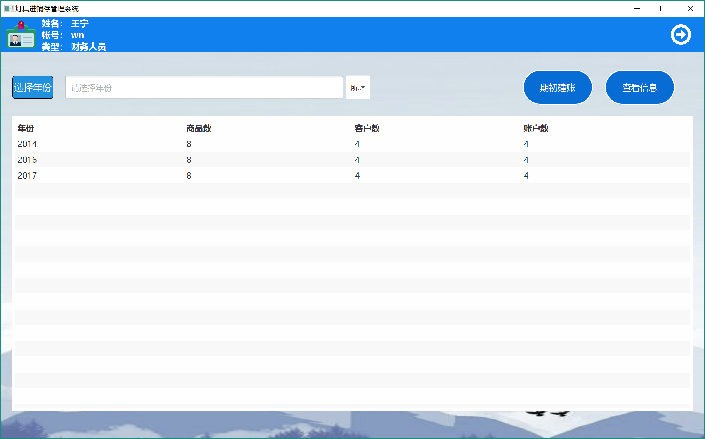

### 2.8.1 期初信息界面
在期初建账界面中，点击“期初建账”，或者选择某个期初账目并点击“查看信息”，会显示期初信息界面，并显示该期初账目的详细信息。期初信息界面可以用来查看和添加期初账目。期初信息界面的样式如下图所示。

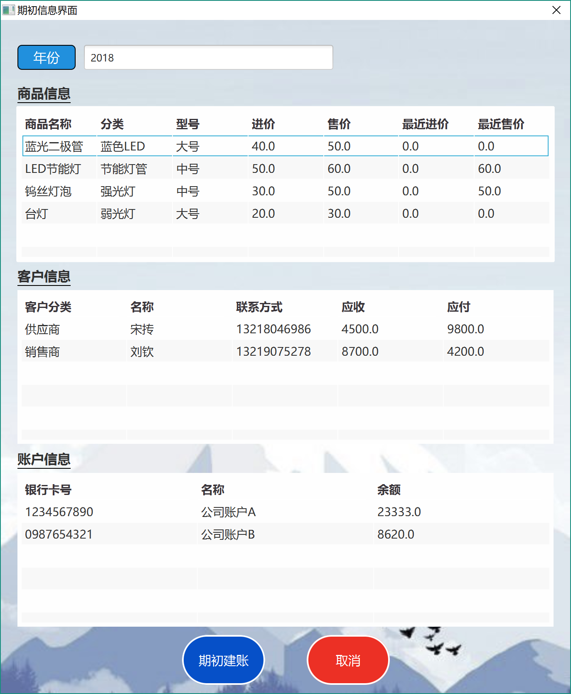

### 2.8.2 期初建账失败提示
在期初建账界面中，点击“期初建账”，若今年已经行期初建账，系统会提示失败。提示界面的样式如下图所示。

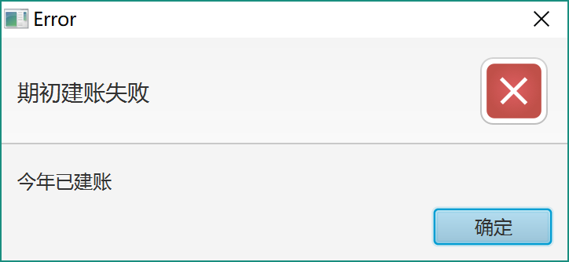

 
 
 

