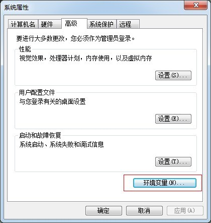

系统管理员手册—— 灯具进销存管理系统  软工二小组
=========================

 
 
 

# 更新历史
| **修改人员**           | **日期**     | **变更原因** | **版本** |
| ------------------ | ---------- | -------- | ------ |
| 陈骁、陈思彤、 王宁、王颀涵 | 2018-01-05 | 最初版本     | V1.0   |
| 陈骁、陈思彤、 王宁、王颀涵 | 2018-01-12 | 提交版本     | V2.0   |

 
 
***********************************************
 
 

# 变更记录
| **修改人员**           | **日期**     | **变更原因** | **版本** | **变更内容** |
| ------------------ | ---------- | -------- | ------ | -------- |
| 陈骁、陈思彤、 王宁、王颀涵 | 2018-01-05 | 初始版本     | V1.0   | 无        |
| 陈骁、陈思彤、 王宁、王颀涵 | 2018-01-12 | 提交版本     | V2.0   | 添加JDK和MySQL的使用教程        |

 
 
***********************************************
 
 

# 目录
<!-- TOC -->

- [更新历史](#更新历史)
- [变更记录](#变更记录)
- [目录](#目录)
- [1 JDK的安装](#1-jdk的安装)
    - [1.1 下载JDK](#11-下载jdk)
    - [1.2 安装JDK](#12-安装jdk)
    - [1.3 设置环境变量](#13-设置环境变量)
- [2.安装MySQL](#2安装mysql)
    - [2.1 安装过程演示](#21-安装过程演示)
    - [2.2 验证安装](#22-验证安装)
    - [2.3 使用数据库](#23-使用数据库)
    - [2.4 补充说明](#24-补充说明)
- [3.登录界面](#3登录界面)
    - [3.1 初始界面](#31-初始界面)
    - [3.2 操作员界面](#32-操作员界面)
- [4.系统管理员界面](#4系统管理员界面)
    - [4.1 系统管理员主界面](#41-系统管理员主界面)
    - [4.2 用户管理界面](#42-用户管理界面)
        - [4.2.1 用户信息界面](#421-用户信息界面)

<!-- /TOC -->

 
 
***********************************************
 
 

# 1 JDK的安装
## 1.1 下载JDK
进入Oracle官网，http://www.oracle.com/technetwork/java/index.html
图中浅绿色圈中的是下载的JDK版本，选择Java SE(标准版)。

点击之后，就会进入这个界面。再点击圈中的部分。

我们选择接受，不然会不允许下载。一般我们用的都是windows系统，其中x86是32位的，x64是64的，根据你自己的系统选择相应的下载并点击，就会建立下载任务。

 
 
 

## 1.2 安装JDK
双击下载后的文件会显示这个界面，点击下一步即可。

这里可以选择安装路径，也可以默认安装。如果更改路径最好不要放在中文或者带空格的目录下，以免将来出现不必要的麻烦。点击下一步就开始安装。

之后会出现如下界面，提示安装JRE，JRE是Java的运行环境，包括了JVM等一些Java的运行环境。但安装的JDK里面已经有了JRE了，这里可以点击“下一步”进行安装，也可以点击“取消”。

安装成功的界面如下所示：

 
 
 

## 1.3 设置环境变量
环境变量一般指在操作系统中用来指定操作系统运行环境的一些参数。如path，当要求系统运行一个程序而没有告诉它程序所在的完整路径时，系统除了在当前目录下面寻找此程序外，还会到path中指定的路径去找。设置过程如下： 

右击我的电脑——>属性——>高级——>环境变量——>在系统变量中找到path.

点击新建——>变量名：JAVA_HOME，变量值：你的java所在路径，比如安装路径：E:\Java\jdk1.7.0_21，这个值只要到这目录即可，不要在后面加\bin等东西。

path——>双击，不要修改内部的值，而是在最前面加这个括号里的东西【%JAVA_HOME%\bin;】，分号不能少，而且必须是英文的分号。

设置环境变量classpath，需要我们自己新建的。class在Java中是一个关键字，表示一个类，classpath是用来指定Java中类或者包所在的路径，这是方便我们的JAVA虚拟机去寻找相应的类文件，JVM会按照classpath环境变量指定的地址依次寻找，已最先找到的为准，所以一般我们将其值设为：【.;%JAVA_HOME%\lib\dt.jar;%JAVA_HOME%\lib\tools.jar】最前面有个点，代表的是当前路径，最后面最好不加分号。

之后全部选择“确定”即可。

 
 
***********************************************
 
 

# 2.安装MySQL
## 2.1 安装过程演示
首先从MySQL官方网站“http://dev.mysql.com/downloads/” 下载MySQL服务器安装软件包，版本教程中下载版本为“mysql-installer-community-5.7.3.0-m13.msi”。双击进入安装，界面显示如下：

选择“接受条款”后按照默认的步骤操作即可。

进入安装前环境验证，如下图。点击excute按钮，会自动下载需要的程序。

所有需要的环境都配置完成后，如下图所示：

点击“next”进入安装，等待下载完成

按照下图所示进行服务器的配置。服务器将影响到MySQL Configuration Wizard（配置向导）对内存、硬盘和过程或使用的决策。

完成后点击next按钮添加用户，请保证存在一个用户，用户名为root，密码为123456，不然server端将无法使用。

最后点击“Next”进入系统服务Myqsl配置、日志配置等。

安装完成的提示界面如下：

 
 
 

## 2.2 验证安装
MySQL安装完成后，点击程序会出现命令行界面，我们验证一下，是否可以正常使用，如下图：

也可以使用工具MySQL WOrkbench，输入密码，登陆，输入命令查询。

 
 
 

## 2.3 使用数据库
以命令行为例，在目标机器的数据库里建立新数据库。这里建立名为erp的数据库，则是在命令行中添加如下命令：mysql> create database erp 
（注意我们要用的数据库名字必须为erp，不然server端无法使用。）

在使用数据库erp的情况下导入名字为数据库文件： 
mysql> source d:/myprogram/database/db.sql; 
（dp.sql是我们编写完成的初始数据库，本文档目录下的tool文件夹里）

导入成功过后erp的内容就是dp.sql所记录的内容了，当这一步完成，软件就可以正常使用了。

 
 
 

## 2.4 补充说明
如果还有关于MySQL不清楚的部分，可以参见官方的中文手册，在本文档目录下的tool文件夹里。

 
 
***********************************************
 
 

# 3.登录界面
## 3.1 初始界面
初始界面为用户提供登陆服务，可以输入账号和密码进行登陆。初始界面如下图所示：

 
 
 

## 3.2 操作员界面
操作员界面位于各个主要界面的最上方，显示了操作员的基本信息。如果当前处于某个用户的主界面，则右侧显示登出按钮；进入了某个功能模块之后，这个按钮变成返回主界面的按钮。操作员界面的样式如下图所示：

 
 
***********************************************
 
 

# 4.系统管理员界面
## 4.1 系统管理员主界面
系统管理员的主界面包含功能模块区域和系统信息区域。点击某个功能模块可以跳转到相应的界面，系统消息区域显示收到的系统消息，点击红色的“清除”按钮可以清空目前收到的系统消息。系统管理员主界面的样式如图所示：

 
 
 

## 4.2 用户管理界面
用户管理界面会显示所有用户的列表，也可以输入用户名或者用户类型来查找用户。点击右侧的按钮可以添加用户；也可以选中用户，进行修改、删除、查看的操作。用户管理界面的样式如下图所示。

### 4.2.1 用户信息界面
在用户管理界面内，对用户的增删改查会显示用户信息界面。对于不同的需求，用户信息界面可以用来添加、查看、编辑用户。其中，对于用户最高权限的设置：只有最高权限的财务人员可以编辑账户，只有最高权限的进货销售人员可以进行5000元的折让（普通为1000元）。用户信息界面的样式如下图所示。

