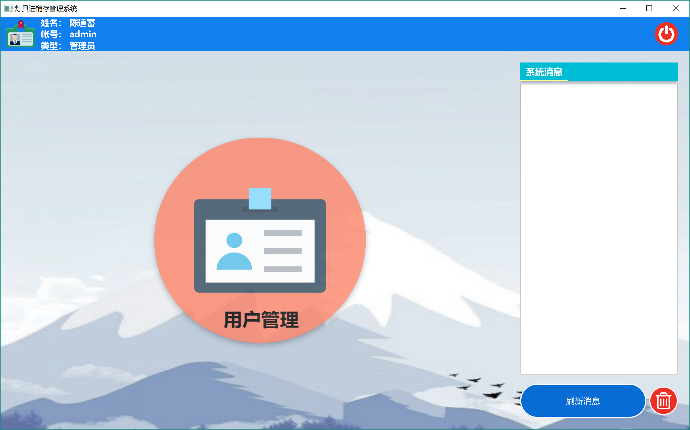
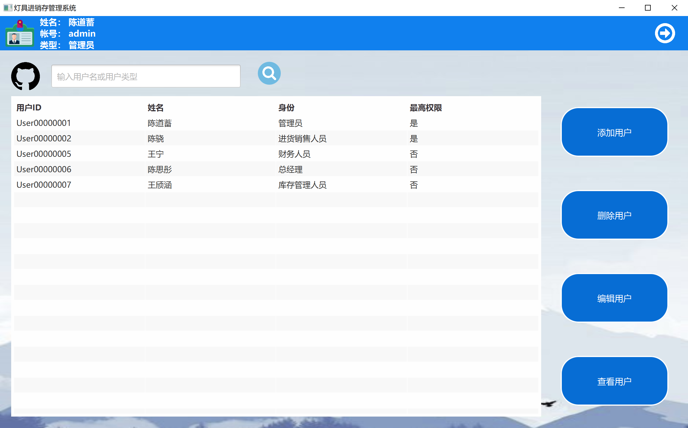
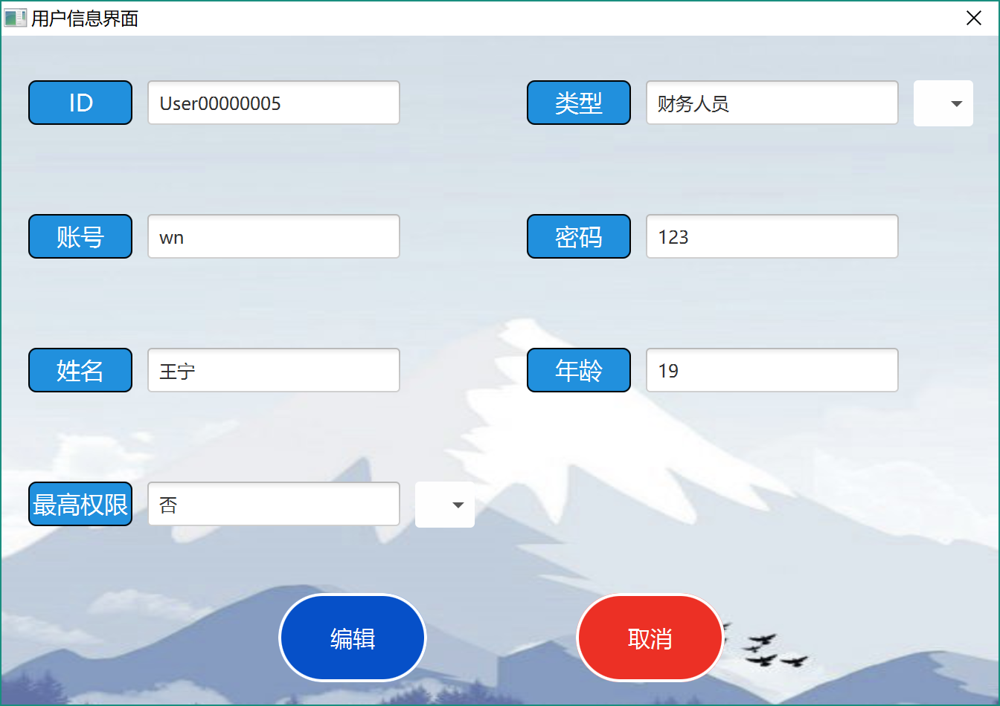

系统管理员手册—— 灯具进销存管理系统  软工二小组
=========================

 
 
 

# 更新历史
| **修改人员**           | **日期**     | **变更原因** | **版本** |
| ------------------ | ---------- | -------- | ------ |
| 陈骁、陈思彤、 王宁、王颀涵 | 2018-01-05 | 最初版本     | V1.0   |

 
 
***********************************************
 
 

# 变更记录
| **修改人员**           | **日期**     | **变更原因** | **版本** | **变更内容** |
| ------------------ | ---------- | -------- | ------ | -------- |
| 陈骁、陈思彤、 王宁、王颀涵 | 2018-01-05 | 初始版本     | V1.0   | 无        |

 
 
***********************************************
 
 

# 目录
<!-- TOC -->

- [更新历史](#更新历史)
- [变更记录](#变更记录)
- [目录](#目录)
- [1.登录界面](#1登录界面)
    - [1.1 初始界面](#11-初始界面)
    - [1.2 操作员界面](#12-操作员界面)
- [2.系统管理员界面](#2系统管理员界面)
    - [2.1 系统管理员主界面](#21-系统管理员主界面)
    - [2.2 用户管理界面](#22-用户管理界面)
        - [2.2.1 用户信息界面](#221-用户信息界面)

<!-- /TOC -->

 
 
***********************************************
 
 

# 1.登录界面
## 1.1 初始界面
初始界面为用户提供登陆服务，可以输入账号和密码进行登陆。初始界面如下图所示：

 
 
 

## 1.2 操作员界面
操作员界面位于各个主要界面的最上方，显示了操作员的基本信息。如果当前处于某个用户的主界面，则右侧显示登出按钮；进入了某个功能模块之后，这个按钮变成返回主界面的按钮。操作员界面的样式如下图所示：

 
 
***********************************************
 
 

# 2.系统管理员界面
## 2.1 系统管理员主界面
系统管理员的主界面包含功能模块区域和系统信息区域。点击某个功能模块可以跳转到相应的界面，系统消息区域显示收到的系统消息，点击红色的“清除”按钮可以清空目前收到的系统消息。系统管理员主界面的样式如图所示：

 
 
 

## 2.2 用户管理界面
用户管理界面会显示所有用户的列表，也可以输入用户名或者用户类型来查找用户。点击右侧的按钮可以添加用户；也可以选中用户，进行修改、删除、查看的操作。用户管理界面的样式如下图所示。

### 2.2.1 用户信息界面
在用户管理界面内，对用户的增删改查会显示用户信息界面。对于不同的需求，用户信息界面可以用来添加、查看、编辑用户。其中，对于用户最高权限的设置：只有最高权限的财务人员可以编辑账户，只有最高权限的进货销售人员可以进行5000元的折让（普通为1000元）。用户信息界面的样式如下图所示。

