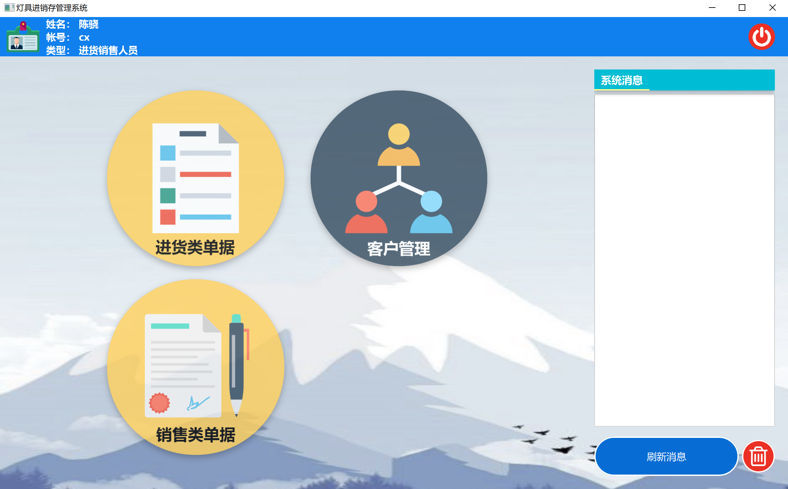
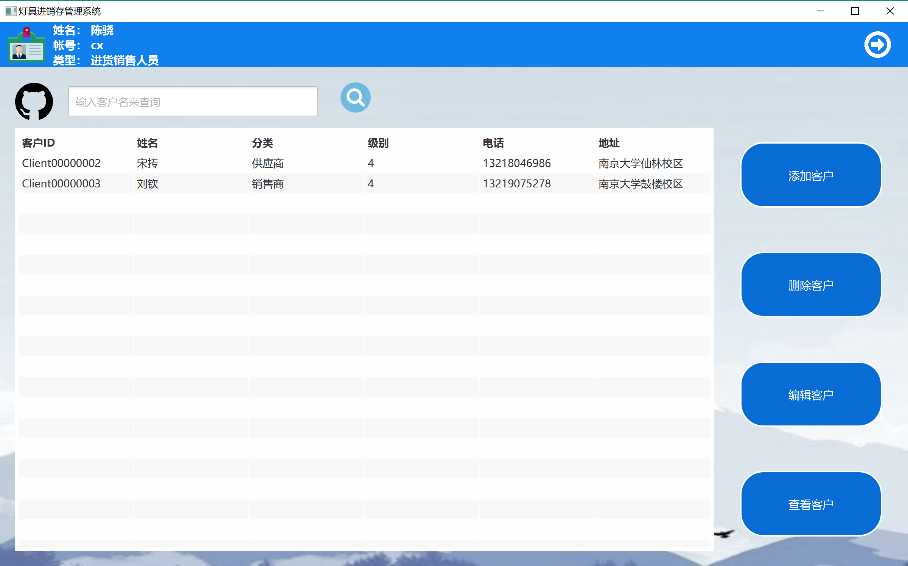
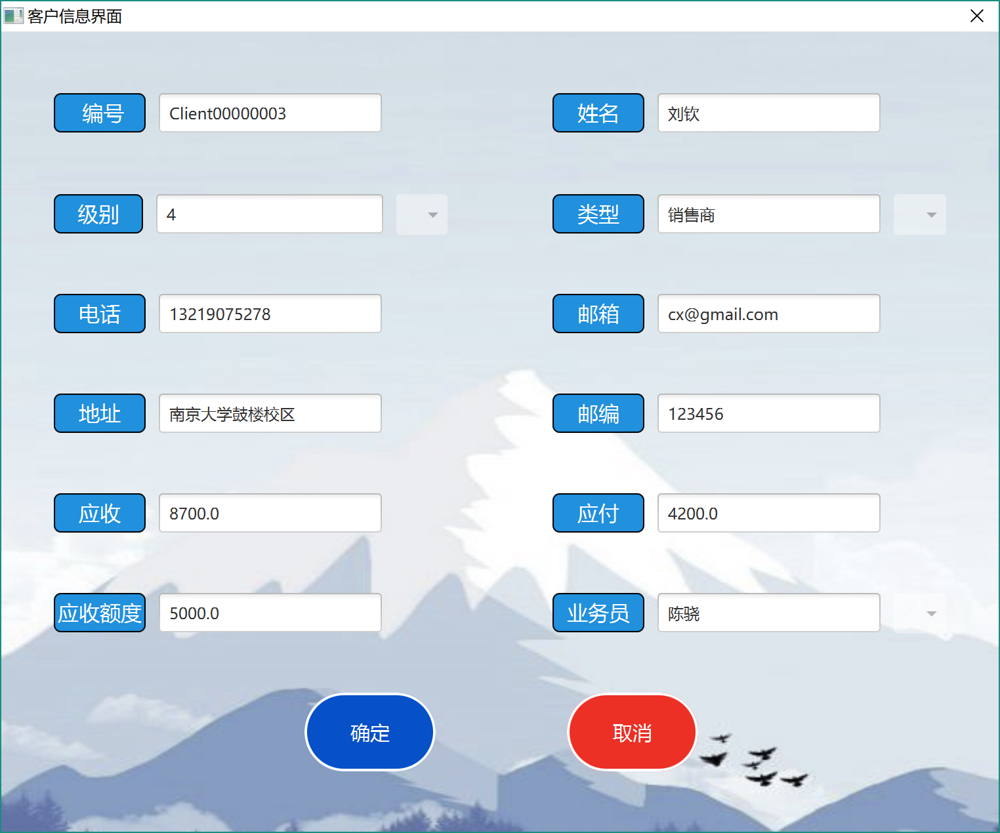
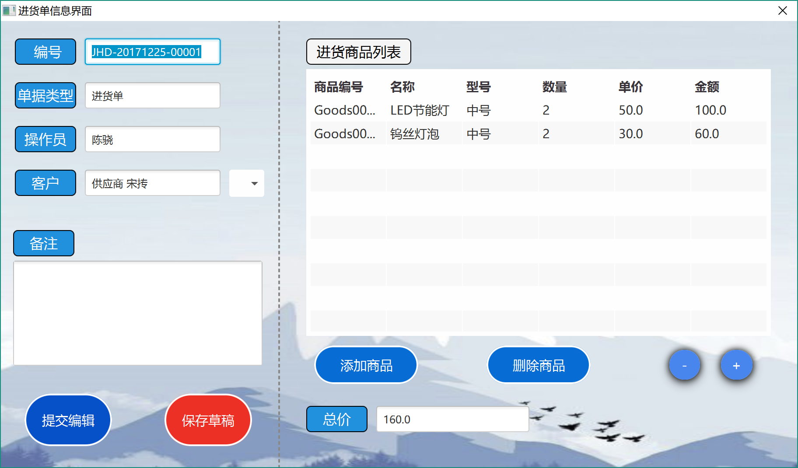
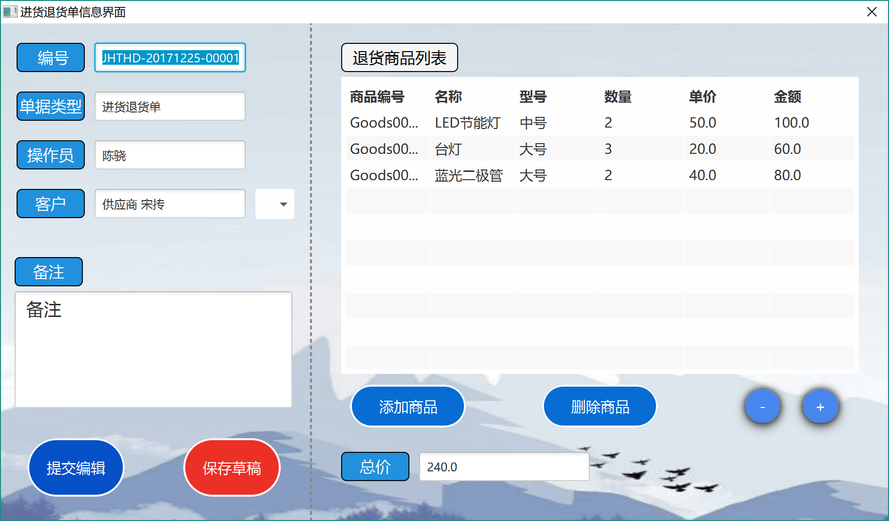
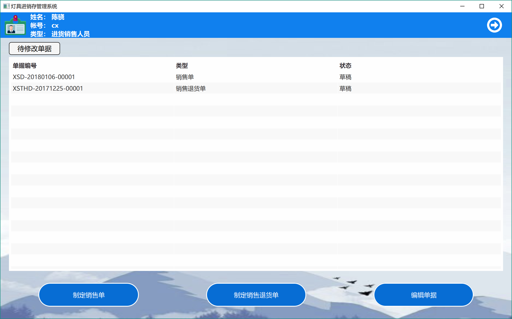
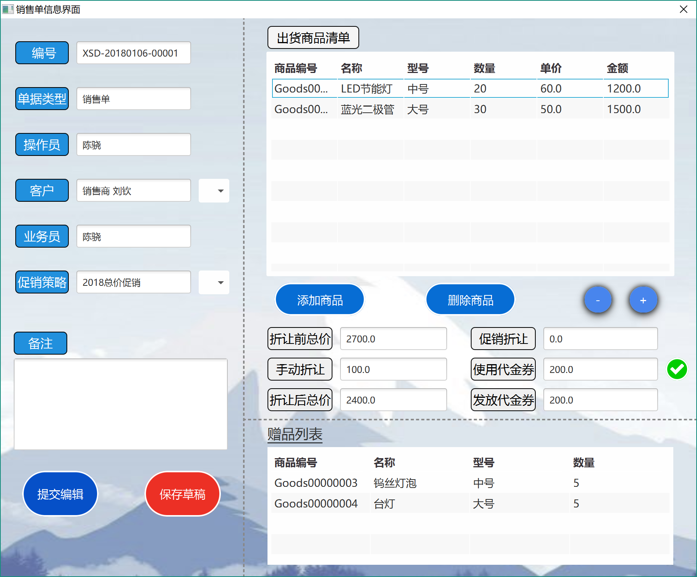
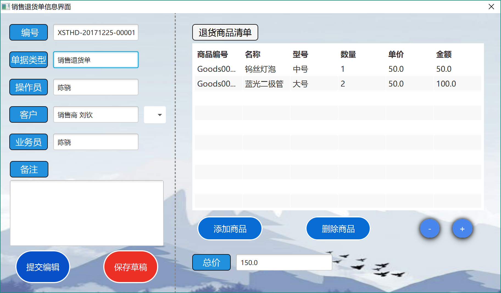

进货销售人员手册—— 灯具进销存管理系统  软工二小组
=========================

 
 
 

# 更新历史
| **修改人员**           | **日期**     | **变更原因** | **版本** |
| ------------------ | ---------- | -------- | ------ |
| 陈骁、陈思彤、 王宁、王颀涵 | 2018-01-06 | 最初版本     | V1.0   |

 
 
***********************************************
 
 

# 变更记录
| **修改人员**           | **日期**     | **变更原因**  | **版本** | **变更内容** |
| ------------------ | ---------- | --------- | ------ | -------- |
| 陈骁、陈思彤、 王宁、王颀涵 | 2018-01-06 | 初始版本      | V1.0   | 无        |

 
 
***********************************************
 
 

# 目录
<!-- TOC -->

- [更新历史](#更新历史)
- [变更记录](#变更记录)
- [目录](#目录)
- [1.登录界面](#1登录界面)
    - [1.1 初始界面](#11-初始界面)
    - [1.2 操作员界面](#12-操作员界面)
- [2.进货销售人员界面](#2进货销售人员界面)
    - [2.1 进货销售人员主界面](#21-进货销售人员主界面)
    - [2.2 客户管理界面](#22-客户管理界面)
        - [2.2.1 客户信息界面](#221-客户信息界面)
    - [2.3 进货类单据界面](#23-进货类单据界面)
        - [2.3.1 进货单界面](#231-进货单界面)
        - [2.3.2 进货退货单界面](#232-进货退货单界面)
    - [2.4 销售类单据界面](#24-销售类单据界面)
        - [2.4.1 销售单界面](#241-销售单界面)
        - [2.4.2 销售退货单界面](#242-销售退货单界面)

<!-- /TOC -->

 
 
***********************************************
 
 

# 1.登录界面
## 1.1 初始界面
初始界面为用户提供登陆服务，可以输入账号和密码进行登陆。初始界面如下图所示：

 
 
 

## 1.2 操作员界面
操作员界面位于各个主要界面的最上方，显示了操作员的基本信息。如果当前处于某个用户的主界面，则右侧显示登出按钮；进入了某个功能模块之后，这个按钮变成返回主界面的按钮。操作员界面的样式如下图所示：

 
 
***********************************************
 
 

# 2.进货销售人员界面
## 2.1 进货销售人员主界面
进货销售人员的主界面包含功能模块区域和系统信息区域。点击某个功能模块可以跳转到相应的界面，系统消息区域显示收到的系统消息，点击红色的“清除”按钮可以清空目前收到的系统消息。进货销售人员主界面的样式如图所示：

 
 
 

## 2.2 客户管理界面
客户管理界面会显示所有用户的列表，也可以输入客户名来查找客户。可以添加客户，或者可以选中客户，进行修改、删除、查看的操作。客户管理界面的样式如下图所示。

### 2.2.1 客户信息界面
在客户管理界面内，对客户的增删改查会显示客户信息界面。对于不同的需求，客户信息界面可以用来添加、查看、编辑客户。客户信息界面的样式如下图所示。

 
 
 

## 2.3 进货类单据界面
进货类单据界面会显示所有待修改的进货类单据（草稿状态和审批不通过状态）。可以制定新的进货单、进货退货单；也可以选中单据并编辑。进货类单据界面的样式如图所示：

### 2.3.1 进货单界面
在进货类单据界面内，添加进货单或者编辑进货单会显示进货单界面。对于不同的需求，该界面可以用来添加、查看、编辑单据。进货单界面的样式如下图所示。

### 2.3.2 进货退货单界面
在进货类单据界面内，添加进货退货单或者编辑进货退货单会显示进货退货单界面。对于不同的需求，该界面可以用来添加、查看、编辑单据。进货退货单界面的样式如下图所示。

 
 
 

## 2.4 销售类单据界面
销售类单据界面会显示所有待修改的销售类单据（草稿状态和审批不通过状态）。可以制定新的销售单、销售退货单；也可以选中单据并编辑。销售类单据界面的样式如图所示：

### 2.4.1 销售单界面
在销售类单据界面内，添加销售单或者编辑销售单会显示销售单界面。对于不同的需求，该界面可以用来添加、查看、编辑单据。销售单界面的样式如下图所示。

### 2.4.2 销售退货单界面
在销售类单据界面内，添加销售退货单或者编辑销售退货单会显示销售退货单界面。对于不同的需求，该界面可以用来添加、查看、编辑单据。销售退货单界面的样式如下图所示。

