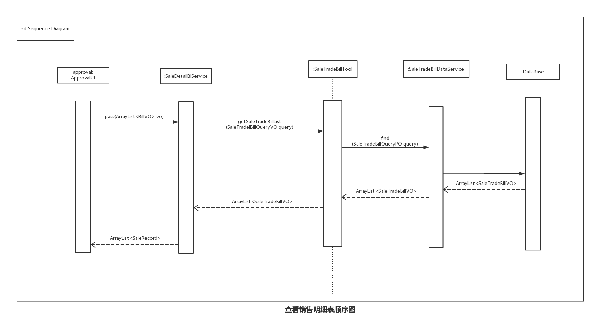

详细设计文档—— 灯具进销存管理系统  软工二小组
=========================

 
 
 

# 更新历史
| **修改人员**           | **日期**     | **变更原因** | **版本** |
| ------------------ | ---------- | -------- | ------ |
| 陈骁、陈思彤、 王宁、王颀涵 | 2017-10-29 | 最初版本     | V1.0   |

 
 
***********************************************
 
 

# 变更记录
| **修改人员**           | **日期**     | **变更原因** | **版本** | **变更内容** |
| ------------------ | ---------- | -------- | ------ | -------- |
| 陈骁、陈思彤、 王宁、王颀涵 | 2017-10-29 | 初始版本     | V1.0   | 无        |

 
 
***********************************************
 
 

<!-- TOC -->

- [更新历史](#更新历史)
- [变更记录](#变更记录)
- [1.引言](#1引言)
    - [1.1 编制目的](#11-编制目的)
- [2.产品概述](#2产品概述)
- [3.体系结构设计概述](#3体系结构设计概述)
- [4.结构视角](#4结构视角)
    - [4.1 业务逻辑层的分解](#41-业务逻辑层的分解)
        - [4.1.1 goodssortbl模块](#411-goodssortbl模块)
            - [(1) 模块概述](#1-模块概述)
            - [(2) 整体结构](#2-整体结构)
            - [(3) 模块内部类的接口规范](#3-模块内部类的接口规范)
                - [GoodsSort的接口规范](#goodssort的接口规范)
                - [GoodsSortInfo的接口规范](#goodssortinfo的接口规范)
                - [GoodsSortOperate的接口规范](#goodssortoperate的接口规范)
                - [GoodsSortTrans的接口规范](#goodssorttrans的接口规范)
            - [(4) 业务逻辑层的动态模型](#4-业务逻辑层的动态模型)
            - [(5) 业务逻辑层的设计原理](#5-业务逻辑层的设计原理)
        - [4.1.2 goodsbl模块](#412-goodsbl模块)
            - [(1) 模块概述](#1-模块概述-1)
            - [(2) 整体结构](#2-整体结构-1)
            - [(3) 模块内部类的接口规范](#3-模块内部类的接口规范-1)
                - [Goods的接口规范](#goods的接口规范)
                - [GoodsInfo的接口规范](#goodsinfo的接口规范)
                - [GoodsOperate的接口规范](#goodsoperate的接口规范)
                - [GoodsTrans的接口规范](#goodstrans的接口规范)
            - [(4) 业务逻辑层的动态模型](#4-业务逻辑层的动态模型-1)
            - [(5) 业务逻辑层的设计原理](#5-业务逻辑层的设计原理-1)
        - [4.1.3 inventorybl模块](#413-inventorybl模块)
            - [(1) 模块概述](#1-模块概述-2)
            - [(2) 整体结构](#2-整体结构-2)
            - [(3) 模块内部类的接口规范](#3-模块内部类的接口规范-2)
                - [InventoryCheck的接口规范](#inventorycheck的接口规范)
                - [InventoryOperate的接口规范](#inventoryoperate的接口规范)
                - [InventoryTrans的接口规范](#inventorytrans的接口规范)
                - [InventoryVerification的接口规范](#inventoryverification的接口规范)
                - [InventoryLossOverBill的接口规范](#inventorylossoverbill的接口规范)
                - [InventoryLossOverBillInfo的接口规范](#inventorylossoverbillinfo的接口规范)
                - [InventoryLossOverBillSortOperate的接口规范](#inventorylossoverbillsortoperate的接口规范)
                - [InventoryLossOverBillTrans的接口规范](#inventorylossoverbilltrans的接口规范)
            - [(4) 业务逻辑层的动态模型](#4-业务逻辑层的动态模型-2)
            - [(5) 业务逻辑层的设计原理](#5-业务逻辑层的设计原理-2)
        - [4.1.4 Clientbl模块](#414-clientbl模块)
            - [(1) 模块概述](#1-模块概述-3)
            - [(2) 整体结构](#2-整体结构-3)
            - [(3) 模块内部类的接口规范](#3-模块内部类的接口规范-3)
                - [Client的接口规范](#client的接口规范)
                - [ClientInfo的接口规范](#clientinfo的接口规范)
                - [ClientOperate的接口规范](#clientoperate的接口规范)
                - [ClientTrans的接口规范](#clienttrans的接口规范)
            - [(4) 业务逻辑层的动态模型](#4-业务逻辑层的动态模型-3)
            - [(5) 业务逻辑层的设计原理](#5-业务逻辑层的设计原理-3)
        - [4.1.5 purchasebl模块](#415-purchasebl模块)
            - [(1) 模块概述](#1-模块概述-4)
            - [(2) 整体结构](#2-整体结构-4)
            - [(3) 模块内部类的接口规范](#3-模块内部类的接口规范-4)
                - [PurchaseTradeBill的接口规范](#purchasetradebill的接口规范)
                - [PurchaseRefundBill的接口规范](#purchaserefundbill的接口规范)
                - [PurchaseInfo的接口规范](#purchaseinfo的接口规范)
                - [PurchaseOperate的接口规范](#purchaseoperate的接口规范)
                - [PurchaseTrans的接口规范](#purchasetrans的接口规范)
            - [(4) 业务逻辑层的动态模型](#4-业务逻辑层的动态模型-4)
            - [(5) 业务逻辑层的设计原理](#5-业务逻辑层的设计原理-4)
        - [4.1.6 salebl模块](#416-salebl模块)
            - [(1) 模块概述](#1-模块概述-5)
            - [(2) 整体结构](#2-整体结构-5)
            - [(3) 模块内部类的接口规范](#3-模块内部类的接口规范-5)
                - [SaleTradeBill的接口规范](#saletradebill的接口规范)
                - [SaleRefundBill的接口规范](#salerefundbill的接口规范)
                - [Salenfo的接口规范](#salenfo的接口规范)
                - [SaleOperate的接口规范](#saleoperate的接口规范)
                - [SaleTrans的接口规范](#saletrans的接口规范)
            - [(4) 业务逻辑层的动态模型](#4-业务逻辑层的动态模型-5)
            - [(5) 业务逻辑层的设计原理](#5-业务逻辑层的设计原理-5)
        - [4.1.7 accountbl模块](#417-accountbl模块)
            - [(1) 模块概述](#1-模块概述-6)
            - [(2) 整体结构](#2-整体结构-6)
            - [(3) 模块内部类的接口规范](#3-模块内部类的接口规范-6)
                - [Account的接口规范](#account的接口规范)
                - [AccountInfo的接口规范](#accountinfo的接口规范)
                - [AccountTrans的接口规范](#accounttrans的接口规范)
            - [(4) 业务逻辑层的动态模型](#4-业务逻辑层的动态模型-6)
            - [(5) 业务逻辑层的设计原理](#5-业务逻辑层的设计原理-6)
        - [4.1.8 financebl模块](#418-financebl模块)
            - [(1) 模块概述](#1-模块概述-7)
            - [(2) 整体结构](#2-整体结构-7)
            - [(3) 模块内部类的接口规范](#3-模块内部类的接口规范-7)
                - [PaymentBill的接口规范](#paymentbill的接口规范)
                - [ReceiptBill的接口规范](#receiptbill的接口规范)
                - [CashBill的接口规范](#cashbill的接口规范)
                - [FinanceInfo的接口规范](#financeinfo的接口规范)
                - [FinanceOperate的接口规范](#financeoperate的接口规范)
                - [FinanceTrans的接口规范](#financetrans的接口规范)
            - [(4) 业务逻辑层的动态模型](#4-业务逻辑层的动态模型-7)
            - [(5) 业务逻辑层的设计原理](#5-业务逻辑层的设计原理-7)
        - [4.1.9 initialbl模块](#419-initialbl模块)
            - [(1) 模块概述](#1-模块概述-8)
            - [(2) 整体结构](#2-整体结构-8)
            - [(3) 模块内部类的接口规范](#3-模块内部类的接口规范-8)
                - [Initial的接口规范](#initial的接口规范)
                - [InitialInfo的接口规范](#initialinfo的接口规范)
                - [InitialTrans的接口规范](#initialtrans的接口规范)
            - [(4) 业务逻辑层的动态模型](#4-业务逻辑层的动态模型-8)
            - [(5) 业务逻辑层的设计原理](#5-业务逻辑层的设计原理-8)
        - [4.1.10 logbl模块](#4110-logbl模块)
            - [(1) 模块概述](#1-模块概述-9)
            - [(2) 整体结构](#2-整体结构-9)
            - [(3) 模块内部类的接口规范](#3-模块内部类的接口规范-9)
                - [Log的接口规范](#log的接口规范)
                - [LogInfo的接口规范](#loginfo的接口规范)
                - [LogOperate的接口规范](#logoperate的接口规范)
                - [LogTrans的接口规范](#logtrans的接口规范)
            - [(4) 业务逻辑层的动态模型](#4-业务逻辑层的动态模型-9)
            - [(5) 业务逻辑层的设计原理](#5-业务逻辑层的设计原理-9)
        - [4.1.11 reportbl模块](#4111-reportbl模块)
            - [(1) 模块描述](#1-模块描述)
            - [(2) 整体结构](#2-整体结构-10)
            - [(3) 模块内部类的接口规范](#3-模块内部类的接口规范-10)
                - [Report的接口规范](#report的接口规范)
            - [(4) 业务逻辑层的动态模型](#4-业务逻辑层的动态模型-10)
        - [4.1.12 approvalbl模块](#4112-approvalbl模块)
            - [(1) 模块描述](#1-模块描述-1)
            - [(2) 整体结构](#2-整体结构-11)
            - [(3) 模块内部类的接口规范](#3-模块内部类的接口规范-11)
            - [(4) 业务逻辑层的动态模型](#4-业务逻辑层的动态模型-11)
        - [4.1.13 promotionbl模块](#4113-promotionbl模块)
            - [(1) 模块描述](#1-模块描述-2)
            - [(2) 整体结构](#2-整体结构-12)
            - [(3) 模块内部类的接口规范](#3-模块内部类的接口规范-12)
                - [Promotion的接口规范](#promotion的接口规范)
                - [PromotionInfo的接口规范](#promotioninfo的接口规范)
                - [PromotionOperate的接口规范](#promotionoperate的接口规范)
                - [PromotionTrans的接口规范](#promotiontrans的接口规范)
            - [(4) 业务逻辑层的动态模型](#4-业务逻辑层的动态模型-12)
        - [4.1.14 userbl模块](#4114-userbl模块)
            - [(1) 模块描述](#1-模块描述-3)
            - [(2) 整体结构](#2-整体结构-13)
            - [(3) 模块内部类的接口规范](#3-模块内部类的接口规范-13)
                - [User的接口规范](#user的接口规范)
                - [UserInfo的接口规范](#userinfo的接口规范)
                - [UserOperate的接口规范](#useroperate的接口规范)
                - [UserTrans的接口规范](#usertrans的接口规范)
            - [(4)业务逻辑的动态模型](#4业务逻辑的动态模型)
        - [4.1.15 editbillbl模块](#4115-editbillbl模块)
            - [(1) 模块概述](#1-模块概述-10)
            - [(2) 整体结构](#2-整体结构-14)
            - [(3) 模块内部类的接口规范](#3-模块内部类的接口规范-14)
                - [EditBill的接口规范](#editbill的接口规范)
            - [(4) 业务逻辑层的动态模型](#4-业务逻辑层的动态模型-13)
            - [(5) 业务逻辑层的设计原理](#5-业务逻辑层的设计原理-10)
        - [4.1.16 messagebl模块](#4116-messagebl模块)
            - [(1) 模块概述](#1-模块概述-11)
            - [(2) 整体结构](#2-整体结构-15)
            - [(3) 模块内部类的接口规范](#3-模块内部类的接口规范-15)
                - [Message的接口规范](#message的接口规范)
                - [MessageOperate的接口规范](#messageoperate的接口规范)
                - [MessageTrans的接口规范](#messagetrans的接口规范)
            - [(4) 业务逻辑层的动态模型](#4-业务逻辑层的动态模型-14)
            - [(5) 业务逻辑层的设计原理](#5-业务逻辑层的设计原理-11)

<!-- /TOC -->

 
 
***********************************************
 
 

# 1.引言
## 1.1 编制目的
本报告详细完成灯具进销存管理系统的详细设计，达到指导后续软件构造的目的，同时实现和测试人员及用户的沟通。 
本报告面向开发人员、测试人员及最终用户而编写，是了解系统的导航。

 
 
***********************************************
 
 

# 2.产品概述
参考灯具进销存管理系统用例文档和灯具进销存管理系统软件规格说明中对产品的概括描述。

 
 
***********************************************
 
 

# 3.体系结构设计概述
参考灯具进销存管理系统体系结构描述文档对体系结构设计的概述

 
 
***********************************************
 
 

# 4.结构视角
## 4.1 业务逻辑层的分解
业务逻辑层的开发包图参见软件体系结构描述文档的图3

### 4.1.1 goodssortbl模块
#### (1) 模块概述
goodssortbl模块负责商品分类的管理，增加商品分类，删除商品分类，修改商品分类，查询商品分类。具体功能需求和非功能需求可参见需求规格说明文档和体系结构设计文档。

#### (2) 整体结构
根据体系结构的设计，我们将系统分为展示层、业务逻辑层、数据层。每一层之间为了增加灵活性，我们会添加接口。比如展示层和业务逻辑层之间，我们添加bussinesslogicservice.GoodsSortBLlervice接口。业务逻辑层和数据层之间添加dataservice. GoodsSortDataService接口。GoodsSortPO是作为商品分类的持久化对象被添加到设计模型中去的。

goodssortbl模块的设计如图

goodssortbl模块各个类的职责如下表所示
| goodssortbl模块的类  | 职责                     |
| ---------------- | ---------------------- |
| GoodsSort        | 负责实现商品分类管理管理界面所需要的服务   |
| GoodsSortOperate | 负责进行其他包的操作造成的商品分类数据的更改 |
| GoodsSortInfo    | 负责为其他包提供商品分类的数据        |
| GoodsSortTrans   | 负责转换商品分类信息的VO和PO       |

#### (3) 模块内部类的接口规范

##### GoodsSort的接口规范
| 提供的服务（供接口）                  |      |                                          |
| --------------------------- | ---- | ---------------------------------------- |
| `GoodsSort.searchGoodsSort` | 语法   | `public ArraytList<GoodsSortVO> searchGoodsSort(String GoodsSortInfo)` |
|                             | 前置条件 | 正在进行商品分类管理                               |
|                             | 后置条件 | 根据输入信息返回相应的商品分类                          |
| `GoodsSort.insertGoodsSort` | 语法   | `public ResultMessage insertGoodsSort(GoodsSortVO goodsSort)` |
|                             | 前置条件 | 正在进行商品分类管理                               |
|                             | 后置条件 | 添加一个商品分类，更新商品分类列表                        |
| `GoodsSort.deleteGoodsSort` | 语法   | `public ResultMessage deleteGoodsSort(String ID)` |
|                             | 前置条件 | 正在进行商品分类管理                               |
|                             | 后置条件 | 删除一个商品分类，更新商品分类列表                        |
| `GoodsSort.updateGoodsSort` | 语法   | `public ResultMessage updateGoodsSort(GoodsSortVO goodsSort)` |
|                             | 前置条件 | 正在进行商品分类管理                               |
|                             | 后置条件 | 编辑一个商品分类，更新商品分类列表                        |
| `GoodsSort.detailGoodsSort` | 语法   | `public ResultMessage detailGoodsSort(String ID)` |
|                             | 前置条件 | 正在进行商品分类管理                               |
|                             | 后置条件 | 返回相应商品分类信息                               |
| `GoodsSort.getID`           | 语法   | `public String getID(String fatherSort)` |
|                             | 前置条件 | 商品分类已添加                                  |
|                             | 后置条件 | 返回新商品分类ID                                |
| `GoodsSort.show`            | 语法   | `public ResultMessage show()`            |
|                             | 前置条件 | 商品分类已选择                                  |
|                             | 后置条件 | 显示商品分类信息                                 |

| 需要的服务（需接口）                               |                 |
| ---------------------------------------- | --------------- |
| 服务名                                      | 服务              |
| `GoodsSortDataService.getList()`         | 取得持久化对象的列表      |
| `GoodsSortDataService.findGoodsSort(String ID)` | 根据ID进行查找单一持久化对象 |
| `GoodsSortDataService.insert(GoodsSortPO po)` | 添加单一持久化对象       |
| `GoodsSortDataService.detele(GoodsSortPO po)` | 删除单一持久化对象       |
| `GoodsSortDataService.update(GoodsSortPO po)` | 修改单一持久化对象       |
| `GoodsSortDataService.detail(GoodsSortPO po)` | 查找单一持久化对象       |

 
 
 

##### GoodsSortInfo的接口规范
| 提供的服务（供接口）                       |      |                                          |
| -------------------------------- | ---- | ---------------------------------------- |
| `GoodsSortInfo.getGoodsSortList` | 语法   | `public ArraytList<GoodsSortVO> getGoodsSortList()` |
|                                  | 前置条件 | 其他包需要取得商品分类信息                            |
|                                  | 后置条件 | 根据输入信息返回相应的商品分类                          |

| 需要的服务（需接口）                       |            |
| -------------------------------- | ---------- |
| 服务名                              | 服务         |
| `GoodsSortDataService.getList()` | 取得持久化对象的列表 |

 
 
 

##### GoodsSortOperate的接口规范
| 提供的服务（供接口）                         |      |                                          |
| ---------------------------------- | ---- | ---------------------------------------- |
| `GoodsSortOperate.updateGoodsSort` | 语法   | `public  updateGoodsSort(GoodsSortVO newGoodsSort)` |
|                                    | 前置条件 | 其他包需要编辑商品分类信息                            |
|                                    | 后置条件 | 更新商品分类信息                                 |

| 需要的服务（需接口）                               |           |
| ---------------------------------------- | --------- |
| 服务名                                      | 服务        |
| `GoodsSortDataService.update(GoodsSortPO po)` | 更改单一化持久对象 |

 
 
 

##### GoodsSortTrans的接口规范
| 提供的服务（供接口）                      |      |                                          |
| ------------------------------- | ---- | ---------------------------------------- |
| `GoodsSortTrans.getGoodsSortPO` | 语法   | `public GoodsSortPO getGoodsSortPO(GoodsSortVO goodsSort)` |
|                                 | 前置条件 | 无                                        |
|                                 | 后置条件 | 根据输入的vo生成相应的po                           |
| `GoodsSortTrans.getGoodsSortVO` | 语法   | `public GoodsSortVO getGoodsSortVO(GoodsSortPO goodsSort)` |
|                                 | 前置条件 | 无                                        |
|                                 | 后置条件 | 根据输入的po生成相应的vo                           |

 
 
 

#### (4) 业务逻辑层的动态模型
如图表明了进销存管理系统中，当库存管理人员想要添加一个商品分类的时候，商品分类管理业务逻辑处理的相关对象之间的协作。

如图表明了进销存管理系统中，当库存管理人员想要删除一个商品分类的时候，商品分类管理业务逻辑处理的相关对象之间的协作。

如图所示的状态图描述了GoodsSort对象的生存期间的状态序列、引起转移的事件，以及因状态转移而伴随的动作。

#### (5) 业务逻辑层的设计原理
利用委托式控制风格，每个界面需要访问的业务逻辑由各自的控制器委托给不同的领域对象。

 
 
***********************************************
 
 

### 4.1.2 goodsbl模块
#### (1) 模块概述
goodsbl模块负责商品的管理，增加商品，删除商品，修改商品，查询商品。具体功能需求和非功能需求可参见需求规格说明文档和体系结构设计文档。

#### (2) 整体结构
根据体系结构的设计，我们将系统分为展示层、业务逻辑层、数据层。每一层之间为了增加灵活性，我们会添加接口。比如展示层和业务逻辑层之间，我们添加bussinesslogicservice.GoodsBLlervice接口。业务逻辑层和数据层之间添加dataservice. GoodsDataService接口。GoodsPO是作为商品分类的持久化对象被添加到设计模型中去的。

goodsbl模块的设计如图

goodsbl模块各个类的职责如下表所示
| goodsbl模块的类  | 职责                   |
| ------------ | -------------------- |
| Goods        | 负责实现商品管理管理界面所需要的服务   |
| GoodsOperate | 负责进行其他包的操作造成的商品数据的更改 |
| GoodsInfo    | 负责为其他包提供商品的数据        |
| GoodsTrans   | 负责转换商品信息的VO和PO       |

#### (3) 模块内部类的接口规范

##### Goods的接口规范
| 提供的服务（供接口）          |      |                                          |
| ------------------- | ---- | ---------------------------------------- |
| `Goods.searchGoods` | 语法   | `public ArraytList<GoodsVO> searchGoods(String GoodsInfo)` |
|                     | 前置条件 | 正在进行商品管理                                 |
|                     | 后置条件 | 根据输入信息返回相应的商品                            |
| `Goods.insertGoods` | 语法   | `public ResultMessage insertGoods(GoodsVO goods)` |
|                     | 前置条件 | 正在进行商品管理                                 |
|                     | 后置条件 | 添加一个商品，更新商品列表                            |
| `Goods.deleteGoods` | 语法   | `public ResultMessage deleteGoods(String ID)` |
|                     | 前置条件 | 正在进行商品管理                                 |
|                     | 后置条件 | 删除一个商品，更新商品列表                            |
| `Goods.updateGoods` | 语法   | `public ResultMessage updateGoods(GoodsVO goods)` |
|                     | 前置条件 | 正在进行商品管理                                 |
|                     | 后置条件 | 编辑一个商品，更新商品列表                            |
| `Goods.detailGoods` | 语法   | `public ResultMessage detailGoods(String ID)` |
|                     | 前置条件 | 正在进行商品管理                                 |
|                     | 后置条件 | 返回相应商品信息                                 |
| `Goods.getID`       | 语法   | `public String getID()`                  |
|                     | 前置条件 | 商品已添加                                    |
|                     | 后置条件 | 返回新商品ID                                  |
| `Goods.setAlarmNum` | 语法   | `public ResultMessage setAlarmNum(String ID,int num)` |
|                     | 前置条件 | 正在进行设置商品报警数量                             |
|                     | 后置条件 | 添加商品报警数量，更新商品列表                          |
| `Goods.show`        | 语法   | `public ResultMessage show()`            |
|                     | 前置条件 | 商品已选择                                    |
|                     | 后置条件 | 显示商品信息                                   |

| 需要的服务（需接口）                              |                 |
| --------------------------------------- | --------------- |
| 服务名                                     | 服务              |
| `GoodsDataService.getList()`            | 取得持久化对象的列表      |
| `GoodsDataService.findGoods(String ID)` | 根据ID进行查找单一持久化对象 |
| `GoodsDataService.insert(GoodsPO po)`   | 添加单一持久化对象       |
| `GoodsDataService.detele(GoodsPO po)`   | 删除单一持久化对象       |
| `GoodsDataService.update(GoodsPO po)`   | 修改单一持久化对象       |
| `GoodsDataService.detail(GoodsPO po)`   | 查找单一持久化对象       |

 
 
 

##### GoodsInfo的接口规范
| 提供的服务（供接口）               |      |                                          |
| ------------------------ | ---- | ---------------------------------------- |
| `GoodsInfo.getGoodsList` | 语法   | `public ArraytList<GoodsVO> getGoodsList()` |
|                          | 前置条件 | 其他包需要取得商品信息                              |
|                          | 后置条件 | 根据输入信息返回相应的商品                            |

| 需要的服务（需接口）                   |            |
| ---------------------------- | ---------- |
| 服务名                          | 服务         |
| `GoodsDataService.getList()` | 取得持久化对象的列表 |

 
 
 

##### GoodsOperate的接口规范
| 提供的服务（供接口）                 |      |                                         |
| -------------------------- | ---- | --------------------------------------- |
| `GoodsOperate.updateGoods` | 语法   | `public  updateGoods(GoodsVO newGoods)` |
|                            | 前置条件 | 其他包需要编辑商品信息                             |
|                            | 后置条件 | 更新商品分类                                  |

| 需要的服务（需接口）                            |           |
| ------------------------------------- | --------- |
| 服务名                                   | 服务        |
| `GoodsDataService.update(GoodsPO po)` | 更改单一化持久对象 |

 
 
 

##### GoodsTrans的接口规范
| 提供的服务（供接口）              |      |                                          |
| ----------------------- | ---- | ---------------------------------------- |
| `GoodsTrans.getGoodsPO` | 语法   | `public GoodsPO getGoodsPO(GoodsVO goods)` |
|                         | 前置条件 | 无                                        |
|                         | 后置条件 | 根据输入的vo生成相应的po                           |
| `GoodsTrans.getGoodsVO` | 语法   | `public GoodsVO getGoodsVO(GoodsPO goods)` |
|                         | 前置条件 | 无                                        |
|                         | 后置条件 | 根据输入的po生成相应的vo                           |

 
 
 

#### (4) 业务逻辑层的动态模型
如图表明了进销存管理系统中，当库存管理人员想要添加一个商品的时候，商品管理业务逻辑处理的相关对象之间的协作。

如图表明了进销存管理系统中，当库存管理人员想要删除一个商品的时候，商品管理业务逻辑处理的相关对象之间的协作。

如图所示的状态图描述了Goods对象的生存期间的状态序列、引起转移的事件，以及因状态转移而伴随的动作。

#### (5) 业务逻辑层的设计原理
利用委托式控制风格，每个界面需要访问的业务逻辑由各自的控制器委托给不同的领域对象。

 
 
***********************************************
 
 

### 4.1.3 inventorybl模块
#### (1) 模块概述
inventorybl模块负责库存的管理，库存查看，库存盘点，建立库存溢损单。具体功能需求和非功能需求可参见需求规格说明文档和体系结构设计文档。

#### (2) 整体结构
根据体系结构的设计，我们将系统分为展示层、业务逻辑层、数据层。每一层之间为了增加灵活性，我们会添加接口。比如展示层和业务逻辑层之间，我们添加bussinesslogicservice.InventoryCheckBLlervice接口，bussinesslogicservice.InventoryVerificationBLlervice接口，bussinesslogicservice.InventoryLossOverBillBLlervice接口。业务逻辑层和数据层之间添加dataservice.InventoryCheckDatalervice接口，dataservice.InventoryVerificationDatalervice接口，dataservice.InventoryLossOverBillDatalervice接口。InventoryPO，InventoryLossOverBillPO是作为库存的持久化对象被添加到设计模型中去的。

inventorybl模块的设计如图

inventorybl模块各个类的职责如下表所示
| inventorybl模块的类              | 职责                   |
| ---------------------------- | -------------------- |
| InventoryCheck               | 负责实现库存查看界面所需要的服务     |
| InventoryOperate             | 负责进行其他包的操作造成的库存数据的更改 |
| InventoryTrans               | 负责转换库存信息的VO和PO       |
| InventoryVerification        | 负责实现库存盘点界面所需要的服务     |
| InventoryLossOverBill        | 负责实现建立库存溢损单界面所需要的服务  |
| InventoryLossOverBillOperate | 负责进行其他包的操作造成的单据数据的更改 |
| InventoryLossOverBillInfo    | 负责为其他包提供单据的数据        |
| InventoryLossOverBillTrans   | 负责转换单据信息的VO和PO       |

#### (3) 模块内部类的接口规范

##### InventoryCheck的接口规范
| 提供的服务（供接口）            |      |                                          |
| --------------------- | ---- | ---------------------------------------- |
| `InventoryCheck.view` | 语法   | `public ResultMessage view(String beginDate,String endDate)` |
|                       | 前置条件 | 正在进行库存查看，日期输入正确                          |
|                       | 后置条件 | 返回对应的在此时间段内的出/入库数量/金额，销售/进货数量/金额，以及库存合计  |

| 需要的服务（需接口）                               |                    |
| ---------------------------------------- | ------------------ |
| 服务名                                      | 服务                 |
| `InventoryCheckDataService.getList()`    | 取得持久化对象的列表         |
| `InventoryCheckDataService.findView(String beginDate,String endDate)` | 根据时间区间查找匹配的单一持久化对象 |

 
 
 

##### InventoryOperate的接口规范
| 提供的服务（供接口）                |      |                                          |
| ------------------------- | ---- | ---------------------------------------- |
| `InventoryOperate.update` | 语法   | `public  update(RepositoryVO repository)` |
|                           | 前置条件 | 其他包需要编辑库存查看信息                            |
|                           | 后置条件 | 更新商库存信息                                  |

| 需要的服务（需接口）                               |           |
| ---------------------------------------- | --------- |
| 服务名                                      | 服务        |
| `InventoryService.update(RepositoryPO po)` | 更改单一化持久对象 |

 
 
 

##### InventoryTrans的接口规范
| 提供的服务（供接口）                       |      |                                          |
| -------------------------------- | ---- | ---------------------------------------- |
| `InventoryTrans.getRepositoryPO` | 语法   | `public RepositoryPO getRepositoryPO(RepositoryVO repository)` |
|                                  | 前置条件 | 无                                        |
|                                  | 后置条件 | 根据输入的vo生成相应的po                           |
| `InventoryTrans.getRepositoryVO` | 语法   | `public RepositoryVO getRepositoryVO(RepositoryPO repository)` |
|                                  | 前置条件 | 无                                        |
|                                  | 后置条件 | 根据输入的po生成相应的vo                           |

 
 
 

##### InventoryVerification的接口规范
| 提供的服务（供接口）                     |      |                                          |
| ------------------------------ | ---- | ---------------------------------------- |
| `InventoryVerification.record` | 语法   | `public ResultMessage record(String date)` |
|                                | 前置条件 | 得到库存数据                                   |
|                                | 后置条件 | 显示库存快照                                   |

| 需要的服务（需接口）                               |                  |
| ---------------------------------------- | ---------------- |
| 服务名                                      | 服务               |
| `InventoryVerificationDataService.getList()` | 取得持久化对象的列表       |
| `InventoryVerificationDataService.findView(String date)` | 根据时间查找匹配的单一持久化对象 |

 
 
 

##### InventoryLossOverBill的接口规范
| 提供的服务（供接口）                            |      |                                          |
| ------------------------------------- | ---- | ---------------------------------------- |
| `InventoryLossOverBill.getGoodsList`  | 语法   | `public ResultMessage getGoodsList()`    |
|                                       | 前置条件 | 得到库存单据数据                                 |
|                                       | 后置条件 | 返回对应商品列表                                 |
| `InventoryLossOverBill.getLossOverID` | 语法   | `public String getLossOverID()`          |
|                                       | 前置条件 | 得到库存单据数据                                 |
|                                       | 后置条件 | 返回对应单据的ID                                |
| `InventoryLossOverBill.getOperator`   | 语法   | `public String getOperator()`            |
|                                       | 前置条件 | 得到库存单据数据                                 |
|                                       | 后置条件 | 返回对应单据的操作员                               |
| `InventoryLossOverBill.setActualNum`  | 语法   | `public ResultMessage setActualNum(int actualNum)` |
|                                       | 前置条件 | 商品数量正确，                                  |
|                                       | 后置条件 | 填入商品实际数量                                 |

| 需要的服务（需接口）                               |                     |
| ---------------------------------------- | ------------------- |
| 服务名                                      | 服务                  |
| `InventoryLossOverBillDataService.getList()` | 取得持久化对象的列表          |
| `InventoryLossOverBillDataService.findGoods(String ID，String name)` | 根据ID与名称查找匹配的单一持久化对象 |
| `InventoryLossOverBillDataService.insert(RepositoryPO po)` | 添加单据                |
| `InventoryLossOverBillDataService.getState(String ID)` | 返回单据的状态             |
| `InventoryLossOverBillDataService.update(RepositoryPO po)` | 修改单据                |

 
 
 

##### InventoryLossOverBillInfo的接口规范
| 提供的服务（供接口）                               |      |                                          |
| ---------------------------------------- | ---- | ---------------------------------------- |
| `InventoryLossOverBillInfo.getInventoryLossOverBillList` | 语法   | `public ArraytList<InventoryLossOverBillVO> getInventoryLossOverBillList()` |
|                                          | 前置条件 | 其他包需要取得单据信息                              |
|                                          | 后置条件 | 根据输入信息返回相应的单据                            |

| 需要的服务（需接口）                               |            |
| ---------------------------------------- | ---------- |
| 服务名                                      | 服务         |
| `InventoryLossOverBillDataService.getList()` | 取得持久化对象的列表 |

 
 
 

##### InventoryLossOverBillSortOperate的接口规范
| 提供的服务（供接口）                               |      |                                          |
| ---------------------------------------- | ---- | ---------------------------------------- |
| `InventoryLossOverBillOperate.updateInventoryLossOverBill` | 语法   | `public  updateInventoryLossOverBill(InventoryLossOverBillVO inventoryLossOverBill)` |
|                                          | 前置条件 | 其他包需要编辑单据信息                              |
|                                          | 后置条件 | 更新单据                                     |

| 需要的服务（需接口）                               |           |
| ---------------------------------------- | --------- |
| 服务名                                      | 服务        |
| `InventoryLossOverBillDataService.update(InventoryLossOverBillPO po)` | 更改单一化持久对象 |

 
 
 

##### InventoryLossOverBillTrans的接口规范
| 提供的服务（供接口）                               |      |                                          |
| ---------------------------------------- | ---- | ---------------------------------------- |
| `InventoryLossOverBillTrans.getInventoryLossOverBillPO` | 语法   | `public InventoryLossOverBillPO getInventoryLossOverBillPO(InventoryLossOverBillVO inventoryLossOverBill)` |
|                                          | 前置条件 | 无                                        |
|                                          | 后置条件 | 根据输入的vo生成相应的po                           |
| `InventoryLossOverBillTrans.getInventoryLossOverBillVO` | 语法   | `public InventoryLossOverBillVO getInventoryLossOverBillVO(InventoryLossOverBillPO inventoryLossOverBill)` |
|                                          | 前置条件 | 无                                        |
|                                          | 后置条件 | 根据输入的po生成相应的vo                           |

 
 
 

#### (4) 业务逻辑层的动态模型
如图表明了进销存管理系统中，当库存管理人员想要库存查看的时候，库存查看业务逻辑处理的相关对象之间的协作。

如图表明了进销存管理系统中，当库存管理人员想要取得商品列表的时候，建立库存溢损单业务逻辑处理的相关对象之间的协作。

如图所示的状态图描述了Inventory对象的生存期间的状态序列、引起转移的事件，以及因状态转移而伴随的动作。

#### (5) 业务逻辑层的设计原理
利用委托式控制风格，每个界面需要访问的业务逻辑由各自的控制器委托给不同的领域对象。

 
 
***********************************************
 
 

### 4.1.4 Clientbl模块
#### (1) 模块概述
Clientbl模块负责客户的管理，创建新的客户，删除客户，修改客户，查找客户。具体功能需求和非功能需求可参见需求规格说明文档和体系结构设计文档。

#### (2) 整体结构
根据体系结构的设计，我们将系统分为展示层、业务逻辑层、数据层。每一层之间为了增加灵活性，我们会添加接口。比如展示层和业务逻辑层之间，我们添加bussinesslogicservice.ClientBLlervice接口。业务逻辑层和数据层之间添加dataservice. ClientDataService接口。ClientPO是作为客户的持久化对象被添加到设计模型中去的。

clientbl模块的设计如图

client模块各个类的职责如下表所示
| clientbl模块的类  | 职责                   |
| ------------- | -------------------- |
| Client        | 负责实现客户管理界面所需要的服务     |
| ClientOperate | 负责进行其他包的操作造成的客户数据的更改 |
| ClientInfo    | 负责为其他包提供客户的数据        |
| ClientTrans   | 负责转换客户信息的VO和PO       |

#### (3) 模块内部类的接口规范

##### Client的接口规范
| 提供的服务（供接口）            |      |                                          |
| --------------------- | ---- | ---------------------------------------- |
| `Client.searchClient` | 语法   | `public ArraytList<ClientVO> searchClient(String clientInfo)` |
|                       | 前置条件 | 正在进行客户管理                                 |
|                       | 后置条件 | 根据输入信息返回相应的客户                            |
| `Client.addClient`    | 语法   | `public ResultMessage addClient(ClientVO client)` |
|                       | 前置条件 | 正在进行客户管理                                 |
|                       | 后置条件 | 添加一个客户，更新客户列表                            |
| `Client.editClient`   | 语法   | `public ResultMessage editClient(ClientVO client)` |
|                       | 前置条件 | 正在进行客户管理                                 |
|                       | 后置条件 | 编辑一个客户，更新客户列表                            |
| `Client.deleteClient` | 语法   | `public ResultMessage deleteClient(String ID, String name)` |
|                       | 前置条件 | 正在进行客户管理                                 |
|                       | 后置条件 | 删除一个客户，更新客户列表                            |
| `Client.getClientID`  | 语法   | `public String getClientID()`            |
|                       | 前置条件 | 新建客户时                                    |
|                       | 后置条件 | 返回一个新的客户ID                               |

| 需要的服务（需接口）                               |                    |
| ---------------------------------------- | ------------------ |
| 服务名                                      | 服务                 |
| `ClientDataService.find(String clientInfo)` | 根据姓名和id进行查找多个持久化对象 |
| `ClientDataService.getList()`            | 取得持久化对象的列表         |
| `ClientDataService.insert(ClientPO po)`  | 添加单一化持久对象          |
| `ClientDataService.delete(ClientPO po)`  | 删除单一化持久对象          |
| `ClientDataService.update(ClientPO po)`  | 更改单一化持久对象          |
| `ClientInfoDataService.getClientID()`    | 得到新的客户ID           |

 
 
 

##### ClientInfo的接口规范
| 提供的服务（供接口）                 |      |                                          |
| -------------------------- | ---- | ---------------------------------------- |
| `ClientInfo.getClientList` | 语法   | `public ArraytList<ClientVO> getClientList()` |
|                            | 前置条件 | 其他包需要取得客户信息                              |
|                            | 后置条件 | 根据输入信息返回相应的客户                            |

| 需要的服务（需接口）                               |                    |
| ---------------------------------------- | ------------------ |
| 服务名                                      | 服务                 |
| `ClientDataService.find(String clientInfo)` | 根据姓名和id进行查找多个持久化对象 |

 
 
 

##### ClientOperate的接口规范
| 提供的服务（供接口）                 |      |                                          |
| -------------------------- | ---- | ---------------------------------------- |
| `ClientOperate.editClient` | 语法   | `public  editClient(ClientVO newClient)` |
|                            | 前置条件 | 其他包需要编辑客户信息                              |
|                            | 后置条件 | 更新客户信息                                   |

| 需要的服务（需接口）                              |           |
| --------------------------------------- | --------- |
| 服务名                                     | 服务        |
| `ClientDataService.update(ClientPO po)` | 更改单一化持久对象 |

 
 
 

##### ClientTrans的接口规范
| 提供的服务（供接口）                |      |                                          |
| ------------------------- | ---- | ---------------------------------------- |
| `ClientTrans.getClientPO` | 语法   | `public ClientPO getClientPO(ClientVO client)` |
|                           | 前置条件 | 无                                        |
|                           | 后置条件 | 根据输入的vo生成相应的po                           |
| `ClientTrans.getClientVO` | 语法   | `public ClientVO getClientVO(ClientPO client)` |
|                           | 前置条件 | 无                                        |
|                           | 后置条件 | 根据输入的po生成相应的vo                           |

 
 
 

#### (4) 业务逻辑层的动态模型
如图表明了进销存管理系统中，当进货销售人员想要添加一个客户的时候，客户管理业务逻辑处理的相关对象之间的协作。

如图表明了进销存管理系统中，当进货销售人员想要删除一个客户的时候，客户管理业务逻辑处理的相关对象之间的协作。

如图所示的状态图描述了Client对象的生存期间的状态序列、引起转移的事件，以及因状态转移而伴随的动作。

#### (5) 业务逻辑层的设计原理
利用委托式控制风格，每个界面需要访问的业务逻辑由各自的控制器委托给不同的领域对象。

 
 
***********************************************
 
 

### 4.1.5 purchasebl模块
#### (1) 模块概述
Purchasebl模块负责进货单、进货退货单的创建。具体功能需求和非功能需求可参见需求规格说明文档和体系结构设计文档。

#### (2) 整体结构
根据体系结构的设计，我们将系统分为展示层、业务逻辑层、数据层。每一层之间为了增加灵活性，我们会添加接口。比如展示层和业务逻辑层之间，我们添加bussinesslogicservice.PurchaseTradeBillBLlervice接口。业务逻辑层和数据层之间添加dataservice. PurchaseTradeBillDataService接口。为了隔离业务逻辑职责和逻辑控制职责，我们增加了PurchaseTradeBillController和PurchaseRefundBillController，这样相应的会将对单据的逻辑业务处理委托给PurchaseTradeBill和PurchaseRefundBill对象。PurchaseTradeBillPO以及PurchaseRefundBillPO是作为单据的持久化对象被添加到设计模型中去的。

purchasebl模块的设计如图

purchasebl模块各个类的职责如下表所示
| purchase模块的类       | 职责                          |
| ------------------ | --------------------------- |
| PurchaseTradeBill  | 负责实现制定进货单界面所需要的服务           |
| PurchaseRefundBill | 负责实现制定进货单界面所需要的服务           |
| PurchaseOperate    | 负责进行其他包的操作造成的进货单/进货退货单数据的更改 |
| PurchaseInfo       | 负责为其他包提供进货单/进货退货单的数据        |
| PurchaseTrans      | 负责转换进货单/进货退货单信息的VO和PO       |

#### (3) 模块内部类的接口规范

##### PurchaseTradeBill的接口规范
| 提供的服务（供接口）                              |      |                                          |
| --------------------------------------- | ---- | ---------------------------------------- |
| `PurchaseTradeBill.getID`               | 语法   | `public String getID ()`                 |
|                                         | 前置条件 | 开始制定进货单                                  |
|                                         | 后置条件 | 返回单据ID                                   |
| `PurchaseTradeBill.getClientList`       | 语法   | `public ArrayList<ClientVO> getClientList()` |
|                                         | 前置条件 | 开始制定进货单                                  |
|                                         | 后置条件 | 返回客户列表                                   |
| `PurchaseTradeBill.getRepositoryList`   | 语法   | `public ArrayList<ClientVO> getRepositoryList()` |
|                                         | 前置条件 | 开始制定进货单                                  |
|                                         | 后置条件 | 返回仓库列表                                   |
| `PurchaseTradeBill.getGoodsList`        | 语法   | `public ArrayList<ClientVO> getGoodsList()` |
|                                         | 前置条件 | 开始制定进货单                                  |
|                                         | 后置条件 | 返回商品列表                                   |
| `PurchaseTradeBill.calculateTotal`      | 语法   | `public double calculateTotal(ArrayList<GoodsVO> goodsList)` |
|                                         | 前置条件 | 添加商品                                     |
|                                         | 后置条件 | 计算商品总价                                   |
| `PurchaseTradeBill.submit`              | 语法   | `public ResultMessage submit(PurchaseTradeBillVO bill)` |
|                                         | 前置条件 | 制定单据完成                                   |
|                                         | 后置条件 | 单据被提交发送给经理进行审批                           |
| `PurchaseTradeBillController.saveDraft` | 语法   | `public ResultMessage saveDraft(PurchaseTradeBillVO bill)` |
|                                         | 前置条件 | 制定单据完成                                   |
|                                         | 后置条件 | 调保存单据草稿                                  |

| 需要的服务（需接口）                               |            |
| ---------------------------------------- | ---------- |
| 服务名                                      | 服务         |
| `PurchaseTradeBillDataService.getList()` | 取得持久化对象的列表 |
| `PurchaseTradeBillDataService.insert(PurchaseTradeBillPO po)` | 插入单一持久化对象  |
| `PurchaseTradeBillDataService.getID()`   | 得到新的进货单ID  |
| `CLientInfo.getClientList()`             | 取得客户列表     |
| `InventoryInfo.getInventoryList()`       | 取得仓库列表     |
| `GoodsInfo.getGoodsList()`               | 取得商品列表     |

 
 
 

##### PurchaseRefundBill的接口规范
| 提供的服务（供接口）                               |      |                                          |
| ---------------------------------------- | ---- | ---------------------------------------- |
| `PurchaseRefundBill.getID`               | 语法   | `public String getID ()`                 |
|                                          | 前置条件 | 开始制定进货单                                  |
|                                          | 后置条件 | 返回单据ID                                   |
| `PurchaseRefundBill.getClientList`       | 语法   | `public ArrayList<ClientVO> getClientList()` |
|                                          | 前置条件 | 开始制定进货单                                  |
|                                          | 后置条件 | 返回客户列表                                   |
| `PurchaseRefundBill.getRepositoryList`   | 语法   | `public ArrayList<ClientVO> getRepositoryList()` |
|                                          | 前置条件 | 开始制定进货单                                  |
|                                          | 后置条件 | 返回仓库列表                                   |
| `PurchaseRefundBill.getGoodsList`        | 语法   | `public ArrayList<ClientVO> getGoodsList()` |
|                                          | 前置条件 | 开始制定进货单                                  |
|                                          | 后置条件 | 返回商品列表                                   |
| `PurchaseRefundBill.calculateTotal`      | 语法   | `public double calculateTotal(ArrayList<GoodsVO> goodsList)` |
|                                          | 前置条件 | 添加商品                                     |
|                                          | 后置条件 | 计算商品总价                                   |
| `PurchaseRefundBill.submit`              | 语法   | `public ResultMessage submit(PurchaseRefundBillVO bill)` |
|                                          | 前置条件 | 制定单据完成                                   |
|                                          | 后置条件 | 单据被提交发送给经理进行审批                           |
| `PurchaseRefundBillController.saveDraft` | 语法   | `public ResultMessage saveDraft(PurchaseRefundBillVO bill)` |
|                                          | 前置条件 | 制定单据完成                                   |
|                                          | 后置条件 | 调保存单据草稿                                  |

| 需要的服务（需接口）                               |            |
| ---------------------------------------- | ---------- |
| 服务名                                      | 服务         |
| `PurchaseRefundBillDataService.getList()` | 取得持久化对象的列表 |
| `PurchaseRefundBillDataService.insert(PurchaseRefundBillPO po)` | 插入单一持久化对象  |
| `PurchaseRefundBillDataService.getID()`  | 得到新的进货单ID  |
| `CLientInfo.getClientList()`             | 取得客户列表     |
| `InventoryInfo.getInventoryList()`       | 取得仓库列表     |
| `GoodsInfo.getGoodsList()`               | 取得商品列表     |

 
 
 

##### PurchaseInfo的接口规范
| 提供的服务（供接口）                               |      |                                          |
| ---------------------------------------- | ---- | ---------------------------------------- |
| `PurchaseInfo.getPurchaseTradeBillList`  | 语法   | `public ArraytList<PurchaseTradeBillVO> getPurchaseTradeBillList()` |
|                                          | 前置条件 | 其他包需要取得进货单信息                             |
|                                          | 后置条件 | 根据输入信息返回相应的进货单列表                         |
| `PurchaseInfo.getPurchaseRefundBillList` | 语法   | `public ArraytList<PurchaseRefundBillVO> getPurchaseRefundBillList()` |
|                                          | 前置条件 | 其他包需要取得进货退货单信息                           |
|                                          | 后置条件 | 根据输入信息返回相应的进货退货单列表                       |
| `PurchaseInfo.getPurchaseBillList`       | 语法   | `public ArraytList<PurchaseBillVO> getPurchaseBillList()` |
|                                          | 前置条件 | 其他包需要取得进货退货单信息                           |
|                                          | 后置条件 | 根据输入信息返回相应的进货退货单列表                       |

| 需要的服务（需接口）                               |            |
| ---------------------------------------- | ---------- |
| 服务名                                      | 服务         |
| `PurchaseTradeBillDataService.getList()` | 取得持久化对象的列表 |
| `PurchaseRefundBillDataService.getList()` | 取得持久化对象的列表 |

 
 
 

##### PurchaseOperate的接口规范
| 提供的服务（供接口）                         |      |                                          |
| ---------------------------------- | ---- | ---------------------------------------- |
| `PurchaseOperate.editPurchaseBill` | 语法   | `public ResultMessage editPurchaseBill(PurchaseBillVO purchaseBill)` |
|                                    | 前置条件 | 其他包需要编辑进货单信息                             |
|                                    | 后置条件 | 更新进货单信息                                  |

| 需要的服务（需接口）                               |           |
| ---------------------------------------- | --------- |
| 服务名                                      | 服务        |
| `PurchaseTradeBillDataService.update(PurchaseTradeBillPO po)` | 更改单一化持久对象 |
| `PurchaseRefundBillDataService.update(PurchaseRefundBillPO po)` | 更改单一化持久对象 |

 
 
 

##### PurchaseTrans的接口规范
| 提供的服务（供接口）                              |      |                                          |
| --------------------------------------- | ---- | ---------------------------------------- |
| `PurchaseTrans.getPurchaseTradeBillPO`  | 语法   | `public PurchaseTradeBillPO getPurchaseTradeBillPO(PurchaseTradeBillVO vo)` |
|                                         | 前置条件 | 无                                        |
|                                         | 后置条件 | 根据输入的vo生成相应的po                           |
| `PurchaseTrans.getPurchaseTradeBillVO`  | 语法   | `public PurchaseTradeBillVO getPurchaseTradeBillVO(PurchaseTradeBillPO po)` |
|                                         | 前置条件 | 无                                        |
|                                         | 后置条件 | 根据输入的po生成相应的vo                           |
| `PurchaseTrans.getPurchaseRefundBillPO` | 语法   | `public PurchaseRefundBillPO getPurchaseRefundBillPO(PurchaseRefundBillVO vo)` |
|                                         | 前置条件 | 无                                        |
|                                         | 后置条件 | 根据输入的vo生成相应的po                           |
| `PurchaseTrans.getPurchaseRefundBillVO` | 语法   | `public PurchaseRefundBillVO getPurchaseRefundBillVO(PurchaseRefundBillPO po)` |
|                                         | 前置条件 | 无                                        |
|                                         | 后置条件 | 根据输入的po生成相应的vo                           |

 
 
 

#### (4) 业务逻辑层的动态模型
如图表明了进销存管理系统中，当制定进货销售单需要取得商品列表的时候，制定进货单业务逻辑处理的相关对象之间的协作。

如图表明了进销存管理系统中，当进货销售人员想要提交进货单的时候，制定进货单业务逻辑处理的相关对象之间的协作。

如图所示的状态图描述了Purchase对象生存期间的状态序列、引起转移的事件，以及因状态转移而伴随的动作。

#### (5) 业务逻辑层的设计原理
利用委托式控制风格，每个界面需要访问的业务逻辑由各自的控制器委托给不同的领域对象。

 
 
***********************************************
 
 

### 4.1.6 salebl模块
#### (1) 模块概述
salebl模块负责销售单、销售退货单的创建。具体功能需求和非功能需求可参见需求规格说明文档和体系结构设计文档。

#### (2) 整体结构
根据体系结构的设计，我们将系统分为展示层、业务逻辑层、数据层。每一层之间为了增加灵活性，我们会添加接口。比如展示层和业务逻辑层之间，我们添加bussinesslogicservice.SaleTradeBillBLlervice接口。业务逻辑层和数据层之间添加dataservice. SaleTradeBillDataService接口。为了隔离业务逻辑职责和逻辑控制职责，我们增加了SaleTradeBillController和SaleRefundBillController，这样相应的Controller会将对单据的逻辑业务处理委托给SaleTradeBill和SaleRefundBill对象。SaleTradeBillPO以及SaleRefundBillPO是作为单据的持久化对象被添加到设计模型中去的。

salebl模块的设计如图

salebl模块各个类的职责如下表所示
| sale模块的类       | 职责                          |
| -------------- | --------------------------- |
| SaleTradeBill  | 负责实现制定销售单界面所需要的服务           |
| SaleRefundBill | 负责实现制定销售单界面所需要的服务           |
| SaleOperate    | 负责进行其他包的操作造成的销售单/销售退货单数据的更改 |
| SaleInfo       | 负责为其他包提供销售单/销售退货单的数据        |
| SaleTrans      | 负责转换销售单/销售退货单信息的VO和PO       |

#### (3) 模块内部类的接口规范

##### SaleTradeBill的接口规范
| 提供的服务（供接口）                        |      |                                          |
| --------------------------------- | ---- | ---------------------------------------- |
| `SaleTradeBill.getID`             | 语法   | `public String getID ()`                 |
|                                   | 前置条件 | 开始制定销售单                                  |
|                                   | 后置条件 | 返回单据ID                                   |
| `SaleTradeBill.getClientList`     | 语法   | `public ArrayList<ClientVO> getClientList()` |
|                                   | 前置条件 | 开始制定销售单                                  |
|                                   | 后置条件 | 返回客户列表                                   |
| `SaleTradeBill.getRepositoryList` | 语法   | `public ArrayList<ClientVO> getRepositoryList()` |
|                                   | 前置条件 | 开始制定销售单                                  |
|                                   | 后置条件 | 返回仓库列表                                   |
| `SaleTradeBill.getPromotionList`  | 语法   | `public ArrayList<PromotionVO> getPromotionList()` |
|                                   | 前置条件 | 开始制定销售单                                  |
|                                   | 后置条件 | 返回促销策略列表                                 |
| `SaleTradeBill.getGoodsList`      | 语法   | `public ArrayList<ClientVO> getGoodsList()` |
|                                   | 前置条件 | 开始制定销售单                                  |
|                                   | 后置条件 | 返回商品列表                                   |
| `SaleTradeBill.calculateTotal`    | 语法   | `public double calculateTotal(ArrayList<GoodsVO> goodsList)` |
|                                   | 前置条件 | 添加商品                                     |
|                                   | 后置条件 | 计算商品总价                                   |
| `SaleTradeBill.submit`            | 语法   | `public ResultMessage submit(SaleTradeBillVO bill)` |
|                                   | 前置条件 | 制定单据完成                                   |
|                                   | 后置条件 | 单据被提交发送给经理进行审批                           |
| `SaleTradeBill.saveDraft`         | 语法   | `public ResultMessage saveDraft(SaleTradeBillVO bill)` |
|                                   | 前置条件 | 制定单据完成                                   |
|                                   | 后置条件 | 调保存单据草稿                                  |

| 需要的服务（需接口）                               |            |
| ---------------------------------------- | ---------- |
| 服务名                                      | 服务         |
| `SaleTradeBillDataService.getList()`     | 取得持久化对象的列表 |
| `SaleTradeBillDataService.insert(SaleTradeBillPO po)` | 插入单一持久化对象  |
| `SaleTradeBillDataService.getID()`       | 得到新的销售单ID  |
| `ClientInfo.getClientList()`             | 取得客户列表     |
| `InventoryInfo.getInventoryList()`       | 取得仓库列表     |
| `GoodsInfo.getGoodsList()`               | 取得商品列表     |
| `GoodsInfo.getPromotionList()`           | 取得促销策略列表   |

 
 
 

##### SaleRefundBill的接口规范
| 提供的服务（供接口）                         |      |                                          |
| ---------------------------------- | ---- | ---------------------------------------- |
| `SaleRefundBill.getID`             | 语法   | `public String getID ()`                 |
|                                    | 前置条件 | 开始制定销售单                                  |
|                                    | 后置条件 | 返回单据ID                                   |
| `SaleRefundBill.getClientList`     | 语法   | `public ArrayList<ClientVO> getClientList()` |
|                                    | 前置条件 | 开始制定销售单                                  |
|                                    | 后置条件 | 返回客户列表                                   |
| `SaleRefundBill.getRepositoryList` | 语法   | `public ArrayList<ClientVO> getRepositoryList()` |
|                                    | 前置条件 | 开始制定销售单                                  |
|                                    | 后置条件 | 返回仓库列表                                   |
| `SaleRefundBill.getGoodsList`      | 语法   | `public ArrayList<ClientVO> getGoodsList()` |
|                                    | 前置条件 | 开始制定销售单                                  |
|                                    | 后置条件 | 返回商品列表                                   |
| `SaleRefundBill.calculateTotal`    | 语法   | `public double calculateTotal(ArrayList<GoodsVO> goodsList)` |
|                                    | 前置条件 | 添加商品                                     |
|                                    | 后置条件 | 计算商品总价                                   |
| `SaleRefundBill.submit`            | 语法   | `public ResultMessage submit(SaleRefundBillVO bill)` |
|                                    | 前置条件 | 制定单据完成                                   |
|                                    | 后置条件 | 单据被提交发送给经理进行审批                           |
| `SaleRefundBill.saveDraft`         | 语法   | `public ResultMessage saveDraft(SaleRefundBillVO bill)` |
|                                    | 前置条件 | 制定单据完成                                   |
|                                    | 后置条件 | 调保存单据草稿                                  |

| 需要的服务（需接口）                               |            |
| ---------------------------------------- | ---------- |
| 服务名                                      | 服务         |
| `SaleRefundBillDataService.getList()`    | 取得持久化对象的列表 |
| `SaleRefundBillDataService.insert(SaleRefundBillPO po)` | 插入单一持久化对象  |
| `SaleRefundBillDataService.getID()`      | 得到新的销售单ID  |
| `ClientInfo.getClientList()`             | 取得客户列表     |
| `InventoryInfo.getInventoryList()`       | 取得仓库列表     |
| `GoodsInfo.getGoodsList()`               | 取得商品列表     |

 
 
 

##### Salenfo的接口规范
| 提供的服务（供接口）                       |      |                                          |
| -------------------------------- | ---- | ---------------------------------------- |
| `SaleInfo.getSaleTradeBillList`  | 语法   | `public ArraytList<SaleTradeBillVO> getSaleTradeBillList()` |
|                                  | 前置条件 | 其他包需要取得销售单信息                             |
|                                  | 后置条件 | 根据输入信息返回相应的销售单列表                         |
| `SaleInfo.getSaleRefundBillList` | 语法   | `public ArraytList<SaleRefundBillVO> getSaleRefundBillList()` |
|                                  | 前置条件 | 其他包需要取得销售单信息                             |
|                                  | 后置条件 | 根据输入信息返回相应的销售单列表                         |
| `SaleInfo.getSaleBillList`       | 语法   | `public ArraytList<SaleBillVO> getSaleRefundBillList()` |
|                                  | 前置条件 | 其他包需要取得销售单信息                             |
|                                  | 后置条件 | 根据输入信息返回相应的销售单列表                         |

| 需要的服务（需接口）                            |            |
| ------------------------------------- | ---------- |
| 服务名                                   | 服务         |
| `SaleRefundBillDataService.getList()` | 取得持久化对象的列表 |
| `SaleTradeBillDataService.getList()`  | 取得持久化对象的列表 |

 
 
 

##### SaleOperate的接口规范
| 提供的服务（供接口）                 |      |                                          |
| -------------------------- | ---- | ---------------------------------------- |
| `SaleOperate.editSaleBill` | 语法   | `public  editSaleBill(SaleTradeBillVO newSaleBill)` |
|                            | 前置条件 | 其他包需要编辑销售单信息                             |
|                            | 后置条件 | 更新销售单信息                                  |

| 需要的服务（需接口）                               |           |
| ---------------------------------------- | --------- |
| 服务名                                      | 服务        |
| `SaleTradeBillDataService.update(SaleTradeBillPO po)` | 更改单一化持久对象 |
| `SaleRefundBillDataService.update(SaleRefundBillPO po)` | 更改单一化持久对象 |

 
 
 

##### SaleTrans的接口规范
| 提供的服务（供接口）                      |      |                                          |
| ------------------------------- | ---- | ---------------------------------------- |
| `SaleTrans.getSaleTradeBillPO`  | 语法   | `public SaleTradeBillPO getSaleTradeBillPO(SaleTradeBillVO vo)` |
|                                 | 前置条件 | 无                                        |
|                                 | 后置条件 | 根据输入的vo生成相应的po                           |
| `SaleTrans.getSaleTradeBillVO`  | 语法   | `public SaleTradeBillVO getSaleTradeBillVO(SaleTradeBillPO po)` |
|                                 | 前置条件 | 无                                        |
|                                 | 后置条件 | 根据输入的po生成相应的vo                           |
| `SaleTrans.getSaleRefundBillPO` | 语法   | `public SaleRefundBillPO getSaleRefundBillPO(SaleRefundBillVO vo)` |
|                                 | 前置条件 | 无                                        |
|                                 | 后置条件 | 根据输入的vo生成相应的po                           |
| `SaleTrans.getSaleRefundBillVO` | 语法   | `public SaleRefundBillVO getSaleRefundBillVO(SaleRefundBillPO po)` |
|                                 | 前置条件 | 无                                        |
|                                 | 后置条件 | 根据输入的po生成相应的vo                           |

 
 
 

#### (4) 业务逻辑层的动态模型
如图表明了进销存管理系统中，当制定进货销售单需要取得商品列表的时候，制定销售单业务逻辑处理的相关对象之间的协作。

如图表明了进销存管理系统中，当进货销售人员想要提交销售单的时候，制定销售单业务逻辑处理的相关对象之间的协作。

如图所示的状态图描述了Sale对象生存期间的状态序列、引起转移的事件，以及因状态转移而伴随的动作。

#### (5) 业务逻辑层的设计原理
利用委托式控制风格，每个界面需要访问的业务逻辑由各自的控制器委托给不同的领域对象。

 
 
***********************************************
 
 

### 4.1.7 accountbl模块
#### (1) 模块概述
accountbl模块负责公司账户的查找、添加、删除和账户属性的修改。具体功能需求和非功能需求可参见需求规格说明文档和体系结构设计文档。

#### (2) 整体结构
根据体系结构的设计，我们将系统分为展示层、业务逻辑层、数据层。每一层之间为了增加灵活性，我们会添加接口。比如展示层和业务逻辑层之间，我们添加bussinesslogicservice.AccountBlService接口。业务逻辑层和数据层之间添加dataservice.AccountDataService接口。AccountPO是作为帐户的持久化对象被添加到设计模型中去的。

accountbl模块的设计如图

accountbl模块各个类的职责如下表所示

| accountbl模块的类 | 职责               |
| ------------- | ---------------- |
| Account       | 负责实现账户管理界面所需要的服务 |
| AccountInfo   | 负责为其它包提供账户的数据    |
| AccountTrans  | 负责转换账户信息的VO和PO   |

#### (3) 模块内部类的接口规范

##### Account的接口规范
| 提供的服务（供接口）                |      |                                          |
| ------------------------- | ---- | ---------------------------------------- |
| `Account.isPrimeRight`    | 语法   | `    public ResultMessage isPrimeRight(UserPO po)` |
|                           | 前置条件 | user已经登入系统                               |
|                           | 后置条件 | 返回用户是否有最高权限                              |
| `Account.addAccount`      | 语法   | `public ResultMessage addAccount(String accountID, String name)` |
|                           | 前置条件 | 已取得最高权限，输入账户和名称合法，accountID不存在           |
|                           | 后置条件 | 新建账户，持久化更新涉及的对象的数据                       |
| `Account.showAccount`     | 语法   | `public AccountVO showAccount(String accountID)` |
|                           | 前置条件 | 已取得最高权限，accountID存在                      |
|                           | 后置条件 | 显示账户的名称和余额                               |
| `Account.getAccountID`    | 语法   | `public String getAccountID(AccountVO vo)` |
|                           | 前置条件 | 已取得最高权限，账户存在                             |
|                           | 后置条件 | 返回账户的ID                                  |
| `Account.getAccountName`  | 语法   | `public String getAccountName(String accountID)` |
|                           | 前置条件 | 已取得最高权限，账户存在                             |
|                           | 后置条件 | 返回账户的名称                                  |
| `Account.getAccountRem`   | 语法   | `public double getAccountRem(String accountID)` |
|                           | 前置条件 | 已取得最高权限，账户存在                             |
|                           | 后置条件 | 返回账户的余额                                  |
| `Account.searchAccount`   | 语法   | `public ArrayList<AccountVO> searchAccount(String keyWords)` |
|                           | 前置条件 | 已取得最高权限，输入关键词合法                          |
|                           | 后置条件 | 查找到匹配的账户                                 |
| `Account.mockAccountName` | 语法   | `public ResultMessage mockAccountName(String accountID, String newName)` |
|                           | 前置条件 | 已取得最高权限，输入账户和新名称合法，accountID存在           |
|                           | 后置条件 | 更改账户名称，持久化更新涉及的对象的数据                     |
| `Account.delAccount`      | 语法   | `public ResultMessage delAccount(String accountID)` |
|                           | 前置条件 | 已取得最高权限，账户存在                             |
|                           | 后置条件 | 删除账户，持久化更新涉及的对象的数据                       |
| `Account.updateAccount`   | 语法   | `public ResultMessage updateAccount()`   |
|                           | 前置条件 | 已取得最高权限                                  |
|                           | 后置条件 | 更新账户，持久化更新涉及的对象的数据                       |

| 需要的服务（需接口）                               |                       |
| ---------------------------------------- | --------------------- |
| 服务名                                      | 服务                    |
| `AccountDataService.rightControl(UserPO po)` | 查找返回用户是否最高权限          |
| `AccountDataService.find(String accountID)` | 根据账户ID查找并返回相应的单一化持久对象 |
| `AccountDataService.insert(AccountPO po)` | 在持久化数据中插入一个单一化持久对象    |
| `AccountDataService.delete(AccountPO po)` | 删除单一化持久对象             |
| `AccountDataService.update(AccountPO po)` | 更新单一化持久对象             |
| `AccountDataService.getList()`           | 取得持久化对象的列表            |
| `AccountInfoDataService.getAccountID()`  | 得到账户ID                |
| `AccountInfoDataService.getAccountName()` | 得到账户名称                |
| `AccountInfoDataService.getAccountRem()` | 得到账户余额                |

 
 
 

##### AccountInfo的接口规范
| 提供的服务（供接口）                   |      |                                          |
| ---------------------------- | ---- | ---------------------------------------- |
| `AccountInfo.getAccountList` | 语法   | `public ArrayList<AccountVO> getAccountList()` |
|                              | 前置条件 | 其它包需要取得账户信息                              |
|                              | 后置条件 | 根据输入信息返回相应的账户                            |

| 需要的服务（需接口）                     |            |
| ------------------------------ | ---------- |
| 服务名                            | 服务         |
| `AccountDataService.getList()` | 取得持久化对象的列表 |

 
 
 

##### AccountTrans的接口规范
| 提供的服务（供接口）                  |      |                                          |
| --------------------------- | ---- | ---------------------------------------- |
| `AccountTrans.getAccountPO` | 语法   | `public AccountPO getAccountPO(AccountVO account)` |
|                             | 前置条件 | 无                                        |
|                             | 后置条件 | 根据输入的vo生成相应的po                           |
| `AccountTrans.getAccountVO` | 语法   | `public AccountVO getAccountVO(AccountPO account)` |
|                             | 前置条件 | 无                                        |
|                             | 后置条件 | 根据输入的po生成相应的vo                           |

 
 
 

#### (4) 业务逻辑层的动态模型
如图表明了进销存管理系统中，当财务人员想要添加一个账户的时候，账户管理业务逻辑处理的相关对象之间的协作。

如图表明了进销存管理系统中，当财务人员想要删除一个账户的时候，账户管理业务逻辑处理的相关对象之间的协作。

如图所示的状态图描述了Account对象的生存期间的状态序列、引起转移的事件，以及因状态转移而伴随的动作。

#### (5) 业务逻辑层的设计原理
利用委托式控制风格，每个界面需要访问的业务逻辑由各自的控制器委托给不同的领域对象。

 
 
***********************************************
 
 

### 4.1.8 financebl模块
#### (1) 模块概述
financebl模块负责财务类单据（包括收付款单、现金费用单，下同）的创建和修改以及提交。具体功能需求和非功能需求可参见需求规格说明文档和体系结构设计文档。

#### (2) 整体结构
根据体系结构的设计，我们将系统分为展示层、业务逻辑层、数据层。每一层之间为了增加灵活性，我们会添加接口。比如展示层和业务逻辑层之间，我们添加bussinesslogicservice.PaymentBillBlService、bussinesslogicservice.ReceiptBillBlService、bussinesslogicservice.CashBillBlService接口。业务逻辑层和数据层之间添加dataservice.PaymentBillDataService、dataservice.ReceiptBillDataService、dataservice.CashBillDataService接口。PaymentBillPO、ReceiptBillPO、CashBillPO是作为财务类单据的持久化对象被添加到设计模型中去的。同时为了更好地展示各个类的职责，我们添加bussinesslogic.goodsbl.GoodsInfo、bussinesslogic.accountbl.AccountInfo、bussinesslogic.clientbl.ClientInfo、bussinesslogic.userbl.User，用于不同的单据ui取得其它类的数据的服务的调用接口。

financebl模块的设计如图

financebl模块各个类的职责如下表所示

| financebl模块的类  | 职责                      |
| -------------- | ----------------------- |
| PaymentBill    | 负责实现制定付款单界面所需要的服务       |
| ReceiptBill    | 负责实现制定收款单界面所需要的服务       |
| CashBill       | 负责实现制定现金费用单界面所需要的服务     |
| FinanceOperate | 负责进行其它包的操作造成的财务类单据数据的更改 |
| FinanceInfo    | 负责为其它包提供财务类单据的数据        |
| FinanceTrans   | 负责转换财务类单据信息的VO和PO       |

#### (3) 模块内部类的接口规范

##### PaymentBill的接口规范
| 提供的服务（供接口）                          |      |                                          |
| ----------------------------------- | ---- | ---------------------------------------- |
| `PaymentBill.getPaymentBillID`      | 语法   | `   public String getPaymentBillID(PaymentBillVO vo)` |
|                                     | 前置条件 | 上一年单据编号后五位id小于99999                      |
|                                     | 后置条件 | 返回新的付款单单据编号                              |
| `PaymentBill.setPaymentBill`        | 语法   | `   public ResultMessage setPaymentBill(ArrayList<ClientVO> clientList,ArrayList<GoodsVO> transList, UserVO operator)` |
|                                     | 前置条件 | 输入的单据编号、客户、转账列表合法，单据编号不存在                |
|                                     | 后置条件 | 新建付款单，持久化更新涉及的对象的数据                      |
| `PaymentBill.showPaymentBill`       | 语法   | `   public PaymentBillVO showPaymentBill(String DocID)` |
|                                     | 前置条件 | 输入的单据编号合法且存在                             |
|                                     | 后置条件 | 返回付款单的所有数据                               |
| `PaymentBill.mockPaymentBill`       | 语法   | `   public ResultMessage mockPaymentBill(ArrayList<ClientVO> clientList,ArrayList<GoodsVO> transList, UserVO operator)` |
|                                     | 前置条件 | 输入的单据编号、客户、转账列表合法，单据编号存在                 |
|                                     | 后置条件 | 修改付款单，持久化更新涉及的对象的数据                      |
| `PaymentBill.mockPaymentBillStatus` | 语法   | `   public ResultMessage mockPaymentBillStatus(String DocID)` |
|                                     | 前置条件 | 输入的单据编号合法且存在，单据内容发生改变                    |
|                                     | 后置条件 | 修改付款单状态，持久化更新涉及的对象的数据                    |
| `PaymentBill.getPaymentBillTotal`   | 语法   | `   public double getPaymentBillTotal(ArrayList<GoodsVO> list)` |
|                                     | 前置条件 | 输入的金额合法                                  |
|                                     | 后置条件 | 返回金额总额                                   |
| `PaymentBill.getOperator`           | 语法   | `  public UserPO getOperator()`          |
|                                     | 前置条件 | 单据内容为草稿状态                                |
|                                     | 后置条件 | 返回操作员                                    |
| `PaymentBill.reversePaymentBill`    | 语法   | `  public ResultMessage reversePaymentBill(PaymentBillVO vo)` |
|                                     | 前置条件 | 单据编号已经存在                                 |
|                                     | 后置条件 | 生成然后入账一份数据取负的单子，持久化更新涉及的对象的数据            |
| `PaymentBill.showButton`            | 语法   | `  public ResultMessage showButton(String DocID)` |
|                                     | 前置条件 | 单据编号已经存在                                 |
|                                     | 后置条件 | 控制按钮的显示                                  |
| `PaymentBill.submitDoc`             | 语法   | `  public ResultMessage submitDoc(PaymentBillVO vo)` |
|                                     | 前置条件 | 单据编号已经存在                                 |
|                                     | 后置条件 | 更新并提交付款单，持久化更新涉及的对象的数据                   |
| `PaymentBill.saveDoc`               | 语法   | `  public ResultMessage saveDoc(PaymentBillVO vo)` |

| 需要的服务（需接口）                               |                          |
| ---------------------------------------- | ------------------------ |
| 服务名                                      | 服务                       |
| `PaymentBillDataService.submitDoc(PaymentBillPO po)` | 上传一个单一化持久对象              |
| `PaymentBillDataService.saveDoc(PaymentBillPO po)` | 保存一个单一化持久对象              |
| `PaymentBillDataService.find(String docID)` | 根据付款单ID查找并返回相应的单一化持久对象结果 |
| `PaymentBillDataService.insert(PaymentBillPO po)` | 在持久化数据中插入一个单一化持久对象记录     |
| `PaymentBillDataService.update(PaymentBillPO po)` | 更新一个单一化持久对象              |
| `PaymentBillDataService.getList()`       | 获取付款单列表信息                |
| `AccountBlService.getAccountID(AccountVO vo)` | 获取账户的编号                  |
| `AccountBlService.getAccountName(String accountID)` | 获取账户的名字                  |
| `AccountBlService.getAccountRem(String accountID)` | 获取账户的余额                  |
| `ClientInfoBlService.getClient(String ID)` | 获取客户信息                   |
| `UserBlService.show()`                   | 获取用户信息                   |

 
 
 

##### ReceiptBill的接口规范
| 提供的服务（供接口）                          |      |                                          |
| ----------------------------------- | ---- | ---------------------------------------- |
| `ReceiptBill.getReceiptBillID`      | 语法   | `   public String getReceiptBillID(ReceiptBillVO vo)` |
|                                     | 前置条件 | 上一年单据编号后五位id小于99999                      |
|                                     | 后置条件 | 返回新的收款单单据编号                              |
| `ReceiptBill.setReceiptBill`        | 语法   | `   public ResultMessage setReceiptBill(ArrayList<ClientVO> clientList,ArrayList<GoodsVO> transList, UserVO operator)` |
|                                     | 前置条件 | 输入的单据编号、客户、转账列表合法，单据编号不存在                |
|                                     | 后置条件 | 新建收款单，持久化更新涉及的对象的数据                      |
| `ReceiptBill.showReceiptBill`       | 语法   | `   public ReceiptBillVO showReceiptBill(String DocID)` |
|                                     | 前置条件 | 输入的单据编号合法且存在                             |
|                                     | 后置条件 | 返回收款单的所有数据                               |
| `ReceiptBill.mockReceiptBill`       | 语法   | `   public ResultMessage mockReceiptBill(ArrayList<ClientVO> clientList,ArrayList<GoodsVO> transList, UserVO operator)` |
|                                     | 前置条件 | 输入的单据编号、客户、转账列表合法，单据编号存在                 |
|                                     | 后置条件 | 修改收款单，持久化更新涉及的对象的数据                      |
| `ReceiptBill.mockReceiptBillStatus` | 语法   | `   public ResultMessage mockReceiptBillStatus(String DocID)` |
|                                     | 前置条件 | 输入的单据编号合法且存在，单据内容发生改变                    |
|                                     | 后置条件 | 修改收款单状态，持久化更新涉及的对象的数据                    |
| `ReceiptBill.getReceiptBillTotal`   | 语法   | `   public double getReceiptBillTotal(ArrayList<GoodsVO> list)` |
|                                     | 前置条件 | 输入的商品金额合法                                |
|                                     | 后置条件 | 返回金额总额                                   |
| `ReceiptBill.getOperator`           | 语法   | `  public UserPO getOperator()`          |
|                                     | 前置条件 | 单据内容为草稿状态                                |
|                                     | 后置条件 | 返回操作员                                    |
| `ReceiptBill.reverseReceiptBill`    | 语法   | `  public ResultMessage reverseReceiptBill(ReceiptBillVO vo)` |
|                                     | 前置条件 | 单据编号已经存在                                 |
|                                     | 后置条件 | 生成然后入账一份数据取负的单子，持久化更新涉及的对象的数据            |
| `ReceiptBill.showButton`            | 语法   | `  public ResultMessage showButton(String DocID)` |
|                                     | 前置条件 | 单据编号已经存在                                 |
|                                     | 后置条件 | 控制按钮的显示                                  |
| `ReceiptBill.submitDoc`             | 语法   | `  public ResultMessage submitDoc(ReceiptBillVO vo)` |
|                                     | 前置条件 | 单据编号已经存在                                 |
|                                     | 后置条件 | 更新并提交收款单，持久化更新涉及的对象的数据                   |
| `ReceiptBill.saveDoc`               | 语法   | `  public ResultMessage saveDoc(ReceiptBillVO vo)` |
|                                     | 前置条件 | 单据编号已经存在                                 |
|                                     | 后置条件 | 保存收款单，持久化更新涉及的对象的数据                      |

| 需要的服务（需接口）                               |                          |
| ---------------------------------------- | ------------------------ |
| 服务名                                      | 服务                       |
| `ReceiptBillDataService.submitDoc(ReceiptBillPO po)` | 上传一个单一化持久对象              |
| `ReceiptBillDataService.saveDoc(ReceiptBillPO po)` | 保存一个单一化持久对象              |
| `ReceiptBillDataService.find(String docID)` | 根据收款单ID查找并返回相应的单一化持久对象结果 |
| `ReceiptBillDataService.insert(ReceiptBillPO po)` | 在持久化数据中插入一个单一化持久对象记录     |
| `ReceiptBillDataService.update(ReceiptBillPO po)` | 更新一个单一化持久对象              |
| `ReceiptBillDataService.getList()`       | 获取收款单列表信息                |
| `AccountBlService.getAccountID(AccountVO vo)` | 获取账户的编号                  |
| `AccountBlService.getAccountName(String accountID)` | 获取账户的名字                  |
| `AccountBlService.getAccountRem(String accountID)` | 获取账户的余额                  |
| `ClientInfoBlService.getClient(String ID)` | 获取客户信息                   |
| `UserBlService.show()`                   | 获取用户信息                   |

 
 
 

##### CashBill的接口规范
| 提供的服务（供接口）                    |      |                                          |
| ----------------------------- | ---- | ---------------------------------------- |
| `CashBill.getCashBillID`      | 语法   | `   public String getCashBillID(CashBillVO vo)` |
|                               | 前置条件 | 上一年单据编号后五位id小于99999                      |
|                               | 后置条件 | 返回新的现金费用单单据编号                            |
| `CashBill.addCashBill`        | 语法   | `   public ResultMessage newCashBill(ArrayList<AccountVO> bankAccount,ArrayList<GoodsVO> itemList,UserVO operator)` |
|                               | 前置条件 | 输入的单据编号、银行账户、条目清单合法，单据编号不存在              |
|                               | 后置条件 | 新建现金费用单，持久化更新涉及的对象的数据                    |
| `CashBill.showCashBill`       | 语法   | `   public CashBillVO showCashBill(String DocID)` |
|                               | 前置条件 | 输入的单据编号合法且存在                             |
|                               | 后置条件 | 返回现金费用单的所有数据                             |
| `CashBill.mockCashBill`       | 语法   | `   public ResultMessage mockCashBill(String DocID, ArrayList<String> bankAccount,ArrayList<String> itemList, String total, String operator)` |
|                               | 前置条件 | 输入的单据编号、银行账户、条目清单合法，单据编号存在               |
|                               | 后置条件 | 修改现金费用单，持久化更新涉及的对象的数据                    |
| `CashBill.mockCashBillStatus` | 语法   | `   public ResultMessage mockCashBillStatus(String DocID)` |
|                               | 前置条件 | 输入的单据编号合法且存在，单据内容发生改变                    |
|                               | 后置条件 | 修改现金费用单状态，持久化更新涉及的对象的数据                  |
| `CashBill.getCashBillTotal`   | 语法   | `   public double getCashBillTotal(ArrayList<Double> list)` |
|                               | 前置条件 | 输入的金额合法                                  |
|                               | 后置条件 | 返回金额总额                                   |
| `CashBill.getOperator`        | 语法   | `  public UserPO getOperator()`          |
|                               | 前置条件 | 单据内容为草稿状态                                |
|                               | 后置条件 | 返回操作员                                    |
| `CashBill.reverseCashBill`    | 语法   | `  public ResultMessage reverseCashBill(CashBillVO vo)` |
|                               | 前置条件 | 单据编号已经存在                                 |
|                               | 后置条件 | 生成然后入账一份数据取负的单子，持久化更新涉及的对象的数据            |
| `CashBill.showButton`         | 语法   | `  public ResultMessage showButton(String DocID)` |
|                               | 前置条件 | 单据编号已经存在                                 |
|                               | 后置条件 | 控制按钮的显示                                  |
| `CashBill.submitDoc`          | 语法   | `  public ResultMessage submitDoc(CashBillVO vo)` |
|                               | 前置条件 | 单据编号已经存在                                 |
|                               | 后置条件 | 更新并提交现金费用单，持久化更新涉及的对象的数据                 |
| `CashBill.saveDoc`            | 语法   | `  public ResultMessage saveDoc(CashBillVO vo)` |
|                               | 前置条件 | 单据编号已经存在                                 |
|                               | 后置条件 | 保存现金费用款单，持久化更新涉及的对象的数据                   |

| 需要的服务（需接口）                               |                            |
| ---------------------------------------- | -------------------------- |
| 服务名                                      | 服务                         |
| `CashBillDataService.submitDoc(CashBillPO po)` | 上传一个单一化持久对象                |
| `CashBillDataService.saveDoc(CashBillPO po)` | 保存一个单一化持久对象                |
| `CashBillDataService.find(String docID)` | 根据现金费用单ID查找并返回相应的单一化持久对象结果 |
| `CashBillDataService.insert(CashBillPO po)` | 在持久化数据中插入一个单一化持久对象记录       |
| `CashBillDataService.update(CashBillPO po)` | 更新一个单一化持久对象                |
| `CashBillDataService.getList()`          | 获取现金费用单列表信息                |
| `AccountBlService.getAccountID(AccountVO vo)` | 获取账户的编号                    |
| `AccountBlService.getAccountName(String accountID)` | 获取账户的名字                    |
| `AccountBlService.getAccountRem(String accountID)` | 获取账户的余额                    |
| `ClientInfoBlService.getClient(String ID)` | 获取客户信息                     |
| `UserBlService.show()`                   | 获取用户信息                     |
| `GoodsInfoBlService.show(String ID)`     | 获取商品信息                     |

 
 
 

##### FinanceInfo的接口规范
| 提供的服务（供接口）                       |      |                                          |
| -------------------------------- | ---- | ---------------------------------------- |
| `FinanceInfo.getPaymentBillList` | 语法   | `public ArraytList<PaymentBillVO> getPaymentBillList()` |
|                                  | 前置条件 | 其它包需要取得付款单的信息                            |
|                                  | 后置条件 | 根据输入信息返回相应的付款单VO                         |
| `FinanceInfo.getReceiptBillList` | 语法   | `public ArraytList<ReceiptBillVO> getReceiptBillList()` |
|                                  | 前置条件 | 其它包需要取得收款单的信息                            |
|                                  | 后置条件 | 根据输入信息返回相应的收款单VO                         |
| `FinanceInfo.getCashBillList`    | 语法   | `public ArraytList<CashBillVO> getCashBillList()` |
|                                  | 前置条件 | 其它包需要取得现金费用单的信息                          |
|                                  | 后置条件 | 根据输入信息返回相应的现金费用单VO                       |

| 需要的服务（需接口）                         |            |
| ---------------------------------- | ---------- |
| 服务名                                | 服务         |
| `PaymentBillDataService.getList()` | 取得持久化对象的列表 |
| `ReceiptBillDataService.getList()` | 取得持久化对象的列表 |
| `CashBillDataService.getList()`    | 取得持久化对象的列表 |

 
 
 

##### FinanceOperate的接口规范
| 提供的服务（供接口）                       |      |                                          |
| -------------------------------- | ---- | ---------------------------------------- |
| `FinanceOperate.editPaymentBill` | 语法   | `public  editPaymentBill(PaymentBillVO newPaymentBill)` |
|                                  | 前置条件 | 其它包需要编辑付款单信息                             |
|                                  | 后置条件 | 更新付款单信息                                  |
| `FinanceOperate.editReceiptBill` | 语法   | `public  editReceiptBill(ReceiptBillVO newReceiptBill)` |
|                                  | 前置条件 | 其它包需要编辑收款单信息                             |
|                                  | 后置条件 | 更新收款单信息                                  |
| `FinanceOperate.editCashBill`    | 语法   | `public  editCashBill(CashBillVO newCashBill)` |
|                                  | 前置条件 | 其它包需要编辑现金费用单信息                           |
|                                  | 后置条件 | 更新现金费用单信息                                |

| 需要的服务（需接口）                               |           |
| ---------------------------------------- | --------- |
| 服务名                                      | 服务        |
| `PaymentBillDataService.update(PaymentBillPO po)` | 更新单一化持久对象 |
| `ReceiptBillDataService.update(ReceiptBillPO po)` | 更新单一化持久对象 |
| `CashBillDataService.update(CashBillPO po)` | 更新单一化持久对象 |

 
 
 

##### FinanceTrans的接口规范
| 提供的服务（供接口）                      |      |                                          |
| ------------------------------- | ---- | ---------------------------------------- |
| `FinanceTrans.getPaymentBillPO` | 语法   | `public PaymentBillPO getPaymentBillPO(PaymentBillVO paymentBill)` |
|                                 | 前置条件 | 无                                        |
|                                 | 后置条件 | 根据输入的vo生成相应的po                           |
| `FinanceTrans.getPaymentBillVO` | 语法   | `public PaymentBillVO getPaymentBillVO(PaymentBillPO paymentBill)` |
|                                 | 前置条件 | 无                                        |
|                                 | 后置条件 | 根据输入的po生成相应的vo                           |
| `FinanceTrans.getReceiptBillPO` | 语法   | `public ReceiptBillPO getReceiptBillPO(ReceiptBillVO receiptBill)` |
|                                 | 前置条件 | 无                                        |
|                                 | 后置条件 | 根据输入的vo生成相应的po                           |
| `FinanceTrans.getReceiptBillVO` | 语法   | `public ReceiptBillVO getReceiptBillVO(ReceiptBillPO receiptBill)` |
|                                 | 前置条件 | 无                                        |
|                                 | 后置条件 | 根据输入的po生成相应的vo                           |
| `FinanceTrans.getCashBillPO`    | 语法   | `public CashBillPO getCashBillPO(CashBillVO cashBill)` |
|                                 | 前置条件 | 无                                        |
|                                 | 后置条件 | 根据输入的vo生成相应的po                           |
| `FinanceTrans.getCashBillVO`    | 语法   | `public CashBillVO getCashBillVO(CashBillPO cashBill)` |
|                                 | 前置条件 | 无                                        |
|                                 | 后置条件 | 根据输入的po生成相应的vo                           |

 
 
 

#### (4) 业务逻辑层的动态模型
如图表明了进销存管理系统中，当财务人员想要提交一份收款单的时候，制定收款单业务逻辑处理的相关对象之间的协作。

如图表明了进销存管理系统中，当财务人员想要为付款单添加账户的时候，制定付款单业务逻辑处理的相关对象之间的协作。

如图所示的状态图描述了Finance对象的生存期间的状态序列、引起转移的事件，以及因状态转移而伴随的动作。

#### (5) 业务逻辑层的设计原理
利用委托式控制风格，每个界面需要访问的业务逻辑由各自的控制器委托给不同的领域对象。

 
 
***********************************************
 
 

### 4.1.9 initialbl模块
#### (1) 模块概述
initialbl模块负责期初信息的查看和建账。具体功能需求和非功能需求可参见需求规格说明文档和体系结构设计文档。

#### (2) 整体结构
根据体系结构的设计，我们将系统分为展示层、业务逻辑层、数据层。每一层之间为了增加灵活性，我们会添加接口。比如展示层和业务逻辑层之间，我们添加bussinesslogicservice.InitialBlService接口。业务逻辑层和数据层之间添加dataservice.InitialDataService接口。InitialPO是作为帐户的持久化对象被添加到设计模型中去的。

initialbl模块的设计如图

initialbl模块各个类的职责如下表所示

| initialbl模块的类 | 职责               |
| ------------- | ---------------- |
| Initial       | 负责实现期初建账界面所需要的服务 |
| InitialInfo   | 负责为其它包提供期初信息数据   |
| InitialTrans  | 负责转换期初信息的VO和PO   |

#### (3) 模块内部类的接口规范

##### Initial的接口规范
| 提供的服务（供接口）                   |      |                                          |
| ---------------------------- | ---- | ---------------------------------------- |
| `Initial.getLastYearGoods`   | 语法   | `    public ArrayList<GoodsPO> getLastYearGoods(Date current)` |
|                              | 前置条件 | 输入的时间合法                                  |
|                              | 后置条件 | 返回上一年的持久化商品对象                            |
| `Initial.getLastYearClient`  | 语法   | `    public ArrayList<ClientPO> getLastYearClient(Date current)` |
|                              | 前置条件 | 输入的时间合法                                  |
|                              | 后置条件 | 返回上一年的持久化客户对象                            |
| `Initial.getLastYearAccount` | 语法   | `    public ArrayList<AccountPO> getLastYearAccount(Date current)` |
|                              | 前置条件 | 输入的时间合法                                  |
|                              | 后置条件 | 返回上一年的持久化账户对象                            |
| `Initial.establishInitial`   | 语法   | `    public ResultMessage establishInitial(ArrayList<GoodsVO> goods, ArrayList<GoodsVO> client,ArrayList<GoodsVO> account)` |
|                              | 前置条件 | 输入的商品、客户、账户对象合法                          |
|                              | 后置条件 | 保存期初信息，持久化更新涉及的对象的数据                     |
| `Initial.getInitial`         | 语法   | `    public ArrayList<InitialVO> getInitial(int year)` |
|                              | 前置条件 | 输入的年份合法且存在                               |
|                              | 后置条件 | 返回对应的期初信息                                |
| `Initial.showButton`         | 语法   | `    public ResultMessage showButton(int year)` |
|                              | 前置条件 | 输入的年份合法且存在                               |
|                              | 后置条件 | 根据年份决定是否显示按钮                             |

| 需要的服务（需接口）                               |                      |
| ---------------------------------------- | -------------------- |
| 服务名                                      | 服务                   |
| `InitialDataService.find(int year)`      | 根据initialID查找单一持久化对象 |
| `InitialDataService.finds(ArrayList<Integer> year)` | 根据initialID查找多个持久化对象 |
| `InitialDataService.insert(InitialPO po)` | 插入单一持久化对象            |
| `InitialDataService.add(InitialPO po)`   | 新增单一持久化对象            |
| `InitialDataService.update(InitialPO po)` | 更新单一持久化对象            |
| `InitialDataService.getList()`           | 获取持久化对象列表            |

 
 
 

##### InitialInfo的接口规范
| 提供的服务（供接口）                   |      |                                          |
| ---------------------------- | ---- | ---------------------------------------- |
| `InitialInfo.getInitialList` | 语法   | `public ArraytList<InitialVO> getInitialList()` |
|                              | 前置条件 | 其它包需要取得账户信息                              |
|                              | 后置条件 | 根据输入信息返回相应的账户                            |

| 需要的服务（需接口）                     |            |
| ------------------------------ | ---------- |
| 服务名                            | 服务         |
| `InitialDataService.getList()` | 取得持久化对象的列表 |

 
 
 

##### InitialTrans的接口规范
| 提供的服务（供接口）                  |      |                                          |
| --------------------------- | ---- | ---------------------------------------- |
| `InitialTrans.getInitialPO` | 语法   | `public InitialPO getInitialPO(InitialVO initial)` |
|                             | 前置条件 | 无                                        |
|                             | 后置条件 | 根据输入的vo生成相应的po                           |
| `InitialTrans.getInitialVO` | 语法   | `public InitialVO getInitialVO(InitialPO initial)` |
|                             | 前置条件 | 无                                        |
|                             | 后置条件 | 根据输入的po生成相应的vo                           |

 
 
 

#### (4) 业务逻辑层的动态模型
如图表明了进销存管理系统中，当财务人员想要查看期初信息的时候，期初建账业务逻辑处理的相关对象之间的协作。

如图表明了进销存管理系统中，当财务人员想要建账的时候，期初建账业务逻辑处理的相关对象之间的协作。

如图所示的状态图描述了Initial对象的生存期间的状态序列、引起转移的事件，以及因状态转移而伴随的动作。

#### (5) 业务逻辑层的设计原理
利用委托式控制风格，每个界面需要访问的业务逻辑由各自的控制器委托给不同的领域对象。

 
 
***********************************************
 
 

### 4.1.10 logbl模块
#### (1) 模块概述
logbl模块负责显示指定时间区间内的操作日志。具体功能需求和非功能需求可参见需求规格说明文档和体系结构设计文档。

#### (2) 整体结构
根据体系结构的设计，我们将系统分为展示层、业务逻辑层、数据层。每一层之间为了增加灵活性，我们会添加接口。比如展示层和业务逻辑层之间，我们添加bussinesslogicservice.LogBlService接口。业务逻辑层和数据层之间添加dataservice.LogDataService接口。LogPO是作为帐户的持久化对象被添加到设计模型中去的。

logbl模块的设计如图

logbl模块各个类的职责如下表所示

| logbl模块的类  | 职责                     |
| ---------- | ---------------------- |
| Log        | 负责实现查看操作日志界面所需要的服务     |
| LogOperate | 负责进行其它包的操作造成的操作日志信息的更改 |
| LogInfo    | 负责为其它包提供操作日志数据         |
| LogTrans   | 负责转换操作日志的VO和PO         |

#### (3) 模块内部类的接口规范

##### Log的接口规范
| 提供的服务（供接口）     |      |                                          |
| -------------- | ---- | ---------------------------------------- |
| `Log.getLog`   | 语法   | `    public ArrayList<LogVO> getLog(Date from, Date to)` |
|                | 前置条件 | 输入的时间合法而且from与to有重叠                      |
|                | 后置条件 | 返回时间区间内的操作日志                             |
| `Log.writeLog` | 语法   | `    public ResultMessage writeLog(String operator, String action, Date date)` |
|                | 前置条件 | 输入的操作者、行为、时间点合法                          |
|                | 后置条件 | 添加操作日志，持久化更新涉及的对象的数据                     |

| 需要的服务（需接口）                               |                    |
| ---------------------------------------- | ------------------ |
| `LogDataService.returnLog(Date from, Date to)` | 根据时间区间查找匹配的单一持久化对象 |
| `LogDataService.find(String logID)`      | 根据logID查找单一持久化对象   |
| `LogDataService.finds(ArrayList<String> logID)` | 根据logID查找多个持久化对象   |
| `LogDataService.insert(LogPO po)`        | 插入单一持久化对象          |
| `LogDataService.add(LogPO po)`           | 新增单一持久化对象          |
| `LogDataService.update(LogPO po)`        | 更新单一持久化对象          |

 
 
 

##### LogInfo的接口规范
| 提供的服务（供接口）           |      |                                         |
| -------------------- | ---- | --------------------------------------- |
| `LogInfo.getLogList` | 语法   | `public ArraytList<LogVO> getLogList()` |
|                      | 前置条件 | 其它包需要取得账户信息                             |
|                      | 后置条件 | 根据输入信息返回相应的账户                           |

| 需要的服务（需接口）                 |            |
| -------------------------- | ---------- |
| 服务名                        | 服务         |
| `LogDataService.getList()` | 取得持久化对象的列表 |

 
 
 

##### LogOperate的接口规范
| 提供的服务（供接口）           |      |                                 |
| -------------------- | ---- | ------------------------------- |
| `LogOperate.editLog` | 语法   | `public  editLog(LogVO newLog)` |
|                      | 前置条件 | 其它包需要编辑账户信息                     |
|                      | 后置条件 | 更新账户信息                          |

| 需要的服务（需接口）                        |           |
| --------------------------------- | --------- |
| 服务名                               | 服务        |
| `LogDataService.update(LogPO po)` | 更新单一化持久对象 |

 
 
 

##### LogTrans的接口规范
| 提供的服务（供接口）          |      |                                    |
| ------------------- | ---- | ---------------------------------- |
| `LogTrans.getLogPO` | 语法   | `public LogPO getLogPO(LogVO log)` |
|                     | 前置条件 | 无                                  |
|                     | 后置条件 | 根据输入的vo生成相应的po                     |
| `LogTrans.getLogVO` | 语法   | `public LogVO getLogVO(LogPO log)` |
|                     | 前置条件 | 无                                  |
|                     | 后置条件 | 根据输入的po生成相应的vo                     |

 
 
 

#### (4) 业务逻辑层的动态模型
如图表明了进销存管理系统中，当财务人员或者总经理想要查看操作日志的时候，查看操作日志业务逻辑处理的相关对象之间的协作。

如图所示的状态图描述了Log对象的生存期间的状态序列、引起转移的事件，以及因状态转移而伴随的动作。

#### (5) 业务逻辑层的设计原理
利用委托式控制风格，每个界面需要访问的业务逻辑由各自的控制器委托给不同的领域对象。

 
 
***********************************************
 
 

### 4.1.11 reportbl模块

#### (1) 模块描述
reportbl模块负责销售明细表，经营历程表和经营情况表的查看，详细过程参见需求规格说明文档和体系结构设计文档。

#### (2) 整体结构
采用分层结构，将系统分为UI层，逻辑层（调用其他逻辑层的接口，无自身对应的数据）。为扩展灵活，清楚业务，在层间设置了接口。

reportbl模块的设计图

reportbl模块中各个类的职责

| reportbl模块的类      | 职责               |
| ----------------- | ---------------- |
| SaleDetail        | 负责实现构造销售明细表所需的服务 |
| BusinessHistory   | 负责实现构造经营历程表所需的服务 |
| BusinessCondition | 负责实现构造经营情况表所需的服务 |

#### (3) 模块内部类的接口规范

##### Report的接口规范

| 提供的服务（供接口）                 |      |                                          |
| -------------------------- | ---- | ---------------------------------------- |
| `SaLeDetail.filter`        | 语法   | `public ArrayList<SaleTradeBillVO> filter(Date start, Date end, GoodsVO goods, PromotionVO Promotion, UserVO salesman, String repository);` |
|                            | 前置条件 | 如果筛选条件是时间区间，则end在start之后                 |
|                            | 后置条件 | 系统返回符合筛选条件的所有销售单据                        |
| `BusinessHistory.filter`   | 语法   | `public ArrayList<BillVO> filter(Date start, Date end, String type, PromotionVO Promotion, UserVO operator, String repository);` |
|                            | 前置条件 | 如果筛选条件是时间区间，则end在start之后                 |
|                            | 后置条件 | 系统返回符合筛选条件的所有单据                          |
| `BusinessCondition.filter` | 语法   | `public String filter(Date start, Date end);` |
|                            | 前置条件 | 如果筛选条件是时间区间，则end在start之后                 |
|                            | 后置条件 | 系统返回对应时间区间的经营情况                          |

| 需要的服务（需接口）                               |                 |
| ---------------------------------------- | --------------- |
| 服务名                                      | 服务              |
| `SaleTradeBillBlService.finds(Date start, Date end, String goods, String Promotion, String salesman, String repository)` | 根据筛选条件查找多个持久化对象 |
| `saleblservice.finds(Date start, Date end, String type, String Promotion, String operator, String repository)(表示saleblservice包内所有接口的finds方法)` | 根据筛选条件查找多个持久化对象 |
| `inventoryblservice.finds(Date start, Date end, String type, String Promotion, String operator, String repository)(表示inventoryblservice包内所有接口的finds方法)` | 根据筛选条件查找多个持久化对象 |
| `purchaseblservice.finds(Date start, Date end, String type, String Promotion, String operator, String repository)(表示purchaseblservice包内所有接口的finds方法)` | 根据筛选条件查找多个持久化对象 |
| `financeblservice.finds(Date start, Date end, String type, String Promotion, String operator, String repository)(表示financeblservice包内所有接口的finds方法)` | 根据筛选条件查找多个持久化对象 |

 
 
 

#### (4) 业务逻辑层的动态模型

如图为查看销售明细表的顺序图

 
 
 

### 4.1.12 approvalbl模块

#### (1) 模块描述
approvalbl模版负责审批单据业务，详细过程参见需求规格说明文档和体系结构设计文档。

#### (2) 整体结构

采用分层结构，将系统分为UI层，逻辑层（调用其他逻辑层的接口，无自身对应的数据）。为扩展灵活，清楚业务，在层间设置了接口。

approvalbl模块的设计图

approval模版中各个类的职责

| approvalbl模块的类 | 职责           |
| -------------- | ------------ |
| Approval       | 负责审批单据的所需的业务 |

 
 
 

#### (3) 模块内部类的接口规范

Approval的接口规范

| 提供的服务（供接口）            |      |                                          |
| --------------------- | ---- | ---------------------------------------- |
| `Approval.show`       | 语法   | `public ArrayList<BillVO> show()`        |
|                       | 前置条件 | 无                                        |
|                       | 后置条件 | 系统返回所有提交单据                               |
| `Approval.filter`     | 语法   | `public ArrayList<BillVO> filter(String type)` |
|                       | 前置条件 | 无                                        |
|                       | 后置条件 | 系统显示该类型的提交单据                             |
| `Approval.pass`       | 语法   | `public ResultMessage pass(BillVO vo)`   |
|                       | 前置条件 | vo属性正确                                   |
|                       | 后置条件 | 系统修改单据的数据及状态                             |
| `Approval.fail`       | 语法   | `public ResultMessage fail(BillVO vo)`   |
|                       | 前置条件 | 无                                        |
|                       | 后置条件 | 系统修改单据的状态                                |
| `Approval.quantities` | 语法   | `public ResultMessage quantities(ArrayList<BillVO> vos)` |
|                       | 前置条件 | 已勾选单据                                    |
|                       | 后置条件 | 系统批量修改单据状态                               |

| 需要的服务（需接口）                               |               |
| ---------------------------------------- | ------------- |
| 服务名                                      | 服务            |
| `inventoryblservice.finds(int state)（表示inventoryblservice包内全部接口的finds方法）` | 根据状态查找多个持久化对象 |
| `saleblservice.finds(int state)（表示saleblservice包内全部接口的finds方法）` | 根据状态查找多个持久化对象 |
| `purchaseblservice.finds(int state)（表示purchaseblservice包内全部接口的finds方法）` | 根据状态查找多个持久化对象 |
| `financeblservice.finds(int state)（表示financeblservice包内全部接口的finds方法）` | 根据状态查找多个持久化对象 |
| `inventoryblservice.update(InventoryBillVO vo)（表示financeblservice包内全部接口的update方法）` | 更新持久化对象       |
| `saleblservice.update(SaleBillVO vo)（表示saleblservice包内全部接口的update方法）` | 更新持久化对象       |
| `purchaseblservice.update(PurchaseBillVO vo)（表示purchaseblservice包内全部接口的update方法）` | 更新持久化对象       |
| `financeblservice.update(FinanceBillVO vo)（表示financeblservice包内全部接口的update方法）` | 更新持久化对象       |

 
 
 

#### (4) 业务逻辑层的动态模型

如图为审批单据业务开始时，展示所有提交单据的顺序图

### 4.1.13 promotionbl模块

#### (1) 模块描述
promotionbl模块负责促销策略的管理，详细过程参见需求规格说明文档和体系结构设计文档。

#### (2) 整体结构
采用分层结构，将系统分为UI层，逻辑层和数据层。为扩展灵活，清楚业务，在层间设置了接口。

promotiontbl模块的设计图

promotion模块各个类的职责如下表所示

| promotionbl模块的类  | 职责                     |
| ---------------- | ---------------------- |
| Promotion        | 负责实现促销策略管理所需要的服务       |
| PromotionInfo    | 负责为其他包提供促销策略的数据        |
| promotionOperate | 负责进行其他包的操作造成的促销策略数据的更改 |
| PromotionTrans   | 负责转换促销策略的VO和PO         |

 
 
 

#### (3) 模块内部类的接口规范

##### Promotion的接口规范

| 提供的服务（供接口）           |      |                                          |
| -------------------- | ---- | ---------------------------------------- |
| `Promotion.show`     | 语法   | `public ArrayList<PromotionVO> show()`   |
|                      | 前置条件 | 无                                        |
|                      | 后置条件 | 系统显示所有促销策略                               |
| `Promotion.add`      | 语法   | `public ResultMessage add(PromotionVO vo)` |
|                      | 前置条件 | vo属性正确                                   |
|                      | 后置条件 | 系统新增促销策略                                 |
| `Promotion.modify`   | 语法   | `public ResultMessage modify(PromotionVO vo)` |
|                      | 前置条件 | vo属性正确                                   |
|                      | 后置条件 | 系统修改促销策略                                 |
| `Promotion.delete`   | 语法   | `public ResultMessage delete(PromotionVO vo)` |
|                      | 前置条件 | 无                                        |
|                      | 后置条件 | 系统删除促销策略                                 |
| `Promotion.getNewID` | 语法   | `public String getNewID()`               |
|                      | 前置条件 | 无                                        |
|                      | 后置条件 | 返回新促销策略的编号                               |

| 需要的服务（需接口）                               |               |
| ---------------------------------------- | ------------- |
| 服务名                                      | 服务            |
| `promotiondataservice.find(String id)(表示promotiondataservice包内全部接口的find方法)` | 根据ID查找单一持久化对象 |
| `promotiondataservice.finds()(表示promotiondataservice包内全部接口的finds方法)` | 查找多个持久化对象     |
| `promotiondataservice.insert(PromotionPO po)(表示promotiondataservice包内全部接口的insert方法)` | 插入单一持久化对象     |
| `promotiondataservice.delete(PromotionPO po)(表示promotiondataservice包内全部接口的delete方法)` | 删除单一持久化对象     |
| `promotiondataservice.update(PromotionPO po)(表示promotiondataservice包内全部接口的update方法)` | 更新单一持久化对象     |

 
 
 

##### PromotionInfo的接口规范

| 提供的服务（供接口）                         |      |                                          |
| ---------------------------------- | ---- | ---------------------------------------- |
| `PromotionInfo.getPromotionList()` | 语法   | `public ArrayList<PromotionVO> getPromotion()` |
|                                    | 前置条件 | 其他包需要促销策略信息                              |
|                                    | 后置条件 | 返回促销策略列表                                 |

| 需要的服务（需接口）                               |                |
| ---------------------------------------- | -------------- |
| 服务名                                      | 服务             |
| `promotiondataservice.finds(Date today)(表示promotiondataservice包内全部接口的finds方法)` | 查找符合条件的多个持久化对象 |

 
 
 

##### PromotionOperate的接口规范

| 提供的服务（供接口）                             |      |                                          |
| -------------------------------------- | ---- | ---------------------------------------- |
| `PromotionOperate.editPromotionList()` | 语法   | `public ResultMessage editPromotionList(PromotionVO vo)` |
|                                        | 前置条件 | 其他包编辑促销策略信息                              |
|                                        | 后置条件 | 更新促销策略信息                                 |

| 需要的服务（需接口）                               |         |
| ---------------------------------------- | ------- |
| 服务名                                      | 服务      |
| `promotiondataservice.update(PromotionPO po)(表示promotiondataservice包内全部接口的update方法)` | 更新持久化对象 |

 
 
 

##### PromotionTrans的接口规范

| 提供的服务（供接口）                       |      |                                          |
| -------------------------------- | ---- | ---------------------------------------- |
| `PromotionTrans.getPromotionPO`  | 语法   | `public PromotionPO getPromotionPO(PromotionVO vo)` |
|                                  | 前置条件 | 无                                        |
|                                  | 后置条件 | 根据输入的vo生成相应的po                           |
| `PromotionTrans.getPromotionVO`  | 语法   | `public PromotionVO getPromotionVO(PromotionPO po)` |
|                                  | 前置条件 | 无                                        |
|                                  | 后置条件 | 根据输入的po生成相应的vo                           |
| `PromotionTrans.getPromotionPOs` | 语法   | `public ArrayList<PromotionPO> getPromotionPOs(ArrayList<PromotionVO> vos)` |
|                                  | 前置条件 | 无                                        |
|                                  | 后置条件 | 根据输入的vo生成相应的po                           |
| `PromotionTrans.getPromotionVOs` | 语法   | `public ArrayList<PromotionVO> getPromotionVOs(ArrayList<PromotionPO> pos)` |
|                                  | 前置条件 | 无                                        |
|                                  | 后置条件 | 根据输入的po生成相应的vo                           |

 
 
 

#### (4) 业务逻辑层的动态模型

如图为增加促销策略的顺序图

如图为更新促销策略的顺序图

如图为促销策略的状态图

### 4.1.14 userbl模块

#### (1) 模块描述
userbl模版负责帐号管理的管理，详细过程参见需求规格说明文档和体系结构设计文档。

#### (2) 整体结构
采用分层结构，将系统分为UI层，逻辑层和数据层。为扩展灵活，清楚业务，在层间设置了接口。

usertbl模块的设计图

user模块各个类的职责如下表所示

| userbl模块的类  | 职责                   |
| ----------- | -------------------- |
| User        | 负责实现促销策略管理所需要的服务     |
| UserInfo    | 负责为其他包提供促销策略的数据      |
| UserOperate | 负责进行其他包的操作造成的帐号数据的更改 |
| UserTrans   | 负责转换促销策略的VO和PO       |

 
 
 

#### (3) 模块内部类的接口规范

##### User的接口规范

| 提供的服务（供接口）      |      |                                          |
| --------------- | ---- | ---------------------------------------- |
| `User.show`     | 语法   | `public ArrayList<UserVO> show()`        |
|                 | 前置条件 | 无                                        |
|                 | 后置条件 | 系统显示所有帐号                                 |
| `User.add`      | 语法   | `public ResultMessage add(UserVO vo)`    |
|                 | 前置条件 | vo属性正确                                   |
|                 | 后置条件 | 系统新增帐号                                   |
| `User.modify`   | 语法   | `public ResultMessage modify(UserVO vo)` |
|                 | 前置条件 | vo属性正确                                   |
|                 | 后置条件 | 系统修改帐号                                   |
| `User.delete`   | 语法   | `public ResultMessage delete(UserVO vo)` |
|                 | 前置条件 | 无                                        |
|                 | 后置条件 | 系统删除帐号                                   |
| `User.getNewID` | 语法   | `public String getNewID()`               |
|                 | 前置条件 | 无                                        |
|                 | 后置条件 | 返回新帐号的编号                                 |

| 需要的服务（需接口）                          |               |
| ----------------------------------- | ------------- |
| 服务名                                 | 服务            |
| `UserDataService.find(String id)`   | 根据ID查找单一持久化对象 |
| `UserDataService.finds()`           | 查找多个持久化对象     |
| `UserDataService.insert(UserPO po)` | 插入单一持久化对象     |
| `UserDataService.delete(UserPO po)` | 删除单一持久化对象     |
| `UserDataService.update(UserPO po)` | 更新单一持久化对象     |

 
 
 

##### UserInfo的接口规范

| 提供的服务（供接口）               |      |                                      |
| ------------------------ | ---- | ------------------------------------ |
| `UserInfo.getUserList()` | 语法   | `public ArrayList<UserVO> getUser()` |
|                          | 前置条件 | 其他包需要帐号信息                            |
|                          | 后置条件 | 返回帐号列表                               |

| 需要的服务（需接口）                |           |
| ------------------------- | --------- |
| 服务名                       | 服务        |
| `UserDataService.finds()` | 查找多个持久化对象 |

 
 
 

##### UserOperate的接口规范

| 提供的服务（供接口）                   |      |                                          |
| ---------------------------- | ---- | ---------------------------------------- |
| `UserOperate.editUserList()` | 语法   | `public ResultMessage editUserList(UserVO vo)` |
|                              | 前置条件 | 其他包编辑帐号信息                                |
|                              | 后置条件 | 更新帐号信息                                   |

| 需要的服务（需接口）                          |         |
| ----------------------------------- | ------- |
| 服务名                                 | 服务      |
| `UserDataService.update(UserPO po)` | 更新持久化对象 |

 
 
 

##### UserTrans的接口规范

| 提供的服务（供接口）             |      |                                          |
| ---------------------- | ---- | ---------------------------------------- |
| `UserTrans.getUserPO`  | 语法   | `public UserPO getUserPO(UserVO vo)`     |
|                        | 前置条件 | 无                                        |
|                        | 后置条件 | 根据输入的vo生成相应的po                           |
| `UserTrans.getUserVO`  | 语法   | `public UserVO getUserVO(UserPO po)`     |
|                        | 前置条件 | 无                                        |
|                        | 后置条件 | 根据输入的po生成相应的vo                           |
| `UserTrans.getUserPOs` | 语法   | `public ArrayList<UserPO> getUserPOs(ArrayList<UserVO> vos)` |
|                        | 前置条件 | 无                                        |
|                        | 后置条件 | 根据输入的vo生成相应的po                           |
| `UserTrans.getUserVOs` | 语法   | `public ArrayList<UserVO> getUserVOs(ArrayList<UserPO> pos)` |
|                        | 前置条件 | 无                                        |
|                        | 后置条件 | 根据输入的po生成相应的vo                           |

 
 
 

#### (4)业务逻辑的动态模型 

如图为增加帐号的顺序图

如图为更新帐号的顺序图

如图为促销策略的状态图

 
 
***********************************************
 
 

### 4.1.15 editbillbl模块
#### (1) 模块概述
EditBillbl模块负责编辑单据（进销类单据、财务类单据、库存类单据）。具体功能需求和非功能需求可参见需求规格说明文档和体系结构设计文档。

#### (2) 整体结构
根据体系结构的设计，我们将系统分为展示层、业务逻辑层、数据层。每一层之间为了增加灵活性，我们会添加接口。比如展示层和业务逻辑层之间，我们添加bussinesslogicservice.EditBillBLlervice接口。业务逻辑层和数据层之间添加dataservice. EditBillDataService接口。EditBillPO是作为客户的持久化对象被添加到设计模型中去的。

editBillbl模块的设计如图

editbill模块各个类的职责如下表所示：
| editbillbl模块的类 | 职责               |
| -------------- | ---------------- |
| EditBill       | 负责实现客户管理界面所需要的服务 |

#### (3) 模块内部类的接口规范

##### EditBill的接口规范
| 提供的服务（供接口）                      |      |                                          |
| ------------------------------- | ---- | ---------------------------------------- |
| `EditBill.getInventoryBillList` | 语法   | `public ArraytList<InventoryBillVO> getInventoryBillList()` |
|                                 | 前置条件 | 在编辑库存类单据界面                               |
|                                 | 后置条件 | 返回库存类单据列表                                |
| `EditBill.getPurchaseBillList`  | 语法   | `public ArraytList<PurchaseBillVO> getPurchaseBillList()` |
|                                 | 前置条件 | 在编辑进销类单据界面                               |
|                                 | 后置条件 | 返回进货类单据列表                                |
| `EditBill.getSaleBillList`      | 语法   | `public ArraytList<PurchaseBillVO> getSaleBillList()` |
|                                 | 前置条件 | 在编辑进销类单据界面                               |
|                                 | 后置条件 | 返回销售类单据列表                                |
| `EditBill.getFinanceBillList`   | 语法   | `public ArraytList<FinanceBillVO> getFinanceBillList()` |
|                                 | 前置条件 | 在编辑财务类单据界面                               |
|                                 | 后置条件 | 返回财务类单据列表                                |
| `EditBill.submit`               | 语法   | `public ResultMessage submit(BillVO bill)` |
|                                 | 前置条件 | 单据编辑完成                                   |
|                                 | 后置条件 | 提交单据                                     |
| `EditBill.saveDraft`            | 语法   | `public ResultMessage submit(BillVO bill)` |
|                                 | 前置条件 | 单据编辑完成                                   |
|                                 | 后置条件 | 保存单据草稿                                   |

| 需要的服务（需接口）                               |           |
| ---------------------------------------- | --------- |
| 服务名                                      | 服务        |
| `InventoryInfo.getInventoryBillList()`   | 返回库存类单据列表 |
| `InventoryInfo.getFinanceBillList()`     | 返回财务类单据列表 |
| `InventoryInfo.getPurchaseBillList()`    | 返回财务类单据列表 |
| `InventoryInfo.getSaleBillList()`        | 返回财务类单据列表 |
| `InventoryOperate.editInventoryBill(InventoryBillVO vo)` | 更改库存类单据列表 |
| `PurchaseOperate.editPurchaseBill(PurchaseBillVO vo)` | 更改进货类单据列表 |
| `SaleOperate.editSaleBill(SaleBillVO vo)` | 更改销售类单据列表 |
| `FinanceOperate.editFinanceBill(FinanceBillVO vo)` | 更改财务类单据列表 |

 
 
 

#### (4) 业务逻辑层的动态模型
如图表明了进销存管理系统中，当财务人员想要取得财务类单据的时候，客户管理业务逻辑处理的相关对象之间的协作。

如图表明了进销存管理系统中，当进货销售人员想要提交修改后进货类单据的时候，客户管理业务逻辑处理的相关对象之间的协作。

如图所示的状态图描述了EditBill对象的生存期间的状态序列、引起转移的事件，以及因状态转移而伴随的动作。

#### (5) 业务逻辑层的设计原理
利用委托式控制风格，每个界面需要访问的业务逻辑由各自的控制器委托给不同的领域对象。

 
 
***********************************************
 
 

### 4.1.16 messagebl模块
#### (1) 模块概述
systemfunctionbl模块登陆操作以及取得系统信息。具体功能需求和非功能需求可参见需求规格说明文档和体系结构设计文档。

#### (2) 整体结构
根据体系结构的设计，我们将系统分为展示层、业务逻辑层、数据层。每一层之间为了增加灵活性，我们会添加接口。比如展示层和业务逻辑层之间，我们添加bussinesslogicservice.MessageBLlervice接口。业务逻辑层和数据层之间添加dataservice.MessageDataService接口。MessagePO是作为系统信息的持久化对象被添加到设计模型中去的。

messagebl模块的设计如图

messagebl模块各个类的职责如下表所示：
| messagebl模块的类  | 职责                          |
| -------------- | --------------------------- |
| Message        | 负责系统信息界面所需要的服务              |
| MessageOperate | 负责进行其他包的操作造成的销售单/销售退货单数据的更改 |
| MessageTrans   | 负责转换销售单/销售退货单信息的VO和PO       |

#### (3) 模块内部类的接口规范

##### Message的接口规范
| 提供的服务（供接口）           |      |                                          |
| -------------------- | ---- | ---------------------------------------- |
| `Message.getMessage` | 语法   | `public MessageVO getMessage(String clientID)` |
|                      | 前置条件 | 在各个用户的主界面                                |
|                      | 后置条件 | 返回系统信息                                   |

| 需要的服务（需接口）                               |                 |
| ---------------------------------------- | --------------- |
| 服务名                                      | 服务              |
| `MessageDataService.find(String clientID)` | 取得该用户的系统信息      |
| `MessageTrans.getMessagePO(MessageVO vo)` | 转换message的vo为po |

 
 
 

##### MessageOperate的接口规范
| 提供的服务（供接口）                      |      |                                          |
| ------------------------------- | ---- | ---------------------------------------- |
| `MessageOperate.addMessageItem` | 语法   | `public ResultMessage addMessage(String message)` |
|                                 | 前置条件 | 在各个用户的主界面                                |
|                                 | 后置条件 | 返回系统信息                                   |

| 需要的服务（需接口）                               |                 |
| ---------------------------------------- | --------------- |
| 服务名                                      | 服务              |
| `MessageDataService.find(String clientID)` | 取得该用户的系统信息      |
| `MessageTrans.getMessagePO(MessageVO vo)` | 转换message的vo为po |
| `MessageDataService.insert(MessagePO message)` | 添加系统信息          |

 
 
 

##### MessageTrans的接口规范
| 提供的服务（供接口）                  |      |                                          |
| --------------------------- | ---- | ---------------------------------------- |
| `MessageTrans.getMessagePO` | 语法   | `public MessagePO getMessagePO(MessageVO vo)` |
|                             | 前置条件 | 无                                        |
|                             | 后置条件 | 将MessageVO转换成PO                          |
| `MessageTrans.getMessageVO` | 语法   | `public MessageVO getMessageVO(MessagePO po)` |
|                             | 前置条件 | 无                                        |
|                             | 后置条件 | 将MessagePO转换成VO                          |

 
 
 

#### (4) 业务逻辑层的动态模型
如图表明了进销存管理系统中，当用户界面刷新系统信息的时候，客户管理业务逻辑处理的相关对象之间的协作。

如图所示的状态图描述了Message对象生存期间的状态序列、引起转移的事件，以及因状态转移而伴随的动作。

#### (5) 业务逻辑层的设计原理
利用委托式控制风格，每个界面需要访问的业务逻辑由各自的控制器委托给不同的领域对象。
