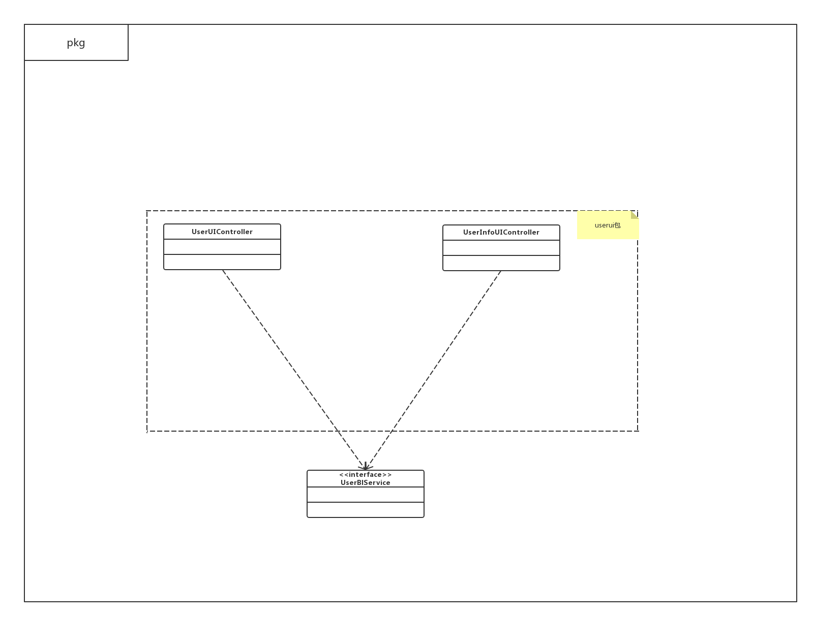
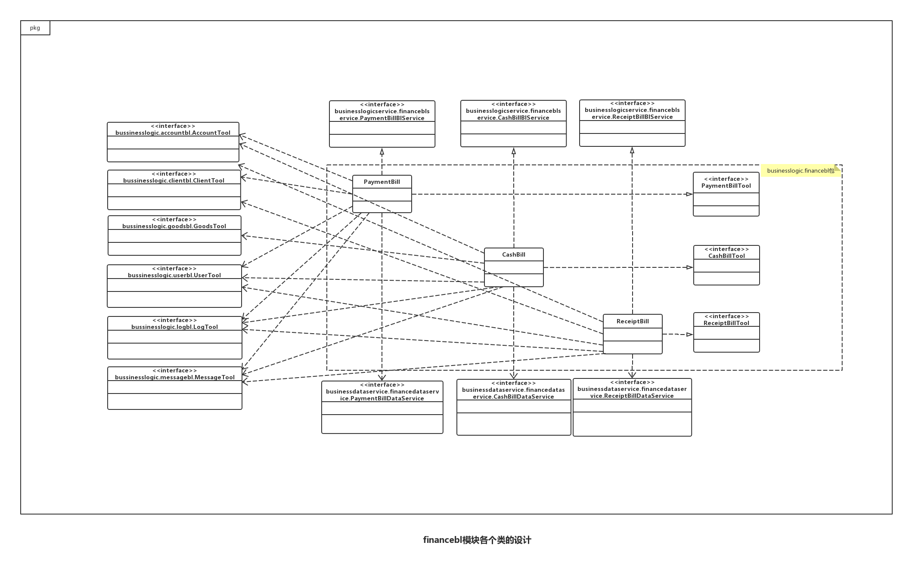
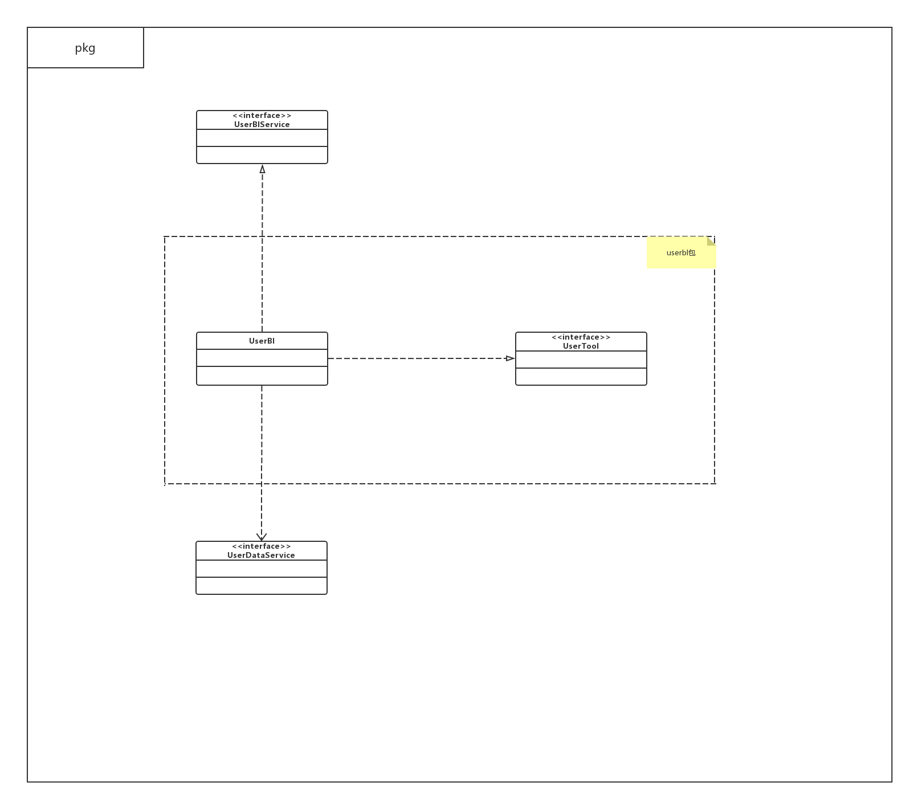

详细设计文档—— 灯具进销存管理系统  软工二小组
=========================

 
 
 

# 更新历史
| **修改人员**           | **日期**     | **变更原因** | **版本** |
| ------------------ | ---------- | -------- | ------ |
| 陈骁、陈思彤、 王宁、王颀涵 | 2017-10-29 | 最初版本     | V1.0   |
| 陈骁、陈思彤、 王宁、王颀涵 | 2018-01-04 | 提交版本    | V2.0   |

 
 
***********************************************
 
 

# 变更记录
| **修改人员**           | **日期**     | **变更原因** | **版本** | **变更内容** |
| ------------------ | ---------- | -------- | ------ | -------- |
| 陈骁、陈思彤、 王宁、王颀涵 | 2017-10-29 | 初始版本     | V1.0   | 无        |
| 陈骁、陈思彤、 王宁、王颀涵 | 2018-01-04 | 提交版本    | V2.0   | 根据代码更新文档|

 
 
***********************************************
 
 

# 目录
<!-- TOC -->

- [更新历史](#更新历史)
- [变更记录](#变更记录)
- [目录](#目录)
- [1.引言](#1引言)
    - [1.1 编制目的](#11-编制目的)
- [2.产品概述](#2产品概述)
- [3.体系结构设计概述](#3体系结构设计概述)
- [4.结构视角](#4结构视角)
    - [4.1 界面层的分解](#41-界面层的分解)
        - [4.1.1 goodssortui模块](#411-goodssortui模块)
            - [(1) 模块概述](#1-模块概述)
            - [(2) 整体结构](#2-整体结构)
            - [(3) 模块内部类的接口规范](#3-模块内部类的接口规范)
                - [GoodsSortUI的接口规范](#goodssortui的接口规范)
                - [GoodsSortInfoUI的接口规范](#goodssortinfoui的接口规范)
        - [4.1.2 goodsui模块](#412-goodsui模块)
            - [(1) 模块概述](#1-模块概述-1)
            - [(2) 整体结构](#2-整体结构-1)
            - [(3) 模块内部类的接口规范](#3-模块内部类的接口规范-1)
                - [GoodsUI的接口规范](#goodsui的接口规范)
                - [GoodsInfoUI的接口规范](#goodsinfoui的接口规范)
        - [4.1.3 inventoryui模块](#413-inventoryui模块)
            - [(1) 模块概述](#1-模块概述-2)
            - [(2) 整体结构](#2-整体结构-2)
            - [(3) 模块内部类的接口规范](#3-模块内部类的接口规范-2)
                - [InventoryCheckUI的接口规范](#inventorycheckui的接口规范)
                - [InventoryVerificationUI的接口规范](#inventoryverificationui的接口规范)
                - [InventoryLossOverBillUI的接口规范](#inventorylossoverbillui的接口规范)
                - [InventoryGiftBillUI的接口规范](#inventorygiftbillui的接口规范)
                - [InventoryBillUI的接口规范](#inventorybillui的接口规范)
        - [4.1.4 clientui模块](#414-clientui模块)
            - [(1) 模块概述](#1-模块概述-3)
            - [(2) 整体结构](#2-整体结构-3)
            - [(3) 模块内部类的接口规范](#3-模块内部类的接口规范-3)
                - [ClientInfoUI的接口规范](#clientinfoui的接口规范)
        - [4.1.5 purchaseui模块](#415-purchaseui模块)
            - [(1) 模块概述](#1-模块概述-4)
            - [(2) 整体结构](#2-整体结构-4)
            - [(3) 模块内部类的接口规范](#3-模块内部类的接口规范-4)
                - [PurchaseTradeBillUI的接口规范](#purchasetradebillui的接口规范)
                - [PurchaseRefundBillUI的接口规范](#purchaserefundbillui的接口规范)
                - [PurchaseBillUI的接口规范](#purchasebillui的接口规范)
        - [4.1.6 saleui模块](#416-saleui模块)
            - [(1) 模块概述](#1-模块概述-5)
            - [(2) 整体结构](#2-整体结构-5)
            - [(3) 模块内部类的接口规范](#3-模块内部类的接口规范-5)
                - [SaleTradeBillUI的接口规范](#saletradebillui的接口规范)
                - [SaleRefundBillUI的接口规范](#salerefundbillui的接口规范)
                - [SaleBillUI的接口规范](#salebillui的接口规范)
        - [4.1.7 accountui模块](#417-accountui模块)
            - [(1) 模块概述](#1-模块概述-6)
            - [(2) 整体结构](#2-整体结构-6)
            - [(3) 模块内部类的接口规范](#3-模块内部类的接口规范-6)
                - [AccountUI的接口规范](#accountui的接口规范)
                - [AccountInfoUI的接口规范](#accountinfoui的接口规范)
        - [4.1.8 financeui模块](#418-financeui模块)
            - [(1) 模块概述](#1-模块概述-7)
            - [(2) 整体结构](#2-整体结构-7)
            - [(3) 模块内部类的接口规范](#3-模块内部类的接口规范-7)
                - [ReceiptBillUI的接口规范](#receiptbillui的接口规范)
                - [PaymentBillUI的接口规范](#paymentbillui的接口规范)
                - [CashBillUI的接口规范](#cashbillui的接口规范)
                - [FinanceBillUI的接口规范](#financebillui的接口规范)
        - [4.1.9 initialui模块](#419-initialui模块)
            - [(1) 模块概述](#1-模块概述-8)
            - [(2) 整体结构](#2-整体结构-8)
            - [(3) 模块内部类的接口规范](#3-模块内部类的接口规范-8)
                - [InitialUI的接口规范](#initialui的接口规范)
                - [InitialInfoUI的接口规范](#initialinfoui的接口规范)
        - [4.1.10 logui模块](#4110-logui模块)
            - [(1) 模块概述](#1-模块概述-9)
            - [(2) 整体结构](#2-整体结构-9)
            - [(3) 模块内部类的接口规范](#3-模块内部类的接口规范-9)
                - [LogUI的接口规范](#logui的接口规范)
        - [4.1.11 reportui模块](#4111-reportui模块)
            - [(1) 模块概述](#1-模块概述-10)
            - [(2) 整体结构](#2-整体结构-10)
            - [(3) 模块内部类的接口规范](#3-模块内部类的接口规范-10)
                - [SaleDetailUIController的接口规范](#saledetailuicontroller的接口规范)
                - [BusinessHistoryUIController的接口规范](#businesshistoryuicontroller的接口规范)
                - [BusinessConditionUIController的接口规范](#businessconditionuicontroller的接口规范)
        - [4.1.12 approvalui模块](#4112-approvalui模块)
            - [(1) 模块概述](#1-模块概述-11)
            - [(2) 整体结构](#2-整体结构-11)
            - [(3) 模块内部类的接口规范](#3-模块内部类的接口规范-11)
                - [ApprovalUIController的接口规范](#approvaluicontroller的接口规范)
        - [4.1.13 promotionui模块](#4113-promotionui模块)
            - [(1) 模块概述](#1-模块概述-12)
            - [(2) 整体结构](#2-整体结构-12)
            - [(3) 模块内部类的接口规范](#3-模块内部类的接口规范-12)
                - [PromotionUIController的接口规范](#promotionuicontroller的接口规范)
                - [PromotionClientUIController的接口规范](#promotionclientuicontroller的接口规范)
                - [PromotionGoodsUIController的接口规范](#promotiongoodsuicontroller的接口规范)
                - [PromotionTotalUIController的接口规范](#promotiontotaluicontroller的接口规范)
        - [4.1.14 userui模块](#4114-userui模块)
            - [(1) 模块概述](#1-模块概述-13)
            - [(2) 整体结构](#2-整体结构-13)
            - [(3) 模块内部类的接口规范](#3-模块内部类的接口规范-13)
                - [UserUIController的接口规范](#useruicontroller的接口规范)
                - [UserInfoUIController的接口规范](#userinfouicontroller的接口规范)
        - [4.1.15 loginui模块](#4115-loginui模块)
            - [(1) 模块概述](#1-模块概述-14)
            - [(2) 整体结构](#2-整体结构-14)
            - [(3) 模块内部类的接口规范](#3-模块内部类的接口规范-14)
                - [LoginUI的接口规范](#loginui的接口规范)
        - [4.1.16 messageui模块](#4116-messageui模块)
            - [(1) 模块概述](#1-模块概述-15)
            - [(2) 整体结构](#2-整体结构-15)
            - [(3) 模块内部类的接口规范](#3-模块内部类的接口规范-15)
                - [InventoryPanelUI的接口规范](#inventorypanelui的接口规范)
                - [PurchaseSalePanelUI的接口规范](#purchasesalepanelui的接口规范)
                - [FinancePanelUI的接口规范](#financepanelui的接口规范)
                - [ManagerPanelUI的接口规范](#managerpanelui的接口规范)
                - [AdministratorPanelUI的接口规范](#administratorpanelui的接口规范)
    - [4.2 业务逻辑层的分解](#42-业务逻辑层的分解)
        - [4.2.1 goodssortbl模块](#421-goodssortbl模块)
            - [(1) 模块概述](#1-模块概述-16)
            - [(2) 整体结构](#2-整体结构-16)
            - [(3) 模块内部类的接口规范](#3-模块内部类的接口规范-16)
                - [GoodsSortBl的接口规范](#goodssortbl的接口规范)
            - [(4) 业务逻辑层的动态模型](#4-业务逻辑层的动态模型)
        - [4.2.2 goodsbl模块](#422-goodsbl模块)
            - [(1) 模块概述](#1-模块概述-17)
            - [(2) 整体结构](#2-整体结构-17)
            - [(3) 模块内部类的接口规范](#3-模块内部类的接口规范-17)
                - [GoodsBl的接口规范](#goodsbl的接口规范)
            - [(4) 业务逻辑层的动态模型](#4-业务逻辑层的动态模型-1)
        - [4.2.3 inventorybl模块](#423-inventorybl模块)
            - [(1) 模块概述](#1-模块概述-18)
            - [(2) 整体结构](#2-整体结构-18)
            - [(3) 模块内部类的接口规范](#3-模块内部类的接口规范-18)
                - [InventoryCheckBl的接口规范](#inventorycheckbl的接口规范)
                - [InventoryVerificationBl的接口规范](#inventoryverificationbl的接口规范)
                - [InventoryLossOverBillBl的接口规范](#inventorylossoverbillbl的接口规范)
                - [InventoryGiftBillBl的接口规范](#inventorygiftbillbl的接口规范)
            - [(4) 业务逻辑层的动态模型](#4-业务逻辑层的动态模型-2)
        - [4.2.4 Clientbl模块](#424-clientbl模块)
            - [(1) 模块概述](#1-模块概述-19)
            - [(2) 整体结构](#2-整体结构-19)
            - [(3) 模块内部类的接口规范](#3-模块内部类的接口规范-19)
                - [ClientBl的接口规范](#clientbl的接口规范)
            - [(4) 业务逻辑层的动态模型](#4-业务逻辑层的动态模型-3)
        - [4.2.5 purchasebl模块](#425-purchasebl模块)
            - [(1) 模块概述](#1-模块概述-20)
            - [(2) 整体结构](#2-整体结构-20)
            - [(3) 模块内部类的接口规范](#3-模块内部类的接口规范-20)
                - [PurchaseTradeBillBl的接口规范](#purchasetradebillbl的接口规范)
                - [PurchaseRefundBillBl的接口规范](#purchaserefundbillbl的接口规范)
            - [(4) 业务逻辑层的动态模型](#4-业务逻辑层的动态模型-4)
        - [4.2.6 salebl模块](#426-salebl模块)
            - [(1) 模块概述](#1-模块概述-21)
            - [(2) 整体结构](#2-整体结构-21)
            - [(3) 模块内部类的接口规范](#3-模块内部类的接口规范-21)
                - [SaleTradeBillBl的接口规范](#saletradebillbl的接口规范)
                - [SaleRefundBillBl的接口规范](#salerefundbillbl的接口规范)
            - [(4) 业务逻辑层的动态模型](#4-业务逻辑层的动态模型-5)
        - [4.2.7 accountbl模块](#427-accountbl模块)
            - [(1) 模块概述](#1-模块概述-22)
            - [(2) 整体结构](#2-整体结构-22)
            - [(3) 模块内部类的接口规范](#3-模块内部类的接口规范-22)
                - [AccountBl的接口规范](#accountbl的接口规范)
            - [(4) 业务逻辑层的动态模型](#4-业务逻辑层的动态模型-6)
        - [4.2.8 financebl模块](#428-financebl模块)
            - [(1) 模块概述](#1-模块概述-23)
            - [(2) 整体结构](#2-整体结构-23)
            - [(3) 模块内部类的接口规范](#3-模块内部类的接口规范-23)
                - [PaymentBillBl的接口规范](#paymentbillbl的接口规范)
                - [ReceiptBillBl的接口规范](#receiptbillbl的接口规范)
                - [CashBillBl的接口规范](#cashbillbl的接口规范)
            - [(4) 业务逻辑层的动态模型](#4-业务逻辑层的动态模型-7)
        - [4.2.9 initialbl模块](#429-initialbl模块)
            - [(1) 模块概述](#1-模块概述-24)
            - [(2) 整体结构](#2-整体结构-24)
            - [(3) 模块内部类的接口规范](#3-模块内部类的接口规范-24)
                - [InitialBl的接口规范](#initialbl的接口规范)
            - [(4) 业务逻辑层的动态模型](#4-业务逻辑层的动态模型-8)
        - [4.2.10 logbl模块](#4210-logbl模块)
            - [(1) 模块概述](#1-模块概述-25)
            - [(2) 整体结构](#2-整体结构-25)
            - [(3) 模块内部类的接口规范](#3-模块内部类的接口规范-25)
                - [LogBl的接口规范](#logbl的接口规范)
            - [(4) 业务逻辑层的动态模型](#4-业务逻辑层的动态模型-9)
        - [4.2.11 reportbl模块](#4211-reportbl模块)
            - [(1) 模块描述](#1-模块描述)
            - [(2) 整体结构](#2-整体结构-26)
            - [(3) 模块内部类的接口规范](#3-模块内部类的接口规范-26)
                - [SaleDetailBl的接口规范](#saledetailbl的接口规范)
                - [BusinessHistoryBl的接口规范](#businesshistorybl的接口规范)
                - [BusinessConditionBl的接口规范](#businessconditionbl的接口规范)
            - [(4) 业务逻辑层的动态模型](#4-业务逻辑层的动态模型-10)
        - [4.2.12 approvalbl模块](#4212-approvalbl模块)
            - [(1) 模块描述](#1-模块描述-1)
            - [(2) 整体结构](#2-整体结构-27)
            - [(3) 模块内部类的接口规范](#3-模块内部类的接口规范-27)
            - [ApprovalBl的接口规范](#approvalbl的接口规范)
            - [(4) 业务逻辑层的动态模型](#4-业务逻辑层的动态模型-11)
        - [4.2.13 promotionbl模块](#4213-promotionbl模块)
            - [(1) 模块描述](#1-模块描述-2)
            - [(2) 整体结构](#2-整体结构-28)
            - [(3) 模块内部类的接口规范](#3-模块内部类的接口规范-28)
                - [PromotionBl的接口规范](#promotionbl的接口规范)
            - [(4) 业务逻辑层的动态模型](#4-业务逻辑层的动态模型-12)
        - [4.2.14 userbl模块](#4214-userbl模块)
            - [(1) 模块描述](#1-模块描述-3)
            - [(2) 整体结构](#2-整体结构-29)
            - [(3) 模块内部类的接口规范](#3-模块内部类的接口规范-29)
                - [UserBl的接口规范](#userbl的接口规范)
            - [(4)业务逻辑的动态模型](#4业务逻辑的动态模型)
        - [4.2.15 loginbl模块](#4215-loginbl模块)
            - [(1) 模块概述](#1-模块概述-26)
            - [(2) 整体结构](#2-整体结构-30)
            - [(3) 模块内部类的接口规范](#3-模块内部类的接口规范-30)
                - [LoginBl的接口规范](#loginbl的接口规范)
            - [(4) 业务逻辑层的动态模型](#4-业务逻辑层的动态模型-13)
        - [4.2.16 messagebl模块](#4216-messagebl模块)
            - [(1) 模块概述](#1-模块概述-27)
            - [(2) 整体结构](#2-整体结构-31)
            - [(3) 模块内部类的接口规范](#3-模块内部类的接口规范-31)
                - [MessageBl的接口规范](#messagebl的接口规范)
            - [(4) 业务逻辑层的动态模型](#4-业务逻辑层的动态模型-14)
    - [4.3 数据层的分解](#43-数据层的分解)
        - [4.3.1 goodssortdata模块](#431-goodssortdata模块)
            - [(1) 模块概述](#1-模块概述-28)
            - [(2) 整体结构](#2-整体结构-32)
            - [(3) 模块内部类的接口规范](#3-模块内部类的接口规范-32)
                - [GoodsSortData的接口规范](#goodssortdata的接口规范)
        - [4.3.1 goodsdata模块](#431-goodsdata模块)
            - [(1) 模块概述](#1-模块概述-29)
            - [(2) 整体结构](#2-整体结构-33)
            - [(3) 模块内部类的接口规范](#3-模块内部类的接口规范-33)
                - [GoodsData的接口规范](#goodsdata的接口规范)
        - [4.3.3 inventorydata模块](#433-inventorydata模块)
            - [(1) 模块概述](#1-模块概述-30)
            - [(2) 整体结构](#2-整体结构-34)
            - [(3) 模块内部类的接口规范](#3-模块内部类的接口规范-34)
                - [InventoryLossOverBillData的接口规范](#inventorylossoverbilldata的接口规范)
                - [InventoryGiftBillData的接口规范](#inventorygiftbilldata的接口规范)
        - [4.3.4 clientdata模块](#434-clientdata模块)
            - [(1) 模块概述](#1-模块概述-31)
            - [(2) 整体结构](#2-整体结构-35)
            - [(3) 模块内部类的接口规范](#3-模块内部类的接口规范-35)
                - [ClientData的接口规范](#clientdata的接口规范)
        - [4.3.5 purchasedata模块](#435-purchasedata模块)
            - [(1) 模块概述](#1-模块概述-32)
            - [(2) 整体结构](#2-整体结构-36)
            - [(3) 模块内部类的接口规范](#3-模块内部类的接口规范-36)
                - [PurchaseTradeBillData的接口规范](#purchasetradebilldata的接口规范)
                - [PurchaseRefundBillData的接口规范](#purchaserefundbilldata的接口规范)
        - [4.3.6 saledata模块](#436-saledata模块)
            - [(1) 模块概述](#1-模块概述-33)
            - [(2) 整体结构](#2-整体结构-37)
            - [(3) 模块内部类的接口规范](#3-模块内部类的接口规范-37)
                - [SaleTradeBillData的接口规范](#saletradebilldata的接口规范)
                - [SaleRefundBillData的接口规范](#salerefundbilldata的接口规范)
        - [4.3.7 accountdata模块](#437-accountdata模块)
            - [(1) 模块概述](#1-模块概述-34)
            - [(2) 整体结构](#2-整体结构-38)
            - [(3) 模块内部类的接口规范](#3-模块内部类的接口规范-38)
                - [AccountData的接口规范](#accountdata的接口规范)
        - [4.3.8 financedata模块](#438-financedata模块)
            - [(1) 模块概述](#1-模块概述-35)
            - [(2) 整体结构](#2-整体结构-39)
            - [(3) 模块内部类的接口规范](#3-模块内部类的接口规范-39)
                - [ReceiptBillData的接口规范](#receiptbilldata的接口规范)
                - [PaymentBillData的接口规范](#paymentbilldata的接口规范)
                - [CashBillData的接口规范](#cashbilldata的接口规范)
        - [4.3.9 initialdata模块](#439-initialdata模块)
            - [(1) 模块概述](#1-模块概述-36)
            - [(2) 整体结构](#2-整体结构-40)
            - [(3) 模块内部类的接口规范](#3-模块内部类的接口规范-40)
                - [InitialData的接口规范](#initialdata的接口规范)
        - [4.3.10 logdata模块](#4310-logdata模块)
            - [(1) 模块概述](#1-模块概述-37)
            - [(2) 整体结构](#2-整体结构-41)
            - [(3) 模块内部类的接口规范](#3-模块内部类的接口规范-41)
                - [LogData的接口规范](#logdata的接口规范)
        - [4.3.11 promotiondata模块](#4311-promotiondata模块)
            - [(1) 模块概述](#1-模块概述-38)
            - [(2) 整体结构](#2-整体结构-42)
            - [(3) 模块内部类的接口规范](#3-模块内部类的接口规范-42)
                - [PromotionData的接口规范](#promotiondata的接口规范)
        - [4.3.12 userdata模块](#4312-userdata模块)
            - [(1) 模块概述](#1-模块概述-39)
            - [(2) 整体结构](#2-整体结构-43)
            - [(3) 模块内部类的接口规范](#3-模块内部类的接口规范-43)
                - [UserData的接口规范](#userdata的接口规范)
        - [4.3.13 messagedata模块](#4313-messagedata模块)
            - [(1) 模块概述](#1-模块概述-40)
            - [(2) 整体结构](#2-整体结构-44)
            - [(3) 模块内部类的接口规范](#3-模块内部类的接口规范-44)
                - [MessageData的接口规范](#messagedata的接口规范)
- [5.依赖视角](#5依赖视角)

<!-- /TOC -->

 
 
***********************************************
 
 

# 1.引言
## 1.1 编制目的
本报告详细完成灯具进销存管理系统的详细设计，达到指导后续软件构造的目的，同时实现和测试人员及用户的沟通。 
本报告面向开发人员、测试人员及最终用户而编写，是了解系统的导航。

 
 
***********************************************
 
 

# 2.产品概述
参考灯具进销存管理系统用例文档和灯具进销存管理系统软件规格说明中对产品的概括描述。

 
 
***********************************************
 
 

# 3.体系结构设计概述
参考灯具进销存管理系统体系结构描述文档对体系结构设计的概述

 
 
***********************************************
 
 

# 4.结构视角
## 4.1 界面层的分解
界面层的开发包图参见软件体系结构描述文档的图3

 
 
***********************************************
 
 

### 4.1.1 goodssortui模块
#### (1) 模块概述
goodssortui模块负责商品分类的管理，创建新的分类，删除商品分类，修改商品分类，增加商品。具体功能需求和非功能需求可参见需求规格说明文档和体系结构设计文档。

 

#### (2) 整体结构
根据体系结构的设计，我们将系统分为展示层、业务逻辑层、数据层。每一层之间为了增加灵活性，我们会添加接口。比如展示层和业务逻辑层之间，我们添加bussinesslogicservice.GoodsSortBlService接口。业务逻辑层和数据层之间添加dataservice.GoodsSortDataService接口。

goodssortui模块的设计如图

goodssortui模块各个类的职责如下表所示

| goodssortui模块的类 | 职责           |
| --------------- | ------------ |
| GoodsSortUI     | 负责实现商品分类管理界面 |
| GoodsSortInfoUI | 负责实现商品分类信息界面 |

 

#### (3) 模块内部类的接口规范
##### GoodsSortUI的接口规范
| 需要的服务（需接口）                               |           |
| ---------------------------------------- | --------- |
| `GoodsSortBlService.getRoot()`           | 返回商品分类根节点 |
| `GoodsSortBlService.deleteGoodsSort(String goodsSortID)` | 删除商品分类    |
| `GoodsSortBlService.find(String goodsSortID)` | 取得商品分类    |

 

##### GoodsSortInfoUI的接口规范
| 需要的服务（需接口）                               |        |
| ---------------------------------------- | ------ |
| `GoodsSortBlService.addGoodsSort(GoodsSortVO goodsSort)` | 添加商品分类 |
| `GoodsSortBlService.editGoodsSort(GoodsSortVO goodsSort)` | 编辑商品分类 |

 
 
***********************************************
 
 

### 4.1.2 goodsui模块
#### (1) 模块概述
goodsui模块负责商品分类的管理，删除商品，修改商品，查找商品。具体功能需求和非功能需求可参见需求规格说明文档和体系结构设计文档。

 

#### (2) 整体结构
根据体系结构的设计，我们将系统分为展示层、业务逻辑层、数据层。每一层之间为了增加灵活性，我们会添加接口。比如展示层和业务逻辑层之间，我们添加bussinesslogicservice.GoodsBlService接口。业务逻辑层和数据层之间添加dataservice.GoodsDataService接口。

goodsui模块的设计如图

goodsui模块各个类的职责如下表所示

| goodsui模块的类 | 职责         |
| ----------- | ---------- |
| GoodsUI     | 负责实现商品管理界面 |
| GoodsInfoUI | 负责实现商品信息界面 |

 

#### (3) 模块内部类的接口规范
##### GoodsUI的接口规范
| 需要的服务（需接口）                               |        |
| ---------------------------------------- | ------ |
| `GoodsBlService.getGoodsList(GoodsQueryVO query)` | 返回商品列表 |
| `GoodsBlService.deleteGoods(String goodsID)` | 删除商品   |

 

##### GoodsInfoUI的接口规范
| 需要的服务（需接口）                               |      |
| ---------------------------------------- | ---- |
| `GoodsBlService.addGoods(GoodsVO goods)` | 添加商品 |
| `GoodsBlService.editGoods(GoodsVO goods)` | 编辑商品 |

 
 
***********************************************
 
 

### 4.1.3 inventoryui模块
#### (1) 模块概述
inventoryui模块负责库存的查看、盘点，以及赠送单与溢损单的制定，修改。具体功能需求和非功能需求可参见需求规格说明文档和体系结构设计文档。

 

#### (2) 整体结构
根据体系结构的设计，我们将系统分为展示层、业务逻辑层、数据层。每一层之间为了增加灵活性，我们会添加接口。比如展示层和业务逻辑层之间，我们添加bussinesslogicservice.InventoryCheckBlService接口、bussinesslogicservice.InventoryVerificationBlService接口、bussinesslogicservice.InventoryLossOverBillBlService接口、bussinesslogicservice.InventoryGiftBillBlService接口。业务逻辑层和数据层之间添加dataservice.InventoryLossOverBillDataService接口、dataservice.InventoryGiftBillDataService接口。

inventoryui模块的设计如图

inventoryui模块各个类的职责如下表所示

| inventoryui模块的类         | 职责            |
| ----------------------- | ------------- |
| InventoryCheckUI        | 负责实现库存查看界面    |
| InventoryVerificationUI | 负责实现库存盘点界面    |
| InventoryLossOverBillUI | 负责实现制定库存溢损单界面 |
| InventoryGiftBillUI     | 负责实现制定库存赠送单界面 |
| InventoryBillUI         | 负责实现修改库存类单据界面 |

 

#### (3) 模块内部类的接口规范
##### InventoryCheckUI的接口规范
| 需要的服务（需接口）                               |          |
| ---------------------------------------- | -------- |
| `InventoryCheckBlService.getInventoryCheck(Date start,Date end)` | 返回库存查看数据 |

 

##### InventoryVerificationUI的接口规范
| 需要的服务（需接口）                               |        |
| ---------------------------------------- | ------ |
| `InventoryVerificationBlService.getGoodsList(GoodsQueryVO query)` | 返回商品列表 |

 

##### InventoryLossOverBillUI的接口规范
| 需要的服务（需接口）                               |                |
| ---------------------------------------- | -------------- |
| `InventoryLossOverBillBlService.getGoodsList(GoodsQueryVO query)` | 返回商品列表         |
| `InventoryLossOverBillBlService.submit(InventoryLossOverBillVO bill)` | 单据被提交进行审批或成为草稿 |
| `InventoryLossOverBillBlService.editInventoryLossOverBill(InventoryLossOverBillVO inventoryLossOverBillVO)` | 修改单据           |

 

##### InventoryGiftBillUI的接口规范
| 需要的服务（需接口）                               |                |
| ---------------------------------------- | -------------- |
| `InventoryLossOverBillBlService.getGoodsList(GoodsQueryVO query)` | 返回商品列表         |
| `InventoryLossOverBillBlService.getClientList(ClientQueryVO query)` | 取得客户列表         |
| `InventoryGiftBillBlService.submit(InventoryGiftBillVO bill)` | 单据被提交进行审批或成为草稿 |
| `InventoryGiftBillBlService.editInventoryGiftBill(InventoryGiftBillVO inventoryGiftBillVO)` | 修改单据           |

 

##### InventoryBillUI的接口规范
| 需要的服务（需接口）                               |           |
| ---------------------------------------- | --------- |
| `InventoryLossOverBillBlService.getInventoryLossOverBillList(BillQueryVO query)` | 取得库存溢损单列表 |
| `InventoryGiftBillBlService.getInventoryGiftBillList(BillQueryVO query)` | 取得库存赠送单列表 |

 
 
***********************************************
 
 

### 4.1.4 clientui模块
#### (1) 模块概述
clientui模块负责客户的管理，创建新的客户，删除客户，修改客户，查找客户。具体功能需求和非功能需求可参见需求规格说明文档和体系结构设计文档。

 

#### (2) 整体结构
根据体系结构的设计，我们将系统分为展示层、业务逻辑层、数据层。每一层之间为了增加灵活性，我们会添加接口。比如展示层和业务逻辑层之间，我们添加bussinesslogicservice.ClientBlService接口。业务逻辑层和数据层之间添加dataservice.ClientDataService接口。

clientui模块的设计如图

clientui模块各个类的职责如下表所示
| clientui模块的类 | 职责         |
| ------------ | ---------- |
| ClientUI     | 负责实现客户管理界面 |
| ClientInfoUI | 负责实现客户信息界面 |

 

#### (3) 模块内部类的接口规范
##### ClientInfoUI的接口规范
| 需要的服务（需接口）                      |        |
| ------------------------------- | ------ |
| `ClientBlService.getClientList(ClientQueryVO query)` | 返回客户列表 |
| `ClientBlService.addClient(ClientVO client)`     | 添加客户   |
| `ClientBlService.editClient(ClientVO client)`    | 编辑客户   |
| `ClientBlService.deleteClient(String clientID)`  | 删除客户   |
| `ClientBlService.getUserList(UserQueryVO query)`   | 取得用户列表 |

 
 
***********************************************
 
 

### 4.1.5 purchaseui模块
#### (1) 模块概述
purchaseui模块负责进货单和进货退货单的制定、修改。具体功能需求和非功能需求可参见需求规格说明文档和体系结构设计文档。

 

#### (2) 整体结构
根据体系结构的设计，我们将系统分为展示层、业务逻辑层、数据层。每一层之间为了增加灵活性，我们会添加接口。比如展示层和业务逻辑层之间，我们添加bussinesslogicservice.PurchaseTradeBillBlService接口。业务逻辑层和数据层之间添加dataservice.PurchaseTradeBillDataService接口。

purchaseui模块的设计如图

purchaseui模块各个类的职责如下表所示
| purchaseui模块的类       | 职责         |
| -------------------- | ---------- |
| PurchaseTradeBillUI  | 负责实现客户管理界面 |
| PurchaseRefunsBillUI | 负责实现客户信息界面 |
| PurchaseBillUI       | 进货类单据总界面  |

 

#### (3) 模块内部类的接口规范
##### PurchaseTradeBillUI的接口规范
| 需要的服务（需接口）                               |                |
| ---------------------------------------- | -------------- |
| `PurchaseTradeBillBlService.getSupplierList(ClientQueryVO query)` | 返回客户列表  |
| `PurchaseTradeBillService.getGoodsList(GoodsQueryVO query)`  | 返回商品列表 |
| `PurchaseTradeBillBlService.submit(PurchaseTradeBillVO purchaseTradeBillVO)`      | 保存单据，返回单据ID|
| `PurchaseTradeBillBlService.editPurchaseTradeBill(PurchaseTradeBillVO purchaseTradeBillVO)` | 更新单据信息 |

 

##### PurchaseRefundBillUI的接口规范
| 需要的服务（需接口）                               |                |
| ---------------------------------------- | -------------- |
| `PurchaseRefundBillBlService.getSupplierList(ClientQueryVO query)` |返回客户列表  |
| `PurchaseRefundBillService.getGoodsList(GoodsQueryVO query)` |返回商品列表 |
| `PurchaseRefundBillBlService.submit(PurchaseRefundBillVO purchaseRefundBillVO)`     |单据被提交发送给经理进行审批|
| `PurchaseRefundBillBlService.editPurchaseRefundBill(PurchaseRefundBillVO purchaseRefundBillVO)` | 更新单据信息 |

 

##### PurchaseBillUI的接口规范
| 需要的服务（需接口）                               |           |
| ---------------------------------------- | --------- |
| `PurchaseTradeBillBlService.getPurchaseTradeBillList(BillQueryVO query)` | 取得进货单列表 |
| `PurchaseRefundBilllService.getPurchaseRefudnBillList(BillQueryVO query)` |取得进货退货单列表|

 
 
***********************************************
 
 

### 4.1.6 saleui模块
#### (1) 模块概述
saleui模块负责进货单和进货退货单的制定、修改。具体功能需求和非功能需求可参见需求规格说明文档和体系结构设计文档。

 

#### (2) 整体结构
根据体系结构的设计，我们将系统分为展示层、业务逻辑层、数据层。每一层之间为了增加灵活性，我们会添加接口。比如展示层和业务逻辑层之间，我们添加bussinesslogicservice.SaleTradeBillBlService接口。业务逻辑层和数据层之间添加dataservice.SaleTradeBillDataService接口。

saleui模块的设计如图

saleui模块各个类的职责如下表所示
| saleui模块的类       | 职责         |
| ---------------- | ---------- |
| SaleTradeBillUI  | 负责实现客户管理界面 |
| SaleRefundBillUI | 负责实现客户信息界面 |
| SaleBillUI   | 销售类单据总界面  |

 

#### (3) 模块内部类的接口规范
##### SaleTradeBillUI的接口规范
| 需要的服务（需接口）                               |                |
| ---------------------------------------- | -------------- |
| `SaleTradeBillBlService.getSellerList(ClientQueryVO query)`   | 返回客户列表  |
| `SaleTradeBillService.getGoodsList(GoodsQueryVO query)`      | 返回商品列表  |
| `SaleTradeBillService.getPromotitonList(PromotionQueryVO query)` | 返回符合的促销策略列表 |
| `SaleTradeBillBlService.submit(SaleTradeBillVO saleTradeBillVO)`          | 保存单据，返回单据ID  |
| `SaleTradeBillBlService.editSaleTradeBill(SaleTradeBillVO saleTradeBillVO)` | 更新单据信息|

 

##### SaleRefundBillUI的接口规范
| 需要的服务（需接口）                               |                |
| ---------------------------------------- | -------------- |
| `SaleRefundBillBlService.getSellerList(ClientQueryVO query)`  |返回客户列表  |
| `SaleRefundBillService.getGoodsList(GoodsQueryVO query)`     | 返回商品列表 |
| `SaleRefundBillBlService.submit(SaleRefundBillVO saleRefundBillVO)`         | 保存单据，返回单据ID |
| `SaleRefundBillBlService.editSaleRefundBill(SaleRefundBillVO saleRefundBillVO)` | 更新单据信息  |

 

##### SaleBillUI的接口规范
| 需要的服务（需接口）                               |           |
| ---------------------------------------- | --------- |
| `SaleTradeBillBlService.getSaleTradeBillList(BillQueryVO query)` |取得销售单列表 |
| `SaleRefundBilllService.getSaleRefudnBillList(BillQueryVO query)` | 取得销售退货单列表  |

 
 
***********************************************
 
 

### 4.1.7 accountui模块
#### (1) 模块概述
accountui模块负责公司银行账户的管理，创建新的帐户，删除帐户，修改账户属性（只限名称），查找显示账户名称和属性(包括名称和余额)。具体功能需求和非功能需求可参见需求规格说明文档和体系结构设计文档。

 

#### (2) 整体结构
根据体系结构的设计，我们将系统分为展示层、业务逻辑层、数据层。每一层之间为了增加灵活性，我们会添加接口。比如展示层和业务逻辑层之间，我们添加bussinesslogicservice.AccountBlService接口。业务逻辑层和数据层之间添加dataservice.AccountDataService接口。

accountui模块的设计如图

accountui模块各个类的职责如下表所示

| accountui模块的类 | 职责              |
| ------------- | --------------- |
| AccountUI     | 负责实现帐户管理界面      |
| AccountInfoUI | 负责实现帐户信息查看和编辑界面 |

 

#### (3) 模块内部类的接口规范
##### AccountUI的接口规范
| 需要的服务（需接口）                               |               |
| ---------------------------------------- | ------------- |
| `AccountBlService.getAccountList(AccountQueryVO query)` | 返回账户列表        |
| `AccountBlService.deleteAccount(String accountID)` | 删除一个账户，更新账户列表 |

 

##### AccountInfoUI的接口规范
| 需要的服务（需接口）                               |               |
| ---------------------------------------- | ------------- |
| `AccountBlService.addAccount(AccountVO account)` | 添加一个账户，更新账户列表 |
| `AccountBlService.editAccount(AccountVO account)` | 编辑一个账户，更新账户列表 |

 
 
***********************************************
 
 

### 4.1.8 financeui模块
#### (1) 模块概述
financeui模块负责收款单、付款单和现金费用单的制定、修改。具体功能需求和非功能需求可参见需求规格说明文档和体系结构设计文档。

 

#### (2) 整体结构
根据体系结构的设计，我们将系统分为展示层、业务逻辑层、数据层。每一层之间为了增加灵活性，我们会添加接口。比如展示层和业务逻辑层之间，我们添加bussinesslogicservice.ReceiptBillBlService、bussinesslogicservice.PaymentBillBlService、bussinesslogicservice.CashBillBlService接口。业务逻辑层和数据层之间添加dataservice.ReceiptBillDataService、dataservice.PaymentBillDataService、dataservice.CashBillDataService接口。

financeui模块的设计如图

financeui模块各个类的职责如下表所示

| financeui模块的类 | 职责                   |
| ------------- | -------------------- |
| ReceiptBillUI | 负责实现收款单的制定修改和查看界面    |
| PaymentBillUI | 负责实现付款单的制定修改和查看界面    |
| CashBillUI    | 负责实现现金费用单的制定修改和查看界面  |
| FinanceBillUI | 负责显示草稿或者审批不通过财务单据的界面 |

 

#### (3) 模块内部类的接口规范
##### ReceiptBillUI的接口规范
| 需要的服务（需接口）                               |                        |
| ---------------------------------------- | ---------------------- |
| `ReceiptBillBlService.getClientList(ClientQueryVO query)` | 返回客户列表                 |
| `ReceiptBillBlService.submit(ReceiptBillVO vo)` | 更新并提交收款单，持久化更新涉及的对象的数据 |
| `ReceiptBillBlService.editReceiptBill(ReceiptBillVO vo)` | 修改收款单                  |

 

##### PaymentBillUI的接口规范
| 需要的服务（需接口）                               |                        |
| ---------------------------------------- | ---------------------- |
| `PaymentBillBlService.getClientList(ClientQueryVO query)` | 返回客户列表                 |
| `PaymentBillBlService.submit(PaymentBillVO vo)` | 更新并提交付款单，持久化更新涉及的对象的数据 |
| `PaymentBillBlService.editPaymentBill(PaymentBillVO vo)` | 修改付款单                  |

 

##### CashBillUI的接口规范
| 需要的服务（需接口）                               |                          |
| ---------------------------------------- | ------------------------ |
| `CashBillBlService.getAccountList(AccountQueryVO query)` | 返回账户列表                   |
| `CashBillBlService.submit(CashBillVO vo)` | 更新并提交现金费用单，持久化更新涉及的对象的数据 |
| `CashBillBlService.editCashBill(CashBillVO vo)` | 修改现金费用单                  |

 

##### FinanceBillUI的接口规范
| 需要的服务（需接口）                               |           |
| ---------------------------------------- | --------- |
| `ReceiptBillBlService.getReceiptBillList(BillQueryVO query)` | 返回收款单列表   |
| `PaymentBillBlService.getPaymentBillList(BillQueryVO query)` | 返回付款单列表   |
| `CashBillBlService.getCashBillList(BillQueryVO query)` | 返回现金费用单列表 |

 
 
***********************************************
 
 

### 4.1.9 initialui模块
#### (1) 模块概述
initialui模块负责期初信息的查看和期初建账。具体功能需求和非功能需求可参见需求规格说明文档和体系结构设计文档。

 

#### (2) 整体结构
根据体系结构的设计，我们将系统分为展示层、业务逻辑层、数据层。每一层之间为了增加灵活性，我们会添加接口。比如展示层和业务逻辑层之间，我们添加bussinesslogicservice.InitialBlService接口。业务逻辑层和数据层之间添加dataservice.InitialDataService接口。

initialui模块的设计如图

initialui模块各个类的职责如下表所示

| initialui模块的类 | 职责              |
| ------------- | --------------- |
| InitialUI     | 负责实现期初建账的导航界面   |
| InitialInfoUI | 负责实现期初信息查看和添加界面 |

 

#### (3) 模块内部类的接口规范
##### InitialUI的接口规范
| 需要的服务（需接口）                               |          |
| ---------------------------------------- | -------- |
| `InitialBlService.getInitial(InitialQueryVO query)` | 返回期初信息列表 |

 

##### InitialInfoUI的接口规范
| 需要的服务（需接口）                               |                      |
| ---------------------------------------- | -------------------- |
| `InitialBlService.getGoodsList(GoodsQueryVO query)` | 返回上一年的持久化商品对象列表      |
| `InitialBlService.getClientList(ClientQueryVO query)` | 返回上一年的持久化客户对象列表      |
| `InitialBlService.getAccountList(AccountQueryVO query)` | 返回上一年的持久化账户对象列表      |
| `InitialBlService.establishInitial(InitialVO initial)` | 保存期初信息，持久化更新涉及的对象的数据 |

 
 
***********************************************
 
 

### 4.1.10 logui模块
#### (1) 模块概述
logui模块负责实现操作日志的查看界面。具体功能需求和非功能需求可参见需求规格说明文档和体系结构设计文档。

 

#### (2) 整体结构
根据体系结构的设计，我们将系统分为展示层、业务逻辑层、数据层。每一层之间为了增加灵活性，我们会添加接口。比如展示层和业务逻辑层之间，我们添加bussinesslogicservice.LogBlService接口。业务逻辑层和数据层之间添加dataservice.LogDataService接口。

logui模块的设计如图

logui模块各个类的职责如下表所示

| logui模块的类 | 职责       |
| --------- | -------- |
| LogUI     | 操作日志查看界面 |

 

#### (3) 模块内部类的接口规范
##### LogUI的接口规范
| 需要的服务（需接口）                               |          |
| ---------------------------------------- | -------- |
| `LogBlService.getLogList(LogQueryVO query)` | 获取操作日志列表 |

 
 
*******************************
 
 

### 4.1.11 reportui模块
#### (1) 模块概述
reportui模块负责报表查看。具体功能需求和非功能需求可参见需求规格说明文档和体系结构设计文档。

 

#### (2) 整体结构
根据体系结构的设计，我们将系统分为展示层、业务逻辑层。层之间为了增加灵活性，添加了接口。展示层和业务逻辑层之间添加了SaleDetailBlService、BusinessHistoryBlService以及BusinessConditionBlService接口。

reportui模块的设计如图

reportui模块各个类的职责如下表所示

| reportui模块的类                  | 职责            |
| ----------------------------- | ------------- |
| SaleDetailUIController        | 负责实现查看销售明细表业务 |
| BusinessHistoryUIController   | 负责实现查看经营历程表业务 |
| BusinessConditionUIController | 负责实现查看经营情况表业务 |

 

#### (3) 模块内部类的接口规范
##### SaleDetailUIController的接口规范
| 需要的服务（需接口）                              |             |
| --------------------------------------- | ----------- |
| 服务名                                     | 服务          |
| `SaleDetailBlService.getSaleRecordList` | 返回符合条件的销售记录 |

 

##### BusinessHistoryUIController的接口规范
| 需要的服务（需接口）                               |             |
| ---------------------------------------- | ----------- |
| 服务名                                      | 服务          |
| `BusinessHistoryBlService.getBillList`   | 返回符合条件的所有单据 |
| `BusinessHistoryBlService.reverseReceiptBill` | 红冲收款单       |
| `BusinessHistoryBlService.reversePaymentBill` | 红冲付款单       |
| `BusinessHistoryBlService.reverseCashBill` | 红冲现金费用单     |

 

##### BusinessConditionUIController的接口规范
| 需要的服务（需接口）                               |             |
| ---------------------------------------- | ----------- |
| 服务名                                      | 服务          |
| `BusinessConditionBlService.getCondition` | 返回符合条件的经营情况 |

 
 
*******************************
 
 

### 4.1.12 approvalui模块
#### (1) 模块概述
approvalui模块负责单据审批。具体功能需求和非功能需求可参见需求规格说明文档和体系结构设计文档。

 

#### (2) 整体结构
根据体系结构的设计，我们将系统分为展示层、业务逻辑层。层之间为了增加灵活性，添加了接口。展示层和业务逻辑层之间添加了ApprovalBlService接口。

approvalui模块的设计如图

approvalui模块各个类的职责如下表所示

| approvalui模块的类       | 职责       |
| -------------------- | -------- |
| ApprovalUIController | 负责实现审批单据 |

 

#### (3) 模块内部类的接口规范
##### ApprovalUIController的接口规范
| 需要的服务（需接口）                      |              |
| ------------------------------- | ------------ |
| 服务名                             | 服务           |
| `ApprovalBlService.getBillList` | 系统显示该类型的提交单据 |
| `ApprovalBlService.pass`        | 系统修改单据的数据及状态 |
| `ApprovalBlService.reject`      | 系统修改单据的状态    |

 
 
*******************************
 
 

### 4.1.13 promotionui模块
#### (1) 模块概述
promotionui模块负责促销策略管理。具体功能需求和非功能需求可参见需求规格说明文档和体系结构设计文档。

 

#### (2) 整体结构
根据体系结构的设计，我们将系统分为展示层、业务逻辑层。层之间为了增加灵活性，添加了接口。展示层和业务逻辑层之间添加了PromotionBlService和PromotionTool接口；业务层和数据层之间添加了PromotionDataBlservice。

promotionui模块的设计如图

promotionui模块各个类的职责如下表所示

| promotionui模块的类             | 职责             |
| --------------------------- | -------------- |
| PromotionUIController       | 负责实现促销策略管理     |
| PromotionClientUIController | 负责实现客户促销策略具体操作 |
| PromotionGoodsUIController  | 负责实现商品促销策略具体操作 |
| PromotionTotalUIController  | 负责实现总价促销策略具体操作 |

 

#### (3) 模块内部类的接口规范
##### PromotionUIController的接口规范
| 需要的服务（需接口）                            |             |
| ------------------------------------- | ----------- |
| 服务名                                   | 服务          |
| `PromotionBlService.getPromotionList` | 显示符合条件的促销策略 |

##### PromotionClientUIController的接口规范
| 需要的服务（需接口）                            |             |
| ------------------------------------- | ----------- |
| 服务名                                   | 服务          |
| `PromotionBlService.getPromotionList` | 显示符合条件的促销策略 |
| `PromotionBlService.addPromotion`     | 新增促销策略      |
| `PromotionBlService.editPromotion`    | 更新促销策略      |
| `PromotionBlService.deletePromotion`  | 删除促销策略      |
| `PromotionBlService.getGoodsList`     | 获取商品列表      |

##### PromotionGoodsUIController的接口规范
| 需要的服务（需接口）                            |             |
| ------------------------------------- | ----------- |
| 服务名                                   | 服务          |
| `PromotionBlService.getPromotionList` | 显示符合条件的促销策略 |
| `PromotionBlService.addPromotion`     | 新增促销策略      |
| `PromotionBlService.editPromotion`    | 更新促销策略      |
| `PromotionBlService.deletePromotion`  | 删除促销策略      |
| `PromotionBlService.getGoodsList`     | 获取商品列表      |

##### PromotionTotalUIController的接口规范
| 需要的服务（需接口）                            |             |
| ------------------------------------- | ----------- |
| 服务名                                   | 服务          |
| `PromotionBlService.getPromotionList` | 显示符合条件的促销策略 |
| `PromotionBlService.addPromotion`     | 新增促销策略      |
| `PromotionBlService.editPromotion`    | 更新促销策略      |
| `PromotionBlService.deletePromotion`  | 删除促销策略      |
| `PromotionBlService.getGoodsList`     | 获取商品列表      |

 
 
************************
 
 

### 4.1.14 userui模块
#### (1) 模块概述
userui模块负责帐号管理。具体功能需求和非功能需求可参见需求规格说明文档和体系结构设计文档。

 

#### (2) 整体结构
根据体系结构的设计，我们将系统分为展示层、业务逻辑层。层之间为了增加灵活性，添加了接口。展示层和业务逻辑层之间添加了UserBlService和UserTool接口；业务层和数据层之间添加了UserDataBlservice。

userui模块的设计如图

userui模块各个类的职责如下表所示

| userui模块的类           | 职责           |
| -------------------- | ------------ |
| UserUIController     | 负责实现帐号管理     |
| UserInfoUIController | 负责实现帐号具体信息操作 |

 

#### (3) 模块内部类的接口规范
##### UserUIController的接口规范
| 需要的服务（需接口）                  |           |
| --------------------------- | --------- |
| 服务名                         | 服务        |
| `UserBlService.getUserList` | 显示符合条件的帐号 |
| `UserBlService.deleteUser`  | 系统删除帐号    |

##### UserInfoUIController的接口规范
| 需要的服务（需接口）               |        |
| ------------------------ | ------ |
| 服务名                      | 服务     |
| `UserBlService.addUser`  | 系统新增帐号 |
| `UserBlService.editUser` | 系统修改帐号 |

 
 
************************
 
 

### 4.1.15 loginui模块
#### (1) 模块概述
loginui模块负责实现登陆界面。具体功能需求和非功能需求可参见需求规格说明文档和体系结构设计文档。

 

#### (2) 整体结构
根据体系结构的设计，我们将系统分为展示层、业务逻辑层、数据层。每一层之间为了增加灵活性，我们会添加接口。比如展示层和业务逻辑层之间，我们添加bussinesslogicservice.LoginBlService接口。业务逻辑层和数据层之间添加dataservice.LoginDataService接口。

loginui模块的设计如图

loginui模块各个类的职责如下表所示
| loginui模块的类 | 职责   |
| ----------- | ---- |
| LoginUI     | 登陆界面 |
 

#### (3) 模块内部类的接口规范
##### LoginUI的接口规范
| 需要的服务（需接口）             |        |
| ---------------------- | ------ |
| `LoginBlService.login(String jobName,String password)` | 进行登陆操作 |
| `LoginBlService.logout(String ID)`| 进行登出操作 |

 
 
***********************************************
 
 

### 4.1.16 messageui模块
#### (1) 模块概述
messageui模块负责取得系统信息。具体功能需求和非功能需求可参见需求规格说明文档和体系结构设计文档。

 

#### (2) 整体结构
根据体系结构的设计，我们将系统分为展示层、业务逻辑层、数据层。每一层之间为了增加灵活性，我们会添加接口。比如展示层和业务逻辑层之间，我们添加bussinesslogicservice.MessageBlService接口。业务逻辑层和数据层之间添加dataservice.MessageDataService接口。MessagePO是作为系统信息的持久化对象被添加到设计模型中去的。

messagebl模块的设计如图

messageui模块各个类的职责如下表所示：

| messageui模块的类        | 职责        |
| -------------------- | --------- |
| InventoryPanelUI     | 库存管理人员主界面 |
| PurchaseSalePanelUI  | 进货销售人员主界面 |
| FinancePenelUI       | 财务人员主界面   |
| ManagerPanelUI       | 总经理主界面    |
| AdministratorPanelUI | 管理员主界面    |

 

#### (3) 模块内部类的接口规范
##### InventoryPanelUI的接口规范
| 需要的服务（需接口）                        |              |      |
| --------------------------------- | ------------ | ---- |
| `MessageBlService.getMessageList(UserVO receiver)` | 根据接收者，返回系统信息 |      |
| `MessageBlService.delete(String ID, int number)` | 根据接收者，返回系统信息 |      |

 

##### PurchaseSalePanelUI的接口规范
| 需要的服务（需接口）                        |              |      |
| --------------------------------- | ------------ | ---- |
| `MessageBlService.getMessageList(UserVO receiver)` | 根据接收者，返回系统信息 |      |
| `MessageBlService.delete(String ID, int number)` | 根据接收者，返回系统信息 |      |

 

##### FinancePanelUI的接口规范
| 需要的服务（需接口）                        |              |      |
| --------------------------------- | ------------ | ---- |
| `MessageBlService.getMessageList(UserVO receiver)` | 根据接收者，返回系统信息 |      |
| `MessageBlService.delete(String ID, int number)` | 根据接收者，返回系统信息 |      |

 

##### ManagerPanelUI的接口规范
| 需要的服务（需接口）                        |              |      |
| --------------------------------- | ------------ | ---- |
| `MessageBlService.getMessageList(UserVO receiver)` | 根据接收者，返回系统信息 |      |
| `MessageBlService.delete(String ID, int number)` | 根据接收者，返回系统信息 |      |

 

##### AdministratorPanelUI的接口规范
| 需要的服务（需接口）                        |              |      |
| --------------------------------- | ------------ | ---- |
| `MessageBlService.getMessageList(UserVO receiver)` | 根据接收者，返回系统信息 |      |
| `MessageBlService.delete(String ID, int number)` | 根据接收者，返回系统信息 |      |

 
 
***********************************************
 
 

## 4.2 业务逻辑层的分解
业务逻辑层的开发包图参见软件体系结构描述文档的图3

 
 
***********************************************
 
 

### 4.2.1 goodssortbl模块
#### (1) 模块概述
goodssortbl模块负责商品分类的管理，增加商品分类，删除商品分类，修改商品分类。具体功能需求和非功能需求可参见需求规格说明文档和体系结构设计文档。

 

#### (2) 整体结构
根据体系结构的设计，我们将系统分为展示层、业务逻辑层、数据层。每一层之间为了增加灵活性，我们会添加接口。比如展示层和业务逻辑层之间，我们添加bussinesslogicservice.GoodsSortBLlervice接口。业务逻辑层和数据层之间添加dataservice. GoodsSortDataService接口。GoodsSortPO是作为商品分类的持久化对象被添加到设计模型中去的。

goodssortbl模块的设计如图

goodssortbl模块各个类的职责如下表所示

| goodssortbl模块的类 | 职责                   |
| --------------- | -------------------- |
| GoodsSortBl     | 负责实现商品分类管理管理界面所需要的服务 |

 

#### (3) 模块内部类的接口规范
##### GoodsSortBl的接口规范
| 提供的服务（供接口）                              |      |                                          |
| --------------------------------------- | ---- | ---------------------------------------- |
| `GoodsSortBlService.getRoot`            | 语法   | `public GoodsSortVO getRoot() throws Exception` |
|                                         | 前置条件 | 正在进行商品分类管理                               |
|                                         | 后置条件 | 输出商品分类的根节点                               |
| `GoodsSortBlService.addGoodsSort`       | 语法   | `public String addGoodsSort(GoodsSortVO goodsSort) throws Exception` |
|                                         | 前置条件 | 正在进行商品分类管理                               |
|                                         | 后置条件 | 添加一个商品分类，更新商品分类列表                        |
| `GoodsSortBlService.deleteGoodsSort`    | 语法   | `public void deleteGoodsSort(String goodsSortID) throws Exception` |
|                                         | 前置条件 | 正在进行商品分类管理                               |
|                                         | 后置条件 | 删除一个商品分类，更新商品分类列表                        |
| `GoodsSortBlService.editGoodsSort`      | 语法   | `public void editGoodsSort(GoodsSortVO goodsSort) throws Exception` |
|                                         | 前置条件 | 正在进行商品分类管理                               |
|                                         | 后置条件 | 编辑一个商品分类，更新商品分类列表                        |
| `GoodsSortBlService/GoodsSortTool.find` | 语法   | `public GoodsSortVO find(String goodsSortID) throws Exception` |
|                                         | 前置条件 | 无                                        |
|                                         | 后置条件 | 返回相关的商品分类                                |

| 需要的服务（需接口）                               |           |
| ---------------------------------------- | --------- |
| 服务名                                      | 服务        |
| `GoodsSortDataService.find(String goodsSortID)` | 取得持久化对象   |
| `GoodsSortDataService.insert(GoodsSortPO po)` | 添加商品分类    |
| `GoodsSortDataService.delete(GoodsSortPO po)` | 删除商品分类    |
| `GoodsSortDataService.update(GoodsSortPO po)` | 修改单一持久化对象 |
| `GoodsSortDataService.getRoot()`         | 得到商品分类根节点 |
| `GoodsTool.getGoodsList(GoodsQueryVO query)` | 取得商品列表    |
| `MessageTool.addMessage(MessageVO message)` | 记录消息      |

 

#### (4) 业务逻辑层的动态模型
如图表明了进销存管理系统中，当库存管理人员想要添加一个商品分类的时候，商品分类管理业务逻辑处理的相关对象之间的协作。

如图表明了进销存管理系统中，当库存管理人员想要删除一个商品分类的时候，商品分类管理业务逻辑处理的相关对象之间的协作。

如图所示的状态图描述了GoodsSort对象的生存期间的状态序列、引起转移的事件，以及因状态转移而伴随的动作。

 
 
***********************************************
 
 

### 4.2.2 goodsbl模块
#### (1) 模块概述
goodsbl模块负责商品的管理，增加商品，删除商品，修改商品，查询商品。具体功能需求和非功能需求可参见需求规格说明文档和体系结构设计文档。

 

#### (2) 整体结构
根据体系结构的设计，我们将系统分为展示层、业务逻辑层、数据层。每一层之间为了增加灵活性，我们会添加接口。此包实现了goodsblservice的所有接口，并依赖goodsdataservice来获取data层的数据。GoodsPO是作为商品分类的持久化对象被添加到设计模型中去的。

goodsbl模块的设计如图

goodsbl模块各个类的职责如下表所示

| goodsbl模块的类 | 职责                 |
| ----------- | ------------------ |
| GoodsBl     | 负责实现商品管理管理界面所需要的服务 |

 

#### (3) 模块内部类的接口规范
##### GoodsBl的接口规范
| 提供的服务（供接口）                             |      |                                          |
| -------------------------------------- | ---- | ---------------------------------------- |
| `GoodsBlService/GoodTool.getGoodsList` | 语法   | `public ArrayList<GoodsVO> getGoodsList(GoodsQueryVO query) throws Exception` |
|                                        | 前置条件 | 正在进行商品管理                                 |
|                                        | 后置条件 | 返回商品列表                                   |
| `GoodsBlService.addGoods`              | 语法   | `public String addGoods(GoodsVO goods) throws Exception` |
|                                        | 前置条件 | 正在进行商品管理                                 |
|                                        | 后置条件 | 添加一个商品，更新商品列表                            |
| `GoodsBlService/GoodsTool.editGoods`   | 语法   | `public void editGoods(GoodsVO goods) throws Exception` |
|                                        | 前置条件 | 正在进行商品管理                                 |
|                                        | 后置条件 | 编辑一个商品，更新商品列表                            |
| `GoodsBlService.deleteGoods`           | 语法   | `public void deleteGoods(String goodsID) throws Exception` |
|                                        | 前置条件 | 正在进行商品管理                                 |
|                                        | 后置条件 | 删除一个商品，更新商品列表                            |
| `GoodTool.find`                        | 语法   | `public GoodsVO find(String goodsID) throws Exception` |
|                                        | 前置条件 | 无                                        |
|                                        | 后置条件 | 返回商品                                     |

| 需要的服务（需接口）                               |               |
| ---------------------------------------- | ------------- |
| 服务名                                      | 服务            |
| `GoodsDataService.find(String goodsID)`  | 根据筛选条件d进行查找商品 |
| `GoodsDataService.insert(GoodsPO po)`    | 添加商品          |
| `GoodsDataService.delete(String goodsID)` | 删除商品          |
| `GoodsDataService.update(GoodsPO po)`    | 更改商品信息        |
| `GoodsDataService.finds(GoodsQueryPO query)` | 查找香相关的商品列表    |
| `MessageTool.addMessage(MessageVO message)` | 记录消息          |

 

#### (4) 业务逻辑层的动态模型
如图表明了进销存管理系统中，当库存管理人员想要添加一个商品的时候，商品管理业务逻辑处理的相关对象之间的协作。

如图表明了进销存管理系统中，当库存管理人员想要删除一个商品的时候，商品管理业务逻辑处理的相关对象之间的协作。

如图所示的状态图描述了Goods对象的生存期间的状态序列、引起转移的事件，以及因状态转移而伴随的动作。

 
 
***********************************************
 
 

### 4.2.3 inventorybl模块
#### (1) 模块概述
inventorybl模块负责库存的管理，库存查看，库存盘点，建立库存溢损单。具体功能需求和非功能需求可参见需求规格说明文档和体系结构设计文档。

 

#### (2) 整体结构
根据体系结构的设计，我们将系统分为展示层、业务逻辑层、数据层。每一层之间为了增加灵活性，我们会添加接口。InventoryPO，InventoryLossOverBillPO是作为库存的持久化对象被添加到设计模型中去的。

inventorybl模块的设计如图

inventorybl模块各个类的职责如下表所示

| inventorybl模块的类         | 职责                  |
| ----------------------- | ------------------- |
| InventoryCheckBl        | 负责实现库存查看界面所需要的服务    |
| InventoryVerificationBl | 负责实现库存盘点界面所需要的服务    |
| InventoryLossOverBillBl | 负责实现建立库存溢损单界面所需要的服务 |
| InventoryGiftBillBl     | 负责实现建立库存赠送单界面所需要的服务 |

 

#### (3) 模块内部类的接口规范
##### InventoryCheckBl的接口规范
| 提供的服务（供接口）                               |      |                                          |
| ---------------------------------------- | ---- | ---------------------------------------- |
| `InventoryCheckBlService.getInventoryCheck` | 语法   | `public ArrayList<InventoryCheckItemVO> getInventoryCheck(Date start,Date end) throws Exception` |
|                                          | 前置条件 | 正在进行库存查看                                 |
|                                          | 后置条件 | 返回对应的库存查看数据                              |

| 需要的服务（需接口）                               |           |
| ---------------------------------------- | --------- |
| 服务名                                      | 服务        |
| `PurchaseTradeBillTool.getPurchaseTradeBillList(BillQueryVO query)` | 取得进货单列表   |
| `PurchaseRefundBillTool.getPurchaseRefundBillList(BillQueryVO query)` | 取得进货退货单列表 |
| `SaleTradeBillTool.getSaleTradeBillList(BillQueryVO query)` | 取得销售单列表   |
| `SaleRefundBillTool.getSaleRefundBillList(BillQueryVO query)` | 取得进货单列表   |
 

##### InventoryVerificationBl的接口规范
| 提供的服务（供接口）                               |      |                                          |
| ---------------------------------------- | ---- | ---------------------------------------- |
| `InventoryVerificationBlService.getGoodsList` | 语法   | `public ArrayList<GoodsVO> getGoodsList(GoodsQueryVO query) throws Exception` |
|                                          | 前置条件 | 无                                        |
|                                          | 后置条件 | 得到库存数据                                   |

| 需要的服务（需接口）                               |        |
| ---------------------------------------- | ------ |
| 服务名                                      | 服务     |
| `GoodsTool.getGoodsList(GoodsQueryVO query)` | 取得商品列表 |

 

##### InventoryLossOverBillBl的接口规范
| 提供的服务（供接口）                               |      |                                          |
| ---------------------------------------- | ---- | ---------------------------------------- |
| `InventoryLossOverBillBlService.getGoodList` | 语法   | `public ArrayList<GoodsVO> getGoodsList(GoodsQueryVO query) throws Exception` |
|                                          | 前置条件 | 无                                        |
|                                          | 后置条件 | 返回对应商品列表                                 |
| `InventoryLossOverBillBlService.submit`  | 语法   | `public String submit(InventoryLossOverBillVO bill) throws Exception` |
|                                          | 前置条件 | 无                                        |
|                                          | 后置条件 | 更新并提交库存溢损单，持久化更新涉及的对象的数据                 |
| `InventoryLossOverBillBlService.editInventoryLossOverBill` | 语法   | `    public void editInventoryLossOverBill(InventoryLossOverBillVO inventoryLossOverBillVO) throws Exception` |
|                                          | 前置条件 | 无                                        |
|                                          | 后置条件 | 更新库存溢损单，持久化更新涉及的对象的数据                    |
| `InventoryLossOverBillBlService/InventoryLossOverBillTool.getInventoryLossOverBillList` | 语法   | `public ArrayList<InventoryLossOverBillVO> getInventoryLossOverBillList(BillQueryVO query) throws Exception` |
|                                          | 前置条件 | 无                                        |
|                                          | 后置条件 | 取得库存溢损单列表                                |
| `InventoryLossOverBillTool.pass`         | 语法   | `public void pass(BillVO billVO)throws Exception` |
|                                          | 前置条件 | 无                                        |
|                                          | 后置条件 | 更改库存，修改单据状态                              |
| `InventoryLossOverBillTool.reject`       | 语法   | `public void reject(BillVO billVO)throws Exception` |
|                                          | 前置条件 | 无                                        |
|                                          | 后置条件 | 修改单据状态为不通过                               |

| 需要的服务（需接口）                               |            |
| ---------------------------------------- | ---------- |
| 服务名                                      | 服务         |
| `InventoryLossOverBillDataService.find(BillQueryPO query)` | 查找匹配的持久化对象 |
| `InventoryLossOverBillDataService.insert(InventoryLossOverBillPO po)` | 添加单据       |
| `InventoryLossOverBillDataService.update(InventoryLossOverBillPO po)` | 修改单据       |
| `GoodsTool.getGoodsList(GoodsQueryVO query)` | 取得商品列表     |
| `LogTool.addLog(LogVO log)`              | 记录日志       |
| `GoodsTool.editGoods(GoodsVO goods)`     | 更该商品信息     |
| `MessageTool.addMessage(MessageVO message)` | 记录消息       |

 

##### InventoryGiftBillBl的接口规范
| 提供的服务（供接口）                               |      |                                          |
| ---------------------------------------- | ---- | ---------------------------------------- |
| `InventoryGiftBillBlService.getGoodList` | 语法   | `public ArrayList<GoodsVO> getGoodsList(GoodsQueryVO query) throws Exception` |
|                                          | 前置条件 | 无                                        |
|                                          | 后置条件 | 返回对应商品列表                                 |
| `InventoryGiftBillBlService.getClientList` | 语法   | `public ArrayList<ClientVO> getClientList(ClientQueryVO query) throws Exception` |
|                                          | 前置条件 | 无                                        |
|                                          | 后置条件 | 返回对应客户列表                                 |
| `InventoryGiftBillBlService.submit`      | 语法   | `public String submit(InventoryGiftBillVO bill) throws Exception` |
|                                          | 前置条件 | 无                                        |
|                                          | 后置条件 | 更新并提交库存赠送单，持久化更新涉及的对象的数据                 |
| `InventoryGiftBillBlService.editInventoryGiftBill` | 语法   | `public void editInventoryGiftBill(InventoryGiftBillVO inventoryGiftBillVO) throws Exception` |
|                                          | 前置条件 | 无                                        |
|                                          | 后置条件 | 更新库存赠送单，持久化更新涉及的对象的数据                    |
| `InventoryGiftBillBlService.getInventoryGiftBillList` | 语法   | `public ArrayList<InventoryGiftBillVO> getInventoryGiftBillList(BillQueryVO query) throws Exception` |
|                                          | 前置条件 | 无                                        |
|                                          | 后置条件 | 取得库存赠送单列表                                |
| `InventoryGiftBillTool.pass`             | 语法   | `public void pass(BillVO billVO)throws Exception` |
|                                          | 前置条件 | 无                                        |
|                                          | 后置条件 | 更新客户应收应付信息，更改库存，修改单据状态                   |
| `InventoryGiftBillTool.reject`           | 语法   | `public void reject(BillVO billVO)throws Exception` |
|                                          | 前置条件 | 无                                        |
|                                          | 后置条件 | 修改单据状态为不通过                               |

| 需要的服务（需接口）                               |            |
| ---------------------------------------- | ---------- |
| 服务名                                      | 服务         |
| `InventoryGiftBillDataService.find(BillQueryVO query)` | 查找匹配的持久化对象 |
| `InventoryGiftBillDataService.insert(InventoryGiftBillPO po)` | 添加单据       |
| `InventoryGiftBillDataService.update(InventoryGiftBillPO po)` | 修改单据       |
| `GoodsTool.getGoodsList(GoodsQueryVO query)` | 取得商品列表     |
| `LogTool.addLog(LogVO log)`              | 记录日志       |
| `GoodsTool.editGoods(GoodsVO goods)`     | 更改商品信息     |
| `ClientTool.editClient(ClientVO client)` | 更新客户信息
| `MessageTool.addMessage(MessageVO message)`      | 记录消息     |

 

#### (4) 业务逻辑层的动态模型

如图表明了进销存管理系统中，当库存管理人员想要取得商品列表的时候，建立库存溢损单业务逻辑处理的相关对象之间的协作。

如图所示的状态图描述了Inventory对象的生存期间的状态序列、引起转移的事件，以及因状态转移而伴随的动作。

 
 
***********************************************
 
 

### 4.2.4 Clientbl模块
#### (1) 模块概述
Clientbl模块负责客户的管理，创建新的客户，删除客户，修改客户，查找客户。具体功能需求和非功能需求可参见需求规格说明文档和体系结构设计文档。

 

#### (2) 整体结构
根据体系结构的设计，我们将系统分为展示层、业务逻辑层、数据层。每一层之间为了增加灵活性，我们会添加接口。比如展示层和业务逻辑层之间，我们添加bussinesslogicservice.ClientBLlervice接口。业务逻辑层和数据层之间添加dataservice.ClientDataService接口。ClientPO是作为客户的持久化对象被添加到设计模型中去的。

clientbl模块的设计如图

client模块各个类的职责如下表所示
| clientbl模块的类 | 职责            |
| ------------ | ------------- |
| ClientBl     | 负责实现客户信息的增删改查 |

 

#### (3) 模块内部类的接口规范
##### ClientBl的接口规范
| 提供的服务（供接口）                               |      |                                          |
| ---------------------------------------- | ---- | ---------------------------------------- |
| `ClientBlService/ClientTool.getClientList` | 语法   | `public ArrayList<ClientVO> getClientList(ClientQueryVO query)` |
|                                          | 前置条件 | 正在进行客户管理                                 |
|                                          | 后置条件 | 返回客户列表                                   |
| `ClientBlService.addClient`              | 语法   | `public String addClient(ClientVO client)` |
|                                          | 前置条件 | 正在进行客户管理                                 |
|                                          | 后置条件 | 添加一个客户，返回客户ID                            |
| `ClientBlService/ClientTool.editClient`  | 语法   | `public void editClient(ClientVO client)` |
|                                          | 前置条件 | 正在进行客户管理                                 |
|                                          | 后置条件 | 编辑一个客户，更新客户列表                            |
| `ClientBlService.deleteClient`           | 语法   | `public void deleteClient(String clientID)` |
|                                          | 前置条件 | 正在进行客户管理                                 |
|                                          | 后置条件 | 删除一个客户，更新客户列表                            |
| `ClientBlService.getUserList`           | 语法   | `public ArrayList<UserVO> getUserList(UserQueryVO query)` |
|                                          | 前置条件 | 正在进行客户管理                                 |
|                                          | 后置条件 | 返回用户列表                    |
| `ClientTool.find`           | 语法   | `public ClientVO find(String clientID)` |
|                                          | 前置条件 | 无                                 |
|                                          | 后置条件 | 根据ID查找客户                    |

| 需要的服务（需接口）                               |              |
| ---------------------------------------- | ------------ |
| 服务名                                      | 服务           |
| `ClientDataService.find(String clientID)` | 根据ID查找客户 |
| `ClientDataService.finds(ClientQueryPO query)` | 根据筛选条件进行查找客户 |
| `ClientDataService.insert(ClientPO po)`  | 添加客户         |
| `ClientDataService.delete(String clientID)`  | 删除客户       |
| `ClientDataService.update(ClientPO po)`  | 更改客户信息       |
| `UserTool.getUserList(UserQueryVO query)`| 查找用户       |

 

#### (4) 业务逻辑层的动态模型
如图表明了进销存管理系统中，当进货销售人员想要查找客户的时候，客户管理业务逻辑处理的相关对象之间的协作。

如图表明了进销存管理系统中，当进货销售人员想要删除一个客户的时候，客户管理业务逻辑处理的相关对象之间的协作。

如图所示的状态图描述了Client对象的生存期间的状态序列、引起转移的事件，以及因状态转移而伴随的动作。

 
 
***********************************************
 
 

### 4.2.5 purchasebl模块
#### (1) 模块概述
purchasebl模块负责进货单、进货退货单的创建。具体功能需求和非功能需求可参见需求规格说明文档和体系结构设计文档。

 

#### (2) 整体结构
根据体系结构的设计，我们将系统分为展示层、业务逻辑层、数据层。此模块实现了purchaseui所要求的purchasebl包的所有接口，并通过purchasedataservice和data层进行交互。PurchaseTradeBillPO以及PurchaseRefundBillPO是作为单据的持久化对象被添加到设计模型中去的。

purchasebl模块的设计如图

purchasebl模块各个类的职责如下表所示
| purchase模块的类         | 职责                |
| -------------------- | ----------------- |
| PurchaseTradeBillBl  | 负责实现制定进货单界面所需要的服务 |
| PurchaseRefundBillBl | 负责实现制定进货单界面所需要的服务 |

 

#### (3) 模块内部类的接口规范
##### PurchaseTradeBillBl的接口规范
| 提供的服务（供接口）                               |      |                                          |
| ---------------------------------------- | ---- | ---------------------------------------- |
| `PurchaseTradeBillBlService.getSupplierList` | 语法   | `public ArrayList<ClientVO> getSupplierList(ClientQueryVO query)` |
|                                          | 前置条件 | 开始制定进货单                                  |
|                                          | 后置条件 | 返回客户列表                                   |
| `PurchaseTradeBillService.getGoodsList`  | 语法   | `public ArrayList<GoodsVO> getGoodsList(GoodsQueryVO query)` |
|                                          | 前置条件 | 开始制定进货单                                  |
|                                          | 后置条件 | 返回商品列表                                   |
| `PurchaseTradeBillBlService.submit`      | 语法   | `public String submit(PurchaseTradeBillVO purchaseTradeBillVO)` |
|                                          | 前置条件 | 无                                        |
|                                          | 后置条件 | 保存单据，返回单据ID                              |
| `PurchaseTradeBillBlService.editPurchaseTradeBill` | 语法   | `public void editPurchaseTradeBill(PurchaseTradeBillVO purchaseTradeBillVO)` |
|                                          | 前置条件 | 制定单据完成                                   |
|                                          | 后置条件 | 更新单据信息                                   |
| `PurchaseTradeBillTool.pass`             | 语法   | `public void pass(BillVO billVO)` |
|                                          | 前置条件 | 单据审批通过                                   |
|                                          | 后置条件 | 更新客户应收应付信息，更改库存，修改单据状态                   |
| `PurchaseTradeBillTool.reject`           | 语法   | `public void reject(BillVO billVO)` |
|                                          | 前置条件 | 单据审批不通过                                  |
|                                          | 后置条件 | 修改单据状态为不通过                               |
| `PurchaseTradeBillBlService/PurchaseTradeBillTool.getPurchaseTradeBillList` | 语法   | `public ArrayList<PurchaseTradeBillVO> getPurchaseTradeBillList(BillQueryVO query)` |
|                                          | 前置条件 | 无                                        |
|                                          | 后置条件 | 取得进货单列表                                  |

| 需要的服务（需接口）                               |           |
| ---------------------------------------- | --------- |
| 服务名                                      | 服务        |
| `PurchaseTradeBillDataService.finds(BillQueryPO query)` | 取得进货单列表 |
| `PurchaseTradeBillDataService.insert(PurchaseTradeBillPO po)` | 添加进货单   |
| `PurchaseTradeBillDataService.update(PurchaseTradeBillPO po)` | 修改进货单   |
| `ClientTool.getClientList(ClientQueryVO query)` | 取得客户列表    |
| `GoodsTool.getGoodsList(GoodsQueryVO query)` | 取得商品列表    |
| `LogTool.addLog(LogVO log)`              | 记录日志      |
| `ClientTool.editClient(ClientVO client)` | 更改客户信息    |
| `GoodsTool.editGoods(GoodsVO goods)`     | 更改在库商品数   |

 

##### PurchaseRefundBillBl的接口规范
| 提供的服务（供接口）                               |      |                                          |
| ---------------------------------------- | ---- | ---------------------------------------- |
| `PurchaseRefundBillBlService.getSupplierList` | 语法   | `public ArrayList<ClientVO> getSupplierList(ClientQueryVO query)` |
|                                          | 前置条件 | 开始制定进货退货单                                |
|                                          | 后置条件 | 返回客户列表                                   |
| `PurchaseRefundBillService.getGoodsList` | 语法   | `public ArrayList<GoodsVO> getGoodsList(GoodsQueryVO query)` |
|                                          | 前置条件 | 开始制定进货退货单                                |
|                                          | 后置条件 | 返回商品列表                                   |
| `PurchaseRefundBillBlService.submit`     | 语法   | `public String submit(PurchaseRefundBillVO bill)` |
|                                          | 前置条件 | 制定单据完成                                   |
|                                          | 后置条件 | 提交单据，返回单据ID                           |
| `PurchaseRefundBillBlService.editPurchaseRefundBill` | 语法   | `public void editPurchaseRefundBill(PurchaseRefundBillVO purchaseRefundBillVO)` |
|                                          | 前置条件 | 制定单据完成                                   |
|                                          | 后置条件 | 更新单据信息                                   |
| `PurchaseRefundBillTool.pass`            | 语法   | `public void pass(PurchaseRefundBillVO bill)` |
|                                          | 前置条件 | 单据审批通过                                   |
|                                          | 后置条件 | 更新客户应收应付信息，更改库存，修改单据状态                   |
| `PurchaseRefundBillTool.reject`          | 语法   | `public void reject(PurchaseRefundBillVO bill)` |
|                                          | 前置条件 | 单据审批不通过                                  |
|                                          | 后置条件 | 修改单据状态为不通过                               |
| `PurchaseRefundBilllService/PurchaseRefundBillTool.getPurchaseRefudnBillList` | 语法   | `public ArrayList<PurchaseRefundBillVO> getPurchaseRefundBillList(BillQueryVO query)` |
|                                          | 前置条件 | 无                                        |
|                                          | 后置条件 | 取得进货退货单列表                                |

| 需要的服务（需接口）                               |           |
| ---------------------------------------- | --------- |
| 服务名                                      | 服务        |
| `PurchaseRefundBillDataService.finds(BillQueryPO query)` | 取得进货单退货列表 |
| `PurchaseRefundBillDataService.insert(PurchaseRefundBillPO po)` | 添加进货退货单   |
| `PurchaseRefundBillDataService.update(PurchaseRefundBillPO po)` | 修改进货退货单   |
| `CLientTool.getClientList(ClientQueryVO query)` | 取得客户列表    |
| `GoodsTool.getGoodsList(GoodsQueryVO query)` | 取得商品列表    |
| `LogTool.addLog(LogVO log)`              | 记录日志      |
| `ClientTool.editClient(ClientVO client)` | 更改客户信息    |
| `GoodsTool.editGoods(GoodsVO goods)`     | 更改在库商品数   |

 

#### (4) 业务逻辑层的动态模型
如图表明了进销存管理系统中，当制定进货销售单需要取得商品列表的时候，制定进货单业务逻辑处理的相关对象之间的协作。

如图表明了进销存管理系统中，当进货销售人员想要提交进货单的时候，制定进货单业务逻辑处理的相关对象之间的协作。

如图所示的状态图描述了Purchase对象生存期间的状态序列、引起转移的事件，以及因状态转移而伴随的动作。

 
 
***********************************************
 
 

### 4.2.6 salebl模块
#### (1) 模块概述
salebl模块负责销售单、销售退货单的创建。具体功能需求和非功能需求可参见需求规格说明文档和体系结构设计文档。

 

#### (2) 整体结构
根据体系结构的设计，我们将系统分为展示层、业务逻辑层、数据层。此模块实现了saleui所要求的salebl包的所有接口，并通过saledataservice和data层进行交互。SaleTradeBillPO以及SaleRefundBillPO是作为单据的持久化对象被添加到设计模型中去的。

salebl模块的设计如图

salebl模块各个类的职责如下表所示
| sale模块的类         | 职责                |
| ---------------- | ----------------- |
| SaleTradeBillBl  | 负责实现制定销售单界面所需要的服务 |
| SaleRefundBillBl | 负责实现制定销售单界面所需要的服务 |

 

#### (3) 模块内部类的接口规范
##### SaleTradeBillBl的接口规范
| 提供的服务（供接口）                               |      |                                          |
| ---------------------------------------- | ---- | ---------------------------------------- |
| `SaleTradeBillBlService.getSellerList`   | 语法   | `public ArrayList<ClientVO> getSellerList(ClientQueryVO query)` |
|                                          | 前置条件 | 开始制定销售单                                  |
|                                          | 后置条件 | 返回客户列表                                   |
| `SaleTradeBillService.getGoodsList`      | 语法   | `public ArrayList<goodsVO> getGoodsList(GoodsQueryVO query)` |
|                                          | 前置条件 | 开始制定销售单                                  |
|                                          | 后置条件 | 返回商品列表                                   |
| `SaleTradeBillService.getPromotitonList` | 语法   | `public ArrayList<PromotionVO> getPromotionList(PromotionQueryVO query)` |
|                                          | 前置条件 | 开始制定销售单                                  |
|                                          | 后置条件 | 返回符合的促销策略列表                              |
| `SaleRefundBillBlService.submit`         | 语法   | `public String submit(SaleRefundBillVO bill)` |
|                                          | 前置条件 | 制定单据完成                                   |
|                                          | 后置条件 | 保存单据，返回单据ID                          |
| `SaleRefundBillBlService.editSaleRefundBill` | 语法   | `public void editSaleRefundBill(SaleRefundBillVO saleRefundBillVO)` |
|                                          | 前置条件 | 无                                        |
|                                          | 后置条件 | 更新单据信息                                   |
| `SaleTradeBillTool.pass`                 | 语法   | `public void pass(SaleTradeBillVO bill)` |
|                                          | 前置条件 | 单据审批通过                                   |
|                                          | 后置条件 | 更新客户应收应付信息，更改库存，修改单据状态                   |
| `SaleTradeBillTool.reject`               | 语法   | `public void reject(SaleTradeBillVO bill)` |
|                                          | 前置条件 | 单据审批不通过                                  |
|                                          | 后置条件 | 修改单据状态为不通过                               |
| `SaleTradeBillBlService/SaleTradeBillTool.getSaleTradeBillList` | 语法   | `public ArrayList<SaleTradeBillVO> getSaleTradeBillList(BillQueryVO query)` |
|                                          | 前置条件 | 无                                        |
|                                          | 后置条件 | 取得销售单列表                                  |

| 需要的服务（需接口）                               |           |
| ---------------------------------------- | --------- |
| 服务名                                      | 服务        |
| `SaleTradeBillDataService.findsByReport(SaleTradeBillQueryPO query)` | 取得销售单列表 |
| `SaleTradeBillDataService.findsByBill(BillQueryPO query)` | 取得销售单列表 |
| `SaleTradeBillDataService.insert(SaleTradeBillPO po)` | 添加销售单   |
| `SaleTradeBillDataService.update(SaleTradeBillPO po)` | 添加销售单   |
| `ClientTool.getClientList(ClientQueryVO query)` | 取得客户列表    |
| `GoodsTool.getGoodsList(GoodsQueryVO query)` | 取得商品列表    |
| `UserTool.getUserList(UserQueryVO query)` | 取得业务员列表   |
| `PromotionTool.getPromotionList(PromotionQueryVO query)` | 取得促销策略列表  |
| `LogTool.addLog(LogVO log)`              | 记录日志      |
| `ClientTool.editClient(ClientVO client)` | 更改客户信息    |
| `GoodsTool.editGoods(GoodsVO goods)`     | 更改在库商品数   |

 

##### SaleRefundBillBl的接口规范
| 提供的服务（供接口）                               |      |                                          |
| ---------------------------------------- | ---- | ---------------------------------------- |
| `SaleRefundBillBlService.getSellerList`  | 语法   | `public ArrayList<ClientVO> getSellerList(ClientQueryVO query)` |
|                                          | 前置条件 | 开始制定销售退货单                                |
|                                          | 后置条件 | 返回客户列表                                   |
| `SaleRefundBillService.getGoodsList`     | 语法   | `public ArrayList<GoodsVO> getGoodsList(GoodsQueryVO query)` |
|                                          | 前置条件 | 开始制定销售退货单                                |
|                                          | 后置条件 | 返回商品列表                                   |
| `SaleRefundBillService.getSalesmanList`  | 语法   | `public ArrayList<UserVO> getSalesmanList(UserVO query)` |
|                                          | 前置条件 | 开始制定销售退货单                                |
|                                          | 后置条件 | 返回业务员列表                                  |
| `SaleRefundBillBlService.submit`         | 语法   | `public String submit(SaleRefundBillVO bill)` |
|                                          | 前置条件 | 制定单据完成                                   |
|                                          | 后置条件 | 保存单据，返回单据ID                          |
| `SaleRefundBillBlService.editSaleRefundBill` | 语法   | `public void editSaleRefundBill(SaleRefundBillVO saleRefundBillVO)` |
|                                          | 前置条件 | 无                                        |
|                                          | 后置条件 | 更新单据信息                                   |
| `SaleRefundBillTool.pass`                | 语法   | `public void pass(SaleRefundBillVO bill)` |
|                                          | 前置条件 | 单据审批通过                                   |
|                                          | 后置条件 | 更新客户应收应付信息，更改库存，修改单据状态                   |
| `SaleRefundBillTool.reject`              | 语法   | `public void reject(SaleRefundBillVO bill)` |
|                                          | 前置条件 | 单据审批不通过                                  |
|                                          | 后置条件 | 修改单据状态为不通过                               |
| `SaleRefundBilllService/SaleRefundBillTool.getSaleRefudnBillList` | 语法   | `public ArrayList<SaleRefundBillVO> getSaleRefundBillList(BillQueryVO query)` |
|                                          | 前置条件 | 无                                        |
|                                          | 后置条件 | 取得销售退货单列表                                |

| 需要的服务（需接口）                               |           |
| ---------------------------------------- | --------- |
| 服务名                                      | 服务        |
| `SaleRefundBillDataService.finds(BillQueryPO query)` | 取得销售单列表 |
| `SaleRefundBillDataService.insert(SaleRefundBillPO po)` | 添加销售单   |
| `SaleRefundBillDataService.update(SaleRefundBillPO po)` | 更新销售单   |
| `ClientTool.getClientList(ClientQueryVO query)` | 取得客户列表    |
| `GoodsTool.getGoodsList(GoodsQueryVO query)` | 取得商品列表    |
| `UserTool.getUserList(UserQueryVO query)` | 取得业务员列表   |
| `LogTool.addLog(LogVO log)`              | 记录日志      |
| `ClientTool.editClient(ClientVO client)` | 更改客户信息    |
| `GoodsTool.editGoods(GoodsVO goods)`     | 更改在库商品数   |

 

#### (4) 业务逻辑层的动态模型
如图表明了进销存管理系统中，当制定销售单需要取得商品列表的时候，制定销售单业务逻辑处理的相关对象之间的协作。

如图表明了进销存管理系统中，当进货销售人员想要提交销售单的时候，制定销售单业务逻辑处理的相关对象之间的协作。

如图所示的状态图描述了Sale对象生存期间的状态序列、引起转移的事件，以及因状态转移而伴随的动作。

 
 
***********************************************
 
 

### 4.2.7 accountbl模块
#### (1) 模块概述
accountbl模块负责公司账户的查找、添加、删除和账户属性的修改。具体功能需求和非功能需求可参见需求规格说明文档和体系结构设计文档。

 

#### (2) 整体结构
根据体系结构的设计，我们将系统分为展示层、业务逻辑层、数据层。每一层之间为了增加灵活性，我们会添加接口。比如展示层和业务逻辑层之间，我们添加bussinesslogicservice.AccountBlService接口。业务逻辑层和数据层之间添加dataservice.AccountDataService接口。实现的AccountTool是对外提供查询和修改Account的方法的接口.bussinesslogic.logbl.LogTool是需要依赖的接口.

accountbl模块的设计如图

accountbl模块各个类的职责如下表所示

| accountbl模块的类 | 职责               |
| ------------- | ---------------- |
| AccountBl     | 负责实现账户管理界面所需要的服务 |

 

#### (3) 模块内部类的接口规范
##### AccountBl的接口规范
| 提供的服务（供接口）                               |      |                                          |
| ---------------------------------------- | ---- | ---------------------------------------- |
| `AccountBlService/AccountTool.getAccountList` | 语法   | `public ArrayList<AccountVO> getAccountList(AccountQueryVO query) throws Exception` |
|                                          | 前置条件 | 无                                        |
|                                          | 后置条件 | 返回账户列表                                   |
| `AccountBlService.addAccount`            | 语法   | `public String addAccount(AccountVO account) throws Exception` |
|                                          | 前置条件 | 最高权限                                     |
|                                          | 后置条件 | 添加一个账户，更新账户列表                            |
| `AccountBlService/AccountTool.editAccount` | 语法   | `public void editAccount(AccountVO account) throws Exception` |
|                                          | 前置条件 | 最高权限                                     |
|                                          | 后置条件 | 编辑一个账户，更新账户列表                            |
| `AccountBlService.deleteAccount`         | 语法   | `public void deleteAccount(String accountID) throws Exception` |
|                                          | 前置条件 | 最高权限                                     |
|                                          | 后置条件 | 删除一个账户，更新账户列表                            |
| `AccountBlService.find`                  | 语法   | `public AccountVO find(String accountID) throws Exception` |
|                                          | 前置条件 | 账户存在                                     |
|                                          | 后置条件 | 返回对应ID账户                                 |

| 需要的服务（需接口）                               |              |
| ---------------------------------------- | ------------ |
| 服务名                                      | 服务           |
| `AccountDataService.find(String accountID)` | 根据ID进行查找账户   |
| `AccountDataService.finds(AccountQueryPO query)` | 根据筛选条件进行查找账户 |
| `AccountDataService.insert(AccountPO po)` | 添加账户         |
| `AccountDataService.delete(String accountID)` | 删除账户         |
| `AccountDataService.update(AccountPO po)` | 更改账户信息       |

 

#### (4) 业务逻辑层的动态模型
如图表明了进销存管理系统中，当财务人员想要添加一个账户的时候，账户管理业务逻辑处理的相关对象之间的协作。

如图表明了进销存管理系统中，当财务人员想要删除一个账户的时候，账户管理业务逻辑处理的相关对象之间的协作。

如图所示的状态图描述了Account对象的生存期间的状态序列、引起转移的事件，以及因状态转移而伴随的动作。

 
 
***********************************************
 
 

### 4.2.8 financebl模块
#### (1) 模块概述
financebl模块负责财务类单据（包括收款单、付款单、现金费用单）的创建和修改以及提交。具体功能需求和非功能需求可参见需求规格说明文档和体系结构设计文档。

 

#### (2) 整体结构
根据体系结构的设计，我们将系统分为展示层、业务逻辑层、数据层。每一层之间为了增加灵活性，我们会添加接口。此包实现了financeblservice包内的所有接口，并通过financedataservice和data层进行交互。PaymentBillTool对外提供查询和修改PaymentBill的方法的接口,ReceiptBillTool对外提供查询和修改ReceiptBill的方法的接口,CashBillTool对外提供查询和修改CashBill的方法的接口.而bussinesslogic.accountbl.AccountTool接口,bussinesslogic.clientbl.ClientTool接口,bussinesslogic.goodsbl.GoodsTool接口,bussinesslogic.logbl.LogTool接口是需要依赖的接口.

financebl模块的设计如图

financebl模块各个类的职责如下表所示

| financebl模块的类 | 职责                  |
| ------------- | ------------------- |
| PaymentBillBl | 负责实现制定付款单界面所需要的服务   |
| ReceiptBillBl | 负责实现制定收款单界面所需要的服务   |
| CashBillBl    | 负责实现制定现金费用单界面所需要的服务 |

 

#### (3) 模块内部类的接口规范
##### PaymentBillBl的接口规范
| 提供的服务（供接口）                               |      |                                          |
| ---------------------------------------- | ---- | ---------------------------------------- |
| `PaymentBillBlService.getClientList`     | 语法   | `public ArrayList<ClientVO> getClientList(ClientQueryVO query) throws Exception` |
|                                          | 前置条件 | 无                                        |
|                                          | 后置条件 | 返回客户列表                                   |
| `PaymentBillBlService.getAccountList`    | 语法   | `public ArrayList<AccountVO> getAccountList(AccountQueryVO query) throws Exception` |
|                                          | 前置条件 | 无                                        |
|                                          | 后置条件 | 返回账户列表                                   |
| `PaymentBillBlService/PaymentBillTool.submit` | 语法   | `public String submit(PaymentBillVO vo) throws Exception` |
|                                          | 前置条件 | 付款单填写完毕                                  |
|                                          | 后置条件 | 更新并提交付款单，持久化更新涉及的对象的数据，记录操作日志            |
| `PaymentBillBlService.editPaymentBill`   | 语法   | `public void editPaymentBill(PaymentBillVO vo) throws Exception` |
|                                          | 前置条件 | 修改单据                                     |
|                                          | 后置条件 | 更新并提交付款单，持久化更新涉及的对象的数据                   |
| `PaymentBillTool.pass`                   | 语法   | `public void pass(BillVO bill)  throws Exception` |
|                                          | 前置条件 | 单据审批通过                                   |
|                                          | 后置条件 | 更新客户应收信息，更改账户信息，修改单据状态，发送通过消息            |
| `PaymentBillTool.reject`                 | 语法   | `public void reject(BillVO bill)  throws Exception` |
|                                          | 前置条件 | 单据审批不通过                                  |
|                                          | 后置条件 | 修改单据状态为不通过，持久化更新涉及的对象的数据，发送拒绝消息          |
| `PaymentBillBlService/PaymentBillTool.getPaymentBillList` | 语法   | `public ArrayList<PaymentBillVO> getPaymentBillList(BillQueryVO query) throws Exception` |
|                                          | 前置条件 | 无                                        |
|                                          | 后置条件 | 取得付款单列表                                  |

| 需要的服务（需接口）                               |               |
| ---------------------------------------- | ------------- |
| 服务名                                      | 服务            |
| `PaymentBillDataService.finds(BillQueryPO query)` | 根据筛选条件获取付款单列表 |
| `PaymentBillDataService.insert(PaymentBillPO po)` | 添加付款单         |
| `PaymentBillDataService.update(PaymentBillPO po)` | 更新付款单信息       |
| `AccountTool.getAccountList(AccountQueryVO query)` | 取得账户列表        |
| `AccountTool.editAccount(AccountVO account)` | 更改账户信息        |
| `ClientTool.getClientList(ClientQueryVO query)` | 取得客户列表        |
| `ClientTool.editClient(ClientVO client)` | 更改客户信息        |
| `LogTool.addLog(LogVO log)`              | 记录日志          |
| `MessageTool.addMessage(MessageVO message)` | 发送消息          |
| `UserTool.getUserList((UserQueryVO query))` | 获取用户列表        |

 

##### ReceiptBillBl的接口规范
| 提供的服务（供接口）                               |      |                                          |
| ---------------------------------------- | ---- | ---------------------------------------- |
| `ReceiptBillBlService.getClientList`     | 语法   | `public ArrayList<ClientVO> getClientList(ClientQueryVO query) throws Exception` |
|                                          | 前置条件 | 无                                        |
|                                          | 后置条件 | 返回客户列表                                   |
| `ReceiptBillBlService.getAccountList`    | 语法   | `public ArrayList<AccountVO> getAccountList(AccountQueryVO query) throws Exception` |
|                                          | 前置条件 | 无                                        |
|                                          | 后置条件 | 返回账户列表                                   |
| `ReceiptBillBlService/ReceiptBillTool.submit` | 语法   | `public String submit(ReceiptBillVO vo) throws Exception` |
|                                          | 前置条件 | 收款单填写完毕                                  |
|                                          | 后置条件 | 更新并提交收款单，持久化更新涉及的对象的数据，记录操作日志            |
| `ReceiptBillBlService.editReceiptBill`   | 语法   | `public void editReceiptBill(ReceiptBillVO vo) throws Exception` |
|                                          | 前置条件 | 修改单据                                     |
|                                          | 后置条件 | 更新并提交收款单，持久化更新涉及的对象的数据                   |
| `ReceiptBillTool.pass`                   | 语法   | `public void pass(BillVO bill)  throws Exception` |
|                                          | 前置条件 | 单据审批通过                                   |
|                                          | 后置条件 | 更新客户应收信息，更改账户信息，修改单据状态，发送通过消息            |
| `ReceiptBillTool.reject`                 | 语法   | `public void reject(BillVO bill)  throws Exception` |
|                                          | 前置条件 | 单据审批不通过                                  |
|                                          | 后置条件 | 修改单据状态为不通过，持久化更新涉及的对象的数据，发送拒绝消息          |
| `ReceiptBillBlService/ReceiptBillTool.getReceiptBillList` | 语法   | `public ArrayList<ReceiptBillVO> getReceiptBillList(BillQueryVO query) throws Exception` |
|                                          | 前置条件 | 无                                        |
|                                          | 后置条件 | 取得收款单列表                                  |

| 需要的服务（需接口）                               |               |
| ---------------------------------------- | ------------- |
| 服务名                                      | 服务            |
| `ReceiptBillDataService.finds(BillQueryPO query)` | 根据筛选条件获取收款单列表 |
| `ReceiptBillDataService.insert(ReceiptBillPO po)` | 添加收款单         |
| `ReceiptBillDataService.update(ReceiptBillPO po)` | 更新收款单信息       |
| `AccountTool.getAccountList(AccountQueryVO query)` | 取得账户列表        |
| `AccountTool.editAccount(AccountVO account)` | 更改账户信息        |
| `ClientTool.getClientList(ClientQueryVO query)` | 取得客户列表        |
| `ClientTool.editClient(ClientVO client)` | 更改客户信息        |
| `LogTool.addLog(LogVO log)`              | 记录日志          |
| `MessageTool.addMessage(MessageVO message)` | 发送消息          |
| `UserTool.getUserList((UserQueryVO query))` | 获取用户列表        |

 

##### CashBillBl的接口规范
| 提供的服务（供接口）                               |      |                                          |
| ---------------------------------------- | ---- | ---------------------------------------- |
| `CashBillBlService.getClientList`        | 语法   | `public ArrayList<ClientVO> getClientList(ClientQueryVO query) throws Exception` |
|                                          | 前置条件 | 无                                        |
|                                          | 后置条件 | 返回客户列表                                   |
| `CashBillBlService.getAccountList`       | 语法   | `public ArrayList<AccountVO> getAccountList(AccountQueryVO query) throws Exception` |
|                                          | 前置条件 | 无                                        |
|                                          | 后置条件 | 返回账户列表                                   |
| `CashBillBlService/CashBillTool.submit`  | 语法   | `public String submit(CashBillVO vo) throws Exception` |
|                                          | 前置条件 | 现金费用单填写完毕                                |
|                                          | 后置条件 | 更新并提交现金费用单，持久化更新涉及的对象的数据，记录操作日志          |
| `CashBillBlService.editCashBill`         | 语法   | `public void editCashBill(CashBillVO vo) throws Exception` |
|                                          | 前置条件 | 修改单据                                     |
|                                          | 后置条件 | 更新并提交现金费用单，持久化更新涉及的对象的数据                 |
| `CashBillTool.pass`    | 语法   | `public void pass(BillVO bill)  throws Exception` |
|                                          | 前置条件 | 单据审批通过                                   |
|                                          | 后置条件 | 更新客户应收信息，更改账户信息，修改单据状态，发送通过消息            |
| `CashBillTool.reject`  | 语法   | `public void reject(BillVO bill)  throws Exception` |
|                                          | 前置条件 | 单据审批不通过                                  |
|                                          | 后置条件 | 修改单据状态为不通过，持久化更新涉及的对象的数据，发送拒绝消息          |
| `CashBillBlService/CashBillTool.getCashBillList` | 语法   | `public ArrayList<CashBillVO> getCashBillList(BillQueryVO query) throws Exception` |
|                                          | 前置条件 | 无                                        |
|                                          | 后置条件 | 取得现金费用单列表                                |

| 需要的服务（需接口）                               |                 |
| ---------------------------------------- | --------------- |
| 服务名                                      | 服务              |
| `CashBillDataService.finds(BillQueryPO query)` | 根据筛选条件获取现金费用单列表 |
| `CashBillDataService.insert(CashBillPO po)` | 添加现金费用单         |
| `CashBillDataService.update(CashBillPO po)` | 更新现金费用单信息       |
| `AccountTool.getAccountList(AccountQueryVO query)` | 取得账户列表          |
| `AccountTool.editAccount(AccountVO account)` | 更改账户信息          |
| `LogTool.addLog(LogVO log)`              | 记录日志            |
| `MessageTool.addMessage(MessageVO message)` | 发送消息            |
| `UserTool.getUserList((UserQueryVO query))` | 获取用户列表          |

 

#### (4) 业务逻辑层的动态模型
如图表明了进销存管理系统中，当财务人员想要提交一份收款单的时候，制定收款单业务逻辑处理的相关对象之间的协作。

如图表明了进销存管理系统中，当财务人员想要为付款单添加账户的时候，制定付款单业务逻辑处理的相关对象之间的协作。

如图所示的状态图描述了Finance对象的生存期间的状态序列、引起转移的事件，以及因状态转移而伴随的动作。

 
 
***********************************************
 
 

### 4.2.9 initialbl模块
#### (1) 模块概述
initialbl模块负责期初信息的查看和建账。具体功能需求和非功能需求可参见需求规格说明文档和体系结构设计文档。

 

#### (2) 整体结构
根据体系结构的设计，我们将系统分为展示层、业务逻辑层、数据层。每一层之间为了增加灵活性，我们会添加接口。此包实现了initialblservice的所有方法，并通过initialdataservice与数据层交互。bussinesslogic.accountbl.AccountTool接口,bussinesslogic.clientbl.ClientTool接口,bussinesslogic.goodsbl.GoodsTool接口,bussinesslogic.logbl.LogTool接口是需要依赖的接口.

initialbl模块的设计如图

initialbl模块各个类的职责如下表所示

| initialbl模块的类 | 职责               |
| ------------- | ---------------- |
| InitialBl     | 负责实现期初建账界面所需要的服务 |

 

#### (3) 模块内部类的接口规范
##### InitialBl的接口规范
| 提供的服务（供接口）                          |      |                                          |
| ----------------------------------- | ---- | ---------------------------------------- |
| `InitialBlService.getGoodsList`     | 语法   | `public ArrayList<GoodsVO> getGoodsList(GoodsQueryVO query)throws Exception` |
|                                     | 前置条件 | 无                                        |
|                                     | 后置条件 | 返回上一年的持久化商品对象                            |
| `InitialBlService.getClientList`    | 语法   | `public ArrayList<ClientVO> getClientList(ClientQueryVO query)throws Exception` |
|                                     | 前置条件 | 无                                        |
|                                     | 后置条件 | 返回上一年的持久化客户对象                            |
| `InitialBlService.getAccountList`   | 语法   | `public ArrayList<AccountVO> getAccountList(AccountQueryVO query)throws Exception` |
|                                     | 前置条件 | 无                                        |
|                                     | 后置条件 | 返回上一年的持久化账户对象                            |
| `InitialBlService.establishInitial` | 语法   | `public String establishInitial(InitialVO initial)throws Exception` |
|                                     | 前置条件 | 今年没有期初建账过                                |
|                                     | 后置条件 | 保存期初信息，持久化更新涉及的对象的数据                     |
| `InitialBlService.getInitial`       | 语法   | `public ArrayList<InitialVO> getInitial(InitialQueryVO query)throws Exception` |
|                                     | 前置条件 | 无                                        |
|                                     | 后置条件 | 返回期初信息列表                                 |

| 需要的服务（需接口）                               |           |
| ---------------------------------------- | --------- |
| 服务名                                      | 服务        |
| `InitialDataService.insert(InitialPO po)` | 添加期初信息    |
| `InitialDataService.finds(InitialQueryPO query)` | 获取持久化对象列表 |
| `ClientTool.getClientList(ClientQueryVO query)` | 取得客户列表    |
| `AccountTool.getAccountList(AccountQueryVO query)` | 取得账户列表    |
| `GoodsTool.getGoodsList(GoodsQueryVO query)` | 取得商品列表    |

 

#### (4) 业务逻辑层的动态模型
如图表明了进销存管理系统中，当财务人员想要查看期初信息的时候，期初建账业务逻辑处理的相关对象之间的协作。

如图表明了进销存管理系统中，当财务人员想要建账的时候，期初建账业务逻辑处理的相关对象之间的协作。

如图所示的状态图描述了Initial对象的生存期间的状态序列、引起转移的事件，以及因状态转移而伴随的动作。

 
 
***********************************************
 
 

### 4.2.10 logbl模块
#### (1) 模块概述
logbl模块包含了日志功能的业务逻辑代码。具体功能需求和非功能需求可参见需求规格说明文档和体系结构设计文档。

 

#### (2) 整体结构
根据体系结构的设计，我们将系统分为展示层、业务逻辑层、数据层。每一层之间为了增加灵活性，我们会添加接口。比如展示层和业务逻辑层之间，我们添加logblservice.LogBlService接口。业务逻辑层和数据层之间添加logdataservice.LogDataService接口。LogTool是对外提供修改Log对象的方法的接口.

logbl模块的设计如图

logbl模块各个类的职责如下表所示

| logbl模块的类 | 职责                 |
| --------- | ------------------ |
| LogBl     | 负责实现查看操作日志界面所需要的服务 |

 

#### (3) 模块内部类的接口规范
##### LogBl的接口规范
| 提供的服务（供接口）                    |      |                                          |
| ----------------------------- | ---- | ---------------------------------------- |
| `LogBlService.getLogList`     | 语法   | `public ArrayList<LogVO> getLogList(LogQueryVO query)throws Exception` |
|                               | 前置条件 | 无                                        |
|                               | 后置条件 | 获取查询的日志列表                                |
| `LogBlService/LogTool.addLog` | 语法   | `public void addLog(LogVO log)throws Exception` |
|                               | 前置条件 | 输入的操作者、行为、时间点合法                          |
|                               | 后置条件 | 添加操作日志，持久化更新涉及的对象的数据                     |

| 需要的服务（需接口）                               |                 |
| ---------------------------------------- | --------------- |
| `LogDataService.finds(LogQueryPO query)` | 根据筛选条件查找符合的日志列表 |
| `LogDataService.insert(LogPO po)`        | 插入日志            |

 

#### (4) 业务逻辑层的动态模型
如图表明了进销存管理系统中，当财务人员或者总经理想要查看操作日志的时候，查看操作日志业务逻辑处理的相关对象之间的协作。

如图所示的状态图描述了Log对象的生存期间的状态序列、引起转移的事件，以及因状态转移而伴随的动作。

 
 
***********************************************
 
 

### 4.2.11 reportbl模块
#### (1) 模块描述
reportbl模块负责销售明细表，经营历程表和经营情况表的查看，详细过程参见需求规格说明文档和体系结构设计文档。

 

#### (2) 整体结构
采用分层结构，将系统分为UI层，逻辑层（调用其他逻辑层的接口，无自身对应的数据）。为扩展灵活，清楚业务，在层间设置了接口。

reportbl模块的设计图

reportbl模块各个类的职责如下表所示:

| reportbl模块的类        | 职责               |
| ------------------- | ---------------- |
| SaleDetailBl        | 负责实现构造销售明细表所需的服务 |
| BusinessHistoryBl   | 负责实现构造经营历程表所需的服务 |
| BusinessConditionBl | 负责实现构造经营情况表所需的服务 |

 

#### (3) 模块内部类的接口规范
##### SaleDetailBl的接口规范
| 提供的服务（供接口）                              |      |                                          |
| --------------------------------------- | ---- | ---------------------------------------- |
| `SaLeDetailBlService.getSaleRecordList` | 语法   | `public ArrayList<SaleRecordVO> getSaleRecordList(SaleDetailQueryVO query) throws Exception` |
|                                         | 前置条件 | 无                                        |
|                                         | 后置条件 | 系统返回符合筛选条件的所有商品销售记录                      |

| 需要的服务（需接口）                               |         |
| ---------------------------------------- | ------- |
| 服务名                                      | 服务      |
| `SaleTradeBillTool.findsByReport(SaleTradeBillQueryVO query) throws Exception` | 返回销售单列表 |

 

##### BusinessHistoryBl的接口规范
| 提供的服务（供接口）                             |      |                                          |
| -------------------------------------- | ---- | ---------------------------------------- |
| `BusinessHistoryBlService.getBillList` | 语法   | `public ArrayList<BillVO> getBillList(BusinessHistoryQueryVO query)` |
|                                        | 前置条件 | 无                                        |
|                                        | 后置条件 | 系统返回符合筛选条件的所有单据                          |

| 需要的服务（需接口）                               |           |
| ---------------------------------------- | --------- |
| 服务名                                      | 服务        |
| `SaleTradeBillTool.findsByReport(SaleTradeBillQueryVO query) throws Exception` | 返回销售单列表   |
| `PurchaseTradeBillTool.getPurchaseTradeBillList(PurchaseTradeBillQueryVO query) throws Exception` | 返回进货单列表   |
| `PurchseRefundBillTool.getPurchseRefundBillList(PurchaseRefundBillQueryVO query) throws Exception` | 返回进货退货单列表 |
| `SaleTradeBillTool.getSaleTradeBillList(SaleTradeBillQueryVO query) throws Exception` | 返回销售单列表   |
| `SaleRefundBillTool.getSaleRefundBilList(SaleRefundBillQueryVO query) throws Exception` | 返回销售退货单列表 |
| `PaymentBillTool.getPaymentBillList(PaymentBillQueryVO query) throws Exception` | 返回付款单列表   |
| `ReceiptBillTool.getReceiptBillList(ReceiptBillQueryVO query) throws Exception` | 返回收款单列表   |
| `CashBillTool.getCashBillList(CashBillQueryVO query) throws Exception` | 返回现金费用单列表 |
| `PaymentBillTool.submit(PaymentBillVO vo) throws Exception` | 提交新付款单    |
| `ReceiptBillTool.submit(ReceiotBillVO vo) throws Exception` | 提交新收款单    |
| `CashBillTool.submit(CashBillVO vo) throws Exception` | 提交新现金费用单  |
| `InventoryLossOverBillTool.getInventoryLossOverBillList(InventoryLossOverBillQueryVO query) throws Exception` | 返回库存溢损单列表 |
| `InventoryGiftBillTool.getInventoryGiftBillList(InventoryGiftBillQueryVO query) throws Exception` | 返回库存赠送单列表 |

 

##### BusinessConditionBl的接口规范
| 提供的服务（供接口）                               |      |                                          |
| ---------------------------------------- | ---- | ---------------------------------------- |
| `BusinessConditionBlService.getCondition` | 语法   | `public ArrayList<Double> getCondition(BusinessConditionQueryVO query)` |
|                                          | 前置条件 | 无                                        |
|                                          | 后置条件 | 系统返回符合筛选条件的经营情况                          |

| 需要的服务（需接口）                               |           |
| ---------------------------------------- | --------- |
| 服务名                                      | 服务        |
| `SaleTradeBillTool.findsByReport(SaleTradeBillQueryVO query) throws Exception` | 返回销售单列表   |
| `PurchaseTradeBillTool.getPurchaseTradeBillList(PurchaseTradeBillQueryVO query) throws Exception` | 返回进货单列表   |
| `PurchseRefundBillTool.getPurchseRefundBillList(PurchaseRefundBillQueryVO query) throws Exception` | 返回进货退货单列表 |
| `SaleTradeBillTool.getSaleTradeBillList(SaleTradeBillQueryVO query) throws Exception` | 返回销售单列表   |
| `SaleRefundBillTool.getSaleRefundBilList(SaleRefundBillQueryVO query) throws Exception` | 返回销售退货单列表 |
| `PaymentBillTool.getPaymentBillList(PaymentBillQueryVO query) throws Exception` | 返回付款单列表   |
| `ReceiptBillTool.getReceiptBillList(ReceiptBillQueryVO query) throws Exception` | 返回收款单列表   |
| `CashBillTool.getCashBillList(CashBillQueryVO query) throws Exception` | 返回现金费用单列表 |
| `InventoryLossOverBillTool.getInventoryLossOverBillList(InventoryLossOverBillQueryVO query) throws Exception` | 返回库存溢损单列表 |
| `InventoryGiftBillTool.getInventoryGiftBillList(InventoryGiftBillQueryVO query) throws Exception` | 返回库存赠送单列表 |

 

#### (4) 业务逻辑层的动态模型

如图为查看销售明细表的顺序图

 
 
***********************************************
 
 

### 4.2.12 approvalbl模块
#### (1) 模块描述
approvalbl模版负责审批单据业务，详细过程参见需求规格说明文档和体系结构设计文档。

 

#### (2) 整体结构
采用分层结构，将系统分为UI层，逻辑层（调用其他逻辑层的接口，无自身对应的数据）。为扩展灵活，清楚业务，在层间设置了接口。

approvalbl模块的设计图

approval模版中各个类的职责

| approvalbl模块的类 | 职责           |
| -------------- | ------------ |
| ApprovalBl     | 负责审批单据的所需的业务 |

 

#### (3) 模块内部类的接口规范
#### ApprovalBl的接口规范

| 提供的服务（供接口）                      |      |                                          |
| ------------------------------- | ---- | ---------------------------------------- |
| `ApprovalBlService.getBillList` | 语法   | `public ArrayList<BillVO> getBillList(BillQueryVO query) throws Exception` |
|                                 | 前置条件 | 无                                        |
|                                 | 后置条件 | 系统显示该类型的提交单据                             |
| `ApprovalBlService.pass`        | 语法   | `public void pass(BillVO vo, UserVO senderVO) throws Exception` |
|                                 | 前置条件 | 无                                        |
|                                 | 后置条件 | 系统修改单据的数据，状态以及单据涉及的数据                    |
| `ApprovalBlService.reject`      | 语法   | `public void reject(BillVO vo, String reason, UserVO senderVO) throws Exception` |
|                                 | 前置条件 | 无                                        |
|                                 | 后置条件 | 系统修改单据的状态                                |

| 需要的服务（需接口）                               |            |
| ---------------------------------------- | ---------- |
| 服务名                                      | 服务         |
| `PurchaseTradeBillTool.getPurchaseTradeBillList(PurchaseTradeBillQueryVO query) throws Exception` | 返回进货单列表    |
| `PurchseRefundBillTool.getPurchseRefundBillList(PurchaseRefundBillQueryVO query) throws Exception` | 返回进货退货单列表  |
| `SaleTradeBillTool.getSaleTradeBillList(SaleTradeBillQueryVO query) throws Exception` | 返回销售单列表    |
| `SaleRefundBillTool.getSaleRefundBilList(SaleRefundBillQueryVO query) throws Exception` | 返回销售退货单列表  |
| `CashBillTool.getCashBillList(CashBillQueryVO query) throws Exception` | 返回现金费用单列表  |
| `InventoryLossOverBillTool.getInventoryLossOverBillList(InventoryLossOverBillQueryVO query) throws Exception` | 返回库存溢损单列表  |
| `InventoryGiftBillTool.getInventoryGiftBillList(InventoryGiftBillQueryVO query) throws Exception` | 返回库存赠送单列表  |
| `PurchaseTradeBillTool.pass(PurchaseTradeBillVO vo) throws Exception` | 进货单审批通过    |
| `PurchseRefundBillTool.pass(PurchaseRefundBillVO vo) throws Exception` | 进货退货单审批通过  |
| `SaleTradeBillTool.pass(SaleTradeBillVO vo) throws Exception` | 销售单审批通过    |
| `SaleRefundBillTool.pass(SaleRefundBillVO vo) throws Exception` | 销售退货单审批通过  |
| `PaymentBillTool.pass(PaymentBillVO vo) throws Exception` | 付款单审批通过    |
| `ReceiptBillTool.pass(ReceiptBillVO vo) throws Exception` | 收款单审批通过    |
| `CashBillTool.pass(CashBillVO vo) throws Exception` | 现金费用单审批通过  |
| `InventoryLossOverBillTool.pass(InventoryLossOverBillVO vo) throws Exception` | 库存溢损单审批通过  |
| `InventoryGiftBillTool.pass(InventoryGiftBillVO vo) throws Exception` | 库存赠送单审批通过  |
| `PurchaseTradeBillTool.reject(PurchaseTradeBillVO vo) throws Exception` | 进货单审批不通过   |
| `PurchseRefundBillTool.reject(PurchaseRefundBillVO vo) throws Exception` | 进货退货单审批不通过 |
| `SaleTradeBillTool.reject(SaleTradeBillVO vo) throws Exception` | 销售单审批不通过   |
| `SaleRefundBillTool.reject(SaleRefundBillVO vo) throws Exception` | 销售退货单审批不通过 |
| `PaymentBillTool.reject(PaymentBillVO vo) throws Exception` | 付款单审批不通过   |
| `ReceiptBillTool.reject(ReceiptBillVO vo) throws Exception` | 收款单审批不通过   |
| `CashBillTool.reject(CashBillVO vo) throws Exception` | 现金费用单审批不通过 |
| `InventoryLossOverBillTool.reject(InventoryLossOverBillVO vo) throws Exception` | 库存溢损单审批不通过 |
| `InventoryGiftBillTool.reject(InventoryGiftBillVO vo) throws Exception` | 库存赠送单审批不通过 |
| `LogTool.addLog(LogVO log) throws Exception` | 记录日志       |
| `MessageTool.addMessage(MessageVO message) throws Exception` | 添加系统信息     |

 

#### (4) 业务逻辑层的动态模型
如图为单据审批通过的顺序图

 
 
***********************************************
 
 

### 4.2.13 promotionbl模块
#### (1) 模块描述
promotionbl模块负责促销策略的管理，详细过程参见需求规格说明文档和体系结构设计文档。

 

#### (2) 整体结构
采用分层结构，将系统分为UI层，逻辑层和数据层。为扩展灵活，清楚业务，在层间设置了接口。

promotiontbl模块的设计图

promotion模块各个类的职责如下表所示

| promotionbl模块的类 | 职责               |
| --------------- | ---------------- |
| PromotionBl     | 负责实现促销策略管理所需要的服务 |

 

#### (3) 模块内部类的接口规范
##### PromotionBl的接口规范
| 提供的服务（供接口）                               |      |                                          |
| ---------------------------------------- | ---- | ---------------------------------------- |
| `PromotionBlService/PromotionTool.getPromotionList` | 语法   | `public ArrayList<PromotionVO> getPromotionList(PromotionQueryVO query) throws Exception` |
|                                          | 前置条件 | 无                                        |
|                                          | 后置条件 | 系统显示符合条件的促销策略                            |
| `PromotionBlService.addPromotion`        | 语法   | `public String addPromotion(PromotionVO vo) throws Exception;` |
|                                          | 前置条件 | vo属性正确                                   |
|                                          | 后置条件 | 系统新增促销策略                                 |
| `PromotionBlService.editPromotion`       | 语法   | `public void editPromotion(PromotionVO vo) throws Exception` |
|                                          | 前置条件 | vo属性正确                                   |
|                                          | 后置条件 | 系统修改促销策略                                 |
| `PromotionBlService.deletePromotion`     | 语法   | `public void deletePromotion(String promotionID) throws Exception` |
|                                          | 前置条件 | 无                                        |
|                                          | 后置条件 | 系统删除促销策略                                 |
| `PromotionBlService.getGoodsList　`       | 语法   | `public ArrayList<GoodsVO> getGoodsList(GoodsQueryVO query) throws Exception` |
|                                          | 前置条件 | 无                                        |
|                                          | 后置条件 | 无                                        |
| `PromotionTool.getPromotionList`         | 语法   | `public ArrayList<PromotionVO> getPromotionList(PromotionQueryVO query) throws Exception` |
|                                          | 前置条件 | 无                                        |
|                                          | 后置条件 | 系统显示符合条件的促销策略                            |
| `PromotionTool.find`                     | 语法   | `public PromotionVO find(String promotionID) throws Exception` |
|                                          | 前置条件 | 无                                        |
|                                          | 后置条件 | 系统显示符合条件的促销策略                            |

| 需要的服务（需接口）                               |              |
| ---------------------------------------- | ------------ |
| 服务名                                      | 服务           |
| `PromotionDataService.finds(PromotionQueryPO query) throws RemoteException` | 根据筛选条件查找促销策略 |
| 服务名                                      | 服务           |
| `PromotionDataService.find(String promotionID) throws RemoteException` | 根据ID查找唯一促销策略 |
| `PromotionDataService.insert(PromotionPO po) throws RemoteException` | 插入单一持久化对象    |
| `PromotionDataService.delete(String promotionID) throws RemoteException` | 删除单一持久化对象    |
| `PromotionDataService.update(PromotionPO po) throws RemoteException` | 更新单一持久化对象    |
| `GoodsTool.getGoodsList(GoodsQueryVO query) throws Exception` | 选择商品列表       |

 

#### (4) 业务逻辑层的动态模型
如图为增加促销策略的顺序图

如图为更新促销策略的顺序图

如图为促销策略的状态图

 
 
***********************************************
 
 

### 4.2.14 userbl模块
#### (1) 模块描述
userbl模版负责帐号管理的管理，详细过程参见需求规格说明文档和体系结构设计文档。

 

#### (2) 整体结构
采用分层结构，将系统分为UI层，逻辑层和数据层。为扩展灵活，清楚业务，在层间设置了接口。

usertbl模块的设计图

user模块各个类的职责如下表所示

| userbl模块的类 | 职责             |
| ---------- | -------------- |
| UserBl     | 负责实现帐号管理所需要的服务 |

 

#### (3) 模块内部类的接口规范
##### UserBl的接口规范
| 提供的服务（供接口）                           |      |                                          |
| ------------------------------------ | ---- | ---------------------------------------- |
| `UserBlService/UserTool.getUserList` | 语法   | `public ArrayList<UserVo> getUserList(UserQueryVO query) throws Exception` |
|                                      | 前置条件 | 正在进行用户管理                                 |
|                                      | 后置条件 | 返回用户列表                                   |
| `UserBlService.addUser`              | 语法   | `public ResultMessage addUser(UserVO user) throws Exception` |
|                                      | 前置条件 | 正在进行用户管理                                 |
|                                      | 后置条件 | 添加一个用户，更新用户列表                            |
| `UserBlService.editUser`             | 语法   | `public ResultMessage editUser(UserVO user) throws Exception` |
|                                      | 前置条件 | 正在进行用户管理                                 |
|                                      | 后置条件 | 编辑一个用户，更新用户列表                            |
| `UserBlService.deleteUser`           | 语法   | `public ResultMessage deleteUser(UserVO user) throws Exception` |
|                                      | 前置条件 | 正在进行用户管理                                 |
|                                      | 后置条件 | 删除一个用户，更新用户列表                            |
| `UserTool.find`                      | 语法   | `public UserVO find(String userID) throws Exception` |
|                                      | 前置条件 | 无                                        |
|                                      | 后置条件 | 插入单一持久化对象                                |
| `UserTool.login`                     | 语法   | `public UserVO login(String jobName, String password) throws Exception` |
|                                      | 前置条件 | 无                                        |
|                                      | 后置条件 | 用户更改为已登录状态                               |
| `UserTool.logout`                    | 语法   | `public void logout(String userID) throws Exception` |
|                                      | 前置条件 | 无                                        |
|                                      | 后置条件 | 用户退出登录                                   |

| 需要的服务（需接口）                               |              |
| ---------------------------------------- | ------------ |
| 服务名                                      | 服务           |
| `UserDataService.finds(UserQueryPO query) throws RemoteException` | 根据筛选条件进行查找用户 |
| `UserDataService.find(String userID) throws RemoteException` | 根据ID查找唯一用户   |
| `UserDataService.insert(UserPO po) throws RemoteException` | 添加用户         |
| `UserDataService.delete(String userID) throws RemoteException` | 删除用户         |
| `UserDataService.update(UserPO po) throws RemoteException` | 更改用户         |
| `UserDataService.login(String jobName, String password) throws RemoteException` | 用户登录         |
| `UserDataService.logout(String userID) throws RemoteException` | 用户登出         |

 

#### (4)业务逻辑的动态模型
如图为增加帐号的顺序图

如图为更新帐号的顺序图

如图为帐号的状态图

 
 
***********************************************
 
 

### 4.2.15 loginbl模块
#### (1) 模块概述
loginbl模块负责登陆操作的业务实现。具体功能需求和非功能需求可参见需求规格说明文档和体系结构设计文档。

 

#### (2) 整体结构
根据体系结构的设计，我们将系统分为展示层、业务逻辑层、数据层。每一层之间为了增加灵活性，我们会添加接口。比如展示层和业务逻辑层之间，我们添加loginblservice.LoginBLlervice接口。业务逻辑层和数据层之间添加logindataservice.LoginDataService接口。

loginbl模块的设计如图

loginbl模块各个类的职责如下表所示：

| loginbl模块的类 | 职责           |
| ----------- | ------------ |
| LoginBl     | 负责登陆界面所需要的服务 |

 

#### (3) 模块内部类的接口规范
##### LoginBl的接口规范
| 提供的服务（供接口）             |      |                                          |
| ---------------------- | ---- | ---------------------------------------- |
| `LoginBlService.login`  | 语法   | `public UserVO login(String jobName, String password)` |
|                         | 前置条件 | 在登陆界面                                    |
|                         | 后置条件 | 根据用户名和密码返回客户信息                           |
| `LoginBlService.logout` | 语法   | `public void logout(String ID)`          |
|                         | 前置条件 | 在登陆界面                                    |
|                         | 后置条件 | 根据用户名和密码返回客户信息                           |

| 需要的服务（需接口）                               |              |
| ---------------------------------------- | ------------ |
| 服务名                                      | 服务           |
| `UserTool.login(String jobName,String password)` | 根据用户名和密码取得用户 |
| `UserTool.logout(String ID)`             | 根据用户ID登出      |

 

#### (4) 业务逻辑层的动态模型
如图表明了进销存管理系统中，当用户界面刷新系统信息的时候，客户管理业务逻辑处理的相关对象之间的协作。

如图所示的状态图描述了Message对象生存期间的状态序列、引起转移的事件，以及因状态转移而伴随的动作。

 
 
***********************************************
 
 

### 4.2.16 messagebl模块
#### (1) 模块概述
messagebl模块负责取得系统信息。具体功能需求和非功能需求可参见需求规格说明文档和体系结构设计文档。

 

#### (2) 整体结构
根据体系结构的设计，我们将系统分为展示层、业务逻辑层、数据层。每一层之间为了增加灵活性，我们会添加接口。比如展示层和业务逻辑层之间，我们添加bussinesslogicservice.MessageBLlervice接口。业务逻辑层和数据层之间添加dataservice.MessageDataService接口。MessagePO是作为系统信息的持久化对象被添加到设计模型中去的。

messagebl模块的设计如图

messagebl模块各个类的职责如下表所示：

| messagebl模块的类 | 职责             |
| ------------- | -------------- |
| MessageBl     | 负责系统信息界面所需要的服务 |

 

#### (3) 模块内部类的接口规范
##### MessageBl的接口规范
| 提供的服务（供接口）                        |      |                                          |
| --------------------------------- | ---- | ---------------------------------------- |
| `MessageBlService.getMessageList` | 语法   | `public Arraylist<MessageVO> getMessageList(UserVO receiver)` |
|                                   | 前置条件 | 在各个用户的主界面                                |
|                                   | 后置条件 | 根据接收者，返回系统信息                             |
| `MessageBlService.deleteMessage`       | 语法   | `public void deleteMessage(String receiverID, int number))` |
|                                   | 前置条件 | 删除给某一用户的信息                               |
|                                   | 后置条件 | 更新持久化数据                                  |
| `MessageTool.addMessage`          | 语法   | `public void addMessage(MessageVO message)` |
|                                   | 前置条件 | 增加给某一用户的信息                               |
|                                   | 后置条件 | 更新持久化数据                                  |

| 需要的服务（需接口）                               |            |
| ---------------------------------------- | ---------- |
| 服务名                                      | 服务         |
| `MessageDataService.finds(String receiverID)` | 取得该用户的系统信息 |
| `MessageDataService.insert(MessagePO message)` | 新增系统消息     |
| `MessageDataService.delete(String receiverID, int number)` | 删除系统消息     |

 

#### (4) 业务逻辑层的动态模型
如图表明了进销存管理系统中，当用户界面刷新系统信息的时候，客户管理业务逻辑处理的相关对象之间的协作。

如图所示的状态图描述了Message对象生存期间的状态序列、引起转移的事件，以及因状态转移而伴随的动作。

 
 
***********************************************
 
 

## 4.3 数据层的分解
数据层的开发包图参见软件体系结构描述文档的图3

 
 
***********************************************
 
 

### 4.3.1 goodssortdata模块
#### (1) 模块概述
goodssortdata模块负责商品分类的管理，创建新的分类，删除商品分类，修改商品分类。具体功能需求和非功能需求可参见需求规格说明文档和体系结构设计文档。

 

#### (2) 整体结构
根据体系结构的设计，我们将系统分为展示层、业务逻辑层、数据层。每一层之间为了增加灵活性，我们会添加接口。比如展示层和业务逻辑层之间，我们添加bussinesslogicservice.GoodsSortBlService接口。业务逻辑层和数据层之间添加dataservice.GoodsSortDataService接口。

goodssortdata模块的设计如图

goodssortdata模块各个类的职责如下表所示

| goodssortdata模块的类 | 职责               |
| ----------------- | ---------------- |
| GoodsSortData     | 负责实现商品分类持久化数据的操作 |

 

#### (3) 模块内部类的接口规范
##### GoodsSortData的接口规范
| 提供的服务（供接口）                     |      |                                          |
| ------------------------------ | ---- | ---------------------------------------- |
| `GoodsSortDataService.find`    | 语法   | `public GoodsSortPO find(String goodsSortID) throws RemoteException` |
|                                | 前置条件 | 无                                        |
|                                | 后置条件 | 根据筛选条件进行查找商品分类                           |
| `GoodsSortDataService.insert`  | 语法   | `public String insert(GoodsSortPO po) throws RemoteException` |
|                                | 前置条件 | 无                                        |
|                                | 后置条件 | 添加新商品分类，返回商品分类ID                         |
| `GoodsSortDataService.delete`  | 语法   | `public void delete(String GoodsSortID) throws RemoteException` |
|                                | 前置条件 | 无                                        |
|                                | 后置条件 | 删除商品分类                                   |
| `GoodsSortDataService.update`  | 语法   | `public void update(GoodsSortPO po) throws RemoteException` |
|                                | 前置条件 | 无                                        |
|                                | 后置条件 | 更新商品分类信息                                 |
| `GoodsSortDataService.getRoot` | 语法   | `public GoodsSortPO getRoot() throws RemoteException` |
|                                | 前置条件 | 无                                        |
|                                | 后置条件 | 返回商品分类根节点                                |

 
 
***********************************************
 
 

### 4.3.1 goodsdata模块
#### (1) 模块概述
goodsdata模块负责商品的管理，创建新的商品，删除商品，修改商品，查找商品。具体功能需求和非功能需求可参见需求规格说明文档和体系结构设计文档。

 

#### (2) 整体结构
根据体系结构的设计，我们将系统分为展示层、业务逻辑层、数据层。每一层之间为了增加灵活性，我们会添加接口。比如展示层和业务逻辑层之间，我们添加bussinesslogicservice.GoodsBlService接口。业务逻辑层和数据层之间添加dataservice.GoodsDataService接口。

goodsdata模块的设计如图

goodsdata模块各个类的职责如下表所示

| goodsdata模块的类 | 职责             |
| ------------- | -------------- |
| GoodsData     | 负责实现商品持久化数据的操作 |

 

#### (3) 模块内部类的接口规范
##### GoodsData的接口规范
| 提供的服务（供接口）                |      |                                          |
| ------------------------- | ---- | ---------------------------------------- |
| `GoodsDataService.find`   | 语法   | `public GoodsPO find(String goodsID) throws RemoteException` |
|                           | 前置条件 | 无                                        |
|                           | 后置条件 | 根据ID进行查找单一商品                             |
| `GoodsDataService.insert` | 语法   | `public String insert(GoodsPO po) throws RemoteException` |
|                           | 前置条件 | 无                                        |
|                           | 后置条件 | 添加新商品，返回商品ID                             |
| `GoodsDataService.delete` | 语法   | `public void delete(String goodsID) throws RemoteException` |
|                           | 前置条件 | 无                                        |
|                           | 后置条件 | 删除商品                                     |
| `GoodsDataService.update` | 语法   | `public void update(GoodsPO po) throws RemoteException` |
|                           | 前置条件 | 无                                        |
|                           | 后置条件 | 更新商品信息                                   |
| `GoodsDataService.finds`  | 语法   | `public ArrayList<GoodsPO> finds(GoodsQueryPO query) throws RemoteException` |
|                           | 前置条件 | 无                                        |
|                           | 后置条件 | 根据筛选返回商品列表                               |

 
 
***********************************************
 
 

### 4.3.3 inventorydata模块
#### (1) 模块概述
inventorydata模块负责登陆操作的数据库实现。具体功能需求和非功能需求可参见需求规格说明文档和体系结构设计文档。

 

#### (2) 整体结构
根据体系结构的设计，我们将系统分为展示层、业务逻辑层、数据层。每一层之间为了增加灵活性，我们会添加接口。比如展示层和业务逻辑层之间，我们添加bussinesslogicservice.InventoryCheckBlService接口、bussinesslogicservice.InventoryVerificationBlService接口、bussinesslogicservice.InventoryLossOverBillBlService接口、bussinesslogicservice.InventoryGiftBillBlService接口。业务逻辑层和数据层之间添加dataservice.InventoryLossOverBillDataService接口、dataservice.InventoryGiftBillDataService接口。

inventorydata模块的设计如图

inventorydata模块各个类的职责如下表所示：

| inventorydata模块的类         | 职责              |
| ------------------------- | --------------- |
| InventoryLossOverBillData | 负责库存溢损单所需要的数据服务 |
| InventoryGiftBillData     | 负责库存赠送单所需要的数据服务 |

 

#### (3) 模块内部类的接口规范
##### InventoryLossOverBillData的接口规范
| 提供的服务（供接口）                               |      |                                          |
| ---------------------------------------- | ---- | ---------------------------------------- |
| 服务名                                      | 服务   |                                          |
| `InventoryLossOverBillDataService.finds` | 语法   | `public ArrayList<InventoryLossOverBillPO> finds(BillQueryPO query) throws RemoteException` |
|                                          | 前置条件 | 无                                        |
|                                          | 后置条件 | 取得溢损单列表                                  |
| `InventoryLossOverBillDataService.insert` | 语法   | `public String insert(InventoryLossOverBillPO po) throws RemoteException` |
|                                          | 前置条件 | 无                                        |
|                                          | 后置条件 | 添加持久化溢损单数据，返回单据ID                        |
| `InventoryLossOverBillDataService.update` | 语法   | `public void update(InventoryLossOverBillPO po) throws RemoteException` |
|                                          | 前置条件 | 无                                        |
|                                          | 后置条件 | 更新持久化溢损单数据                               |

 

##### InventoryGiftBillData的接口规范
| 提供的服务（供接口）                            |      |                                          |
| ------------------------------------- | ---- | ---------------------------------------- |
| 服务名                                   | 服务   |                                          |
| `InventoryGiftBillDataService.finds`  | 语法   | `ArrayList<InventoryGiftBillPO> finds(BillQueryPO query) throws RemoteException` |
|                                       | 前置条件 | 无                                        |
|                                       | 后置条件 | 取得赠送单列表                                  |
| `InventoryGiftBillDataService.insert` | 语法   | `public String insert(InventoryGiftBillPO po) throws RemoteException` |
|                                       | 前置条件 | 无                                        |
|                                       | 后置条件 | 添加持久化赠送单数据，返回单据ID                        |
| `InventoryGiftBillDataService.update` | 语法   | `public void update(InventoryGiftBillPO po) throws RemoteException` |
|                                       | 前置条件 | 无                                        |
|                                       | 后置条件 | 更新持久化赠送单数据                               |

 
 
***********************************************
 
 

### 4.3.4 clientdata模块
#### (1) 模块概述
clientdata模块负责客户的管理，创建新的客户，删除客户，修改客户，查找客户。具体功能需求和非功能需求可参见需求规格说明文档和体系结构设计文档。

 

#### (2) 整体结构
根据体系结构的设计，我们将系统分为展示层、业务逻辑层、数据层。每一层之间为了增加灵活性，我们会添加接口。比如展示层和业务逻辑层之间，我们添加bussinesslogicservice.ClientBlService接口。业务逻辑层和数据层之间添加dataservice.ClientDataService接口。

clientdata模块的设计如图

clientdata模块各个类的职责如下表所示：

| clientdata模块的类 | 职责             |
| -------------- | -------------- |
| ClientData     | 负责实现客户持久化数据的操作 |

 

#### (3) 模块内部类的接口规范
##### ClientData的接口规范
| 提供的服务（供接口）                               |      |                                          |
| ---------------------------------------- | ---- | ---------------------------------------- |
| `ClientDataService.find(String clientID)` | 语法   | `public ClientPO find(String clientID)`  |
|                                          | 前置条件 | 无                                        |
|                                          | 后置条件 | 根据ID进行查找客户                               |
| `ClientDataService.finds(ClientQueryPO query)` | 语法   | `public ClientPO find(ClientQueryPO query)` |
|                                          | 前置条件 | 无                                        |
|                                          | 后置条件 | 根据筛选条件进行查找客户                             |
| `ClientDataService.insert(ClientPO po)`  | 语法   | `public void insert(ClientPO po)`        |
|                                          | 前置条件 | 无                                        |
|                                          | 后置条件 | 添加新客户，返回提示信息                             |
| `ClientDataService.delete(String clientID)`  | 语法   | `public void delete(String clientID)`        |
|                                          | 前置条件 | 无                                        |
|                                          | 后置条件 | 删除客户，返回提示信息                              |
| `ClientDataService.update(ClientPO po)`  | 语法   | `public void update(ClientPO po)`        |
|                                          | 前置条件 | 无                                        |
|                                          | 后置条件 | 更新客户信息，返回提示信息                            |

 
 
***********************************************
 
 

### 4.3.5 purchasedata模块
#### (1) 模块概述
purchasedata模块负责进货单、进货退货单的创建。具体功能需求和非功能需求可参见需求规格说明文档和体系结构设计文档。

 

#### (2) 整体结构
根据体系结构的设计，我们将系统分为展示层、业务逻辑层、数据层。此模块实现了purchaseui所要求的purchasebl包的所有接口，并通过purchasedataservice和data层进行交互。PurchaseTradeBillPO以及PurchaseRefundBillPO是作为单据的持久化对象被添加到设计模型中去的。

purchasedata模块的设计如图

purchasebl模块各个类的职责如下表所示：

| purchase模块的类           | 职责              |
| ---------------------- | --------------- |
| PurchaseTradeBillData  | 负责实现制定进货单所需要的服务 |
| PurchaseRefundBillData | 负责实现制定进货单所需要的服务 |

 

#### (3) 模块内部类的接口规范
##### PurchaseTradeBillData的接口规范
| 提供的服务（供接口）                               |      |                                          |
| ---------------------------------------- | ---- | ---------------------------------------- |
| 服务名                                      | 服务   |                                          |
| `PurchaseTradeBillDataService.finds(BillQueryPO query)` | 语法   | `public ArrayList<PurchaseTradeBillPO> find(BillQueryPO query)` |
|                                          | 前置条件 | 无                                        |
|                                          | 后置条件 | 取得进货单列表                                  |
| `PurchaseTradeBillDataService.insert(PurchaseTradeBillPO po)` | 语法   | `public void insert(PurchaseTradeBillPO bill)` |
|                                          | 前置条件 | 制定单据完成                                   |
|                                          | 后置条件 | 添加持久化进货单数据                               |
| `PurchaseTradeBillDataService.update(PurchaseTradeBillPO po)` | 语法   | `public void update(PurchaseTradeBillPO bill)` |
|                                          | 前置条件 | 修改单据完成                                   |
|                                          | 后置条件 | 更新持久化进货单数据                               |

 

##### PurchaseRefundBillData的接口规范
| 提供的服务（供接口）                               |      |                                          |
| ---------------------------------------- | ---- | ---------------------------------------- |
| 服务名                                      | 服务   |                                          |
| `PurchaseRefundBillDataService.finds(BillQueryPO query)` | 语法   | `public ArrayList<PurchaseRefundBillPO> find(BillQueryPO query)` |
|                                          | 前置条件 | 无                                        |
|                                          | 后置条件 | 取得进货退货单列表                                |
| `PurchaseRefundBillDataService.insert(PurchaseRefundBillPO po)` | 语法   | `public void insert(PurchaseRefundBillPO bill)` |
|                                          | 前置条件 | 制定单据完成                                   |
|                                          | 后置条件 | 添加持久化进货退货单数据                             |
| `PurchaseRefundBillDataService.update(PurchaseRefundBillPO po)` | 语法   | `public void update(PurchaseRefundBillPO bill)` |
|                                          | 前置条件 | 修改单据完成                                   |
|                                          | 后置条件 | 更新持久化进货退货单数据                             |

 
 
***********************************************
 
 

### 4.3.6 saledata模块
#### (1) 模块概述
saledata模块负责销售单、销售退货单的创建。具体功能需求和非功能需求可参见需求规格说明文档和体系结构设计文档。

 

#### (2) 整体结构
根据体系结构的设计，我们将系统分为展示层、业务逻辑层、数据层。此模块实现了saleui所要求的salebl包的所有接口，并通过saledataservice和data层进行交互。SaleTradeBillPO以及SaleRefundBillPO是作为单据的持久化对象被添加到设计模型中去的。

saledata模块的设计如图

salebl模块各个类的职责如下表所示：

| sale模块的类           | 职责              |
| ------------------ | --------------- |
| SaleTradeBillData  | 负责实现制定销售单所需要的服务 |
| SaleRefundBillData | 负责实现制定销售单所需要的服务 |

 

#### (3) 模块内部类的接口规范
##### SaleTradeBillData的接口规范
| 提供的服务（供接口）                               |      |                                          |
| ---------------------------------------- | ---- | ---------------------------------------- |
| 服务名                                      | 服务   |                                          |
| `SaleTradeBillDataService.findsByReport(SaleTradeBillQueryPO query)` | 语法   | `public ArrayList<SaleTradeBillPO> findsByReport(BillQueryPO query)` |
|                                          | 前置条件 | 无                                        |
|                                          | 后置条件 | 取得销售单列表                                  |
| `SaleTradeBillDataService.findsByBill(BillQueryPO query)` | 语法   | `public ArrayList<SaleTradeBillPO> find(BillQueryPO query)` |
|                                          | 前置条件 | 无                                        |
|                                          | 后置条件 | 取得销售单列表                                  |
| `SaleTradeBillDataService.insert(SaleTradeBillPO po)` | 语法   | `public void insert(SaleTradeBillPO bill)` |
|                                          | 前置条件 | 制定单据完成                                   |
|                                          | 后置条件 | 添加持久化销售单数据                               |
| `SaleTradeBillDataService.update(SaleTradeBillPO po)` | 语法   | `public void update(SaleTradeBillPO bill)` |
|                                          | 前置条件 | 修改单据完成                                   |
|                                          | 后置条件 | 更新持久化销售单数据                               |

 

##### SaleRefundBillData的接口规范
| 提供的服务（供接口）                               |      |                                          |
| ---------------------------------------- | ---- | ---------------------------------------- |
| 服务名                                      | 服务   |                                          |
| `SaleRefundBillDataService.finds(BillQueryPO query)` | 语法   | `public ArrayList<SaleRefundBillPO> find(BillQueryPO query)` |
|                                          | 前置条件 | 无                                        |
|                                          | 后置条件 | 取得销售退货单列表                                |
| `SaleRefundBillDataService.insert(SaleRefundBillPO po)` | 语法   | `public void insert(SaleRefundBillPO bill)` |
|                                          | 前置条件 | 制定单据完成                                   |
|                                          | 后置条件 | 添加持久化销售退货单数据                             |
| `SaleRefundBillDataService.update(SaleRefundBillPO po)` | 语法   | `public void update(SaleRefundBillPO bill)` |
|                                          | 前置条件 | 修改单据完成                                   |
|                                          | 后置条件 | 更新持久化销售退货单数据                             |

 
 
***********************************************
 
 

### 4.3.7 accountdata模块
#### (1) 模块概述
accountdata模块负责公司银行账户的管理，创建新的帐户，删除帐户，修改账户属性（只限名称），查找显示账户名称和属性。具体功能需求和非功能需求可参见需求规格说明文档和体系结构设计文档。

 

#### (2) 整体结构
根据体系结构的设计，我们将系统分为展示层、业务逻辑层、数据层。每一层之间为了增加灵活性，我们会添加接口。比如展示层和业务逻辑层之间，我们添加bussinesslogicservice.AccountBlService接口。业务逻辑层和数据层之间添加dataservice.AccountDataService接口。

accountdata模块的设计如图

accountdata模块各个类的职责如下表所示

| accountdata模块的类 | 职责             |
| --------------- | -------------- |
| AccountData     | 负责实现帐户持久化数据的操作 |

 

#### (3) 模块内部类的接口规范
##### AccountData的接口规范
| 提供的服务（供接口）                  |      |                                          |
| --------------------------- | ---- | ---------------------------------------- |
| `AccountDataService.find`   | 语法   | `public AccountPO find(String accountID) throws RemoteException` |
|                             | 前置条件 | ID存在                                     |
|                             | 后置条件 | 根据ID查找帐户                                 |
| `AccountDataService.finds`  | 语法   | `public ArrayList<AccountPO> finds(AccountQueryPO query) throws RemoteException` |
|                             | 前置条件 | 无                                        |
|                             | 后置条件 | 根据筛选条件查找帐户                               |
| `AccountDataService.insert` | 语法   | `public String insert(AccountPO po) throws RemoteException` |
|                             | 前置条件 | 账号不存在                                    |
|                             | 后置条件 | 添加新帐户持久化数据                               |
| `AccountDataService.delete` | 语法   | `public void delete(String accountID) throws RemoteException` |
|                             | 前置条件 | 账户存在                                     |
|                             | 后置条件 | 删除帐户持久化数据                                |
| `AccountDataService.update` | 语法   | `public void update(AccountPO po) throws RemoteException` |
|                             | 前置条件 | 账户存在                                     |
|                             | 后置条件 | 更新帐户持久化数据信息                              |

 
 
***********************************************
 
 

### 4.3.8 financedata模块
#### (1) 模块概述
financedata模块负责收款单、付款单和现金费用单的制定、修改。具体功能需求和非功能需求可参见需求规格说明文档和体系结构设计文档。

 

#### (2) 整体结构
根据体系结构的设计，我们将系统分为展示层、业务逻辑层、数据层。此模块实现了financeui所要求的financebl包的所有接口，并通过financedataservice和data层进行交互。

financedata模块的设计如图

financedata模块各个类的职责如下表所示

| financedata模块的类 | 职责                |
| --------------- | ----------------- |
| ReceiptBillData | 负责收款单数据的持久化操作     |
| PaymentBillData | 负责实现付款单数据的持久化操作   |
| CashBillData    | 负责实现现金费用单数据的持久化操作 |

 

#### (3) 模块内部类的接口规范
##### ReceiptBillData的接口规范
| 提供的服务（供接口）                      |      |                                          |
| ------------------------------- | ---- | ---------------------------------------- |
| `ReceiptBillDataService.finds`  | 语法   | `public ArrayList<ReceiptBillPO> finds(BillQueryPO query) throws RemoteException` |
|                                 | 前置条件 | 无                                        |
|                                 | 后置条件 | 根据筛选条件获取收款单列表                            |
| `ReceiptBillDataService.insert` | 语法   | `public String insert(ReceiptBillPO po) throws RemoteException` |
|                                 | 前置条件 | ID不存在                                    |
|                                 | 后置条件 | 添加新收款单持久化数据                              |
| `ReceiptBillDataService.update` | 语法   | `public void update(ReceiptBillPO po) throws RemoteException` |
|                                 | 前置条件 | ID存在                                     |
|                                 | 后置条件 | 更新收款单持久化数据                               |

 

##### PaymentBillData的接口规范
| 提供的服务（供接口）                      |      |                                          |
| ------------------------------- | ---- | ---------------------------------------- |
| `PaymentBillDataService.finds`  | 语法   | `public ArrayList<PaymentBillPO> finds(BillQueryPO query) throws RemoteException` |
|                                 | 前置条件 | 无                                        |
|                                 | 后置条件 | 根据筛选条件获取付款单列表                            |
| `PaymentBillDataService.insert` | 语法   | `public String insert(PaymentBillPO po) throws RemoteException` |
|                                 | 前置条件 | ID不存在                                    |
|                                 | 后置条件 | 添加新付款单持久化数据                              |
| `PaymentBillDataService.update` | 语法   | `public void update(PaymentBillPO po) throws RemoteException` |
|                                 | 前置条件 | ID存在                                     |
|                                 | 后置条件 | 更新付款单持久化数据                               |

 

##### CashBillData的接口规范
| 提供的服务（供接口）                   |      |                                          |
| ---------------------------- | ---- | ---------------------------------------- |
| `CashBillDataService.finds`  | 语法   | `public ArrayList<CashBillPO> finds(BillQueryPO query) throws RemoteException` |
|                              | 前置条件 | 无                                        |
|                              | 后置条件 | 根据筛选条件获取现金费用单列表                          |
| `CashBillDataService.insert` | 语法   | `public String insert(CashBillPO po) throws RemoteException` |
|                              | 前置条件 | ID不存在                                    |
|                              | 后置条件 | 添加新现金费用单持久化数据                            |
| `CashBillDataService.update` | 语法   | `public void update(CashBillPO po) throws RemoteException` |
|                              | 前置条件 | ID存在                                     |
|                              | 后置条件 | 更新现金费用单持久化数据                             |

 
 
***********************************************
 
 

### 4.3.9 initialdata模块
#### (1) 模块概述
initialdata模块负责期初信息的查看和期初建账。具体功能需求和非功能需求可参见需求规格说明文档和体系结构设计文档。

 

#### (2) 整体结构
根据体系结构的设计，我们将系统分为展示层、业务逻辑层、数据层。此模块实现了initialui所要求的initialbl包的所有接口，并通过initialdataservice和data层进行交互。

initialdata模块的设计如图

initialdata模块各个类的职责如下表所示

| initialdata模块的类 | 职责               |
| --------------- | ---------------- |
| InitialData     | 负责实现期初建账数据的持久化操作 |

 

#### (3) 模块内部类的接口规范
##### InitialData的接口规范
| 提供的服务（供接口）                  |      |                                          |
| --------------------------- | ---- | ---------------------------------------- |
| `InitialDataService.finds`  | 语法   | `public ArrayList<InitialPO> finds(InitialQueryPO query) throws RemoteException` |
|                             | 前置条件 | 无                                        |
|                             | 后置条件 | 根据筛选条件获取期初信息列表                           |
| `InitialDataService.insert` | 语法   | `public String insert(InitialPO po) throws RemoteException` |
|                             | 前置条件 | 无                                        |
|                             | 后置条件 | 添加新期初信息持久化数据                             |

 
 
***********************************************
 
 

### 4.3.10 logdata模块
#### (1) 模块概述
logdata模块负责实现操作日志的记录持久化操作。具体功能需求和非功能需求可参见需求规格说明文档和体系结构设计文档。

 

#### (2) 整体结构
根据体系结构的设计，我们将系统分为展示层、业务逻辑层、数据层。此模块实现了logui所要求的logbl包的所有接口，并通过logdataservice和data层进行交互。

logdata模块的设计如图

logdata模块各个类的职责如下表所示

| logdata模块的类 | 职责           |
| ----------- | ------------ |
| LogData     | 操作日志持久化数据的记录 |
 

#### (3) 模块内部类的接口规范
##### LogData的接口规范
| 提供的服务（供接口）              |      |                                          |
| ----------------------- | ---- | ---------------------------------------- |
| `LogDataService.finds`  | 语法   | `public ArrayList<LogPO> finds(LogQueryPO query) throws RemoteException` |
|                         | 前置条件 | 无                                        |
|                         | 后置条件 | 根据筛选条件获取操作日志列表                           |
| `LogDataService.insert` | 语法   | `public void insert(LogPO po) throws RemoteException` |
|                         | 前置条件 | 无                                        |
|                         | 后置条件 | 添加持久化新操作日志                               |

 
 
***********************************************
 
 

### 4.3.11 promotiondata模块
#### (1) 模块概述
promotiondata模块负责促销策略管理的数据库实现。具体功能需求和非功能需求可参见需求规格说明文档和体系结构设计文档。

 

#### (2) 整体结构
根据体系结构的设计，我们将系统分为展示层、业务逻辑层、数据层。每一层之间为了增加灵活性，我们会添加接口。比如展示层和业务逻辑层之间添加了PromotionBlervice和PromotionTool接口。业务逻辑层和数据层之间添加了PromotionDataService接口。

promotiondata模块的设计如图

promotiondata模块各个类的职责如下表所示：

| promotiondata模块的类 | 职责               |
| ----------------- | ---------------- |
| PromotionData     | 负责促销策略管理所需要的数据服务 |

 

#### (3) 模块内部类的接口规范
##### PromotionData的接口规范
| 提供的服务（供接口）                    |      |                                          |
| ----------------------------- | ---- | ---------------------------------------- |
| `PromotionDataService.finds`  | 语法   | `public ArrayList<PromotionPO> finds(PromotionQueryPO query) throws RemoteException` |
|                               | 前置条件 | 无                                        |
|                               | 后置条件 | 返回符合筛选条件的促销策略                            |
| `PromotionDataService.find`   | 语法   | `public PromotionPO find(String promotionID) throws RemoteException` |
|                               | 前置条件 | 无                                        |
|                               | 后置条件 | 返回根据ID查找到的唯一促销策略                         |
| `PromotionDataService.insert` | 语法   | `public String insert(PromotionPO po) throws RemoteException` |
|                               | 前置条件 | 同样ID的po不存在                               |
|                               | 后置条件 | 在数据库中增加一个po                              |
| `PromotionDataService.update` | 语法   | `public void update(PromotionPO po) throws RemoteException` |
|                               | 前置条件 | 在数据库中存在同样ID的po                           |
|                               | 后置条件 | 更新一个po                                   |
| `PromotionDataService.delete` | 语法   | `public void delete(String promotionID) throws RemoteException` |
|                               | 前置条件 | 在数据库中存在同样ID的po                           |
|                               | 后置条件 | 删除一个po                                   |

 
 
***********************************************
 
 

### 4.3.12 userdata模块
#### (1) 模块概述
userdata模块负责帐号管理的数据库实现。具体功能需求和非功能需求可参见需求规格说明文档和体系结构设计文档。

 

#### (2) 整体结构
根据体系结构的设计，我们将系统分为展示层、业务逻辑层、数据层。每一层之间为了增加灵活性，我们会添加接口。比如展示层和业务逻辑层之间添加了UserBlervice和UserTool接口。业务逻辑层和数据层之间添加了UserDataService接口。

userdata模块的设计如图

userdata模块各个类的职责如下表所示：

| userdata模块的类 | 职责             |
| ------------ | -------------- |
| UserData     | 负责帐号管理所需要的数据服务 |

 

#### (3) 模块内部类的接口规范
##### UserData的接口规范
| 提供的服务（供接口）               |      |                                          |
| ------------------------ | ---- | ---------------------------------------- |
| `UserDataService.find`   | 语法   | `public UserPO find(String userID) throws RemoteException` |
|                          | 前置条件 | 无                                        |
|                          | 后置条件 | 返回根据ID查找到的唯一帐号                           |
| `UserDataService.finds`  | 语法   | `public ArrayList<UserPO> find(UserQueryVO query) throws RemoteException` |
|                          | 前置条件 | 无                                        |
|                          | 后置条件 | 返回符合筛选条件的帐号                              |
| `UserDataService.insert` | 语法   | `public String insert(UserPO po) throws RemoteException` |
|                          | 前置条件 | 同样ID的po不存在                               |
|                          | 后置条件 | 在数据库中增加一个po                              |
| `UserDataService.update` | 语法   | `public void update(UserPO po) throws RemoteException` |
|                          | 前置条件 | 在数据库中存在同样ID的po                           |
|                          | 后置条件 | 更新一个po                                   |
| `UserDataService.delete` | 语法   | `public void delete(String userID) throws RemoteException` |
|                          | 前置条件 | 在数据库中存在同样ID的po                           |
|                          | 后置条件 | 删除一个po                                   |
| `UserDataService.login`  | 语法   | `public UserPO login(String jobName, String password) throws RemoteException` |
|                          | 前置条件 | 无                                        |
|                          | 后置条件 | 返回匹配的帐号，修改帐号为已登录                         |
| `UserDataService.logout` | 语法   | `public void logout(String userID) throws RemoteException` |
|                          | 前置条件 | 无                                        |
|                          | 后置条件 | 修改帐号为登出                                  |

### 4.3.13 messagedata模块
#### (1) 模块概述
messagedata模块负责取得系统信息。具体功能需求和非功能需求可参见需求规格说明文档和体系结构设计文档。

 

#### (2) 整体结构
根据体系结构的设计，我们将系统分为展示层、业务逻辑层、数据层。每一层之间为了增加灵活性，我们会添加接口。比如展示层和业务逻辑层之间，我们添加bussinesslogicservice.MessageBLlervice接口。业务逻辑层和数据层之间添加dataservice.MessageDataService接口。MessagePO是作为系统信息的持久化对象被添加到设计模型中去的。

messagedata模块的设计如图

messagedata模块各个类的职责如下表所示：

| messagedata模块的类 | 职责             |
| --------------- | -------------- |
| MessageData     | 负责系统信息界面所需要的服务 |

 

#### (3) 模块内部类的接口规范
##### MessageData的接口规范
| 提供的服务（供接口）                  |      |                                          |
| --------------------------- | ---- | ---------------------------------------- |
| `MessageDataService.finds`   | 语法   | `public Arraylist<MessagePO> finds(String receiverID)` |
|                             | 前置条件 | 无                                        |
|                             | 后置条件 | 根据接收者，返回系统信息                             |
| `MessageDataService.insert` | 语法   | `public void insert(MessagePO message)`  |
|                             | 前置条件 | 增加给某一用户的信息                               |
|                             | 后置条件 | 更新持久化数据                                  |
| `MessageDataService.delete` | 语法   | `public void delete(String ID, int number)` |
|                             | 前置条件 | 删除给某一用户的信息                               |
|                             | 后置条件 | 更新持久化数据                                  |

 
 
***********************************************
 
 

# 5.依赖视角
下图是客户端和服务器端各自的包之间的依赖关系

