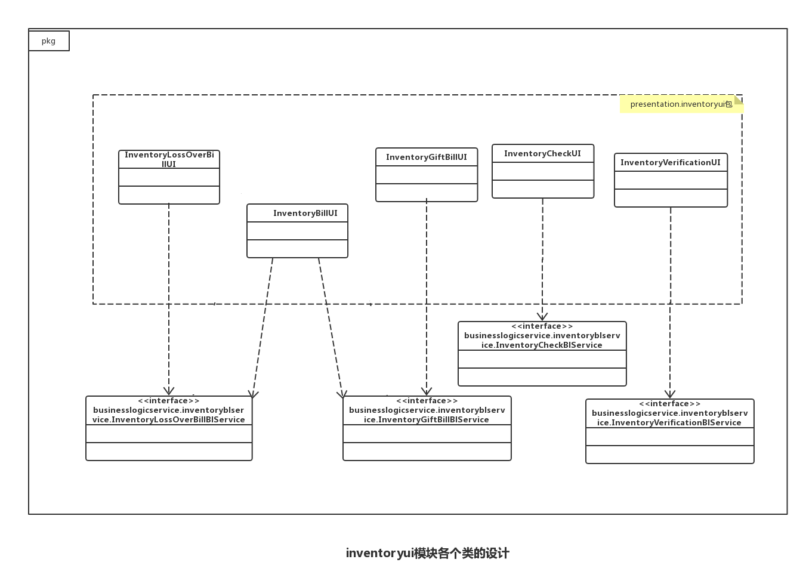
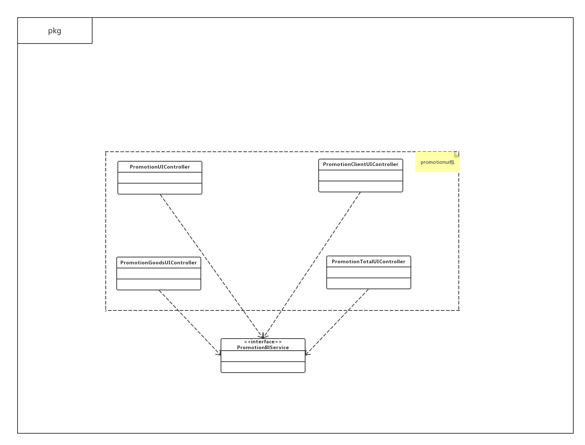
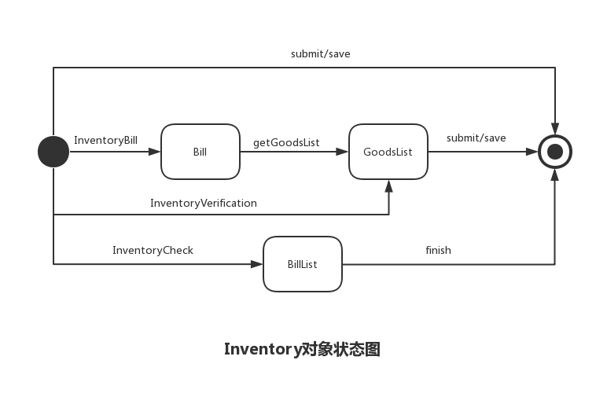
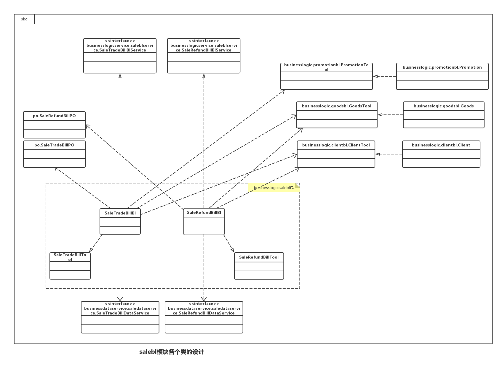
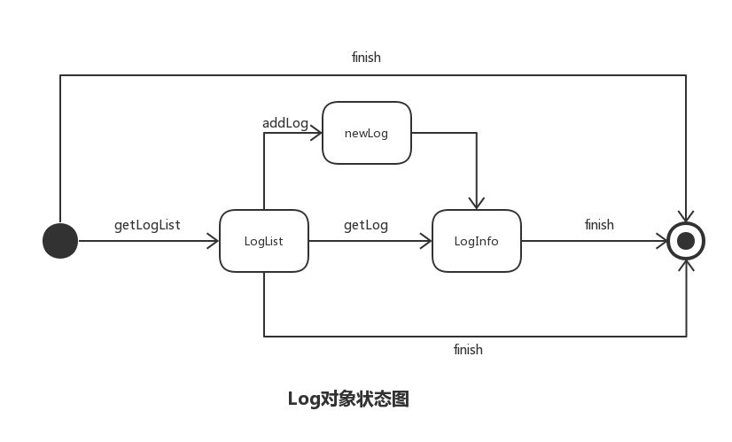

详细设计文档—— 灯具进销存管理系统  软工二小组
=========================

 
 
 

# 更新历史
| **修改人员**           | **日期**     | **变更原因** | **版本** |
| ------------------ | ---------- | -------- | ------ |
| 陈骁、陈思彤、 王宁、王颀涵 | 2017-10-29 | 最初版本     | V1.0   |

 
 
***********************************************
 
 

# 变更记录
| **修改人员**           | **日期**     | **变更原因** | **版本** | **变更内容** |
| ------------------ | ---------- | -------- | ------ | -------- |
| 陈骁、陈思彤、 王宁、王颀涵 | 2017-10-29 | 初始版本     | V1.0   | 无        |

 
 
***********************************************
 
 

# 目录
<!-- TOC -->

- [更新历史](#更新历史)
- [变更记录](#变更记录)
- [目录](#目录)
- [1.引言](#1引言)
    - [1.1 编制目的](#11-编制目的)
- [2.产品概述](#2产品概述)
- [3.体系结构设计概述](#3体系结构设计概述)
- [4.结构视角](#4结构视角)
    - [4.1 界面层的分解](#41-界面层的分解)
        - [4.1.1 goodssortui模块](#411-goodssortui模块)
            - [(1) 模块概述](#1-模块概述)
            - [(2) 整体结构](#2-整体结构)
            - [(3) 模块内部类的接口规范](#3-模块内部类的接口规范)
                - [GoodsSortUI的接口规范](#goodssortui的接口规范)
                - [GoodsSortInfoUI的接口规范](#goodssortinfoui的接口规范)
        - [4.1.2 goodsui模块](#412-goodsui模块)
            - [(1) 模块概述](#1-模块概述-1)
            - [(2) 整体结构](#2-整体结构-1)
            - [(3) 模块内部类的接口规范](#3-模块内部类的接口规范-1)
                - [GoodsUI的接口规范](#goodsui的接口规范)
                - [GoodsInfoUI的接口规范](#goodsinfoui的接口规范)
        - [4.1.3 inventoryui模块](#413-inventoryui模块)
            - [(1) 模块概述](#1-模块概述-2)
            - [(2) 整体结构](#2-整体结构-2)
            - [(3) 模块内部类的接口规范](#3-模块内部类的接口规范-2)
                - [InventoryCheckUI的接口规范](#inventorycheckui的接口规范)
                - [InventoryVerificationUI的接口规范](#inventoryverificationui的接口规范)
                - [InventoryLossOverBillUI的接口规范](#inventorylossoverbillui的接口规范)
                - [InventoryGiftBillUI的接口规范](#inventorygiftbillui的接口规范)
                - [EditInventoryBillUI的接口规范](#editinventorybillui的接口规范)
                - [AddGoodsUI的接口规范](#addgoodsui的接口规范)
        - [4.1.4 clientui模块](#414-clientui模块)
            - [(1) 模块概述](#1-模块概述-3)
            - [(2) 整体结构](#2-整体结构-3)
            - [(3) 模块内部类的接口规范](#3-模块内部类的接口规范-3)
                - [ClientInfoUI的接口规范](#clientinfoui的接口规范)
        - [4.1.5 purchaseui模块](#415-purchaseui模块)
            - [(1) 模块概述](#1-模块概述-4)
            - [(2) 整体结构](#2-整体结构-4)
            - [(3) 模块内部类的接口规范](#3-模块内部类的接口规范-4)
                - [PurchaseTradeBillUI的接口规范](#purchasetradebillui的接口规范)
                - [PurchaseRefundBillUI的接口规范](#purchaserefundbillui的接口规范)
                - [EditPurchaseBillUI的接口规范](#editpurchasebillui的接口规范)
                - [AddGoodsUI的接口规范](#addgoodsui的接口规范-1)
        - [4.1.6 saleui模块](#416-saleui模块)
            - [(1) 模块概述](#1-模块概述-5)
            - [(2) 整体结构](#2-整体结构-5)
            - [(3) 模块内部类的接口规范](#3-模块内部类的接口规范-5)
                - [SaleTradeBillUI的接口规范](#saletradebillui的接口规范)
                - [SaleRefundBillUI的接口规范](#salerefundbillui的接口规范)
                - [EditSaleBillUI的接口规范](#editsalebillui的接口规范)
                - [AddGoodsUI的接口规范](#addgoodsui的接口规范-2)
        - [4.1.7 accountui模块](#417-accountui模块)
            - [(1) 模块概述](#1-模块概述-6)
            - [(2) 整体结构](#2-整体结构-6)
            - [(3) 模块内部类的接口规范](#3-模块内部类的接口规范-6)
                - [AccountUI的接口规范](#accountui的接口规范)
                - [AccountInfoUI的接口规范](#accountinfoui的接口规范)
        - [4.1.8 financeui模块](#418-financeui模块)
            - [(1) 模块概述](#1-模块概述-7)
            - [(2) 整体结构](#2-整体结构-7)
            - [(3) 模块内部类的接口规范](#3-模块内部类的接口规范-7)
                - [ReceiptBillUI的接口规范](#receiptbillui的接口规范)
                - [PaymentBillUI的接口规范](#paymentbillui的接口规范)
                - [CashBillUI的接口规范](#cashbillui的接口规范)
                - [EditFinanceBillUI的接口规范](#editfinancebillui的接口规范)
                - [AddTransListUI的接口规范](#addtranslistui的接口规范)
                - [AddItemListUI的接口规范](#additemlistui的接口规范)
        - [4.1.9 initialui模块](#419-initialui模块)
            - [(1) 模块概述](#1-模块概述-8)
            - [(2) 整体结构](#2-整体结构-8)
            - [(3) 模块内部类的接口规范](#3-模块内部类的接口规范-8)
                - [InitialUI的接口规范](#initialui的接口规范)
                - [InitialInfoUI的接口规范](#initialinfoui的接口规范)
        - [4.1.10 logui模块](#4110-logui模块)
            - [(1) 模块概述](#1-模块概述-9)
            - [(2) 整体结构](#2-整体结构-9)
            - [(3) 模块内部类的接口规范](#3-模块内部类的接口规范-9)
                - [LogUI的接口规范](#logui的接口规范)
        - [4.1.11 reportui模块](#4111-reportui模块)
            - [(1) 模块概述](#1-模块概述-10)
            - [(2) 整体结构](#2-整体结构-10)
            - [(3) 模块内部类的接口规范](#3-模块内部类的接口规范-10)
                - [SaleDetailUI的接口规范](#saledetailui的接口规范)
                - [BusinessHistoryUI的接口规范](#businesshistoryui的接口规范)
                - [BusinessConditionUI的接口规范](#businessconditionui的接口规范)
        - [4.1.12 approvalui模块](#4112-approvalui模块)
            - [(1) 模块概述](#1-模块概述-11)
            - [(2) 整体结构](#2-整体结构-11)
            - [(3) 模块内部类的接口规范](#3-模块内部类的接口规范-11)
                - [ApprovalUI的接口规范](#approvalui的接口规范)
        - [4.1.13 promotionui模块](#4113-promotionui模块)
            - [(1) 模块概述](#1-模块概述-12)
            - [(2) 整体结构](#2-整体结构-12)
            - [(3) 模块内部类的接口规范](#3-模块内部类的接口规范-12)
                - [PromotionInfoUI的接口规范](#promotioninfoui的接口规范)
        - [4.1.14 userui模块](#4114-userui模块)
            - [(1) 模块概述](#1-模块概述-13)
            - [(2) 整体结构](#2-整体结构-13)
            - [(3) 模块内部类的接口规范](#3-模块内部类的接口规范-13)
                - [UserInfoUI的接口规范](#userinfoui的接口规范)
        - [4.1.15 loginui模块](#4115-loginui模块)
            - [(1) 模块概述](#1-模块概述-14)
            - [(2) 整体结构](#2-整体结构-14)
            - [(3) 模块内部类的接口规范](#3-模块内部类的接口规范-14)
                - [LoginUI的接口规范](#loginui的接口规范)
        - [4.1.16 messageui模块](#4116-messageui模块)
            - [(1) 模块概述](#1-模块概述-15)
            - [(2) 整体结构](#2-整体结构-15)
            - [(3) 模块内部类的接口规范](#3-模块内部类的接口规范-15)
                - [InventoryPanelUI的接口规范](#inventorypanelui的接口规范)
                - [PurchaseSalePanelUI的接口规范](#purchasesalepanelui的接口规范)
                - [FinancePanelUI的接口规范](#financepanelui的接口规范)
                - [ManagerPanelUI的接口规范](#managerpanelui的接口规范)
                - [AdministratorPanelUI的接口规范](#administratorpanelui的接口规范)
    - [4.2 业务逻辑层的分解](#42-业务逻辑层的分解)
        - [4.2.1 goodssortbl模块](#421-goodssortbl模块)
            - [(1) 模块概述](#1-模块概述-16)
            - [(2) 整体结构](#2-整体结构-16)
            - [(3) 模块内部类的接口规范](#3-模块内部类的接口规范-16)
                - [GoodsSort的接口规范](#goodssort的接口规范)
            - [(4) 业务逻辑层的动态模型](#4-业务逻辑层的动态模型)
        - [4.2.2 goodsbl模块](#422-goodsbl模块)
            - [(1) 模块概述](#1-模块概述-17)
            - [(2) 整体结构](#2-整体结构-17)
            - [(3) 模块内部类的接口规范](#3-模块内部类的接口规范-17)
                - [Goods的接口规范](#goods的接口规范)
            - [(4) 业务逻辑层的动态模型](#4-业务逻辑层的动态模型-1)
        - [4.2.3 inventorybl模块](#423-inventorybl模块)
            - [(1) 模块概述](#1-模块概述-18)
            - [(2) 整体结构](#2-整体结构-18)
            - [(3) 模块内部类的接口规范](#3-模块内部类的接口规范-18)
                - [InventoryCheck的接口规范](#inventorycheck的接口规范)
                - [InventoryVerification的接口规范](#inventoryverification的接口规范)
                - [InventoryLossOverBill的接口规范](#inventorylossoverbill的接口规范)
                - [InventoryGiftBill的接口规范](#inventorygiftbill的接口规范)
            - [(4) 业务逻辑层的动态模型](#4-业务逻辑层的动态模型-2)
        - [4.2.4 Clientbl模块](#424-clientbl模块)
            - [(1) 模块概述](#1-模块概述-19)
            - [(2) 整体结构](#2-整体结构-19)
            - [(3) 模块内部类的接口规范](#3-模块内部类的接口规范-19)
                - [ClientBl的接口规范](#clientbl的接口规范)
            - [(4) 业务逻辑层的动态模型](#4-业务逻辑层的动态模型-3)
        - [4.2.5 purchasebl模块](#425-purchasebl模块)
            - [(1) 模块概述](#1-模块概述-20)
            - [(2) 整体结构](#2-整体结构-20)
            - [(3) 模块内部类的接口规范](#3-模块内部类的接口规范-20)
                - [PurchaseTradeBillBl的接口规范](#purchasetradebillbl的接口规范)
                - [PurchaseRefundBillBl的接口规范](#purchaserefundbillbl的接口规范)
            - [(4) 业务逻辑层的动态模型](#4-业务逻辑层的动态模型-4)
        - [4.2.6 salebl模块](#426-salebl模块)
            - [(1) 模块概述](#1-模块概述-21)
            - [(2) 整体结构](#2-整体结构-21)
            - [(3) 模块内部类的接口规范](#3-模块内部类的接口规范-21)
                - [SaleTradeBillBl的接口规范](#saletradebillbl的接口规范)
                - [SaleRefundBillBl的接口规范](#salerefundbillbl的接口规范)
            - [(4) 业务逻辑层的动态模型](#4-业务逻辑层的动态模型-5)
        - [4.2.7 accountbl模块](#427-accountbl模块)
            - [(1) 模块概述](#1-模块概述-22)
            - [(2) 整体结构](#2-整体结构-22)
            - [(3) 模块内部类的接口规范](#3-模块内部类的接口规范-22)
                - [AccountBl的接口规范](#accountbl的接口规范)
            - [(4) 业务逻辑层的动态模型](#4-业务逻辑层的动态模型-6)
        - [4.2.8 financebl模块](#428-financebl模块)
            - [(1) 模块概述](#1-模块概述-23)
            - [(2) 整体结构](#2-整体结构-23)
            - [(3) 模块内部类的接口规范](#3-模块内部类的接口规范-23)
                - [PaymentBillBl的接口规范](#paymentbillbl的接口规范)
                - [ReceiptBillBl的接口规范](#receiptbillbl的接口规范)
                - [CashBillBl的接口规范](#cashbillbl的接口规范)
            - [(4) 业务逻辑层的动态模型](#4-业务逻辑层的动态模型-7)
        - [4.2.9 initialbl模块](#429-initialbl模块)
            - [(1) 模块概述](#1-模块概述-24)
            - [(2) 整体结构](#2-整体结构-24)
            - [(3) 模块内部类的接口规范](#3-模块内部类的接口规范-24)
                - [InitialBl的接口规范](#initialbl的接口规范)
            - [(4) 业务逻辑层的动态模型](#4-业务逻辑层的动态模型-8)
        - [4.2.10 logbl模块](#4210-logbl模块)
            - [(1) 模块概述](#1-模块概述-25)
            - [(2) 整体结构](#2-整体结构-25)
            - [(3) 模块内部类的接口规范](#3-模块内部类的接口规范-25)
                - [LogBl的接口规范](#logbl的接口规范)
            - [(4) 业务逻辑层的动态模型](#4-业务逻辑层的动态模型-9)
        - [4.2.11 reportbl模块](#4211-reportbl模块)
            - [(1) 模块描述](#1-模块描述)
            - [(2) 整体结构](#2-整体结构-26)
            - [(3) 模块内部类的接口规范](#3-模块内部类的接口规范-26)
                - [SaleDetailBl的接口规范](#saledetailbl的接口规范)
                - [BusinessHistoryBl的接口规范](#businesshistorybl的接口规范)
                - [BusinessConditionBl的接口规范](#businessconditionbl的接口规范)
            - [(4) 业务逻辑层的动态模型](#4-业务逻辑层的动态模型-10)
        - [4.2.12 approvalbl模块](#4212-approvalbl模块)
            - [(1) 模块描述](#1-模块描述-1)
            - [(2) 整体结构](#2-整体结构-27)
            - [(3) 模块内部类的接口规范](#3-模块内部类的接口规范-27)
            - [ApprovalBl的接口规范](#approvalbl的接口规范)
            - [(4) 业务逻辑层的动态模型](#4-业务逻辑层的动态模型-11)
        - [4.2.13 promotionbl模块](#4213-promotionbl模块)
            - [(1) 模块描述](#1-模块描述-2)
            - [(2) 整体结构](#2-整体结构-28)
            - [(3) 模块内部类的接口规范](#3-模块内部类的接口规范-28)
                - [PromotionBl的接口规范](#promotionbl的接口规范)
            - [(4) 业务逻辑层的动态模型](#4-业务逻辑层的动态模型-12)
        - [4.2.14 userbl模块](#4214-userbl模块)
            - [(1) 模块描述](#1-模块描述-3)
            - [(2) 整体结构](#2-整体结构-29)
            - [(3) 模块内部类的接口规范](#3-模块内部类的接口规范-29)
                - [UserBl的接口规范](#userbl的接口规范)
            - [(4)业务逻辑的动态模型](#4业务逻辑的动态模型)
        - [4.2.15 loginbl模块](#4215-loginbl模块)
            - [(1) 模块概述](#1-模块概述-26)
            - [(2) 整体结构](#2-整体结构-30)
            - [(3) 模块内部类的接口规范](#3-模块内部类的接口规范-30)
                - [LoginBl的接口规范](#loginbl的接口规范)
            - [(4) 业务逻辑层的动态模型](#4-业务逻辑层的动态模型-13)
        - [4.2.16 messagebl模块](#4216-messagebl模块)
            - [(1) 模块概述](#1-模块概述-27)
            - [(2) 整体结构](#2-整体结构-31)
            - [(3) 模块内部类的接口规范](#3-模块内部类的接口规范-31)
                - [MessageBl的接口规范](#messagebl的接口规范)
            - [(4) 业务逻辑层的动态模型](#4-业务逻辑层的动态模型-14)
    - [4.3 数据层的分解](#43-数据层的分解)
        - [4.3.1 goodssortdata模块](#431-goodssortdata模块)
            - [(1) 模块概述](#1-模块概述-28)
            - [(2) 整体结构](#2-整体结构-32)
            - [(3) 模块内部类的接口规范](#3-模块内部类的接口规范-32)
                - [GoodsSortData的接口规范](#goodssortdata的接口规范)
        - [4.3.1 goodsdata模块](#431-goodsdata模块)
            - [(1) 模块概述](#1-模块概述-29)
            - [(2) 整体结构](#2-整体结构-33)
            - [(3) 模块内部类的接口规范](#3-模块内部类的接口规范-33)
                - [GoodsData的接口规范](#goodsdata的接口规范)
        - [4.3.3 inventorydata模块](#433-inventorydata模块)
            - [(1) 模块概述](#1-模块概述-30)
            - [(2) 整体结构](#2-整体结构-34)
            - [(3) 模块内部类的接口规范](#3-模块内部类的接口规范-34)
                - [InventoryLossOverBillData的接口规范](#inventorylossoverbilldata的接口规范)
                - [InventoryGiftBillData的接口规范](#inventorygiftbilldata的接口规范)
        - [4.3.4 clientdata模块](#434-clientdata模块)
            - [(1) 模块概述](#1-模块概述-31)
            - [(2) 整体结构](#2-整体结构-35)
            - [(3) 模块内部类的接口规范](#3-模块内部类的接口规范-35)
                - [ClientData的接口规范](#clientdata的接口规范)
        - [4.3.5 purchasedata模块](#435-purchasedata模块)
            - [(1) 模块概述](#1-模块概述-32)
            - [(2) 整体结构](#2-整体结构-36)
            - [(3) 模块内部类的接口规范](#3-模块内部类的接口规范-36)
                - [PurchaseTradeBillData的接口规范](#purchasetradebilldata的接口规范)
                - [PurchaseRefundBillData的接口规范](#purchaserefundbilldata的接口规范)
        - [4.3.6 saledata模块](#436-saledata模块)
            - [(1) 模块概述](#1-模块概述-33)
            - [(2) 整体结构](#2-整体结构-37)
            - [(3) 模块内部类的接口规范](#3-模块内部类的接口规范-37)
                - [SaleTradeBillData的接口规范](#saletradebilldata的接口规范)
                - [SaleRefundBillData的接口规范](#salerefundbilldata的接口规范)
        - [4.3.7 accountdata模块](#437-accountdata模块)
            - [(1) 模块概述](#1-模块概述-34)
            - [(2) 整体结构](#2-整体结构-38)
            - [(3) 模块内部类的接口规范](#3-模块内部类的接口规范-38)
                - [AccountData的接口规范](#accountdata的接口规范)
        - [4.3.8 financedata模块](#438-financedata模块)
            - [(1) 模块概述](#1-模块概述-35)
            - [(2) 整体结构](#2-整体结构-39)
            - [(3) 模块内部类的接口规范](#3-模块内部类的接口规范-39)
                - [ReceiptBillData的接口规范](#receiptbilldata的接口规范)
                - [PaymentBillData的接口规范](#paymentbilldata的接口规范)
                - [CashBillData的接口规范](#cashbilldata的接口规范)
        - [4.3.9 initialdata模块](#439-initialdata模块)
            - [(1) 模块概述](#1-模块概述-36)
            - [(2) 整体结构](#2-整体结构-40)
            - [(3) 模块内部类的接口规范](#3-模块内部类的接口规范-40)
                - [InitialData的接口规范](#initialdata的接口规范)
        - [4.3.10 logdata模块](#4310-logdata模块)
            - [(1) 模块概述](#1-模块概述-37)
            - [(2) 整体结构](#2-整体结构-41)
            - [(3) 模块内部类的接口规范](#3-模块内部类的接口规范-41)
                - [LogData的接口规范](#logdata的接口规范)
        - [4.3.11 promotiondata模块](#4311-promotiondata模块)
            - [(1) 模块概述](#1-模块概述-38)
            - [(2) 整体结构](#2-整体结构-42)
            - [(3) 模块内部类的接口规范](#3-模块内部类的接口规范-42)
                - [PromotionData的接口规范](#promotiondata的接口规范)
        - [4.3.12 userdata模块](#4312-userdata模块)
            - [(1) 模块概述](#1-模块概述-39)
            - [(2) 整体结构](#2-整体结构-43)
            - [(3) 模块内部类的接口规范](#3-模块内部类的接口规范-43)
                - [UserData的接口规范](#userdata的接口规范)
        - [4.3.13 logindata模块](#4313-logindata模块)
            - [(1) 模块概述](#1-模块概述-40)
            - [(2) 整体结构](#2-整体结构-44)
            - [(3) 模块内部类的接口规范](#3-模块内部类的接口规范-44)
                - [LoginData的接口规范](#logindata的接口规范)
        - [4.3.14 messagedata模块](#4314-messagedata模块)
            - [(1) 模块概述](#1-模块概述-41)
            - [(2) 整体结构](#2-整体结构-45)
            - [(3) 模块内部类的接口规范](#3-模块内部类的接口规范-45)
                - [MessageData的接口规范](#messagedata的接口规范)
- [5.依赖视角](#5依赖视角)

<!-- /TOC -->

 
 
***********************************************
 
 

# 1.引言
## 1.1 编制目的
本报告详细完成灯具进销存管理系统的详细设计，达到指导后续软件构造的目的，同时实现和测试人员及用户的沟通。 
本报告面向开发人员、测试人员及最终用户而编写，是了解系统的导航。

 
 
***********************************************
 
 

# 2.产品概述
参考灯具进销存管理系统用例文档和灯具进销存管理系统软件规格说明中对产品的概括描述。

 
 
***********************************************
 
 

# 3.体系结构设计概述
参考灯具进销存管理系统体系结构描述文档对体系结构设计的概述

 
 
***********************************************
 
 

# 4.结构视角
## 4.1 界面层的分解
界面层的开发包图参见软件体系结构描述文档的图3

 
 
***********************************************
 
 

### 4.1.1 goodssortui模块
#### (1) 模块概述
goodssortui模块负责商品分类的管理，创建新的分类，删除商品分类，修改商品分类，查找商品分类。具体功能需求和非功能需求可参见需求规格说明文档和体系结构设计文档。

 

#### (2) 整体结构
根据体系结构的设计，我们将系统分为展示层、业务逻辑层、数据层。每一层之间为了增加灵活性，我们会添加接口。比如展示层和业务逻辑层之间，我们添加bussinesslogicservice.GoodsSortBlService接口。业务逻辑层和数据层之间添加dataservice.GoodsSortDataService接口。

goodssortui模块的设计如图

goodssortui模块各个类的职责如下表所示

| goodssortui模块的类 | 职责           |
| --------------- | ------------ |
| GoodsSortUI     | 负责实现商品分类管理界面 |
| GoodsSortInfoUI | 负责实现商品分类信息界面 |

 

#### (3) 模块内部类的接口规范
##### GoodsSortUI的接口规范
| 需要的服务（需接口）                            |          |
| ------------------------------------- | -------- |
| `GoodsSortBlService.getGoodsSortList` | 返回商品分类列表 |
| `GoodsSortBlService.addGoodsSort`     | 添加商品分类   |
| `GoodsSortBlService.editGoodsSort`    | 编辑商品分类   |
| `GoodsSortBlService.deleteGoodsSort`  | 删除商品分类   |
| `GoodsSortBlService.getGoodsSortID`   | 取得商品分类ID |

 

##### GoodsSortInfoUI的接口规范
| 需要的服务（需接口）                            |          |
| ------------------------------------- | -------- |
| `GoodsSortBlService.getGoodsSortList` | 返回商品分类列表 |

 
 
***********************************************
 
 

### 4.1.2 goodsui模块
#### (1) 模块概述
goodsui模块负责商品分类的管理，创建新的商品，删除商品，修改商品，查找商品。具体功能需求和非功能需求可参见需求规格说明文档和体系结构设计文档。

 

#### (2) 整体结构
根据体系结构的设计，我们将系统分为展示层、业务逻辑层、数据层。每一层之间为了增加灵活性，我们会添加接口。比如展示层和业务逻辑层之间，我们添加bussinesslogicservice.GoodsBlService接口。业务逻辑层和数据层之间添加dataservice.GoodsDataService接口。

goodsui模块的设计如图

goodsui模块各个类的职责如下表所示

| goodsui模块的类 | 职责         |
| ----------- | ---------- |
| GoodsUI     | 负责实现商品管理界面 |
| GoodsInfoUI | 负责实现商品信息界面 |

 

#### (3) 模块内部类的接口规范
##### GoodsUI的接口规范
| 需要的服务（需接口）                    |        |
| ----------------------------- | ------ |
| `GoodsBlService.getGoodsList` | 返回商品列表 |
| `GoodsBlService.addGoods`     | 添加商品   |
| `GoodsBlService.editGoods`    | 编辑商品   |
| `GoodsBlService.deleteGoods`  | 删除商品   |
| `GoodsBlService.getGoodsID`   | 取得商品ID |

 

##### GoodsInfoUI的接口规范
| 需要的服务（需接口）                    |        |
| ----------------------------- | ------ |
| `GoodsBlService.getGoodsList` | 返回商品列表 |

 
 
***********************************************
 
 

### 4.1.3 inventoryui模块
#### (1) 模块概述
inventoryui模块负责库存的查看、盘点，以及赠送单与溢损单的制定，修改。具体功能需求和非功能需求可参见需求规格说明文档和体系结构设计文档。

 

#### (2) 整体结构
根据体系结构的设计，我们将系统分为展示层、业务逻辑层、数据层。每一层之间为了增加灵活性，我们会添加接口。比如展示层和业务逻辑层之间，我们添加bussinesslogicservice.InventoryCheckBlService接口、bussinesslogicservice.InventoryVerificationBlService接口、bussinesslogicservice.InventoryLossOverBillBlService接口、bussinesslogicservice.InventoryGiftBillBlService接口。业务逻辑层和数据层之间添加dataservice.InventoryLossOverBillDataService接口、dataservice.InventoryGiftBillDataService接口。

inventoryui模块的设计如图

inventoryui模块各个类的职责如下表所示

| inventoryui模块的类         | 职责            |
| ----------------------- | ------------- |
| InventoryCheckUI        | 负责实现库存查看界面    |
| InventoryVerificationUI | 负责实现库存盘点界面    |
| InventoryLossOverBillUI | 负责实现制定库存溢损单界面 |
| InventoryGiftBillUI     | 负责实现制定库存赠送单界面 |
| EditInventoryBillUI     | 负责实现修改库存类单据界面 |

 

#### (3) 模块内部类的接口规范
##### InventoryCheckUI的接口规范
| 需要的服务（需接口）                               |        |
| ---------------------------------------- | ------ |
| `InventoryCheckBlService.getImportNumber` | 返回入库数量 |
| `InventoryCheckBlService.getExportNumber` | 返回出库数量 |
| `InventoryCheckBlService.getImportAmount` | 返回入库金额 |
| `InventoryCheckBlService.getExportAmount` | 返回出库金额 |
| `InventoryCheckBlService.getPurchaseNumber` | 返回进货数量 |
| `InventoryCheckBlService.getPurchaseAmount` | 返回进货金额 |
| `InventoryCheckBlService.getSaleNumber`  | 返回销售数量 |
| `InventoryCheckBlService.getSaleAmount`  | 返回销售金额 |

 

##### InventoryVerificationUI的接口规范
| 需要的服务（需接口）                               |        |
| ---------------------------------------- | ------ |
| `InventoryVerificationBlService.getGoodsList` | 返回商品列表 |

 

##### InventoryLossOverBillUI的接口规范
| 需要的服务（需接口）                               |                |
| ---------------------------------------- | -------------- |
| `InventoryLossOverBillBlService.getID`   | 返回单据ID         |
| `InventoryLossOverBillBlService.getGoodsList` | 返回商品列表         |
| `InventoryLossOverBillBlService.submit`  | 单据被提交发送给经理进行审批 |
| `InventoryLossOverBillBlService.saveDraft` | 保存单据草稿         |

 

##### InventoryGiftBillUI的接口规范
| 需要的服务（需接口）                               |                |
| ---------------------------------------- | -------------- |
| `InventoryGiftBillBlService.getID`       | 返回单据ID         |
| `InventoryGiftBillBlService.getGoodsList` | 返回商品列表         |
| `InventoryGiftBillBlService.submit`      | 单据被提交发送给经理进行审批 |
| `InventoryGiftBillBlService.saveDraft`   | 保存单据草稿         |

 

##### EditInventoryBillUI的接口规范
| 需要的服务（需接口）                               |           |
| ---------------------------------------- | --------- |
| `InventoryLossOverBillBlService.getInventoryLossOverBillList` | 取得库存溢损单列表 |
| `InventoryGiftBillBlService.getInventoryGiftBillList` | 取得库存赠送单列表 |

 

##### AddGoodsUI的接口规范
| 需要的服务（需接口）                               |        |
| ---------------------------------------- | ------ |
| `InventoryLossOverBillBlService.getGoodsList` | 返回商品列表 |
| `InventoryGiftBillBlService.getGoodsList` | 返回商品列表 |

 
 
***********************************************
 
 

### 4.1.4 clientui模块
#### (1) 模块概述
clientui模块负责客户的管理，创建新的客户，删除客户，修改客户，查找客户。具体功能需求和非功能需求可参见需求规格说明文档和体系结构设计文档。

 

#### (2) 整体结构
根据体系结构的设计，我们将系统分为展示层、业务逻辑层、数据层。每一层之间为了增加灵活性，我们会添加接口。比如展示层和业务逻辑层之间，我们添加bussinesslogicservice.ClientBlService接口。业务逻辑层和数据层之间添加dataservice.ClientDataService接口。

clientui模块的设计如图

clientui模块各个类的职责如下表所示
| clientui模块的类 | 职责         |
| ------------ | ---------- |
| ClientUI     | 负责实现客户管理界面 |
| ClientInfoUI | 负责实现客户信息界面 |

 

#### (3) 模块内部类的接口规范
##### ClientInfoUI的接口规范
| 需要的服务（需接口）                      |        |
| ------------------------------- | ------ |
| `ClientBlService.getClientList` | 返回客户列表 |
| `ClientBlService.addClient`     | 添加客户   |
| `ClientBlService.editClient`    | 编辑客户   |
| `ClientBlService.deleteClient`  | 删除客户   |
| `ClientBlService.getClientID`   | 取得客户ID |

 
 
***********************************************
 
 

### 4.1.5 purchaseui模块
#### (1) 模块概述
purchaseui模块负责进货单和进货退货单的制定、修改。具体功能需求和非功能需求可参见需求规格说明文档和体系结构设计文档。

 

#### (2) 整体结构
根据体系结构的设计，我们将系统分为展示层、业务逻辑层、数据层。每一层之间为了增加灵活性，我们会添加接口。比如展示层和业务逻辑层之间，我们添加bussinesslogicservice.PurchaseTradeBillBlService接口。业务逻辑层和数据层之间添加dataservice.PurchaseTradeBillDataService接口。

purchaseui模块的设计如图

purchaseui模块各个类的职责如下表所示
| purchaseui模块的类       | 职责         |
| -------------------- | ---------- |
| PurchaseTradeBillUI  | 负责实现客户管理界面 |
| PurchaseRefunsBillUI | 负责实现客户信息界面 |
| EditPurchaseBillUI   | 修改进货类单据界面  |
| AddGoodsUI           | 添加商品界面     |

 

#### (3) 模块内部类的接口规范
##### PurchaseTradeBillUI的接口规范
| 需要的服务（需接口）                               |                |
| ---------------------------------------- | -------------- |
| `PurchaseTradeBillBlService.getID`       | 返回单据ID         |
| `PurchaseTradeBillBlService.getSupplierList` | 返回客户列表         |
| `PurchaseTradeBillService.getGoodsList`  | 返回商品列表         |
| `PurchaseTradeBillBlService.submit`      | 单据被提交发送给经理进行审批 |
| `PurchaseTradeBillBlService.saveDraft`   | 保存单据草稿         |

 

##### PurchaseRefundBillUI的接口规范
| 需要的服务（需接口）                               |                |
| ---------------------------------------- | -------------- |
| `PurchaseRefundBillBlService.getID`      | 返回单据ID         |
| `PurchaseRefundBillBlService.getSupplierList` | 返回客户列表         |
| `PurchaseRefundBillService.getGoodsList` | 返回商品列表         |
| `PurchaseRefundBillBlService.submit`     | 单据被提交发送给经理进行审批 |
| `PurchaseRefundBillBlService.saveDraft`  | 保存单据草稿         |

 

##### EditPurchaseBillUI的接口规范
| 需要的服务（需接口）                               |           |
| ---------------------------------------- | --------- |
| `PurchaseTradeBillBlService.getPurchaseTradeBillList` | 取得进货单列表   |
| `PurchaseRefundBillBlService.getPurchaseRefundBillList` | 取得进货退货单列表 |

 

##### AddGoodsUI的接口规范
| 需要的服务（需接口）                               |        |
| ---------------------------------------- | ------ |
| `PurchaseTradeBillService.getGoodsList`  | 返回商品列表 |
| `PurchaseRefundBillService.getGoodsList` | 返回商品列表 |

 
 
***********************************************
 
 

### 4.1.6 saleui模块
#### (1) 模块概述
saleui模块负责进货单和进货退货单的制定、修改。具体功能需求和非功能需求可参见需求规格说明文档和体系结构设计文档。

 

#### (2) 整体结构
根据体系结构的设计，我们将系统分为展示层、业务逻辑层、数据层。每一层之间为了增加灵活性，我们会添加接口。比如展示层和业务逻辑层之间，我们添加bussinesslogicservice.SaleTradeBillBlService接口。业务逻辑层和数据层之间添加dataservice.SaleTradeBillDataService接口。

saleui模块的设计如图

saleui模块各个类的职责如下表所示
| saleui模块的类       | 职责         |
| ---------------- | ---------- |
| SaleTradeBillUI  | 负责实现客户管理界面 |
| SaleRefundBillUI | 负责实现客户信息界面 |
| EditSaleBillUI   | 修改销售类单据界面  |
| AddGoodsUI       | 添加商品界面     |

 

#### (3) 模块内部类的接口规范
##### SaleTradeBillUI的接口规范
| 需要的服务（需接口）                               |                |
| ---------------------------------------- | -------------- |
| `SaleTradeBillBlService.getID`           | 返回单据ID         |
| `SaleTradeBillBlService.getSalesmanList` | 返回业务员列表        |
| `SaleTradeBillBlService.getSellerList`   | 返回客户列表         |
| `SaleTradeBillService.getPromotionList`  | 返回促销策略列表       |
| `SaleTradeBillBlService.submit`          | 单据被提交发送给经理进行审批 |
| `SaleTradeBillBlService.saveDraft`       | 保存单据草稿         |

 

##### SaleRefundBillUI的接口规范
| 需要的服务（需接口）                               |                |
| ---------------------------------------- | -------------- |
| `SaleRefundBillBlService.getID`          | 返回单据ID         |
| `SaleRefundBillBlService.getSalesmanList` | 返回业务员列表        |
| `SaleRefundBillBlService.getSellerList`  | 返回客户列表         |
| `SaleRefundBillBlService.submit`         | 单据被提交发送给经理进行审批 |
| `SaleRefundBillBlService.saveDraft`      | 保存单据草稿         |

 

##### EditSaleBillUI的接口规范
| 需要的服务（需接口）                               |           |
| ---------------------------------------- | --------- |
| `SaleTradeBillBlService.getSaleTradeBillList` | 取得进货单列表   |
| `SaleRefundBillBlService.getSaleRefundBillList` | 取得进货退货单列表 |

 

##### AddGoodsUI的接口规范
| 需要的服务（需接口）                           |        |
| ------------------------------------ | ------ |
| `SaleTradeBillService.getGoodsList`  | 返回商品列表 |
| `SaleRefundBillService.getGoodsList` | 返回商品列表 |

 
 
***********************************************
 
 

### 4.1.7 accountui模块
#### (1) 模块概述
accountui模块负责公司银行账户的管理，创建新的帐户，删除帐户，修改账户属性（只限名称），查找显示账户名称和属性(包括名称和余额)。具体功能需求和非功能需求可参见需求规格说明文档和体系结构设计文档。

 

#### (2) 整体结构
根据体系结构的设计，我们将系统分为展示层、业务逻辑层、数据层。每一层之间为了增加灵活性，我们会添加接口。比如展示层和业务逻辑层之间，我们添加bussinesslogicservice.AccountBlService接口。业务逻辑层和数据层之间添加dataservice.AccountDataService接口。

accountui模块的设计如图

accountui模块各个类的职责如下表所示

| accountui模块的类 | 职责              |
| ------------- | --------------- |
| AccountUI     | 负责实现帐户管理界面      |
| AccountInfoUI | 负责实现帐户信息查看和编辑界面 |

 

#### (3) 模块内部类的接口规范
##### AccountUI的接口规范
| 需要的服务（需接口）                        |               |
| --------------------------------- | ------------- |
| `AccountBlService.getAccountList` | 返回账户列表        |
| `AccountBlService.getID`          | 返回账户ID        |
| `AccountBlService.addAccount`     | 添加一个账户，更新账户列表 |
| `AccountBlService.deleteAccount`  | 删除一个账户，更新账户列表 |

 

##### AccountInfoUI的接口规范
| 需要的服务（需接口）                       |               |
| -------------------------------- | ------------- |
| `AccountBlService.getID`         | 返回账户ID        |
| `AccountBlService.editAccount`   | 编辑一个账户，更新账户列表 |
| `AccountBlService.deleteAccount` | 删除一个账户，更新账户列表 |

 
 
***********************************************
 
 

### 4.1.8 financeui模块
#### (1) 模块概述
financeui模块负责收款单、付款单和现金费用单的制定、修改。具体功能需求和非功能需求可参见需求规格说明文档和体系结构设计文档。

 

#### (2) 整体结构
根据体系结构的设计，我们将系统分为展示层、业务逻辑层、数据层。每一层之间为了增加灵活性，我们会添加接口。比如展示层和业务逻辑层之间，我们添加bussinesslogicservice.ReceiptBillBlService、bussinesslogicservice.PaymentBillBlService、bussinesslogicservice.CashBillBlService接口。业务逻辑层和数据层之间添加dataservice.ReceiptBillDataService、dataservice.PaymentBillDataService、dataservice.CashBillDataService接口。

financeui模块的设计如图

financeui模块各个类的职责如下表所示

| financeui模块的类     | 职责            |
| ----------------- | ------------- |
| ReceiptBillUI     | 负责实现收款单制定界面   |
| PaymentBillUI     | 负责实现付款单制定界面   |
| CashBillUI        | 负责实现现金费用单制定界面 |
| EditFinanceBillUI | 修改财务类单据界面     |
| AddTransListUI    | 添加转账列表界面      |
| AddItemListUI     | 添加条目清单界面      |

 

#### (3) 模块内部类的接口规范
##### ReceiptBillUI的接口规范
| 需要的服务（需接口）                            |                        |
| ------------------------------------- | ---------------------- |
| `ReceiptBillBlService.getID`          | 返回新的收款单单据编号            |
| `ReceiptBillBlService.getClientList`  | 返回客户列表                 |
| `ReceiptBillBlService.getAccountList` | 返回账户列表                 |
| `ReceiptBillBlService.submit`         | 更新并提交收款单，持久化更新涉及的对象的数据 |
| `ReceiptBillBlService.saveDraft`      | 保存单据草稿                 |

 

##### PaymentBillUI的接口规范
| 需要的服务（需接口）                            |                        |
| ------------------------------------- | ---------------------- |
| `PaymentBillBlService.getID`          | 返回新的付款单单据编号            |
| `PaymentBillBlService.getClientList`  | 返回客户列表                 |
| `PaymentBillBlService.getAccountList` | 返回账户列表                 |
| `PaymentBillBlService.submit`         | 更新并提交付款单，持久化更新涉及的对象的数据 |
| `PaymentBillBlService.saveDraft`      | 保存单据草稿                 |

 

##### CashBillUI的接口规范
| 需要的服务（需接口）                         |                          |
| ---------------------------------- | ------------------------ |
| `CashBillBlService.getID`          | 返回新的现金费用单单据编号            |
| `CashBillBlService.getGoodsList`   | 返回商品列表                   |
| `CashBillBlService.getAccountList` | 返回账户列表                   |
| `CashBillBlService.submit`         | 更新并提交现金费用单，持久化更新涉及的对象的数据 |
| `CashBillBlService.saveDraft`      | 保存单据草稿                   |

 

##### EditFinanceBillUI的接口规范
| 需要的服务（需接口）                               |           |
| ---------------------------------------- | --------- |
| `CashBillBlService.getCashBillList`      | 取得现金费用单列表 |
| `ReceiptBillBlService.getReceiptBillList` | 取得收款单列表   |
| `PaymentBillBlService.getPaymentBillList` | 取得付款单列表   |

 

##### AddTransListUI的接口规范
| 需要的服务（需接口）                           |        |
| ------------------------------------ | ------ |
| `ReceiptBillBlService.getClientList` | 返回客户列表 |
| `PayemntBillBlService.getClientList` | 返回客户列表 |

 

##### AddItemListUI的接口规范
| 需要的服务（需接口）                       |        |
| -------------------------------- | ------ |
| `CashBillBlService.getGoodsList` | 返回商品列表 |

 
 
***********************************************
 
 

### 4.1.9 initialui模块
#### (1) 模块概述
initialui模块负责期初信息的查看和期初建账。具体功能需求和非功能需求可参见需求规格说明文档和体系结构设计文档。

 

#### (2) 整体结构
根据体系结构的设计，我们将系统分为展示层、业务逻辑层、数据层。每一层之间为了增加灵活性，我们会添加接口。比如展示层和业务逻辑层之间，我们添加bussinesslogicservice.InitialBlService接口。业务逻辑层和数据层之间添加dataservice.InitialDataService接口。

initialui模块的设计如图

initialui模块各个类的职责如下表所示

| initialui模块的类 | 职责           |
| ------------- | ------------ |
| InitialUI     | 负责实现期初建账界面   |
| InitialInfoUI | 负责实现期初信息查看界面 |

 

#### (3) 模块内部类的接口规范
##### InitialUI的接口规范
| 需要的服务（需接口）                        |                      |
| --------------------------------- | -------------------- |
| `InitialBlService.getGoodsList`   | 返回上一年的持久化商品对象列表      |
| `InitialBlService.getClientList`  | 返回上一年的持久化客户对象列表      |
| `InitialBlService.getAccountList` | 返回上一年的持久化账户对象列表      |
| `InitialBlService.addInitial`     | 保存期初信息，持久化更新涉及的对象的数据 |

 

##### InitialInfoUI的接口规范
| 需要的服务（需接口）                        |          |
| --------------------------------- | -------- |
| `Initial.getYear`                 | 返回期初信息   |
| `InitialBlService.getInitialList` | 返回期初信息列表 |

 
 
***********************************************
 
 

### 4.1.10 logui模块
#### (1) 模块概述
logui模块负责实现操作日志的查看界面。具体功能需求和非功能需求可参见需求规格说明文档和体系结构设计文档。

 

#### (2) 整体结构
根据体系结构的设计，我们将系统分为展示层、业务逻辑层、数据层。每一层之间为了增加灵活性，我们会添加接口。比如展示层和业务逻辑层之间，我们添加bussinesslogicservice.LogBlService接口。业务逻辑层和数据层之间添加dataservice.LogDataService接口。

logui模块的设计如图

logui模块各个类的职责如下表所示

| logui模块的类 | 职责       |
| --------- | -------- |
| LogUI     | 操作日志查看界面 |

 

#### (3) 模块内部类的接口规范
##### LogUI的接口规范
| 需要的服务（需接口）                |          |
| ------------------------- | -------- |
| `LogBlService.getLogList` | 获取操作日志列表 |

 
 
***********************************************
 
 

### 4.1.11 reportui模块
#### (1) 模块概述
reportui模块负责报表查看。具体功能需求和非功能需求可参见需求规格说明文档和体系结构设计文档。

 

#### (2) 整体结构
根据体系结构的设计，我们将系统分为展示层、业务逻辑层。层之间为了增加灵活性，添加了接口。展示层和业务逻辑层之间添加了SaleDetailBlService、BusinessHistoryBlService以及BusinessConditionBlService接口。

reportui模块的设计如图

reportui模块各个类的职责如下表所示

| reportui模块的类        | 职责          |
| ------------------- | ----------- |
| SaleDetailUI        | 负责实现查看销售明细表 |
| BusinessHistoryUI   | 负责实现查看经营历程表 |
| BusinessConditionUI | 负责实现查看经营情况表 |

 

#### (3) 模块内部类的接口规范
##### SaleDetailUI的接口规范
| 需要的服务（需接口）                              |             |
| --------------------------------------- | ----------- |
| 服务名                                     | 服务          |
| `SaLeDetailBlService.getSaleRecordList` | 返回符合条件的销售记录 |

 

##### BusinessHistoryUI的接口规范
| 需要的服务（需接口）                             |             |
| -------------------------------------- | ----------- |
| 服务名                                    | 服务          |
| `BusinessHistoryBlService.getBillList` | 返回符合条件的所有单据 |

 

##### BusinessConditionUI的接口规范
| 需要的服务（需接口）                               |             |
| ---------------------------------------- | ----------- |
| 服务名                                      | 服务          |
| `BusinessConditionBlService.getCondition` | 返回符合条件的经营情况 |

 
 
*******************************
 
 

### 4.1.12 approvalui模块
#### (1) 模块概述
approvalui模块负责单据审批。具体功能需求和非功能需求可参见需求规格说明文档和体系结构设计文档。

 

#### (2) 整体结构
根据体系结构的设计，我们将系统分为展示层、业务逻辑层。层之间为了增加灵活性，添加了接口。展示层和业务逻辑层之间添加了ApprovalBlService接口。

approvalui模块的设计如图

approvalui模块各个类的职责如下表所示

| approvalui模块的类 | 职责       |
| -------------- | -------- |
| ApprovalUI     | 负责实现审批单据 |

 

#### (3) 模块内部类的接口规范
##### ApprovalUI的接口规范
| 需要的服务（需接口）                      |              |
| ------------------------------- | ------------ |
| 服务名                             | 服务           |
| `ApprovalBlService.getBillList` | 系统显示该类型的提交单据 |
| `ApprovalBlService.pass`        | 系统修改单据的数据及状态 |
| `ApprovalBlService.reject`      | 系统修改单据的状态    |

 
 
*******************************
 
 

### 4.1.13 promotionui模块
#### (1) 模块概述
promotionui模块负责促销策略管理。具体功能需求和非功能需求可参见需求规格说明文档和体系结构设计文档。

 

#### (2) 整体结构
根据体系结构的设计，我们将系统分为展示层、业务逻辑层。层之间为了增加灵活性，添加了接口。展示层和业务逻辑层之间添加了PromotionBlService和PromotionTool接口；业务层和数据层之间添加了PromotionDataBlservice。

promotionui模块的设计如图

promotionui模块各个类的职责如下表所示

| promotionui模块的类 | 职责             |
| --------------- | -------------- |
| PromotionUI     | 负责实现促销策略管理     |
| PromotionInfoUI | 负责实现促销策略具体信息操作 |

 

#### (3) 模块内部类的接口规范
##### PromotionInfoUI的接口规范
| 需要的服务（需接口）                            |             |
| ------------------------------------- | ----------- |
| 服务名                                   | 服务          |
| `PromotionBlService.getPromotionList` | 显示符合条件的促销策略 |
| `Promotion.addPromotion `             | 系统新增促销策略    |
| `Promotion.editPromotion`             | 系统修改促销策略    |
| `Promotion.deletePromotion`           | 系统删除促销策略    |
| `Promotion.getID`                     | 返回新促销策略的编号  |

 
 
************************
 
 

### 4.1.14 userui模块
#### (1) 模块概述
userui模块负责帐号管理。具体功能需求和非功能需求可参见需求规格说明文档和体系结构设计文档。

 

#### (2) 整体结构
根据体系结构的设计，我们将系统分为展示层、业务逻辑层。层之间为了增加灵活性，添加了接口。展示层和业务逻辑层之间添加了UserBlService和UserTool接口；业务层和数据层之间添加了UserDataBlservice。

userui模块的设计如图

userui模块各个类的职责如下表所示

| userui模块的类 | 职责             |
| --------------- | -------------- |
| UserUI     | 负责实现帐号管理     |
| UserInfoUI | 负责实现帐号具体信息操作 |

 

#### (3) 模块内部类的接口规范
##### UserInfoUI的接口规范
| 需要的服务（需接口）                            |             |
| ------------------------------------- | ----------- |
| 服务名                                   | 服务          |
| `UserBlService.getUserList` | 显示符合条件的帐号 |
| `UserBlService.addUser `             | 系统新增帐号    |
| `UserBlService.editUser`             | 系统修改帐号    |
| `UserBlService.deleteUser`           | 系统删除帐号    |
| `UserBlService.getID`                     | 返回新帐号的编号  |

 
 
************************
 
 

### 4.1.15 loginui模块
#### (1) 模块概述
loginui模块负责实现登陆界面。具体功能需求和非功能需求可参见需求规格说明文档和体系结构设计文档。

 

#### (2) 整体结构
根据体系结构的设计，我们将系统分为展示层、业务逻辑层、数据层。每一层之间为了增加灵活性，我们会添加接口。比如展示层和业务逻辑层之间，我们添加bussinesslogicservice.LoginBlService接口。业务逻辑层和数据层之间添加dataservice.LoginDataService接口。

loginui模块的设计如图

loginui模块各个类的职责如下表所示
| loginui模块的类 | 职责   |
| ----------- | ---- |
| LoginUI     | 登陆界面 |
 

#### (3) 模块内部类的接口规范
##### LoginUI的接口规范
| 需要的服务（需接口）             |        |
| ---------------------- | ------ |
| `LoginBlService.login` | 进行登陆操作 |

 
 
***********************************************
 
 

### 4.1.16 messageui模块
#### (1) 模块概述
messageui模块负责取得系统信息。具体功能需求和非功能需求可参见需求规格说明文档和体系结构设计文档。

 

#### (2) 整体结构
根据体系结构的设计，我们将系统分为展示层、业务逻辑层、数据层。每一层之间为了增加灵活性，我们会添加接口。比如展示层和业务逻辑层之间，我们添加bussinesslogicservice.MessageBlService接口。业务逻辑层和数据层之间添加dataservice.MessageDataService接口。MessagePO是作为系统信息的持久化对象被添加到设计模型中去的。

messagebl模块的设计如图

messageui模块各个类的职责如下表所示：

| messageui模块的类        | 职责        |
| -------------------- | --------- |
| InventoryPanelUI     | 库存管理人员主界面 |
| PurchaseSalePanelUI  | 进货销售人员主界面 |
| FinancePenelUI       | 财务人员主界面   |
| ManagerPanelUI       | 总经理主界面    |
| AdministratorPanelUI | 管理员主界面    |

 

#### (3) 模块内部类的接口规范
##### InventoryPanelUI的接口规范
| 需要的服务（需接口）                        |              |      |
| --------------------------------- | ------------ | ---- |
| `MessageBlService.getMessageList` | 根据接收者，返回系统信息 |      |

 

##### PurchaseSalePanelUI的接口规范
| 需要的服务（需接口）                        |              |      |
| --------------------------------- | ------------ | ---- |
| `MessageBlService.getMessageList` | 根据接收者，返回系统信息 |      |

 

##### FinancePanelUI的接口规范
| 需要的服务（需接口）                        |              |      |
| --------------------------------- | ------------ | ---- |
| `MessageBlService.getMessageList` | 根据接收者，返回系统信息 |      |

 

##### ManagerPanelUI的接口规范
| 需要的服务（需接口）                        |              |      |
| --------------------------------- | ------------ | ---- |
| `MessageBlService.getMessageList` | 根据接收者，返回系统信息 |      |

 

##### AdministratorPanelUI的接口规范
| 需要的服务（需接口）                        |              |      |
| --------------------------------- | ------------ | ---- |
| `MessageBlService.getMessageList` | 根据接收者，返回系统信息 |      |

 
 
***********************************************
 
 

## 4.2 业务逻辑层的分解
业务逻辑层的开发包图参见软件体系结构描述文档的图3

 
 
***********************************************
 
 

### 4.2.1 goodssortbl模块
#### (1) 模块概述
goodssortbl模块负责商品分类的管理，增加商品分类，删除商品分类，修改商品分类，查询商品分类。具体功能需求和非功能需求可参见需求规格说明文档和体系结构设计文档。

 

#### (2) 整体结构
根据体系结构的设计，我们将系统分为展示层、业务逻辑层、数据层。每一层之间为了增加灵活性，我们会添加接口。比如展示层和业务逻辑层之间，我们添加bussinesslogicservice.GoodsSortBLlervice接口。业务逻辑层和数据层之间添加dataservice. GoodsSortDataService接口。GoodsSortPO是作为商品分类的持久化对象被添加到设计模型中去的。

goodssortbl模块的设计如图

goodssortbl模块各个类的职责如下表所示

| goodssortbl模块的类 | 职责                   |
| --------------- | -------------------- |
| GoodsSort       | 负责实现商品分类管理管理界面所需要的服务 |

 

#### (3) 模块内部类的接口规范
##### GoodsSort的接口规范
| 提供的服务（供接口）                               |      |                                          |
| ---------------------------------------- | ---- | ---------------------------------------- |
| `GoodsSortBlService/GoodsSortTool.getGoodsSortList` | 语法   | `public ArrayList<GoodsSortVO> getGoodsSortList(GoodsSortQueryVO query)` |
|                                          | 前置条件 | 正在进行商品分类管理                               |
|                                          | 后置条件 | 根据输入信息返回相应的商品分类                          |
| `GoodsSortBlService.addGoodsSort`        | 语法   | `public ResultMessage addGoodsSort(GoodsSortVO goodsSort)` |
|                                          | 前置条件 | 正在进行商品分类管理                               |
|                                          | 后置条件 | 添加一个商品分类，更新商品分类列表                        |
| `GoodsSortBlService.deleteGoodsSort`     | 语法   | `public ResultMessage deleteGoodsSort(GoodsSortVO goodsSort)` |
|                                          | 前置条件 | 正在进行商品分类管理                               |
|                                          | 后置条件 | 删除一个商品分类，更新商品分类列表                        |
| `GoodsSortBlService.editGoodsSort`       | 语法   | `public ResultMessage editGoodsSort(GoodsSortVO goodsSort)` |
|                                          | 前置条件 | 正在进行商品分类管理                               |
|                                          | 后置条件 | 编辑一个商品分类，更新商品分类列表                        |
| `GoodsSortBlService.getID`               | 语法   | `public String getID()`                  |
|                                          | 前置条件 | 商品分类已添加                                  |
|                                          | 后置条件 | 返回新商品分类ID                                |

| 需要的服务（需接口）                               |            |
| ---------------------------------------- | ---------- |
| 服务名                                      | 服务         |
| `GoodsSortDataService.find(GoodsSortQueryPO query)` | 取得持久化对象的列表 |
| `GoodsSortDataService.insert(GoodsSortPO po)` | 添加商品分类     |
| `GoodsSortDataService.delete(GoodsSortPO po)` | 删除商品分类     |
| `GoodsSortDataService.update(GoodsSortPO po)` | 修改单一持久化对象  |
| `GoodsSortDataService.getGoodsSortID()`  | 得到新的商品分类ID |
| `GoodsTool.getGoodsList(GoodsQueryVO query)` | 取得商品列表     |
| `LogTool.addLog(LogVO log)`              | 记录日志       |

 

#### (4) 业务逻辑层的动态模型
如图表明了进销存管理系统中，当库存管理人员想要添加一个商品分类的时候，商品分类管理业务逻辑处理的相关对象之间的协作。

如图表明了进销存管理系统中，当库存管理人员想要删除一个商品分类的时候，商品分类管理业务逻辑处理的相关对象之间的协作。

如图所示的状态图描述了GoodsSort对象的生存期间的状态序列、引起转移的事件，以及因状态转移而伴随的动作。

 
 
***********************************************
 
 

### 4.2.2 goodsbl模块
#### (1) 模块概述
goodsbl模块负责商品的管理，增加商品，删除商品，修改商品，查询商品。具体功能需求和非功能需求可参见需求规格说明文档和体系结构设计文档。

 

#### (2) 整体结构
根据体系结构的设计，我们将系统分为展示层、业务逻辑层、数据层。每一层之间为了增加灵活性，我们会添加接口。此包实现了goodsblservice的所有接口，并依赖goodsdataservice来获取data层的数据。GoodsPO是作为商品分类的持久化对象被添加到设计模型中去的。

goodsbl模块的设计如图

goodsbl模块各个类的职责如下表所示

| goodsbl模块的类 | 职责                 |
| ----------- | ------------------ |
| Goods       | 负责实现商品管理管理界面所需要的服务 |

 

#### (3) 模块内部类的接口规范
##### Goods的接口规范
| 提供的服务（供接口）                              |      |                                          |
| --------------------------------------- | ---- | ---------------------------------------- |
| `GoodsBlService/GoodsTool.getGoodsList` | 语法   | `public ArrayList<GoodsVO> getGoodsList(GoodsQueryVO query)` |
|                                         | 前置条件 | 正在进行商品管理                                 |
|                                         | 后置条件 | 返回商品列表                                   |
| `GoodsBlService.addGoods`               | 语法   | `public ResultMessage addGoods(GoodsVO goods)` |
|                                         | 前置条件 | 正在进行商品管理                                 |
|                                         | 后置条件 | 添加一个商品，更新商品列表                            |
| `GoodsBlService/GoodsTool.editGoods`    | 语法   | `public ResultMessage editGoods(GoodsVO goods)` |
|                                         | 前置条件 | 正在进行商品管理                                 |
|                                         | 后置条件 | 编辑一个商品，更新商品列表                            |
| `GoodsBlService.deleteGoods`            | 语法   | `public ResultMessage deleteGoods(GoodsVO goods)` |
|                                         | 前置条件 | 正在进行商品管理                                 |
|                                         | 后置条件 | 删除一个商品，更新商品列表                            |
| `GoodsBlService.getGoodsID`             | 语法   | `public String getGoodsID()`             |
|                                         | 前置条件 | 新建商品时                                    |
|                                         | 后置条件 | 返回一个新的商品ID                               |

| 需要的服务（需接口）                               |               |
| ---------------------------------------- | ------------- |
| 服务名                                      | 服务            |
| `GoodsDataService.find(GoodsQueryPO query)` | 根据筛选条件d进行查找商品 |
| `GoodsDataService.insert(GoodsPO po)`    | 添加商品          |
| `GoodsDataService.delete(GoodsPO po)`    | 删除商品          |
| `GoodsDataService.update(GoodsPO po)`    | 更改商品信息        |
| `GoodsDataService.getGoodsID()`          | 得到新的商品ID      |
| `LogTool.addLog(LogVO log)`              | 记录日志          |

 

#### (4) 业务逻辑层的动态模型
如图表明了进销存管理系统中，当库存管理人员想要添加一个商品的时候，商品管理业务逻辑处理的相关对象之间的协作。

如图表明了进销存管理系统中，当库存管理人员想要删除一个商品的时候，商品管理业务逻辑处理的相关对象之间的协作。

如图所示的状态图描述了Goods对象的生存期间的状态序列、引起转移的事件，以及因状态转移而伴随的动作。

 
 
***********************************************
 
 

### 4.2.3 inventorybl模块
#### (1) 模块概述
inventorybl模块负责库存的管理，库存查看，库存盘点，建立库存溢损单。具体功能需求和非功能需求可参见需求规格说明文档和体系结构设计文档。

 

#### (2) 整体结构
根据体系结构的设计，我们将系统分为展示层、业务逻辑层、数据层。每一层之间为了增加灵活性，我们会添加接口。InventoryPO，InventoryLossOverBillPO是作为库存的持久化对象被添加到设计模型中去的。

inventorybl模块的设计如图

inventorybl模块各个类的职责如下表所示

| inventorybl模块的类       | 职责                  |
| --------------------- | ------------------- |
| InventoryCheck        | 负责实现库存查看界面所需要的服务    |
| InventoryVerification | 负责实现库存盘点界面所需要的服务    |
| InventoryLossOverBill | 负责实现建立库存溢损单界面所需要的服务 |
| InventoryGiftBill     | 负责实现建立库存赠送单界面所需要的服务 |

 

#### (3) 模块内部类的接口规范
##### InventoryCheck的接口规范
| 提供的服务（供接口）                               |      |                                          |
| ---------------------------------------- | ---- | ---------------------------------------- |
| `InventoryCheckBlService.getImportNumber` | 语法   | `public int getImportNumber(Date start,Date end)` |
|                                          | 前置条件 | 正在进行库存查看，日期输入正确                          |
|                                          | 后置条件 | 返回对应的在此时间段内的入库商品数                        |
| `InventoryCheckBlService.getExportNumber` | 语法   | `public int getExportNumber(Date start,Date end)` |
|                                          | 前置条件 | 正在进行库存查看，日期输入正确                          |
|                                          | 后置条件 | 返回对应的在此时间段内的出库商品数                        |
| `InventoryCheckBlService.getImportAmount` | 语法   | `public double getImportAmount(Date start,Date end)` |
|                                          | 前置条件 | 正在进行库存查看，日期输入正确                          |
|                                          | 后置条件 | 返回对应的在此时间段内的入库商品金额                       |
| `InventoryCheckBlService.getExportAmount` | 语法   | `public double getExportAmount(Date start,Date end)` |
|                                          | 前置条件 | 正在进行库存查看，日期输入正确                          |
|                                          | 后置条件 | 返回对应的在此时间段内的出库商品金额                       |
| `InventoryCheckBlService.getPurchaseNumber` | 语法   | `public int getPurchaseNumber(Date start,Date end)` |
|                                          | 前置条件 | 正在进行库存查看，日期输入正确                          |
|                                          | 后置条件 | 返回对应的在此时间段内的进货商品数                        |
| `InventoryCheckBlService.getPurchaseAmount` | 语法   | `public int getPurchaseAmount(Date start,Date end)` |
|                                          | 前置条件 | 正在进行库存查看，日期输入正确                          |
|                                          | 后置条件 | 返回对应的在此时间段内的进货商金额                        |
| `InventoryCheckBlService.getSaleNumber`  | 语法   | `public double getSaleNumber(Date start,Date end)` |
|                                          | 前置条件 | 正在进行库存查看，日期输入正确                          |
|                                          | 后置条件 | 返回对应的在此时间段内的销售商品数                        |
| `InventoryCheckBlService.getSaleAmount`  | 语法   | `public double getSaleAmount(Date start,Date end)` |
|                                          | 前置条件 | 正在进行库存查看，日期输入正确                          |
|                                          | 后置条件 | 返回对应的在此时间段内的销售商金额                        |

| 需要的服务（需接口）                               |           |
| ---------------------------------------- | --------- |
| 服务名                                      | 服务        |
| `PurchaseTradeBillTool.getPurchaseTradeBillList(BillQueryVO query)` | 取得进货单列表   |
| `PurchaseRefundBillTool.getPurchaseRefundBillList(BillQueryVO query)` | 取得进货退货单列表 |
| `SaleTradeBillTool.getSaleTradeBillList(BillQueryVO query)` | 取得销售单列表   |
| `SaleRefundBillTool.getSaleRefundBillList(BillQueryVO query)` | 取得进货单列表   |
 

##### InventoryVerification的接口规范
| 提供的服务（供接口）                           |      |                                          |
| ------------------------------------ | ---- | ---------------------------------------- |
| `InventoryVerification.getGoodsList` | 语法   | `public ArrayList<GoodsVO> getGoodsList(GoodsQueryVO query)` |
|                                      | 前置条件 | 无                                        |
|                                      | 后置条件 | 得到库存数据                                   |

| 需要的服务（需接口）                               |        |
| ---------------------------------------- | ------ |
| 服务名                                      | 服务     |
| `GoodsTool.getGoodsList(GoodsQueryVO query)` | 取得商品列表 |

 

##### InventoryLossOverBill的接口规范
| 提供的服务（供接口）                               |      |                                          |
| ---------------------------------------- | ---- | ---------------------------------------- |
| `InventoryLossOverBillBlService.getID`   | 语法   | `public String getID()`                  |
|                                          | 前置条件 | 得到库存单据数据                                 |
|                                          | 后置条件 | 返回对应单据的ID                                |
| `InventoryLossOverBillBlService.getGoodList` | 语法   |                                          |
|                                          | 前置条件 | 得到库存单据数据                                 |
|                                          | 后置条件 | 返回对应商品列表                                 |
| `InventoryLossOverBillBlService.submit`  | 语法   | `public ResultMessage submit(InventoryLossOverBillVO bill)` |
|                                          | 前置条件 | 制定单据完成                                   |
|                                          | 后置条件 | 单据被提交发送给经理进行审批                           |
| `InventoryLossOverBillBlService.saveDraft` | 语法   | `public ResultMessage saveDraft(InventoryLossOverBillVO bill)` |
|                                          | 前置条件 | 制定单据完成                                   |
|                                          | 后置条件 | 保存单据草稿                                   |
| `InventoryLossOverBillTool.pass`         | 语法   | `public ResultMessage pass(InventoryLossOverBillVO bill)` |
|                                          | 前置条件 | 单据审批通过                                   |
|                                          | 后置条件 | 更新客户应收应付信息，更改库存，修改单据状态                   |
| `InventoryLossOverBillTool.reject`       | 语法   | `public ResultMessage reject(InventoryLossOverBillVO bill)` |
|                                          | 前置条件 | 单据审批不通过                                  |
|                                          | 后置条件 | 修改单据状态为不通过                               |
| `InventoryLossOverBillBlService/InventoryLossOverBillTool.getInventoryLossOverBillList` | 语法   | `public ArrayList<InventoryLossOverBillVO> getInventoryLossOverBillList(BillQueryVO query)` |
|                                          | 前置条件 | 无                                        |
|                                          | 后置条件 | 取得进货单列表                                  |

| 需要的服务（需接口）                               |              |
| ---------------------------------------- | ------------ |
| 服务名                                      | 服务           |
| `InventoryLossOverBillDataService.find(BillQueryPO query)` | 查找匹配的单一持久化对象 |
| `InventoryLossOverBillDataService.getID()` | 得到新的单据ID     |
| `InventoryLossOverBillDataService.insert(InventoryLossOverBillPO bill)` | 添加单据         |
| `InventoryLossOverBillDataService.update(InventoryLossOverBillPO bill)` | 修改单据         |
| `GoodsTool.getGoodsList(GoodsQueryVO query)` | 取得商品列表       |
| `LogTool.addLog(LogVO log)`              | 记录日志         |
| `GoodsTool.editGoods(GoodsVO goods)`     | 更该商品信息       |

 

##### InventoryGiftBill的接口规范
| 提供的服务（供接口）                               |      |                                          |
| ---------------------------------------- | ---- | ---------------------------------------- |
| `InventoryGiftBillBlService.getID`       | 语法   | `public String getID()`                  |
|                                          | 前置条件 | 得到库存单据数据                                 |
|                                          | 后置条件 | 返回对应单据的ID                                |
| `InventoryGiftBillBlService.getGoodList` | 语法   | `public ArrayList<GoodsVO> getGoodsList(GoodsQueryVO query)` |
|                                          | 前置条件 | 得到库存单据数据                                 |
|                                          | 后置条件 | 返回对应商品列表                                 |
| `InventoryGiftBillBlService.getClientList` | 语法   | `public ArrayList<ClientVO> getGoodsList(ClientQueryVO query)` |
|                                          | 前置条件 | 得到库存单据数据                                 |
|                                          | 后置条件 | 返回对应商品列表                                 |
| `InventoryGiftBillBlService.submit`      | 语法   | `public ResultMessage submit(InventoryGiftBillVO bill)` |
|                                          | 前置条件 | 制定单据完成                                   |
|                                          | 后置条件 | 单据被提交发送给经理进行审批                           |
| `InventoryGiftBillBlService.saveDraft`   | 语法   | `public ResultMessage saveDraft(InventoryGiftBillVO bill)` |
|                                          | 前置条件 | 制定单据完成                                   |
|                                          | 后置条件 | 保存单据草稿                                   |
| `InventoryLossOverBillTool.pass`         | 语法   | `public ResultMessage pass(InventoryGiftBillVO bill)` |
|                                          | 前置条件 | 单据审批通过                                   |
|                                          | 后置条件 | 更新客户应收应付信息，更改库存，修改单据状态                   |
| `InventoryLossOverBillTool.reject`       | 语法   | `public ResultMessage reject(InventoryGiftBillVO bill)` |
|                                          | 前置条件 | 单据审批不通过                                  |
|                                          | 后置条件 | 修改单据状态为不通过                               |
| `InventoryGiftBillBlService/InventoryGiftBillTool.getInventoryGiftBillList` | 语法   | `public ArrayList<InventoryGiftBillVO> getInventoryGiftBillList(BillQueryVO query)` |
|                                          | 前置条件 | 无                                        |
|                                          | 后置条件 | 取得进货单列表                                  |

| 需要的服务（需接口）                               |                 |
| ---------------------------------------- | --------------- |
| 服务名                                      | 服务              |
| `InventoryGiftBillDataService.find(BillQueryVO query)` | 根据筛选条件返回库存赠送单列表 |
| `InventoryGiftBillDataService.getID()`   | 得到新的单据ID        |
| `InventoryGiftBillDataService.insert(InventoryGiftBillPO bill)` | 添加单据            |
| `InventoryGiftBillDataService.update(InventoryGiftBillPO bill)` | 修改单据            |
| `GoodsTool.getGoodsList(GoodsQueryVO query)` | 取得商品列表          |
| `LogTool.addLog(LogVO log)`              | 记录日志            |
| `GoodsTool.editGoods(GoodsVO goods)`     | 更改商品信息          |

 

#### (4) 业务逻辑层的动态模型
如图表明了进销存管理系统中，当库存管理人员想要库存查看得到出库数量的时候，库存查看业务逻辑处理的相关对象之间的协作。

如图表明了进销存管理系统中，当库存管理人员想要取得商品列表的时候，建立库存溢损单业务逻辑处理的相关对象之间的协作。

如图所示的状态图描述了Inventory对象的生存期间的状态序列、引起转移的事件，以及因状态转移而伴随的动作。

 
 
***********************************************
 
 

### 4.2.4 Clientbl模块
#### (1) 模块概述
Clientbl模块负责客户的管理，创建新的客户，删除客户，修改客户，查找客户。具体功能需求和非功能需求可参见需求规格说明文档和体系结构设计文档。

 

#### (2) 整体结构
根据体系结构的设计，我们将系统分为展示层、业务逻辑层、数据层。每一层之间为了增加灵活性，我们会添加接口。比如展示层和业务逻辑层之间，我们添加bussinesslogicservice.ClientBLlervice接口。业务逻辑层和数据层之间添加dataservice.ClientDataService接口。ClientPO是作为客户的持久化对象被添加到设计模型中去的。

clientbl模块的设计如图

client模块各个类的职责如下表所示
| clientbl模块的类 | 职责            |
| ------------ | ------------- |
| ClientBl     | 负责实现客户信息的增删改查 |

 

#### (3) 模块内部类的接口规范
##### ClientBl的接口规范
| 提供的服务（供接口）                               |      |                                          |
| ---------------------------------------- | ---- | ---------------------------------------- |
| `ClientBlService/ClientTool.getClientList` | 语法   | `public ArrayList<ClientVo> getClientList(ClientQueryVO query)` |
|                                          | 前置条件 | 正在进行客户管理                                 |
|                                          | 后置条件 | 返回客户列表                                   |
| `ClientBlService.addClient`              | 语法   | `public ResultMessage addClient(ClientVO client)` |
|                                          | 前置条件 | 正在进行客户管理                                 |
|                                          | 后置条件 | 添加一个客户，更新客户列表                            |
| `ClientBlService/ClientTool.editClient`  | 语法   | `public ResultMessage editClient(ClientVO client)` |
|                                          | 前置条件 | 正在进行客户管理                                 |
|                                          | 后置条件 | 编辑一个客户，更新客户列表                            |
| `ClientBlService.deleteClient`           | 语法   | `public ResultMessage deleteClient(ClientVO client)` |
|                                          | 前置条件 | 正在进行客户管理                                 |
|                                          | 后置条件 | 删除一个客户，更新客户列表                            |
| `ClientBlService.getClientID`            | 语法   | `public String getClientID()`            |
|                                          | 前置条件 | 新建客户时                                    |
|                                          | 后置条件 | 返回一个新的客户ID                               |

| 需要的服务（需接口）                               |              |
| ---------------------------------------- | ------------ |
| 服务名                                      | 服务           |
| `ClientDataService.find(ClientQueryPO query)` | 根据筛选条件进行查找客户 |
| `ClientDataService.insert(ClientPO po)`  | 添加客户         |
| `ClientDataService.delete(ClientPO po)`  | 删除客户         |
| `ClientDataService.update(ClientPO po)`  | 更改客户信息       |
| `ClientDataService.getID()`              | 得到新的客户ID     |
| `LogTool.addLog(LogVO log)`              | 记录日志      |

 

#### (4) 业务逻辑层的动态模型
如图表明了进销存管理系统中，当进货销售人员想要查找客户的时候，客户管理业务逻辑处理的相关对象之间的协作。

如图表明了进销存管理系统中，当进货销售人员想要删除一个客户的时候，客户管理业务逻辑处理的相关对象之间的协作。

如图所示的状态图描述了Client对象的生存期间的状态序列、引起转移的事件，以及因状态转移而伴随的动作。

 
 
***********************************************
 
 

### 4.2.5 purchasebl模块
#### (1) 模块概述
purchasebl模块负责进货单、进货退货单的创建。具体功能需求和非功能需求可参见需求规格说明文档和体系结构设计文档。

 

#### (2) 整体结构
根据体系结构的设计，我们将系统分为展示层、业务逻辑层、数据层。此模块实现了purchaseui所要求的purchasebl包的所有接口，并通过purchasedataservice和data层进行交互。PurchaseTradeBillPO以及PurchaseRefundBillPO是作为单据的持久化对象被添加到设计模型中去的。

purchasebl模块的设计如图

purchasebl模块各个类的职责如下表所示
| purchase模块的类         | 职责                |
| -------------------- | ----------------- |
| PurchaseTradeBillBl  | 负责实现制定进货单界面所需要的服务 |
| PurchaseRefundBillBl | 负责实现制定进货单界面所需要的服务 |

 

#### (3) 模块内部类的接口规范
##### PurchaseTradeBillBl的接口规范
| 提供的服务（供接口）                               |      |                                          |
| ---------------------------------------- | ---- | ---------------------------------------- |
| `PurchaseTradeBillBlService.getID`       | 语法   | `public String getID ()`                 |
|                                          | 前置条件 | 开始制定进货单                                  |
|                                          | 后置条件 | 返回单据ID                                   |
| `PurchaseTradeBillBlService.getSupplierList` | 语法   | `public ArrayList<ClientVO> getSupplierList(ClientQueryVO query)` |
|                                          | 前置条件 | 开始制定进货单                                  |
|                                          | 后置条件 | 返回客户列表                                   |
| `PurchaseTradeBillService.getGoodsList`  | 语法   | `public ArrayList<GoodsVO> getGoodsList(GoodsQueryVO query)` |
|                                          | 前置条件 | 开始制定进货单                                  |
|                                          | 后置条件 | 返回商品列表                                   |
| `PurchaseTradeBillBlService.submit`      | 语法   | `public ResultMessage submit(PurchaseTradeBillVO bill)` |
|                                          | 前置条件 | 制定单据完成                                   |
|                                          | 后置条件 | 单据被提交发送给经理进行审批                           |
| `PurchaseTradeBillBlService.saveDraft`   | 语法   | `public ResultMessage saveDraft(PurchaseTradeBillVO bill)` |
|                                          | 前置条件 | 制定单据完成                                   |
|                                          | 后置条件 | 保存单据草稿                                   |
| `PurchaseTradeBillTool.pass`             | 语法   | `public ResultMessage pass(PurchaseTradeBillVO bill)` |
|                                          | 前置条件 | 单据审批通过                                   |
|                                          | 后置条件 | 更新客户应收应付信息，更改库存，修改单据状态                   |
| `PurchaseTradeBillTool.reject`           | 语法   | `public ResultMessage reject(PurchaseTradeBillVO bill)` |
|                                          | 前置条件 | 单据审批不通过                                  |
|                                          | 后置条件 | 修改单据状态为不通过                               |
| `PurchaseTradeBillBlService/PurchaseTradeBillTool.getPurchaseTradeBillList` | 语法   | `public ArrayList<PurchaseTradeBillVO> getPurchaseTradeBillList(BillQueryVO query)` |
|                                          | 前置条件 | 无                                        |
|                                          | 后置条件 | 取得进货单列表                                  |

| 需要的服务（需接口）                               |           |
| ---------------------------------------- | --------- |
| 服务名                                      | 服务        |
| `PurchaseTradeBillDataService.find(BillQueryPO query)` | 取得进货单列表   |
| `PurchaseTradeBillDataService.getID()`   | 得到新的进货单ID |
| `PurchaseTradeBillDataService.insert(PurchaseTradeBillPO po)` | 添加进货单     |
| `PurchaseTradeBillDataService.update(PurchaseTradeBillPO po)` | 修改进货单     |
| `ClientTool.getClientList(ClientQueryVO query)` | 取得客户列表    |
| `GoodsTool.getGoodsList(GoodsQueryVO query)` | 取得商品列表    |
| `LogTool.addLog(LogVO log)`              | 记录日志      |
| `ClientTool.editClient(ClientVO client)` | 更改客户信息    |
| `GoodsTool.editGoods(GoodsVO goods)`     | 更改在库商品数   |

 

##### PurchaseRefundBillBl的接口规范
| 提供的服务（供接口）                               |      |                                          |
| ---------------------------------------- | ---- | ---------------------------------------- |
| `PurchaseRefundBillBlService.getID`      | 语法   | `public String getID ()`                 |
|                                          | 前置条件 | 开始制定进货退货单                                |
|                                          | 后置条件 | 返回单据ID                                   |
| `PurchaseRefundBillBlService.getSupplierList` | 语法   | `public ArrayList<ClientVO> getSupplierList(ClientQueryVO query)` |
|                                          | 前置条件 | 开始制定进货退货单                                |
|                                          | 后置条件 | 返回客户列表                                   |
| `PurchaseRefundBillService.getGoodsList` | 语法   | `public ArrayList<GoodsVO> getGoodsList(GoodsQueryVO query)` |
|                                          | 前置条件 | 开始制定进货退货单                                |
|                                          | 后置条件 | 返回商品列表                                   |
| `PurchaseRefundBillBlService.submit`     | 语法   | `public ResultMessage submit(PurchaseRefundBillVO bill)` |
|                                          | 前置条件 | 制定单据完成                                   |
|                                          | 后置条件 | 单据被提交发送给经理进行审批                           |
| `PurchaseRefundBillBlService.saveDraft`  | 语法   | `public ResultMessage saveDraft(PurchaseRefundBillVO bill)` |
|                                          | 前置条件 | 制定单据完成                                   |
|                                          | 后置条件 | 保存单据草稿                                   |
| `PurchaseRefundBillTool.pass`            | 语法   | `public ResultMessage pass(PurchaseRefundBillVO bill)` |
|                                          | 前置条件 | 单据审批通过                                   |
|                                          | 后置条件 | 更新客户应收应付信息，更改库存，修改单据状态                   |
| `PurchaseRefundBillTool.reject`          | 语法   | `public ResultMessage reject(PurchaseRefundBillVO bill)` |
|                                          | 前置条件 | 单据审批不通过                                  |
|                                          | 后置条件 | 修改单据状态为不通过                               |
| `PurchaseRefundBilllService/PurchaseRefundBillTool.getPurchaseRefudnBillList` | 语法   | `public ArrayList<PurchaseRefundBillVO> getPurchaseRefundBillList(BillQueryVO query)` |
|                                          | 前置条件 | 无                                        |
|                                          | 后置条件 | 取得进货退货单列表                                |

| 需要的服务（需接口）                               |           |
| ---------------------------------------- | --------- |
| 服务名                                      | 服务        |
| `PurchaseRefundBillDataService.find(BillQueryPO query)` | 取得进货单列表   |
| `PurchaseRefundBillDataService.getID()`  | 得到新的进货单ID |
| `PurchaseRefundBillDataService.insert(PurchaseRefundBillPO po)` | 添加进货单     |
| `PurchaseRefundBillDataService.update(PurchaseRefundBillPO po)` | 添加进货单     |
| `CLientTool.getClientList(ClientQueryVO query)` | 取得客户列表    |
| `GoodsTool.getGoodsList(GoodsQueryVO query)` | 取得商品列表    |
| `LogTool.addLog(LogVO log)`              | 记录日志      |
| `ClientTool.editClient(ClientVO client)` | 更改客户信息    |
| `GoodsTool.editGoods(GoodsVO goods)`     | 更改在库商品数   |

 

#### (4) 业务逻辑层的动态模型
如图表明了进销存管理系统中，当制定进货销售单需要取得商品列表的时候，制定进货单业务逻辑处理的相关对象之间的协作。

如图表明了进销存管理系统中，当进货销售人员想要提交进货单的时候，制定进货单业务逻辑处理的相关对象之间的协作。

如图所示的状态图描述了Purchase对象生存期间的状态序列、引起转移的事件，以及因状态转移而伴随的动作。

 
 
***********************************************
 
 

### 4.2.6 salebl模块
#### (1) 模块概述
salebl模块负责销售单、销售退货单的创建。具体功能需求和非功能需求可参见需求规格说明文档和体系结构设计文档。

 

#### (2) 整体结构
根据体系结构的设计，我们将系统分为展示层、业务逻辑层、数据层。此模块实现了saleui所要求的salebl包的所有接口，并通过saledataservice和data层进行交互。SaleTradeBillPO以及SaleRefundBillPO是作为单据的持久化对象被添加到设计模型中去的。

salebl模块的设计如图

salebl模块各个类的职责如下表所示
| sale模块的类         | 职责                |
| ---------------- | ----------------- |
| SaleTradeBillBl  | 负责实现制定销售单界面所需要的服务 |
| SaleRefundBillBl | 负责实现制定销售单界面所需要的服务 |

 

#### (3) 模块内部类的接口规范
##### SaleTradeBillBl的接口规范
| 提供的服务（供接口）                               |      |                                          |
| ---------------------------------------- | ---- | ---------------------------------------- |
| `SaleTradeBillBlService.getID`           | 语法   | `public String getID ()`                 |
|                                          | 前置条件 | 开始制定销售单                                  |
|                                          | 后置条件 | 返回单据ID                                   |
| `SaleTradeBillBlService.getSellerList`   | 语法   | `public ArrayList<ClientVO> getSellerList(ClientQueryVO query)` |
|                                          | 前置条件 | 开始制定销售单                                  |
|                                          | 后置条件 | 返回客户列表                                   |
| `SaleTradeBillService.getGoodsList`      | 语法   | `public ArrayList<goodsVO> getGoodsList(GoodsQueryVO query)` |
|                                          | 前置条件 | 开始制定销售单                                  |
|                                          | 后置条件 | 返回商品列表                                   |
| `SaleTradeBillService.getSalesmanList`   | 语法   | `public ArrayList<UserVO> getSalesmanList(UserVO query)` |
|                                          | 前置条件 | 开始制定销售单                                  |
|                                          | 后置条件 | 返回业务员列表                                  |
| `SaleTradeBillService.getPromotitonList` | 语法   | `public ArrayList<PromotionVO> getPromotionList(PromotionQueryVO query)` |
|                                          | 前置条件 | 开始制定销售单                                  |
|                                          | 后置条件 | 返回符合的促销策略列表                              |
| `SaleTradeBillBlService.submit`          | 语法   | `public ResultMessage submit(SaleTradeBillVO bill)` |
|                                          | 前置条件 | 制定单据完成                                   |
|                                          | 后置条件 | 单据被提交发送给经理进行审批                           |
| `SaleTradeBillBlService.saveDraft`       | 语法   | `public ResultMessage saveDraft(SaleTradeBillVO bill)` |
|                                          | 前置条件 | 制定单据完成                                   |
|                                          | 后置条件 | 保存单据草稿                                   |
| `SaleTradeBillTool.pass`                 | 语法   | `public ResultMessage pass(SaleTradeBillVO bill)` |
|                                          | 前置条件 | 单据审批通过                                   |
|                                          | 后置条件 | 更新客户应收应付信息，更改库存，修改单据状态                   |
| `SaleTradeBillTool.reject`               | 语法   | `public ResultMessage reject(SaleTradeBillVO bill)` |
|                                          | 前置条件 | 单据审批不通过                                  |
|                                          | 后置条件 | 修改单据状态为不通过                               |
| `SaleTradeBillBlService/SaleTradeBillTool.getSaleTradeBillList` | 语法   | `public ArrayList<SaleTradeBillVO> getSaleTradeBillList(BillQueryVO query)` |
|                                          | 前置条件 | 无                                        |
|                                          | 后置条件 | 取得销售单列表                                  |

| 需要的服务（需接口）                               |           |
| ---------------------------------------- | --------- |
| 服务名                                      | 服务        |
| `SaleTradeBillDataService.find(BillQueryPO query)` | 取得销售单列表   |
| `SaleTradeBillDataService.getID()`       | 得到新的销售单ID |
| `SaleTradeBillDataService.insert(SaleTradeBillPO po)` | 添加销售单     |
| `SaleTradeBillDataService.update(SaleTradeBillPO po)` | 添加销售单     |
| `CLientTool.getClientList(ClientQueryVO query)` | 取得客户列表    |
| `GoodsTool.getGoodsList(GoodsQueryVO query)` | 取得商品列表    |
| `UserTool.getUserList(UserQueryVO query)` | 取得业务员列表   |
| `PromotionTool.getPromotionList(PromotionQueryVO query)` | 取得促销策略列表  |
| `LogTool.addLog(LogVO log)`              | 记录日志      |
| `ClientTool.editClient(ClientVO client)` | 更改客户信息    |
| `GoodsTool.editGoods(GoodsVO goods)`     | 更改在库商品数   |

 

##### SaleRefundBillBl的接口规范
| 提供的服务（供接口）                               |      |                                          |
| ---------------------------------------- | ---- | ---------------------------------------- |
| `SaleRefundBillBlService.getID`          | 语法   | `public String getID ()`                 |
|                                          | 前置条件 | 开始制定销售退货单                                |
|                                          | 后置条件 | 返回单据ID                                   |
| `SaleRefundBillBlService.getSellerList`  | 语法   | `public ArrayList<ClientVO> getSellerList(ClientQueryVO query)` |
|                                          | 前置条件 | 开始制定销售退货单                                |
|                                          | 后置条件 | 返回客户列表                                   |
| `SaleRefundBillService.getGoodsList`     | 语法   | `public ArrayList<GoodsVO> getGoodsList(GoodsQueryVO query)` |
|                                          | 前置条件 | 开始制定销售退货单                                |
|                                          | 后置条件 | 返回商品列表                                   |
| `SaleRefundBillService.getSalesmanList`  | 语法   | `public ArrayList<UserVO> getSalesmanList(UserVO query)` |
|                                          | 前置条件 | 开始制定销售退货单                                |
|                                          | 后置条件 | 返回业务员列表                                  |
| `SaleRefundBillBlService.submit`         | 语法   | `public ResultMessage submit(SaleRefundBillVO bill)` |
|                                          | 前置条件 | 制定单据完成                                   |
|                                          | 后置条件 | 单据被提交发送给经理进行审批                           |
| `SaleRefundBillBlService.saveDraft`      | 语法   | `public ResultMessage saveDraft(SaleRefundBillVO bill)` |
|                                          | 前置条件 | 制定单据完成                                   |
|                                          | 后置条件 | 保存单据草稿                                   |
| `SaleRefundBillTool.pass`                | 语法   | `public ResultMessage pass(SaleRefundBillVO bill)` |
|                                          | 前置条件 | 单据审批通过                                   |
|                                          | 后置条件 | 更新客户应收应付信息，更改库存，修改单据状态                   |
| `SaleRefundBillTool.reject`              | 语法   | `public ResultMessage reject(SaleRefundBillVO bill)` |
|                                          | 前置条件 | 单据审批不通过                                  |
|                                          | 后置条件 | 修改单据状态为不通过                               |
| `SaleRefundBilllService/SaleRefundBillTool.getSaleRefudnBillList` | 语法   | `public ArrayList<SaleRefundBillVO> getSaleRefundBillList(BillQueryVO query)` |
|                                          | 前置条件 | 无                                        |
|                                          | 后置条件 | 取得销售退货单列表                                |

| 需要的服务（需接口）                               |           |
| ---------------------------------------- | --------- |
| 服务名                                      | 服务        |
| `SaleRefundBillDataService.find(BillQueryPO query)` | 取得销售单列表   |
| `SaleRefundBillDataService.getID()`      | 得到新的销售单ID |
| `SaleRefundBillDataService.insert(SaleRefundBillPO po)` | 添加销售单     |
| `SaleRefundBillDataService.update(SaleRefundBillPO po)` | 更新销售单     |
| `ClientTool.getClientList(ClientQueryVO query)` | 取得客户列表    |
| `GoodsTool.getGoodsList(GoodsQueryVO query)` | 取得商品列表    |
| `UserTool.getUserList(UserQueryVO query)` | 取得业务员列表   |
| `LogTool.addLog(LogVO log)`              | 记录日志      |
| `ClientTool.editClient(ClientVO client)` | 更改客户信息    |
| `GoodsTool.editGoods(GoodsVO goods)`     | 更改在库商品数   |

 

#### (4) 业务逻辑层的动态模型
如图表明了进销存管理系统中，当制定销售单需要取得商品列表的时候，制定销售单业务逻辑处理的相关对象之间的协作。

如图表明了进销存管理系统中，当进货销售人员想要提交销售单的时候，制定销售单业务逻辑处理的相关对象之间的协作。

如图所示的状态图描述了Sale对象生存期间的状态序列、引起转移的事件，以及因状态转移而伴随的动作。

 
 
***********************************************
 
 

### 4.2.7 accountbl模块
#### (1) 模块概述
accountbl模块负责公司账户的查找、添加、删除和账户属性的修改。具体功能需求和非功能需求可参见需求规格说明文档和体系结构设计文档。

 

#### (2) 整体结构
根据体系结构的设计，我们将系统分为展示层、业务逻辑层、数据层。每一层之间为了增加灵活性，我们会添加接口。比如展示层和业务逻辑层之间，我们添加bussinesslogicservice.AccountBlService接口。业务逻辑层和数据层之间添加dataservice.AccountDataService接口。实现的AccountTool是对外提供查询和修改Account的方法的接口.bussinesslogic.logbl.LogTool是需要依赖的接口.

accountbl模块的设计如图

accountbl模块各个类的职责如下表所示

| accountbl模块的类 | 职责               |
| ------------- | ---------------- |
| AccountBl     | 负责实现账户管理界面所需要的服务 |

 

#### (3) 模块内部类的接口规范
##### AccountBl的接口规范
| 提供的服务（供接口）                               |      |                                          |
| ---------------------------------------- | ---- | ---------------------------------------- |
| `AccountBlService/AccountTool.getAccountList` | 语法   | `public ArrayList<AccountVO> getAccountList(AccountQueryVO query)` |
|                                          | 前置条件 | 正在进行账户管理                                 |
|                                          | 后置条件 | 返回账户列表                                   |
| `AccountBlService.getID`                 | 语法   | `public String getID()`                  |
|                                          | 前置条件 | 正在进行账户管理                                 |
|                                          | 后置条件 | 返回账户ID                                   |
| `AccountBlService.addAccount`            | 语法   | `public ResultMessage addAccount(AccountVO account)` |
|                                          | 前置条件 | 正在进行账户管理                                 |
|                                          | 后置条件 | 添加一个账户，更新账户列表                            |
| `AccountBlService/AccountTool.editAccount` | 语法   | `public ResultMessage editAccount(AccountVO account)` |
|                                          | 前置条件 | 正在进行账户管理                                 |
|                                          | 后置条件 | 编辑一个账户，更新账户列表                            |
| `AccountBlService.deleteAccount`         | 语法   | `public ResultMessage deleteAccount(AccountVO account)` |
|                                          | 前置条件 | 正在进行账户管理                                 |
|                                          | 后置条件 | 删除一个账户，更新账户列表                            |

| 需要的服务（需接口）                               |              |
| ---------------------------------------- | ------------ |
| 服务名                                      | 服务           |
| `AccountDataService.find(AccountQueryPO query)` | 根据筛选条件进行查找账户 |
| `AccountDataService.getID()`             | 取得账户ID       |
| `AccountDataService.insert(AccountPO po)` | 添加账户         |
| `AccountDataService.delete(AccountPO po)` | 删除账户         |
| `AccountDataService.update(AccountPO po)` | 更改账户信息       |
| `LogTool.addLog(LogVO log)`              | 记录日志         |

 

#### (4) 业务逻辑层的动态模型
如图表明了进销存管理系统中，当财务人员想要添加一个账户的时候，账户管理业务逻辑处理的相关对象之间的协作。

如图表明了进销存管理系统中，当财务人员想要删除一个账户的时候，账户管理业务逻辑处理的相关对象之间的协作。

如图所示的状态图描述了Account对象的生存期间的状态序列、引起转移的事件，以及因状态转移而伴随的动作。

 
 
***********************************************
 
 

### 4.2.8 financebl模块
#### (1) 模块概述
financebl模块负责财务类单据（包括收款单、付款单、现金费用单）的创建和修改以及提交。具体功能需求和非功能需求可参见需求规格说明文档和体系结构设计文档。

 

#### (2) 整体结构
根据体系结构的设计，我们将系统分为展示层、业务逻辑层、数据层。每一层之间为了增加灵活性，我们会添加接口。此包实现了financeblservice包内的所有接口，并通过financedataservice和data层进行交互。PaymentBillTool对外提供查询和修改PaymentBill的方法的接口,ReceiptBillTool对外提供查询和修改ReceiptBill的方法的接口,CashBillTool对外提供查询和修改CashBill的方法的接口.而bussinesslogic.accountbl.AccountTool接口,bussinesslogic.clientbl.ClientTool接口,bussinesslogic.goodsbl.GoodsTool接口,bussinesslogic.logbl.LogTool接口是需要依赖的接口.

financebl模块的设计如图

financebl模块各个类的职责如下表所示

| financebl模块的类 | 职责                  |
| ------------- | ------------------- |
| PaymentBillBl | 负责实现制定付款单界面所需要的服务   |
| ReceiptBillBl | 负责实现制定收款单界面所需要的服务   |
| CashBillBl    | 负责实现制定现金费用单界面所需要的服务 |

 

#### (3) 模块内部类的接口规范
##### PaymentBillBl的接口规范
| 提供的服务（供接口）                               |      |                                          |
| ---------------------------------------- | ---- | ---------------------------------------- |
| `PaymentBillBlService.getID`             | 语法   | `public String getID()`                  |
|                                          | 前置条件 | 当日单据小于99999条                             |
|                                          | 后置条件 | 返回新的付款单单据编号                              |
| `PaymentBillBlService.getClientList`     | 语法   | `  public ArrayList<ClientVO> getClientList(ClientQueryVO query)` |
|                                          | 前置条件 | 编辑付款单时                                   |
|                                          | 后置条件 | 返回客户列表                                   |
| `PaymentBillBlService.getAccountList`    | 语法   | `  public ArrayList<AccountVO> getAccountList(AccountQueryVO query)` |
|                                          | 前置条件 | 编辑付款单时                                   |
|                                          | 后置条件 | 返回账户列表                                   |
| `PaymentBillBlService.submit`            | 语法   | `  public ResultMessage submit(PaymentBillVO vo)` |
|                                          | 前置条件 | 制定单据完成                                   |
|                                          | 后置条件 | 更新并提交付款单，持久化更新涉及的对象的数据                   |
| `PaymentBillBlService.saveDraft`         | 语法   | `  public ResultMessage saveDraft(PaymentBillVO vo)` |
|                                          | 前置条件 | 制定单据完成                                   |
|                                          | 后置条件 | 保存单据草稿                                   |
| `PaymentBillTool.pass`                   | 语法   | `public ResultMessage pass(PaymentBillVO bill)` |
|                                          | 前置条件 | 单据审批通过                                   |
|                                          | 后置条件 | 更新客户应收应付信息，更改账户信息，修改单据状态                 |
| `PaymentBillTool.reject`                 | 语法   | `public ResultMessage reject(PaymentBillVO bill)` |
|                                          | 前置条件 | 单据审批不通过                                  |
|                                          | 后置条件 | 修改单据状态为不通过                               |
| `PaymentBillBlService/PaymentBillTool.getPaymentBillList` | 语法   | `public ArrayList<PaymentBillVO> getPaymentBillList(BillQueryVO query)` |
|                                          | 前置条件 | 无                                        |
|                                          | 后置条件 | 取得收款单列表                                  |

| 需要的服务（需接口）                               |               |
| ---------------------------------------- | ------------- |
| 服务名                                      | 服务            |
| `PaymentBillDataService.find(BillQueryPO query)` | 根据筛选条件获取付款单列表 |
| `PaymentBillDataService.getID()`         | 得到新的付款单ID     |
| `PaymentBillDataService.insert(PaymentBillPO po)` | 添加付款单         |
| `PaymentBillDataService.update(PaymentBillPO po)` | 更新付款单信息       |
| `ClientTool.getClientList(ClientQueryVO query)` | 取得客户列表        |
| `AccountTool.getAccountList(AccountQueryVO query)` | 取得账户列表        |
| `LogTool.addLog(LogVO log)`              | 记录日志          |
| `ClientTool.editClient(ClientVO client)` | 更改客户信息        |
| `AccountTool.editAccount(AccountVO account)` | 更改账户信息        |

 

##### ReceiptBillBl的接口规范
| 提供的服务（供接口）                               |      |                                          |
| ---------------------------------------- | ---- | ---------------------------------------- |
| `ReceiptBillBlService.getID`             | 语法   | `public String getID()`                  |
|                                          | 前置条件 | 当日单据小于99999条                             |
|                                          | 后置条件 | 返回新的收款单单据编号                              |
| `ReceiptBillBlService.getClientList`     | 语法   | `  public ArrayList<ClientVO> getClientList(ClientQueryVO query)` |
|                                          | 前置条件 | 编辑收款单时                                   |
|                                          | 后置条件 | 返回客户列表                                   |
| `ReceiptBillBlService.getAccountList`    | 语法   | `  public ArrayList<AccountVO> getAccountList(AccountQueryVO query)` |
|                                          | 前置条件 | 编辑收款单时                                   |
|                                          | 后置条件 | 返回账户列表                                   |
| `ReceiptBillBlService.submit`            | 语法   | `  public ResultMessage submit(ReceiptBillVO vo)` |
|                                          | 前置条件 | 制定单据完成                                   |
|                                          | 后置条件 | 更新并提交收款单，持久化更新涉及的对象的数据                   |
| `ReceiptBillBlService.saveDraft`         | 语法   | `  public ResultMessage saveDraft(ReceiptBillVO vo)` |
|                                          | 前置条件 | 制定单据完成                                   |
|                                          | 后置条件 | 保存单据草稿                                   |
| `ReceiptBillTool.pass`                   | 语法   | `public ResultMessage pass(ReceiptBillVO bill)` |
|                                          | 前置条件 | 单据审批通过                                   |
|                                          | 后置条件 | 更新客户应收应付信息，更改账户信息，修改单据状态                 |
| `ReceiptBillTool.reject`                 | 语法   | `public ResultMessage reject(ReceiptBillVO bill)` |
|                                          | 前置条件 | 单据审批不通过                                  |
|                                          | 后置条件 | 修改单据状态为不通过                               |
| `ReceiptBillBlService/ReceiptBillTool.getReceiptBillList` | 语法   | `public ArrayList<ReceiptBillVO> getReceiptBillList(BillQueryVO query)` |
|                                          | 前置条件 | 无                                        |
|                                          | 后置条件 | 取得收款单列表                                  |

| 需要的服务（需接口）                               |               |
| ---------------------------------------- | ------------- |
| 服务名                                      | 服务            |
| `ReceiptBillDataService.find(BillQueryPO query)` | 根据筛选条件获取收款单列表 |
| `ReceiptBillDataService.getID()`         | 得到新的收款单ID     |
| `ReceiptBillDataService.insert(ReceiptBillPO po)` | 添加收款单         |
| `ReceiptBillDataService.update(ReceiptBillPO po)` | 更新收款单信息       |
| `ClientTool.getClientList(ClientQueryVO query)` | 取得客户列表        |
| `AccountTool.getAccountList(AccountQueryVO query)` | 取得账户列表        |
| `LogTool.addLog(LogVO log)`              | 记录日志          |
| `ClientTool.editClient(ClientVO client)` | 更改客户信息        |
| `AccountTool.editAccount(AccountVO account)` | 更改账户信息        |

 

##### CashBillBl的接口规范
| 提供的服务（供接口）                               |      |                                          |
| ---------------------------------------- | ---- | ---------------------------------------- |
| `CashBillBlService.getID`                | 语法   | `public String getID()`                  |
|                                          | 前置条件 | 当日单据小于99999条                             |
|                                          | 后置条件 | 返回新的现金费用单单据编号                            |
| `CashBillBlService.getGoodsList`         | 语法   | `  public ArrayList<GoodsVO> getGoodsList(GoodsQueryVO query)` |
|                                          | 前置条件 | 编辑现金费用单时                                 |
|                                          | 后置条件 | 返回商品列表                                   |
| `CashBillBlService.getAccountList`       | 语法   | `  public ArrayList<AccountVO> getAccountList(AccountQueryVO query)` |
|                                          | 前置条件 | 编辑现金费用单时                                 |
|                                          | 后置条件 | 返回账户列表                                   |
| `CashBillBlService.submit`               | 语法   | `  public ResultMessage submit(CashBillVO vo)` |
|                                          | 前置条件 | 制定单据完成                                   |
|                                          | 后置条件 | 更新并提交现金费用单，持久化更新涉及的对象的数据                 |
| `CashBillBlService.saveDraft`            | 语法   | `  public ResultMessage saveDraft(CashBillVO vo)` |
|                                          | 前置条件 | 制定单据完成                                   |
|                                          | 后置条件 | 保存单据草稿                                   |
| `CashBillTool.pass`                      | 语法   | `public ResultMessage pass(CashBillVO bill)` |
|                                          | 前置条件 | 单据审批通过                                   |
|                                          | 后置条件 | 更新更改账户信息，修改单据状态                          |
| `CashBillTool.reject`                    | 语法   | `public ResultMessage reject(CashBillVO bill)` |
|                                          | 前置条件 | 单据审批不通过                                  |
|                                          | 后置条件 | 修改单据状态为不通过                               |
| `CashBillBlService/CashBillTool.getCashBillList` | 语法   | `public ArrayList<CashBillVO> getCashBillList(BillQueryVO query)` |
|                                          | 前置条件 | 无                                        |
|                                          | 后置条件 | 取得现金费用单列表                                |

| 需要的服务（需接口）                               |                 |
| ---------------------------------------- | --------------- |
| 服务名                                      | 服务              |
| `CashBillDataService.find(BillQueryPO query)` | 根据筛选条件获取现金费用单列表 |
| `CashBillDataService.getID()`            | 得到新的现金费用单ID     |
| `CashBillDataService.insert(CashBillPO po)` | 添加现金费用单         |
| `CashBillDataService.update(CashBillPO po)` | 更新现金费用单信息       |
| `GoodsTool.getGoodsList(GoodsQueryVO query)` | 取得商品列表          |
| `AccountTool.getAccountList(AccountQueryVO query)` | 取得账户列表          |
| `LogTool.addLog(LogVO log)`              | 记录日志            |
| `AccountTool.editAccount(AccountVO account)` | 更改账户信息          |

 

#### (4) 业务逻辑层的动态模型
如图表明了进销存管理系统中，当财务人员想要提交一份收款单的时候，制定收款单业务逻辑处理的相关对象之间的协作。

如图表明了进销存管理系统中，当财务人员想要为付款单添加账户的时候，制定付款单业务逻辑处理的相关对象之间的协作。

如图所示的状态图描述了Finance对象的生存期间的状态序列、引起转移的事件，以及因状态转移而伴随的动作。

 
 
***********************************************
 
 

### 4.2.9 initialbl模块
#### (1) 模块概述
initialbl模块负责期初信息的查看和建账。具体功能需求和非功能需求可参见需求规格说明文档和体系结构设计文档。

 

#### (2) 整体结构
根据体系结构的设计，我们将系统分为展示层、业务逻辑层、数据层。每一层之间为了增加灵活性，我们会添加接口。此包实现了initialblservice的所有方法，并通过initialdataservice与数据层交互。bussinesslogic.accountbl.AccountTool接口,bussinesslogic.clientbl.ClientTool接口,bussinesslogic.goodsbl.GoodsTool接口,bussinesslogic.logbl.LogTool接口是需要依赖的接口.

initialbl模块的设计如图

initialbl模块各个类的职责如下表所示

| initialbl模块的类 | 职责               |
| ------------- | ---------------- |
| InitialBl     | 负责实现期初建账界面所需要的服务 |

 

#### (3) 模块内部类的接口规范
##### InitialBl的接口规范
| 提供的服务（供接口）                        |      |                                          |
| --------------------------------- | ---- | ---------------------------------------- |
| `Initial.getYear`                 | 语法   | `public String getYear()`                |
|                                   | 前置条件 | 无                                        |
|                                   | 后置条件 | 返回期初信息列表                                 |
| `InitialBlService.getGoodsList`   | 语法   | `    public ArrayList<GoodsVO> getGoodsList(GoodsQueryVO query)` |
|                                   | 前置条件 | 无                                        |
|                                   | 后置条件 | 返回上一年的持久化商品对象                            |
| `InitialBlService.getClientList`  | 语法   | `    public ArrayList<ClientVO> getClientList(ClientQueryVO query)` |
|                                   | 前置条件 | 无                                        |
|                                   | 后置条件 | 返回上一年的持久化客户对象                            |
| `InitialBlService.getAccountList` | 语法   | `    public ArrayList<AccountVO> getAccountList(AccountQueryVO query)` |
|                                   | 前置条件 | 输入的时间合法                                  |
|                                   | 后置条件 | 返回上一年的持久化账户对象                            |
| `InitialBlService.addInitial`     | 语法   | `public ResultMessage establishInitial(initialVO initial)` |
|                                   | 前置条件 | 输入的商品、客户、账户对象合法                          |
|                                   | 后置条件 | 保存期初信息，持久化更新涉及的对象的数据                     |
| `InitialBlService.getInitialList` | 语法   | `public ArrayList<InitialVO> getInitial(InitialQueryVO query)` |
|                                   | 前置条件 | 无                                        |
|                                   | 后置条件 | 返回期初信息列表                                 |

| 需要的服务（需接口）                               |           |
| ---------------------------------------- | --------- |
| 服务名                                      | 服务        |
| `InitialDataService.insert(InitialPO po)` | 添加起初信息    |
| `InitialDataService.find(InitialQueryPO query)` | 获取持久化对象列表 |
| `ClientTool.getClientList(ClientQueryVO query)` | 取得客户列表    |
| `AccountTool.getAccountList(AccountQueryVO query)` | 取得账户列表    |
| `GoodsTool.getGoodsList(GoodsQueryVO query)` | 取得商品列表    |
| `LogTool.addLog(LogVO log)`              | 记录日志      |

 

#### (4) 业务逻辑层的动态模型
如图表明了进销存管理系统中，当财务人员想要查看期初信息的时候，期初建账业务逻辑处理的相关对象之间的协作。

如图表明了进销存管理系统中，当财务人员想要建账的时候，期初建账业务逻辑处理的相关对象之间的协作。

如图所示的状态图描述了Initial对象的生存期间的状态序列、引起转移的事件，以及因状态转移而伴随的动作。

 
 
***********************************************
 
 

### 4.2.10 logbl模块
#### (1) 模块概述
logbl模块包含了日志功能的业务逻辑代码。具体功能需求和非功能需求可参见需求规格说明文档和体系结构设计文档。

 

#### (2) 整体结构
根据体系结构的设计，我们将系统分为展示层、业务逻辑层、数据层。每一层之间为了增加灵活性，我们会添加接口。比如展示层和业务逻辑层之间，我们添加logblservice.LogBlService接口。业务逻辑层和数据层之间添加logdataservice.LogDataService接口。LogTool是对外提供修改Log对象的方法的接口.

logbl模块的设计如图

logbl模块各个类的职责如下表所示

| logbl模块的类 | 职责                 |
| --------- | ------------------ |
| LogBl     | 负责实现查看操作日志界面所需要的服务 |

 

#### (3) 模块内部类的接口规范
##### LogBl的接口规范
| 提供的服务（供接口）                    |      |                                          |
| ----------------------------- | ---- | ---------------------------------------- |
| `LogBlService.getLogList`     | 语法   | `public ArrayList<LogVO> getLogList(LogQueryVO query)` |
|                               | 前置条件 | 无                                        |
|                               | 后置条件 |                                          |
| `LogBlService/LogTool.addLog` | 语法   | `    public ResultMessage addLog(LogVO log)` |
|                               | 前置条件 | 输入的操作者、行为、时间点合法                          |
|                               | 后置条件 | 添加操作日志，持久化更新涉及的对象的数据                     |

| 需要的服务（需接口）                              |               |
| --------------------------------------- | ------------- |
| `LogDataService.find(LogQueryPO query)` | 根据筛选条件查找符合的日志 |
| `LogDataService.insert(LogPO po)`       | 插入日志          |
| `LogDataService.update(LogPO po)`       | 更新日志          |

 

#### (4) 业务逻辑层的动态模型
如图表明了进销存管理系统中，当财务人员或者总经理想要查看操作日志的时候，查看操作日志业务逻辑处理的相关对象之间的协作。

如图所示的状态图描述了Log对象的生存期间的状态序列、引起转移的事件，以及因状态转移而伴随的动作。

 
 
***********************************************
 
 

### 4.2.11 reportbl模块
#### (1) 模块描述
reportbl模块负责销售明细表，经营历程表和经营情况表的查看，详细过程参见需求规格说明文档和体系结构设计文档。

 

#### (2) 整体结构
采用分层结构，将系统分为UI层，逻辑层（调用其他逻辑层的接口，无自身对应的数据）。为扩展灵活，清楚业务，在层间设置了接口。

reportbl模块的设计图

reportbl模块各个类的职责如下表所示:

| reportbl模块的类        | 职责               |
| ------------------- | ---------------- |
| SaleDetailBl        | 负责实现构造销售明细表所需的服务 |
| BusinessHistoryBl   | 负责实现构造经营历程表所需的服务 |
| BusinessConditionBl | 负责实现构造经营情况表所需的服务 |

 

#### (3) 模块内部类的接口规范
##### SaleDetailBl的接口规范
| 提供的服务（供接口）                              |      |                                          |
| --------------------------------------- | ---- | ---------------------------------------- |
| `SaLeDetailBlService.getSaleRecordList` | 语法   | `public ArrayList<SaleRecord> getSaleRecordList(SaleDetailQueryVO query)` |
|                                         | 前置条件 | 无                                        |
|                                         | 后置条件 | 系统返回符合筛选条件的所有商品销售记录                      |

| 需要的服务（需接口）                               |         |
| ---------------------------------------- | ------- |
| 服务名                                      | 服务      |
| `SaleTradeBillTool.getSaleTradeBillList(BillQueryVO query)` | 返回销售单列表 |

 

##### BusinessHistoryBl的接口规范
| 提供的服务（供接口）                             |      |                                          |
| -------------------------------------- | ---- | ---------------------------------------- |
| `BusinessHistoryBlService.getBillList` | 语法   | `public ArrayList<BillVO> getBillList(BusinessHistoryQueryVO query)` |
|                                        | 前置条件 | 无                                        |
|                                        | 后置条件 | 系统返回符合筛选条件的所有单据                          |

| 需要的服务（需接口）                               |           |
| ---------------------------------------- | --------- |
| 服务名                                      | 服务        |
| `PurchaseTradeBillTool.getPurchaseTradeBillList(BillQueryVO query)` | 返回进货单列表   |
| `PurchaseRefundBillTool.getPurchaseRefundBillList(BillQueryVO query)` | 返回进货退货单列表 |
| `SaleTradeBillTool.getSaleTradeBillList(BillQueryVO query)` | 返回销售单列表   |
| `SaleRefundBillTool.getSaleRefundBillList(BillQueryVO query)` | 返回销售退货单列表 |
| `PaymentBillTool.getPaymentBillList(BillQueryVO query)` | 返回付款单列表   |
| `ReceiptBillTool.getReceiptBillList(BillQueryVO query)` | 返回收款单列表   |
| `CashBillTool.getCashBillList(BillQueryVO query)` | 返回现金费用单列表 |
| `InventoryLossOverBillTool.getInventoryLossOverBillList(BillQueryVO query)` | 返回库存溢损单列表 |
| `InventoryGiftBillTool.getInventoryGiftBillList(BillQueryVO query)` | 返回库存赠送单列表 |

 

##### BusinessConditionBl的接口规范
| 提供的服务（供接口）                               |      |                                          |
| ---------------------------------------- | ---- | ---------------------------------------- |
| `BusinessConditionBlService.getCondition` | 语法   | `public ArrayList<double> getCondition(BusinessConditionQueryVO query)` |
|                                          | 前置条件 | 无                                        |
|                                          | 后置条件 | 系统返回符合筛选条件的经营情况                          |

| 需要的服务（需接口）                               |           |
| ---------------------------------------- | --------- |
| 服务名                                      | 服务        |
| `PurchaseTradeBillTool.getPurchaseTradeBillList(BillQueryVO query)` | 返回进货单列表   |
| `PurchaseRefundBillTool.getPurchaseRefundBillList(BillQueryVO query)` | 返回进货退货单列表 |
| `SaleTradeBillTool.getSaleTradeBillList(BillQueryVO query)` | 返回销售单列表   |
| `SaleRefundBillTool.getSaleRefundBilList(BillQueryVO query)` | 返回销售退货单列表 |
| `CashBillTool.getCashBillList(BillQueryVO query)` | 返回现金费用单列表 |
| `InventoryLossOverBillTool.getInventoryLossOverBillList(BillQueryVO query)` | 返回库存溢损单列表 |
| `InventoryGiftBillTool.getInventoryGiftBillList(BillQueryVO query)` | 返回库存赠送单列表 |

 

#### (4) 业务逻辑层的动态模型

如图为查看销售明细表的顺序图

 
 
***********************************************
 
 

### 4.2.12 approvalbl模块
#### (1) 模块描述
approvalbl模版负责审批单据业务，详细过程参见需求规格说明文档和体系结构设计文档。

 

#### (2) 整体结构
采用分层结构，将系统分为UI层，逻辑层（调用其他逻辑层的接口，无自身对应的数据）。为扩展灵活，清楚业务，在层间设置了接口。

approvalbl模块的设计图

approval模版中各个类的职责

| approvalbl模块的类 | 职责           |
| -------------- | ------------ |
| ApprovalBl     | 负责审批单据的所需的业务 |

 

#### (3) 模块内部类的接口规范
#### ApprovalBl的接口规范

| 提供的服务（供接口）                      |      |                                          |
| ------------------------------- | ---- | ---------------------------------------- |
| `ApprovalBlService.getBillList` | 语法   | `public ArrayList<BillVO> getBillList(BillQueryVO query)` |
|                                 | 前置条件 | 无                                        |
|                                 | 后置条件 | 系统显示该类型的提交单据                             |
| `ApprovalBlService.pass`        | 语法   | `public ResultMessage pass(ArrayList<BillVO> vo)` |
|                                 | 前置条件 | vo属性正确                                   |
|                                 | 后置条件 | 系统修改单据的数据及状态                             |
| `ApprovalBlService.reject`      | 语法   | `public ResultMessage reject(BillVO vo, String result)` |
|                                 | 前置条件 | 无                                        |
|                                 | 后置条件 | 系统修改单据的状态                                |

| 需要的服务（需接口）                               |            |
| ---------------------------------------- | ---------- |
| 服务名                                      | 服务         |
| `PurchaseTradeBillTool.getPurchaseTradeBillList(BillQueryVO query)` | 返回进货单列表    |
| `PurchaseRefundBillTool.getPurchaseRefundBillList(BillQueryVO query)` | 返回进货退货单列表  |
| `SaleTradeBillTool.getSaleTradeBillList(BillQueryVO query)` | 返回销售单列表    |
| `SaleRefundBillTool.getSaleRefundBilList(BillQueryVO query)` | 返回销售退货单列表  |
| `CashBillTool.getCashBillList(BillQueryVO query)` | 返回现金费用单列表  |
| `InventoryLossOverBillTool.getInventoryLossOverBillList(BillQueryVO query)` | 返回库存溢损单列表  |
| `InventoryGiftBillTool.getInventoryGiftBillList(BillQueryVO query)` | 返回库存赠送单列表  |
| `PurchaseTradeBillTool.pass(PurchaseTradeBillVO vo)` | 进货单审批通过    |
| `PurchaseRefundBillTool.pass(PurchaseRefundBillVO vo)` | 进货退货单审批通过  |
| `SaleTradeBillTool.pass(SaleTradeBillVO vo)` | 销售单审批通过    |
| `SaleRefundBillTool.pass(SaleRefundBillVO vo)` | 销售退货单审批通过  |
| `PaymentBillTool.pass(PaymentBillVO vo)` | 付款单审批通过    |
| `ReceiptBillTool.pass(ReceiptBillVO vo)` | 收款单审批通过    |
| `CashBillTool.pass(CashBillVO vo)`       | 现金费用单审批通过  |
| `InventoryLossOverBillTool.pass(InventoryLossOverBillVO vo)` | 库存溢损单审批通过  |
| `InventoryGiftBillTool.pass(InventoryGiftBillVO vo)` | 库存赠送单审批通过  |
| `PurchaseTradeBillTool.reject(PurchaseTradeBillVO vo)` | 进货单审批不通过   |
| `PurchaseRefundBillTool.reject(PurchaseRefundBillVO vo)` | 进货退货单审批不通过 |
| `SaleTradeBillTool.reject(SaleTradeBillVO vo)` | 销售单审批不通过   |
| `SaleRefundBillTool.reject(SaleRefundBillVO vo)` | 销售退货单审批不通过 |
| `PaymentBillTool.reject(PaymentBillVO vo)` | 付款单审批不通过   |
| `ReceiptBillTool.reject(ReceiptBillVO vo)` | 收款单审批不通过   |
| `CashBillTool.reject(CashBillVO vo)`     | 现金费用单审批不通过 |
| `InventoryLossOverBillTool.reject(InventoryLossOverBillVO vo)` | 库存溢损单审批不通过 |
| `InventoryGiftBillTool.reject(InventoryGiftBillVO vo)` | 库存赠送单审批不通过 |
| `LogTool.addLog(LogVO log)`              | 记录日志       |
| `MessageTool.addMessage(MessageVO message)` | 添加系统信息     |

 

#### (4) 业务逻辑层的动态模型
如图为单据审批通过的顺序图

如图为单据审批不通过的顺序图

 
 
***********************************************
 
 

### 4.2.13 promotionbl模块
#### (1) 模块描述
promotionbl模块负责促销策略的管理，详细过程参见需求规格说明文档和体系结构设计文档。

 

#### (2) 整体结构
采用分层结构，将系统分为UI层，逻辑层和数据层。为扩展灵活，清楚业务，在层间设置了接口。

promotiontbl模块的设计图

promotion模块各个类的职责如下表所示

| promotionbl模块的类 | 职责               |
| --------------- | ---------------- |
| PromotionBl     | 负责实现促销策略管理所需要的服务 |

 

#### (3) 模块内部类的接口规范
##### PromotionBl的接口规范
| 提供的服务（供接口）                               |      |                                          |
| ---------------------------------------- | ---- | ---------------------------------------- |
| `PromotionBlService/PromotionTool.getPromotionList` | 语法   | `public ArrayList<PromotionVO> getPromotionList(PromotionQueryVO query)` |
|                                          | 前置条件 | 无                                        |
|                                          | 后置条件 | 系统显示所有促销策略                               |
| `Promotion.addPromotion`                 | 语法   | `public ResultMessage add(PromotionVO vo)` |
|                                          | 前置条件 | vo属性正确                                   |
|                                          | 后置条件 | 系统新增促销策略                                 |
| `Promotion.editPromotion`                | 语法   | `public ResultMessage editPromotion(PromotionVO vo)` |
|                                          | 前置条件 | vo属性正确                                   |
|                                          | 后置条件 | 系统修改促销策略                                 |
| `Promotion.deletePromotion`              | 语法   | `public ResultMessage deletePromotion(PromotionVO vo)` |
|                                          | 前置条件 | 无                                        |
|                                          | 后置条件 | 系统删除促销策略                                 |
| `Promotion.getID`                        | 语法   | `public String getID()`                  |
|                                          | 前置条件 | 无                                        |
|                                          | 后置条件 | 返回新促销策略的编号                               |

| 需要的服务（需接口）                               |              |
| ---------------------------------------- | ------------ |
| 服务名                                      | 服务           |
| `PromotionDataService.find(PromotionQueryPO query)` | 根据筛选条件查找促销策略 |
| `PromotionDataService.insert(PromotionPO po)` | 插入单一持久化对象    |
| `PromotionDataService.delete(PromotionPO po)` | 删除单一持久化对象    |
| `PromotionDataService.update(PromotionPO po)` | 更新单一持久化对象    |
| `PromotionDataService.getPromotionID()`  | 得到新的促销策略ID   |
| `LogTool.addLog(LogVO log)`              | 记录日志         |
| `MessageTool.addMessage(MessageVO message)` | 添加系统信息       |

 

#### (4) 业务逻辑层的动态模型
如图为增加促销策略的顺序图

如图为更新促销策略的顺序图

如图为促销策略的状态图

 
 
***********************************************
 
 

### 4.2.14 userbl模块
#### (1) 模块描述
userbl模版负责帐号管理的管理，详细过程参见需求规格说明文档和体系结构设计文档。

 

#### (2) 整体结构
采用分层结构，将系统分为UI层，逻辑层和数据层。为扩展灵活，清楚业务，在层间设置了接口。

usertbl模块的设计图

user模块各个类的职责如下表所示

| userbl模块的类 | 职责             |
| ---------- | -------------- |
| UserBl     | 负责实现帐号管理所需要的服务 |

 

#### (3) 模块内部类的接口规范
##### UserBl的接口规范
| 提供的服务（供接口）                           |      |                                          |
| ------------------------------------ | ---- | ---------------------------------------- |
| `UserBlService/UserTool.getUserList` | 语法   | `public ArrayList<UserVo> getUserList(UserQueryVO query)` |
|                                      | 前置条件 | 正在进行用户管理                                 |
|                                      | 后置条件 | 返回用户列表                                   |
| `UserBlService.addUser`              | 语法   | `public ResultMessage addUser(UserVO user)` |
|                                      | 前置条件 | 正在进行用户管理                                 |
|                                      | 后置条件 | 添加一个用户，更新用户列表                            |
| `UserBlService/UserTool.editUser`    | 语法   | `public ResultMessage editUser(UserVO user)` |
|                                      | 前置条件 | 正在进行用户管理                                 |
|                                      | 后置条件 | 编辑一个用户，更新用户列表                            |
| `UserBlService.deleteUser`           | 语法   | `public ResultMessage deleteUser(UserVO user)` |
|                                      | 前置条件 | 正在进行用户管理                                 |
|                                      | 后置条件 | 删除一个用户，更新用户列表                            |
| `UserBlService.getUserID`            | 语法   | `public String getUserID()`              |
|                                      | 前置条件 | 新建用户时                                    |
|                                      | 后置条件 | 返回一个新的用户ID                               |

| 需要的服务（需接口）                               |           |
| ---------------------------------------- | --------- |
| 服务名                                      | 服务        |
| `UserDataService.find(UserQueryPO query)` | 取得所有用户的列表 |
| `UserDataService.insert(UserPO po)`      | 添加用户      |
| `UserDataService.delete(UserPO po)`      | 删除用户      |
| `UserDataService.update(UserPO po)`      | 更改用户信息    |
| `UserDataService.getUserID()`            | 得到新的用户ID  |
| `LogTool.addLog(LogVO log)`              | 记录日志      |
| `MessageTool.addMessage(MessageVO message)` | 添加系统信息    |

 

#### (4)业务逻辑的动态模型
如图为增加帐号的顺序图

如图为更新帐号的顺序图

如图为帐号的状态图

 
 
***********************************************
 
 

### 4.2.15 loginbl模块
#### (1) 模块概述
loginbl模块负责登陆操作的业务实现。具体功能需求和非功能需求可参见需求规格说明文档和体系结构设计文档。

 

#### (2) 整体结构
根据体系结构的设计，我们将系统分为展示层、业务逻辑层、数据层。每一层之间为了增加灵活性，我们会添加接口。比如展示层和业务逻辑层之间，我们添加loginblservice.LoginBLlervice接口。业务逻辑层和数据层之间添加logindataservice.LoginDataService接口。

loginbl模块的设计如图

loginbl模块各个类的职责如下表所示：

| loginbl模块的类 | 职责           |
| ----------- | ------------ |
| LoginBl     | 负责登陆界面所需要的服务 |

 

#### (3) 模块内部类的接口规范
##### LoginBl的接口规范
| 提供的服务（供接口）             |      |                                          |
| ---------------------- | ---- | ---------------------------------------- |
| `LoginBlService.login` | 语法   | `public UserVO login(String ID, String password)` |
|                        | 前置条件 | 在登陆界面                                    |
|                        | 后置条件 | 根据用户名和密码返回客户信息                           |

| 需要的服务（需接口）                               |              |
| ---------------------------------------- | ------------ |
| 服务名                                      | 服务           |
| `LoginDataService.login(String ID,String password)` | 根据用户名和密码取得用户 |

 

#### (4) 业务逻辑层的动态模型
如图表明了进销存管理系统中，当用户界面刷新系统信息的时候，客户管理业务逻辑处理的相关对象之间的协作。

如图所示的状态图描述了Message对象生存期间的状态序列、引起转移的事件，以及因状态转移而伴随的动作。

 
 
***********************************************
 
 

### 4.2.16 messagebl模块
#### (1) 模块概述
messagebl模块负责取得系统信息。具体功能需求和非功能需求可参见需求规格说明文档和体系结构设计文档。

 

#### (2) 整体结构
根据体系结构的设计，我们将系统分为展示层、业务逻辑层、数据层。每一层之间为了增加灵活性，我们会添加接口。比如展示层和业务逻辑层之间，我们添加bussinesslogicservice.MessageBLlervice接口。业务逻辑层和数据层之间添加dataservice.MessageDataService接口。MessagePO是作为系统信息的持久化对象被添加到设计模型中去的。

messagebl模块的设计如图

messagebl模块各个类的职责如下表所示：

| messagebl模块的类 | 职责             |
| ------------- | -------------- |
| MessageBl     | 负责系统信息界面所需要的服务 |

 

#### (3) 模块内部类的接口规范
##### MessageBl的接口规范
| 提供的服务（供接口）                        |      |                                          |
| --------------------------------- | ---- | ---------------------------------------- |
| `MessageBlService.getMessageList` | 语法   | `public Arraylist<MessageVO> getMessageList(UserVO receiver)` |
|                                   | 前置条件 | 在各个用户的主界面                                |
|                                   | 后置条件 | 根据接收者，返回系统信息                             |
| `MessageTool.addMessage`          | 语法   | `public ResultMessage addMessage(MessageVO message)` |
|                                   | 前置条件 | 增加给某一用户的信息                               |
|                                   | 后置条件 | 更新持久化数据                                  |

| 需要的服务（需接口）                               |            |
| ---------------------------------------- | ---------- |
| 服务名                                      | 服务         |
| `MessageDataService.find(UserPO receiver)` | 取得该用户的系统信息 |
| `MessageDataService.insert(MessagePO message)` | 新增系统消息     |

 

#### (4) 业务逻辑层的动态模型
如图表明了进销存管理系统中，当用户界面刷新系统信息的时候，客户管理业务逻辑处理的相关对象之间的协作。

如图所示的状态图描述了Message对象生存期间的状态序列、引起转移的事件，以及因状态转移而伴随的动作。

 
 
***********************************************
 
 

## 4.3 数据层的分解
数据层的开发包图参见软件体系结构描述文档的图3

 
 
***********************************************
 
 

### 4.3.1 goodssortdata模块
#### (1) 模块概述
goodssortdata模块负责商品分类的管理，创建新的分类，删除商品分类，修改商品分类，查找商品分类。具体功能需求和非功能需求可参见需求规格说明文档和体系结构设计文档。

 

#### (2) 整体结构
根据体系结构的设计，我们将系统分为展示层、业务逻辑层、数据层。每一层之间为了增加灵活性，我们会添加接口。比如展示层和业务逻辑层之间，我们添加bussinesslogicservice.GoodsSortBlService接口。业务逻辑层和数据层之间添加dataservice.GoodsSortDataService接口。

goodssortdata模块的设计如图

goodssortdata模块各个类的职责如下表所示

| goodssortdata模块的类 | 职责               |
| ----------------- | ---------------- |
| GoodsSortData     | 负责实现商品分类持久化数据的操作 |

 

#### (3) 模块内部类的接口规范
##### GoodsSortData的接口规范
| 提供的服务（供接口）                               |      |                                          |
| ---------------------------------------- | ---- | ---------------------------------------- |
| `GoodsSortDataService.find(GoodsSortQueryPO query)` | 语法   | `public GoodsSortPO find(GoodsSortQueryPO query)` |
|                                          | 前置条件 | 无                                        |
|                                          | 后置条件 | 根据筛选条件进行查找商品分类                           |
| `GoodsSortDataService.insert(GoodsSortPO po)` | 语法   | `public ResultMessage insert(GoodsSortPO po)` |
|                                          | 前置条件 | 无                                        |
|                                          | 后置条件 | 添加新商品分类，返回提示信息                           |
| `GoodsSortDataService.delete(GoodsSortPO po)` | 语法   | `public ResultMessage delete(GoodsSortPO po)` |
|                                          | 前置条件 | 无                                        |
|                                          | 后置条件 | 删除商品分类，返回提示信息                            |
| `GoodsSortDataService.update(GoodsSortPO po)` | 语法   | `public ResultMessage update(GoodsSortPO po)` |
|                                          | 前置条件 | 无                                        |
|                                          | 后置条件 | 更新商品分类信息，返回提示信息                          |
| `GoodsSortDataService.getGoodsSortID()`  | 语法   | `public String getGoodsSortID()`         |
|                                          | 前置条件 | 无                                        |
|                                          | 后置条件 | 返回新的商品分类ID                               |

 
 
***********************************************
 
 

### 4.3.1 goodsdata模块
#### (1) 模块概述
goodsdata模块负责商品的管理，创建新的商品，删除商品，修改商品，查找商品。具体功能需求和非功能需求可参见需求规格说明文档和体系结构设计文档。

 

#### (2) 整体结构
根据体系结构的设计，我们将系统分为展示层、业务逻辑层、数据层。每一层之间为了增加灵活性，我们会添加接口。比如展示层和业务逻辑层之间，我们添加bussinesslogicservice.GoodsBlService接口。业务逻辑层和数据层之间添加dataservice.GoodsDataService接口。

goodsdata模块的设计如图

goodsdata模块各个类的职责如下表所示

| goodsdata模块的类 | 职责             |
| ------------- | -------------- |
| GoodsData     | 负责实现商品持久化数据的操作 |

 

#### (3) 模块内部类的接口规范
##### GoodsData的接口规范
| 提供的服务（供接口）                               |      |                                          |
| ---------------------------------------- | ---- | ---------------------------------------- |
| `GoodsDataService.find(GoodsQueryPO query)` | 语法   | `public GoodsPO find(GoodsQueryPO query)` |
|                                          | 前置条件 | 无                                        |
|                                          | 后置条件 | 根据筛选条件进行查找商品                             |
| `GoodsDataService.insert(GoodsPO po)`    | 语法   | `public ResultMessage insert(GoodsPO po)` |
|                                          | 前置条件 | 无                                        |
|                                          | 后置条件 | 添加新商品，返回提示信息                             |
| `GoodsDataService.delete(GoodsPO po)`    | 语法   | `public ResultMessage delete(GoodsPO po)` |
|                                          | 前置条件 | 无                                        |
|                                          | 后置条件 | 删除商品，返回提示信息                              |
| `GoodsDataService.update(GoodsPO po)`    | 语法   | `public ResultMessage update(GoodsPO po)` |
|                                          | 前置条件 | 无                                        |
|                                          | 后置条件 | 更新商品信息，返回提示信息                            |
| `GoodsDataService.getGoodsID()`          | 语法   | `public String getGoodsID()`             |
|                                          | 前置条件 | 无                                        |
|                                          | 后置条件 | 返回新的商品ID                                 |

 
 
***********************************************
 
 

### 4.3.3 inventorydata模块
#### (1) 模块概述
inventorydata模块负责登陆操作的数据库实现。具体功能需求和非功能需求可参见需求规格说明文档和体系结构设计文档。

 

#### (2) 整体结构
根据体系结构的设计，我们将系统分为展示层、业务逻辑层、数据层。每一层之间为了增加灵活性，我们会添加接口。比如展示层和业务逻辑层之间，我们添加bussinesslogicservice.InventoryCheckBlService接口、bussinesslogicservice.InventoryVerificationBlService接口、bussinesslogicservice.InventoryLossOverBillBlService接口、bussinesslogicservice.InventoryGiftBillBlService接口。业务逻辑层和数据层之间添加dataservice.InventoryLossOverBillDataService接口、dataservice.InventoryGiftBillDataService接口。

inventorydata模块的设计如图

inventorydata模块各个类的职责如下表所示：

| inventorydata模块的类         | 职责              |
| ------------------------- | --------------- |
| InventoryLossOverBillData | 负责库存溢损单所需要的数据服务 |
| InventoryGiftBillData     | 负责库存赠送单所需要的数据服务 |

 

#### (3) 模块内部类的接口规范
##### InventoryLossOverBillData的接口规范
| 提供的服务（供接口）                               |      |                                          |
| ---------------------------------------- | ---- | ---------------------------------------- |
| 服务名                                      | 服务   |                                          |
| `InventoryLossOverBillDataService.find(BillQueryPO query)` | 语法   | `public ArrayList<InventoryLossOverBillPO> find(BillQueryPO query)` |
|                                          | 前置条件 | 无                                        |
|                                          | 后置条件 | 取得溢损单列表                                  |
| `InventoryLossOverBillDataService.getID()` | 语法   | `public String getID ()`                 |
|                                          | 前置条件 | 开始制定销售单                                  |
|                                          | 后置条件 | 返回单据ID                                   |
| `InventoryLossOverBillDataService.insert(InventoryLossOverBillPO po)` | 语法   | `public ResultMessage insert(InventoryLossOverBillPO bill)` |
|                                          | 前置条件 | 制定单据完成                                   |
|                                          | 后置条件 | 添加持久化溢损单数据                               |
| `InventoryLossOverBillDataService.update(InventoryLossOverBillPO po)` | 语法   | `public ResultMessage update(InventoryLossOverBillPO bill)` |
|                                          | 前置条件 | 修改单据完成                                   |
|                                          | 后置条件 | 更新持久化溢损单数据                               |

 

##### InventoryGiftBillData的接口规范
| 提供的服务（供接口）                               |      |                                          |
| ---------------------------------------- | ---- | ---------------------------------------- |
| 服务名                                      | 服务   |                                          |
| `InventoryGiftBillDataService.find(BillQueryPO query)` | 语法   | `public ArrayList<InventoryGiftBillPO> find(BillQueryPO query)` |
|                                          | 前置条件 | 无                                        |
|                                          | 后置条件 | 取得赠送单列表                                  |
| `InventoryGiftBillDataService.getID()`   | 语法   | `public String getID ()`                 |
|                                          | 前置条件 | 开始制定销售单                                  |
|                                          | 后置条件 | 返回单据ID                                   |
| `InventoryGiftBillDataService.insert(InventoryGiftBillPO po)` | 语法   | `public ResultMessage insert(InventoryGiftBillPO bill)` |
|                                          | 前置条件 | 制定单据完成                                   |
|                                          | 后置条件 | 添加持久化赠送单数据                               |
| `InventoryGiftBillDataService.update(InventoryGiftBillPO po)` | 语法   | `public ResultMessage update(InventoryGiftBillPO bill)` |
|                                          | 前置条件 | 修改单据完成                                   |
|                                          | 后置条件 | 更新持久化赠送单数据                               |

 
 
***********************************************
 
 

### 4.3.4 clientdata模块
#### (1) 模块概述
clientdata模块负责客户的管理，创建新的客户，删除客户，修改客户，查找客户。具体功能需求和非功能需求可参见需求规格说明文档和体系结构设计文档。

 

#### (2) 整体结构
根据体系结构的设计，我们将系统分为展示层、业务逻辑层、数据层。每一层之间为了增加灵活性，我们会添加接口。比如展示层和业务逻辑层之间，我们添加bussinesslogicservice.ClientBlService接口。业务逻辑层和数据层之间添加dataservice.ClientDataService接口。

clientdata模块的设计如图

clientdata模块各个类的职责如下表所示：

| clientdata模块的类 | 职责             |
| -------------- | -------------- |
| ClientData     | 负责实现客户持久化数据的操作 |

 

#### (3) 模块内部类的接口规范
##### ClientData的接口规范
| 提供的服务（供接口）                               |      |                                          |
| ---------------------------------------- | ---- | ---------------------------------------- |
| `ClientDataService.find(ClientQueryPO query)` | 语法   | `public ClientPO find(ClientQueryPO query)` |
|                                          | 前置条件 | 无                                        |
|                                          | 后置条件 | 根据筛选条件进行查找客户                             |
| `ClientDataService.insert(ClientPO po)`  | 语法   | `public ResultMessage insert(ClientPO po)` |
|                                          | 前置条件 | 无                                        |
|                                          | 后置条件 | 添加新客户，返回提示信息                             |
| `ClientDataService.delete(ClientPO po)`  | 语法   | `public ResultMessage delete(ClientPO po)` |
|                                          | 前置条件 | 无                                        |
|                                          | 后置条件 | 删除客户，返回提示信息                              |
| `ClientDataService.update(ClientPO po)`  | 语法   | `public ResultMessage update(ClientPO po)` |
|                                          | 前置条件 | 无                                        |
|                                          | 后置条件 | 更新客户信息，返回提示信息                            |
| `ClientDataService.getID()`              | 语法   | `public String getID()`                  |
|                                          | 前置条件 | 无                                        |
|                                          | 后置条件 | 返回新的客户ID                                 |
 
 
***********************************************
 
 

### 4.3.5 purchasedata模块
#### (1) 模块概述
purchasedata模块负责进货单、进货退货单的创建。具体功能需求和非功能需求可参见需求规格说明文档和体系结构设计文档。

 

#### (2) 整体结构
根据体系结构的设计，我们将系统分为展示层、业务逻辑层、数据层。此模块实现了purchaseui所要求的purchasebl包的所有接口，并通过purchasedataservice和data层进行交互。PurchaseTradeBillPO以及PurchaseRefundBillPO是作为单据的持久化对象被添加到设计模型中去的。

purchasedata模块的设计如图

purchasebl模块各个类的职责如下表所示：

| purchase模块的类           | 职责              |
| ---------------------- | --------------- |
| PurchaseTradeBillData  | 负责实现制定进货单所需要的服务 |
| PurchaseRefundBillData | 负责实现制定进货单所需要的服务 |

 

#### (3) 模块内部类的接口规范
##### PurchaseTradeBillData的接口规范
| 提供的服务（供接口）                               |      |                                          |
| ---------------------------------------- | ---- | ---------------------------------------- |
| 服务名                                      | 服务   |                                          |
| `PurchaseTradeBillDataService.find(BillQueryPO query)` | 语法   | `public ArrayList<PurchaseTradeBillPO> find(BillQueryPO query)` |
|                                          | 前置条件 | 无                                        |
|                                          | 后置条件 | 取得进货单列表                                  |
| `PurchaseTradeBillDataService.getID()`   | 语法   | `public String getID ()`                 |
|                                          | 前置条件 | 开始制定进货单                                  |
|                                          | 后置条件 | 返回单据ID                                   |
| `PurchaseTradeBillDataService.insert(PurchaseTradeBillPO po)` | 语法   | `public ResultMessage insert(PurchaseTradeBillPO bill)` |
|                                          | 前置条件 | 制定单据完成                                   |
|                                          | 后置条件 | 添加持久化进货单数据                               |
| `PurchaseTradeBillDataService.update(PurchaseTradeBillPO po)` | 语法   | `public ResultMessage update(PurchaseTradeBillPO bill)` |
|                                          | 前置条件 | 修改单据完成                                   |
|                                          | 后置条件 | 更新持久化进货单数据                               |

 

##### PurchaseRefundBillData的接口规范
| 提供的服务（供接口）                               |      |                                          |
| ---------------------------------------- | ---- | ---------------------------------------- |
| 服务名                                      | 服务   |                                          |
| `PurchaseRefundBillDataService.find(BillQueryPO query)` | 语法   | `public ArrayList<PurchaseRefundBillPO> find(BillQueryPO query)` |
|                                          | 前置条件 | 无                                        |
|                                          | 后置条件 | 取得进货退货单列表                                |
| `PurchaseRefundBillDataService.getID()`  | 语法   | `public String getID ()`                 |
|                                          | 前置条件 | 开始制定进货退货单                                |
|                                          | 后置条件 | 返回单据ID                                   |
| `PurchaseRefundBillDataService.insert(PurchaseRefundBillPO po)` | 语法   | `public ResultMessage insert(PurchaseRefundBillPO bill)` |
|                                          | 前置条件 | 制定单据完成                                   |
|                                          | 后置条件 | 添加持久化进货退货单数据                             |
| `PurchaseRefundBillDataService.update(PurchaseRefundBillPO po)` | 语法   | `public ResultMessage update(PurchaseRefundBillPO bill)` |
|                                          | 前置条件 | 修改单据完成                                   |
|                                          | 后置条件 | 更新持久化进货退货单数据                             |

 
 
***********************************************
 
 

### 4.3.6 saledata模块
#### (1) 模块概述
saledata模块负责销售单、销售退货单的创建。具体功能需求和非功能需求可参见需求规格说明文档和体系结构设计文档。

 

#### (2) 整体结构
根据体系结构的设计，我们将系统分为展示层、业务逻辑层、数据层。此模块实现了saleui所要求的salebl包的所有接口，并通过saledataservice和data层进行交互。SaleTradeBillPO以及SaleRefundBillPO是作为单据的持久化对象被添加到设计模型中去的。

saledata模块的设计如图

salebl模块各个类的职责如下表所示：

| sale模块的类           | 职责              |
| ------------------ | --------------- |
| SaleTradeBillData  | 负责实现制定销售单所需要的服务 |
| SaleRefundBillData | 负责实现制定销售单所需要的服务 |

 

#### (3) 模块内部类的接口规范
##### SaleTradeBillData的接口规范
| 提供的服务（供接口）                               |      |                                          |
| ---------------------------------------- | ---- | ---------------------------------------- |
| 服务名                                      | 服务   |                                          |
| `SaleTradeBillDataService.find(BillQueryPO query)` | 语法   | `public ArrayList<SaleTradeBillPO> find(BillQueryPO query)` |
|                                          | 前置条件 | 无                                        |
|                                          | 后置条件 | 取得销售单列表                                  |
| `SaleTradeBillDataService.getID()`       | 语法   | `public String getID ()`                 |
|                                          | 前置条件 | 开始制定销售单                                  |
|                                          | 后置条件 | 返回单据ID                                   |
| `SaleTradeBillDataService.insert(SaleTradeBillPO po)` | 语法   | `public ResultMessage insert(SaleTradeBillPO bill)` |
|                                          | 前置条件 | 制定单据完成                                   |
|                                          | 后置条件 | 添加持久化销售单数据                               |
| `SaleTradeBillDataService.update(SaleTradeBillPO po)` | 语法   | `public ResultMessage update(SaleTradeBillPO bill)` |
|                                          | 前置条件 | 修改单据完成                                   |
|                                          | 后置条件 | 更新持久化销售单数据                               |

 

##### SaleRefundBillData的接口规范
| 提供的服务（供接口）                               |      |                                          |
| ---------------------------------------- | ---- | ---------------------------------------- |
| 服务名                                      | 服务   |                                          |
| `SaleRefundBillDataService.find(BillQueryPO query)` | 语法   | `public ArrayList<SaleRefundBillPO> find(BillQueryPO query)` |
|                                          | 前置条件 | 无                                        |
|                                          | 后置条件 | 取得销售退货单列表                                |
| `SaleRefundBillDataService.getID()`      | 语法   | `public String getID ()`                 |
|                                          | 前置条件 | 开始制定销售退货单                                |
|                                          | 后置条件 | 返回单据ID                                   |
| `SaleRefundBillDataService.insert(SaleRefundBillPO po)` | 语法   | `public ResultMessage insert(SaleRefundBillPO bill)` |
|                                          | 前置条件 | 制定单据完成                                   |
|                                          | 后置条件 | 添加持久化销售退货单数据                             |
| `SaleRefundBillDataService.update(SaleRefundBillPO po)` | 语法   | `public ResultMessage update(SaleRefundBillPO bill)` |
|                                          | 前置条件 | 修改单据完成                                   |
|                                          | 后置条件 | 更新持久化销售退货单数据                             |

 
 
***********************************************
 
 

### 4.3.7 accountdata模块
#### (1) 模块概述
accountdata模块负责公司银行账户的管理，创建新的帐户，删除帐户，修改账户属性（只限名称），查找显示账户名称和属性。具体功能需求和非功能需求可参见需求规格说明文档和体系结构设计文档。

 

#### (2) 整体结构
根据体系结构的设计，我们将系统分为展示层、业务逻辑层、数据层。每一层之间为了增加灵活性，我们会添加接口。比如展示层和业务逻辑层之间，我们添加bussinesslogicservice.AccountBlService接口。业务逻辑层和数据层之间添加dataservice.AccountDataService接口。

accountdata模块的设计如图

accountdata模块各个类的职责如下表所示

| accountdata模块的类 | 职责             |
| --------------- | -------------- |
| AccountData     | 负责实现帐户持久化数据的操作 |

 

#### (3) 模块内部类的接口规范
##### AccountData的接口规范
| 提供的服务（供接口）                               |      |
| ---------------------------------------- | ---- |
| `AccountDataService.find(AccountQueryPO query)` | 语法   |
|                                          | 前置条件 |
|                                          | 后置条件 |
| `AccountDataService.insert(AccountPO po)` | 语法   |
|                                          | 前置条件 |
|                                          | 后置条件 |
| `AccountDataService.delete(AccountPO po)` | 语法   |
|                                          | 前置条件 |
|                                          | 后置条件 |
| `AccountDataService.update(AccountPO po)` | 语法   |
|                                          | 前置条件 |
|                                          | 后置条件 |
| `AccountDataService.getID()`             | 语法   |
|                                          | 前置条件 |
|                                          | 后置条件 |

 
 
***********************************************
 
 

### 4.3.8 financedata模块
#### (1) 模块概述
financedata模块负责收款单、付款单和现金费用单的制定、修改。具体功能需求和非功能需求可参见需求规格说明文档和体系结构设计文档。

 

#### (2) 整体结构
根据体系结构的设计，我们将系统分为展示层、业务逻辑层、数据层。此模块实现了financeui所要求的financebl包的所有接口，并通过financedataservice和data层进行交互。

financedata模块的设计如图

financedata模块各个类的职责如下表所示

| financedata模块的类 | 职责                |
| --------------- | ----------------- |
| ReceiptBillData | 负责收款单数据的持久化操作     |
| PaymentBillData | 负责实现付款单数据的持久化操作   |
| CashBillData    | 负责实现现金费用单数据的持久化操作 |

 

#### (3) 模块内部类的接口规范
##### ReceiptBillData的接口规范
| 提供的服务（供接口）                               |      |
| ---------------------------------------- | ---- |
| `ReceiptBillDataService.find(BillQueryPO query)` | 语法   |
|                                          | 前置条件 |
|                                          | 后置条件 |
| `ReceiptBillDataService.insert(ReceiptBillPO po)` | 语法   |
|                                          | 前置条件 |
|                                          | 后置条件 |
| `ReceiptBillDataService.update(ReceiptBillPO po)` | 语法   |
|                                          | 前置条件 |
|                                          | 后置条件 |
| `ReceiptBillDataService.getID()`         | 语法   |
|                                          | 前置条件 |
|                                          | 后置条件 |

 

##### PaymentBillData的接口规范
| 提供的服务（供接口）                               |      |
| ---------------------------------------- | ---- |
| `PaymentBillDataService.find(BillQueryPO query)` | 语法   |
|                                          | 前置条件 |
|                                          | 后置条件 |
| `PaymentBillDataService.insert(PaymentBillPO po)` | 语法   |
|                                          | 前置条件 |
|                                          | 后置条件 |
| `PaymentBillDataService.update(PaymentBillPO po)` | 语法   |
|                                          | 前置条件 |
|                                          | 后置条件 |
| `PaymentBillDataService.getID()`         | 语法   |
|                                          | 前置条件 |
|                                          | 后置条件 |

 

##### CashBillData的接口规范
| 提供的服务（供接口）                               |      |
| ---------------------------------------- | ---- |
| `CashBillDataService.find(BillQueryPO query)` | 语法   |
|                                          | 前置条件 |
|                                          | 后置条件 |
| `CashBillDataService.insert(CashBillPO po)` | 语法   |
|                                          | 前置条件 |
|                                          | 后置条件 |
| `CashBillDataService.update(CashBillPO po)` | 语法   |
|                                          | 前置条件 |
|                                          | 后置条件 |
| `CashBillDataService.getID()`            | 语法   |
|                                          | 前置条件 |
|                                          | 后置条件 |

 
 
***********************************************
 
 

### 4.3.9 initialdata模块
#### (1) 模块概述
initialdata模块负责期初信息的查看和期初建账。具体功能需求和非功能需求可参见需求规格说明文档和体系结构设计文档。

 

#### (2) 整体结构
根据体系结构的设计，我们将系统分为展示层、业务逻辑层、数据层。此模块实现了initialui所要求的initialbl包的所有接口，并通过initialdataservice和data层进行交互。

initialdata模块的设计如图

initialdata模块各个类的职责如下表所示

| initialdata模块的类 | 职责               |
| --------------- | ---------------- |
| InitialData     | 负责实现期初建账数据的持久化操作 |

 

#### (3) 模块内部类的接口规范
##### InitialData的接口规范
| 提供的服务（供接口）                               |      |
| ---------------------------------------- | ---- |
| `InitialDataService.find(InitialQueryPO query)` | 语法   |
|                                          | 前置条件 |
|                                          | 后置条件 |
| `InitialDataService.insert(InitialPO po)` | 语法   |
|                                          | 前置条件 |
|                                          | 后置条件 |

 
 
***********************************************
 
 

### 4.3.10 logdata模块
#### (1) 模块概述
logdata模块负责实现操作日志的记录持久化操作。具体功能需求和非功能需求可参见需求规格说明文档和体系结构设计文档。

 

#### (2) 整体结构
根据体系结构的设计，我们将系统分为展示层、业务逻辑层、数据层。此模块实现了logui所要求的logbl包的所有接口，并通过logdataservice和data层进行交互。

logdata模块的设计如图

logdata模块各个类的职责如下表所示

| logdata模块的类 | 职责           |
| ----------- | ------------ |
| LogData     | 操作日志持久化数据的记录 |
 

#### (3) 模块内部类的接口规范
##### LogData的接口规范
| 提供的服务（供接口）                              |      |
| --------------------------------------- | ---- |
| `LogDataService.find(LogQueryPO query)` | 语法   |
|                                         | 前置条件 |
|                                         | 后置条件 |
| `LogDataService.insert(LogPO po)`       | 语法   |
|                                         | 前置条件 |
|                                         | 后置条件 |
| `LogDataService.update(LogPO po)`       | 语法   |
|                                         | 前置条件 |
|                                         | 后置条件 |

 
 
***********************************************
 
 

### 4.3.11 promotiondata模块
#### (1) 模块概述
promotiondata模块负责促销策略管理的数据库实现。具体功能需求和非功能需求可参见需求规格说明文档和体系结构设计文档。

 

#### (2) 整体结构
根据体系结构的设计，我们将系统分为展示层、业务逻辑层、数据层。每一层之间为了增加灵活性，我们会添加接口。比如展示层和业务逻辑层之间添加了PromotionBLlervice和PromotionTool接口。业务逻辑层和数据层之间添加了PromotionDataService接口。

promotiondata模块的设计如图

promotiondata模块各个类的职责如下表所示：

| promotiondata模块的类 | 职责               |
| ----------------- | ---------------- |
| PromotionData     | 负责促销策略管理所需要的数据服务 |

 

#### (3) 模块内部类的接口规范
##### PromotionData的接口规范
| promotiondataservice提供的服务（供接口）        |      |                                          |
| ------------------------------------- | ---- | ---------------------------------------- |
| `PromotionDataService.find`           | 语法   | `public ArrayList<PromotionPO> find(PromotionQueryPO query) throws RemoteException` |
|                                       | 前置条件 | 无                                        |
|                                       | 后置条件 | 查找返回符合筛选条件的 `ArrayList<PromotionPO>`结果   |
| `PromotionDataService.insert`         | 语法   | `public void insert(PromotionPO po) throws RemoteException` |
|                                       | 前置条件 | 同样ID的po不存在                               |
|                                       | 后置条件 | 在数据库中增加一个po                              |
| `PromotionDataService.update`         | 语法   | `public void update(PromotionPO po) throws RemoteException` |
|                                       | 前置条件 | 在数据库中存在同样ID的po                           |
|                                       | 后置条件 | 更新一个po                                   |
| `PromotionDataService.delete`         | 语法   | `public void delete(PromotionPO po) throws RemoteException` |
|                                       | 前置条件 | 在数据库中存在同样ID的po                           |
|                                       | 后置条件 | 删除一个po                                   |
| `PromotionDataService.getPromotionID` | 语法   | `public String getPromotionID() throws RemoteException` |
|                                       | 前置条件 | 无                                        |
|                                       | 后置条件 | 返回新建促销策略的ID                              |

 
 
***********************************************
 
 

### 4.3.12 userdata模块
#### (1) 模块概述
userdata模块负责帐号管理的数据库实现。具体功能需求和非功能需求可参见需求规格说明文档和体系结构设计文档。

 

#### (2) 整体结构
根据体系结构的设计，我们将系统分为展示层、业务逻辑层、数据层。每一层之间为了增加灵活性，我们会添加接口。比如展示层和业务逻辑层之间添加了UserBLlervice和UserTool接口。业务逻辑层和数据层之间添加了UserDataService接口。

userdata模块的设计如图

userdata模块各个类的职责如下表所示：

| userdata模块的类 | 职责             |
| ------------ | -------------- |
| UserData     | 负责帐号管理所需要的数据服务 |

 

#### (3) 模块内部类的接口规范
##### UserData的接口规范
| userdataservice提供的服务（供接口）   |      |                                          |
| --------------------------- | ---- | ---------------------------------------- |
| `UserDataService.find`      | 语法   | `public ArrayList<UserPO> find(UserQueryPO query) throws RemoteException` |
|                             | 前置条件 | 无                                        |
|                             | 后置条件 | 查找返回符合筛选条件的 `ArrayList<UserPO>`结果        |
| `UserDataService.insert`    | 语法   | `public void insert(UserPO po) throws RemoteException` |
|                             | 前置条件 | 同样ID的po不存在                               |
|                             | 后置条件 | 在数据库中增加一个po                              |
| `UserDataService.update`    | 语法   | `public void update(UserPO po) throws RemoteException` |
|                             | 前置条件 | 在数据库中存在同样ID的po                           |
|                             | 后置条件 | 更新一个po                                   |
| `UserDataService.delete`    | 语法   | `public void delete(UserPO po) throws RemoteException` |
|                             | 前置条件 | 在数据库中存在同样ID的po                           |
|                             | 后置条件 | 删除一个po                                   |
| `UserDataService.getUserID` | 语法   | `public String getUserID() throws RemoteException` |
|                             | 前置条件 | 无                                        |
|                             | 后置条件 | 返回新建帐号的ID                                |

 
 
***********************************************
 
 

### 4.3.13 logindata模块
#### (1) 模块概述
logindata模块负责登陆操作的数据库实现。具体功能需求和非功能需求可参见需求规格说明文档和体系结构设计文档。

 

#### (2) 整体结构
根据体系结构的设计，我们将系统分为展示层、业务逻辑层、数据层。每一层之间为了增加灵活性，我们会添加接口。比如展示层和业务逻辑层之间，我们添加loginblservice.LoginBLlervice接口。业务逻辑层和数据层之间添加logindataservice.LoginDataService接口。

logindata模块的设计如图

logindata模块各个类的职责如下表所示：

| logindata模块的类 | 职责             |
| ------------- | -------------- |
| LoginData     | 负责登陆操作所需要的数据服务 |

 

#### (3) 模块内部类的接口规范
##### LoginData的接口规范
| 提供的服务（供接口）               |      |                                          |
| ------------------------ | ---- | ---------------------------------------- |
| `LoginDataService.login` | 语法   | `public UserPO login(String ID, String password)` |
|                          | 前置条件 | 无                                        |
|                          | 后置条件 | 根据用户名和密码返回客户信息                           |

 
 
***********************************************
 
 

### 4.3.14 messagedata模块
#### (1) 模块概述
messagedata模块负责取得系统信息。具体功能需求和非功能需求可参见需求规格说明文档和体系结构设计文档。

 

#### (2) 整体结构
根据体系结构的设计，我们将系统分为展示层、业务逻辑层、数据层。每一层之间为了增加灵活性，我们会添加接口。比如展示层和业务逻辑层之间，我们添加bussinesslogicservice.MessageBLlervice接口。业务逻辑层和数据层之间添加dataservice.MessageDataService接口。MessagePO是作为系统信息的持久化对象被添加到设计模型中去的。

messagedata模块的设计如图

messagedata模块各个类的职责如下表所示：

| messagedata模块的类 | 职责             |
| --------------- | -------------- |
| MessageData     | 负责系统信息界面所需要的服务 |

 

#### (3) 模块内部类的接口规范
##### MessageData的接口规范
| 提供的服务（供接口）                  |      |                                          |
| --------------------------- | ---- | ---------------------------------------- |
| `MessageDataService.find`   | 语法   | `public Arraylist<MessagePO> find(UserPO receiver)` |
|                             | 前置条件 | 无                                        |
|                             | 后置条件 | 根据接收者，返回系统信息                             |
| `MessageDataService.insert` | 语法   | `public ResultMessage insert(MessagePO message)` |
|                             | 前置条件 | 增加给某一用户的信息                               |
|                             | 后置条件 | 更新持久化数据                                  |

 
 
***********************************************
 
 

# 5.依赖视角
下图是客户端和服务器端各自的包之间的依赖关系

