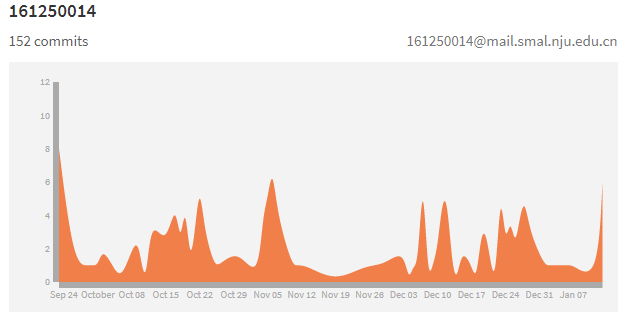
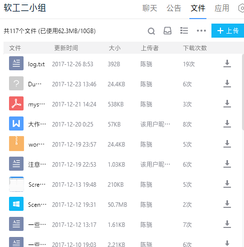

# 第31小组大作业项目过程整理

### 1、目录

- [2.1 版本控制](#### 2.1 版本控制)
- [2.2 持续集成](#### 2.2 持续集成)
- [2.3 团队合作](#### 2.3 团队合作)
- [2.4 团队交流](#### 2.4 团队交流)
- [2.5 开发模式](#### 2.5 开发模式)

### 2、按检查点分类介绍

#### 2.1 版本控制
**我们使用的是`SourceTree`配合`Gitlab`进行版本控制** 

工具截图如下： 

上图是我们小组项目的GitLab仓库
 

上图是使用SourceTree进行版本控制的界面
 

---
#### 2.2 持续集成
持续集成过程包括： 

##### ( i ) Junit单元测试
我们在代码构建的时候，是以分层的方式分配工作（具体是组长陈骁负责UI层开发，王宁和王颀涵负责BL层开发，陈思彤负责Data层开发） 编写模块的时候不能测试模块之间的协作，故又在进行单元测试的时候使用`Mock`和`Stub`的方式模拟其它模块的动作  

使用Junit(版本4)进行测试的界面：

 
##### (ii) maven
项目中为了解决库依赖的问题，我们使用过maven作为外部包依赖和管理的工具：

 
##### ( iii ) Jenkins
在项目最后阶段我们使用Jenkins作为持续集成和打包的工具：

上图为项目视图
  

上图为构建历史
 

<a url = "持续集成-Jenkins/Dashboard [Jenkins].html">这里是Jenkins的页面</a>

------
#### 2.3 团队合作
**我们小组采取git的方式进行合作**

开发模式图：

 
**提交统计** 

如图，截止目前小组已经总共提交`457`次

其中，对于`master`分支，从9月23日到1月13日的112天内平均每天提交`2`次

**从时间分布上，**
- 每天提交时间高峰主要集中在19：00~24:00，这个时段一般只有上机课，所以小组成员时间充裕

- 一月中每天提交次数高峰是按周为周期的，这是由于大作业的阶段任务以周为周期

- 一周中每天提交次数较为平均，周三与周五稍微少一点，因为这两天小组成员课程相对多一点

  **从小组贡献上，**
- 总的提交记录：

- 组长陈骁的提交记录：

- 陈思彤的提交记录：

- 王宁的提交记录：

- 王颀涵的提交记录：

---
### 2.4 团队交流
**小组内使用`QQ`和`短信`、`电话`的方式进行交流，包括会议通知、标准制定、技术探讨等**

截图如下：

上图是QQ聊天记录截图
 

上图是QQ群文件截图
 

上图是短信交流记录截图
 

**小组开会一般在晚上19:00~20:00，地点大部分在四食堂和九食堂**

---
### 2.5 开发模式
**目前项目的`文档`、程序的`框架`布局是由组长陈骁负责完成的，陈思彤参与`功能`的设计，王宁和王颀涵参与`讨论`并负责完成规定的文档和代码`任务`，经陈骁和陈思彤`审查`并提交至Git**

**分数配比上，以项目贡献为依据，经内部协商，同意组长陈骁各从王宁、王颀涵处各取3分，陈思彤的分数不变。因此最终组长陈骁的分数比王宁、王颀涵高9分，比陈思彤高6分**
